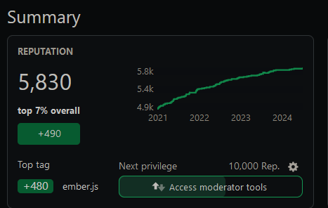

+++
title = "stackoverflow harvest"
date = 2024-04-19T10:00:00-07:00
draft = false
categories = ["software", "humor"]
tags = ["imaginary internet points"]
+++

I answered one question on Stack Overflow, one time, a decade ago

but their algorithm is so good at entrenching answers that my worthless point harvest is bountiful, e'ry season

