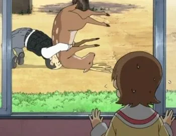
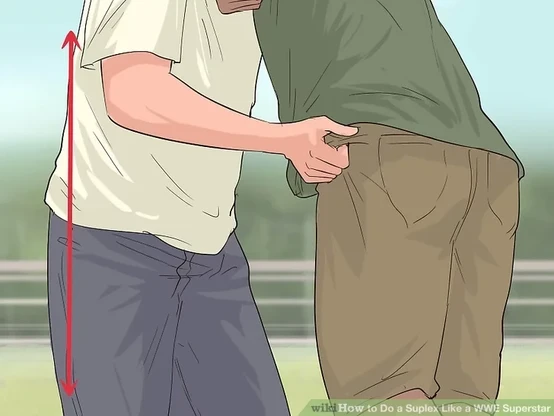
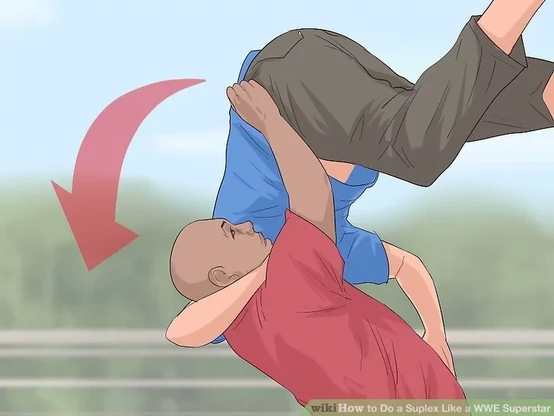
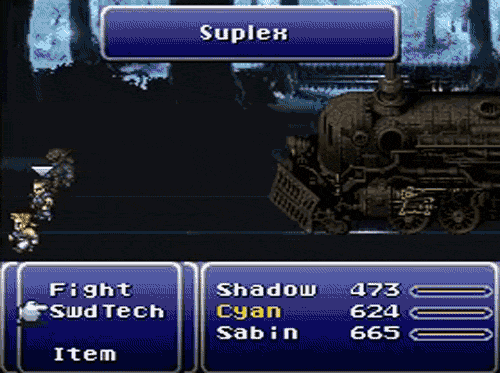

+++
title = "a love letter to the suplex"
date = 2024-03-06T11:00:00-07:00
draft = false
categories = ["humor"]
tags = []
+++

every time I see two people hugging in a picture my mind immediately moves to the next frame where one of them is delivering a devastating suplex

try it: you, too, can enjoy this brain disease

the suplex is objectively funny

like, imagine this scenario:

a realtor is taking a man through a nice building. they say "well, if this fourplex isn't the right size for you, perhaps I can interest you in a duplex?"

prospective buyer: "no, I still think that's going to be too small."

realtor: "okay, well, I'm showing off a beautiful suplex right now."

prospective buyer: "a... suplex?"

realtor:

**note: this joke also works with a round house for similar reasons , although it's 18% less hilarious**

-------

[Ghost Train Suplex : Final Fantasy VI | Bryan Heemskerk - Why is this event so iconic or memorable for many FFVI Fans? ](https://www.reddit.com/r/FinalFantasyVI/comments/1gd9ke4/ghost_train_suplex_final_fantasy_vi_bryan/)

