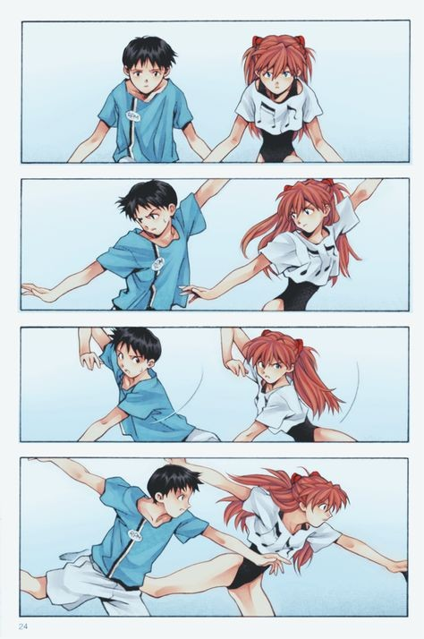

+++
title = "Sync Up"
date = 2024-06-04T12:00:00-07:00
draft = false
categories = ["work work"]
tags = ["corporate"]
+++

at some point in the past 20 years people stopped saying "meet" and started saying "sync" or "sync up"

MEETINGS ARE OVER, NOW THERE IS ONLY SYNCHRONIZATION