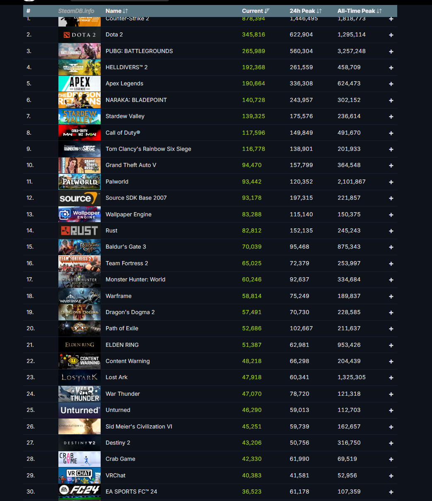

+++
title = "VRChat #29"
date = 2024-04-05T12:00:00-07:00
draft = false
categories = ["vrchat", "video games"]
tags = ["steam"]
+++

to be honest "we're #29" doesn't have that much of a ring to it but it ain't nothin'

like, it's definitely _something_ to have held on to a spot in the top 50 on Steam for so long

I'm not sure _what_ exactly but it's _something_