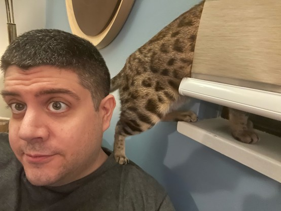

+++
title = "Bengals"
date = 2024-01-22T09:00:00-07:00
draft = false
categories = ["zapp", "cat"]
tags = []
+++

Bengal cats are an unusually intelligent, active, and difficult breed of cat, not recommended for first time cat owners. They require a lot of attention and play, and can be destructive if bored. They are not lap cats and they won’t be as affectionate as more domesticated cats.

That being said, if you do have the massive amount of time to invest into becoming besties with a l’il leopard cat, you get the positive sides of their intelligence and playfulness and chattiness and bossiness.



Also the secret to unlocking leopard snuggles are “finding the blanket with the texture they like”, “Canadian winters” and “a drafty ol townhouse house built in the 70s”

me: 37 years old

secretly, in my head, all the time:

------

places where cat shouldn't be:

places where cat should be:

