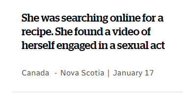

+++
title = "pasta alla surprise"
date = 2025-01-20T12:00:00-07:00
draft = false
categories = ["humor", "real news", "canada"]
tags = ["cbc"]
+++

Jesus christ, CBC, what recipe was she searching for?

_ed: (in the actual story she found the video because she was poking around the browser history of her boyfriends' laptop, but the headline makes it sound like AllRecipes.com was hosting the video under their recipe for Broccoli Casserole or something)_