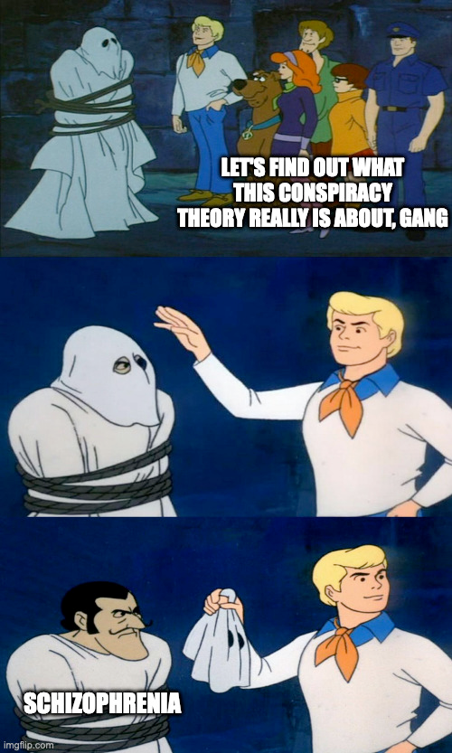

+++
title = "fascinated by conspiracies"
date = 2025-01-12T12:00:00-07:00
draft = false
categories = ["conspiracy"]
tags = []
+++

like most people, I'm kinda low-key fascinated with insane conspiracy theories and insidious cults, even if a lot of the time it turns out that the true believers are just afflicted with the potent combination of "terminally online" and "mentally ill"

it turns out, convincing a paranoid schizophrenic that the government is hiding tens of thousands of their clones in the centre of the hollow toroid earth is not terribly difficult, and the democratization of media has made it possible for these folk to use one another to create impressive self-reinforcing communal structures of impossible and insane lore

_did you know that the earth is flat, that you can opt out of all laws by simply not agreeing to be bound by them, that hollywood and washington elites (despite looking older every year at seemingly exactly the same rate as everyone else) harvest children's adrenaline glands to perform secret satanic rituals in order to stay eternally young? did you know that Earth has 4 corner simultaneous 4-day TIME CUBE?_

