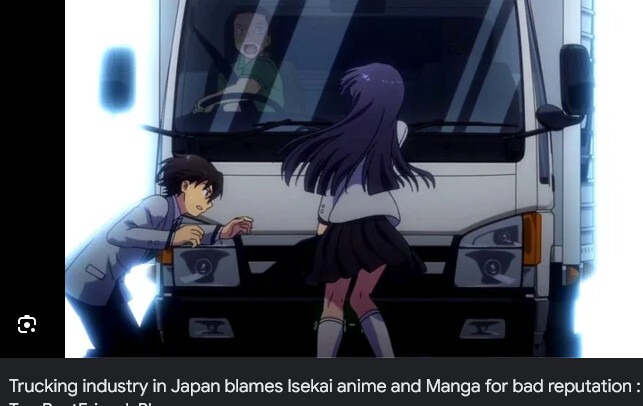

+++
title = "isekai troubles"
date = 2025-06-16T16:00:00-07:00
draft = false
categories = ["real news", "humor"]
tags = ["isekai", "truck", "bus factor"]
+++

> https://weekly-net.co.jp/news/174582/
>
> "Films and dramas, comics and anime. The car used in the scene where the character is killed in a car accident is almost always a truck.”
>
> While exchanging opinions on the issue of image in the transportation industry, a transportation manager in Shizuoka Prefecture made that statement. In the scene where an important person in the story dramatically loses his life in a traffic accident, the major role that effectively enhances the impact is certainly played by large vehicles such as trucks and dumps, even if you count as many as you can remember.
>
> (Translated by Google)

In related news, the North American bus industry is taking [software developers and engineers to task](https://en.wikipedia.org/wiki/Bus_factor)