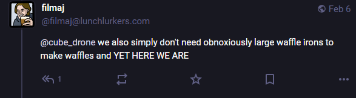

+++
title = 'orchestra'
date = 2025-02-06T11:00:00-07:00
draft = false
categories = ["music"]
tags = []
+++



I went to the local symphony orchestra last night, and it was nice

but I am left wondering what an orchestra is meant to accomplish, nowadays

so many people playing at the same time accomplishes big, room-filling sound, and it's the only way to accurately experience some compositions the way they would have a hundred years ago,

but does electric amplification and live audio mixing render a lot of old orchestra tech obsolete?

we simply do not require large bands to make big sound anymore

when I see modern folks on youtube chasing big band sound, they do it with much smaller groups in rooms _littered_ with sound pickups

although honestly there's still a lot of 'em, I guess there's some fullness of sound you simply can't get without a bunch of people playing it simultaneously



`@filmaj`:



