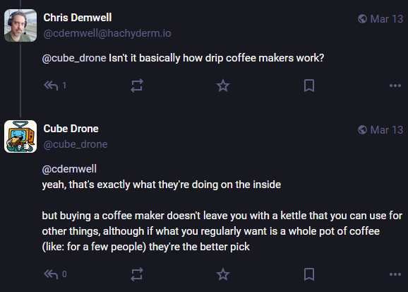

+++
title = 'ready set joe'
date = 2025-03-13T11:00:00-07:00
draft = false
categories = ["food"]
tags = ["coffee"]
+++

So, uh, Melitta is probably the least well-respected of the common pourover brands but let me tell you, you can get a Melitta pourover for $12 CDN and a 100-pack of new filters at any grocery store for $5, which is maybe 1/3 of the cost of the other two.



A gooseneck kettle, hario v60 and a baratza burr grinder will set you back $300.

But a $20 blade grinder, a $20 kettle and a $12 plastic pour-over with $5 filters can get you a coffee setup that's 80% as good for a tiny fraction of the price.



I remember on a trip to San Francisco in the 10s, I was a little startled, they offered a crazy new thing called "pourover" and charged exorbitantly for it, and I, out of curiosity, paid, only to watch them make coffee

... the exact way I made coffee at home, just with more pomp.

"my mom showed me how to do that when I was just out of high school, it's actually just the best way for a person to make a single cup of coffee"

I'm a little obsessed with finding that point in the price/quality curve where you're actually getting the absolute best bang for your buck and I feel like for coffee this is it.

[`@apike`](https://mastodon.social/@apike) having tried burr and blade grinders, I'm gonna say it: coffee enthusiasts over-value a perfectly consistent and predictable grind

with only a little practice a blade grinder reliably produces a good cup of coffee, you just need to time it right

_although admittedly I did splurge on a nice, reasonably priced OXO burr grinder, so_

I believe that professionals tend towards techniques that produce consistency and homogeneity - like neutrally flavored broths, perfectly diced vegetables, and very precise measurements.

Amateurs who ape these techniques without having to meet the same demands are cargo culting needlessly: perfect consistency is rarely as important a goal for home cooks, so go ahead: USE a boldly flavored stock or rough chop your vegetables: it will be FINE.

The same goes for coffee grind consistency.

`:(`