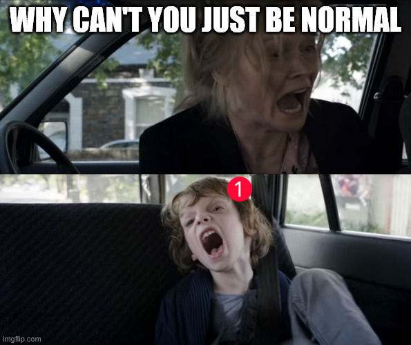

+++
title = 'slack is being a problem'
date = 2025-03-10T10:00:00-07:00
draft = false
categories = ["humor", "work work"]
tags = ["slack"]
+++

Slack: HEY! I HAVE A NOTIFICATION FOR YOU!

Me: but it's after work on a friday what is it

Slack: IT'S THIS THING A CO-WORKER SAID YESTERDAY

Me: slack what is wrong with you

Slack: I'VE FORGOTTEN HOW NOTIFICATIONS WORK

Me: i'm surprised you answered but ok

**ed:** for context, around this time Slack was struggling to _stop notifying you that you had an available message_, even if you did not,
in fact, have an available message.