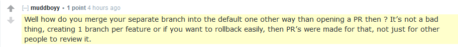

+++
title = "the children arent alright"
date = 2025-02-04T11:00:00-07:00
draft = false
categories = ["software"]
tags = ["github"]
+++

just having the weirdest interactions in a r/webdev conversation where folks are pushing, reviewing, and merging pull requests in their own personal single-person repositories

and I'm like "why would you do that?" and they're like "well how else do you merge a branch" and I finally realize the mistake I've made


