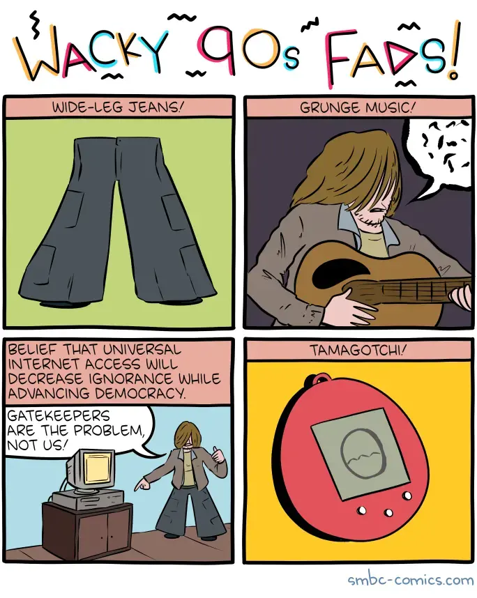

+++
title = 'wacky 90s fads'
date = 2025-02-24T12:00:00-07:00
draft = false
categories = ["humor", "software"]
tags = []
+++

Eradicating newspapers didn't exactly create utopian outcomes the way we may have hoped, but nevertheless, print media newspapers and magazines can't just keep on existing while all of their functionality lives on in a superior format.

They've been going the way of renting tapes from the local Blockbuster for a while now.

I don't feel too bad for traditional print media or the postal service, they've had more than half of my entire life to figure out some kind of viable pivot.

It's funny, when I was a kid something like the internet and e-mail existed, but it was laboriously hand-created every day, manually, by legions of hard workers doing their best to get fresh content to your door every morning and deliver all of your messages by hand to anybody who you might want to talk to.

News, movie reviews, weather updates, daily games, local updates, it was a surprisingly robust and varied offering, differentiated by the rest of written content by its relative speed and immediacy.

Obviously the speed and immediacy of electronic transmission wins, right? once your average person has access to a powerful, comfortable to use internet-enabled device at all times, the only thing a newspaper can do that a modern computer can't is act as a cheap wrapper for fish and chips.

So what do we lose? Well, business models supporting creators of hyper-local content, for one. Not a lot of vloggers out there covering the municipal news beat. Also: news had a kind of journalistic code of ethics that the internet has not been able to replace, although I sometimes think that they get lionized more than they deserve - the code was more what you'd call guidelines than actual rules.