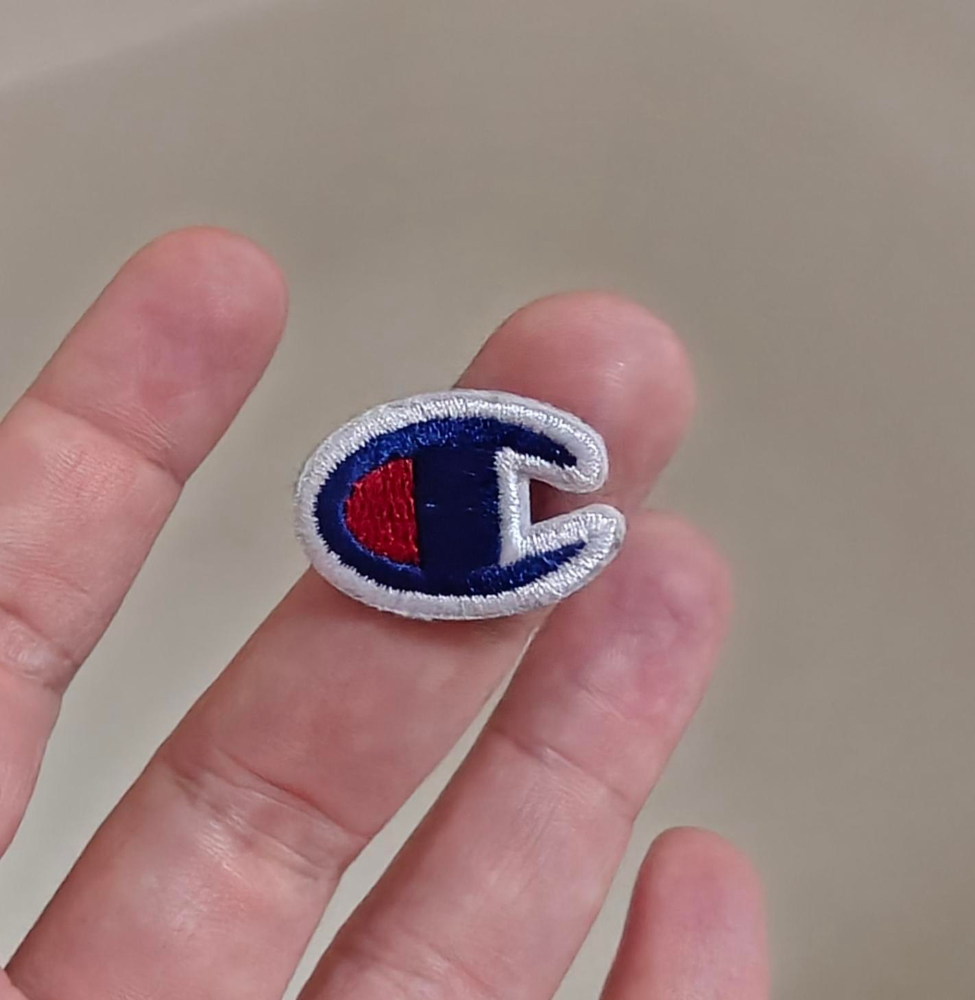

+++
title = 'champion quality'
date = 2026-03-09T12:00:00-07:00
categories = ["clothing", "canada"]
tags = ["isn't it iron-on", "pants"]
+++

Late last year, I responded to some dramatic weight loss by buying some new sweatpants: I bought a $25 pair of "Champion" [sweatpants from Costco](https://www.costco.ca/champion-mens-fleece-cargo-pant.product.4000399164.html) and a $130 pair from the Canadian made "[House of Blanks](https://www.houseofblanks.com/)" to compare the difference between something very clearly made in bulk-ass bulk and something made locally. 

The quality differences between the two pairs of sweatpants are _very noticeable_, and I think I would prefer to own one pair of House of Blanks over five of the suspiciously cheap Costco brand.

Anyways today the "Champion" embroidery fell off of the Costco sweats, revealing that this detail was simply iron-on, glued to the pants.