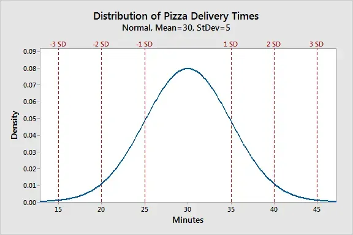
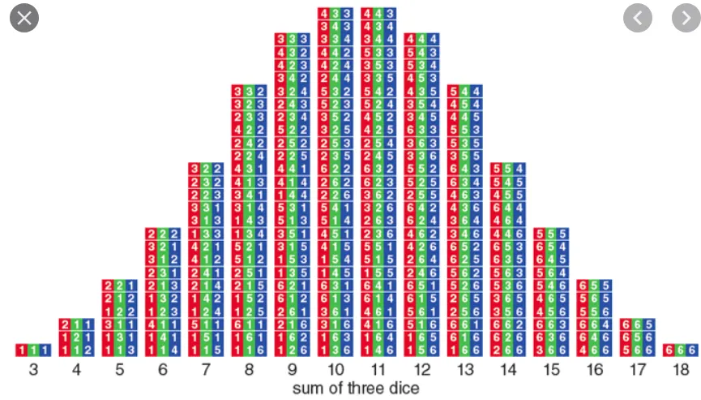
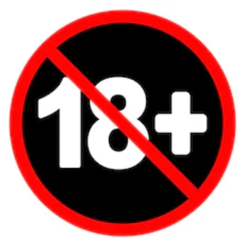

+++
title = 'Arrays With More than 18 Elements In Them are Dumb'
date = 2020-12-15T12:00:00-07:00
draft = false
categories = ["gamedev", "software"]
tags = ["python"]
+++

A decade ago, when I was working on, you know, procedural generation stuff, fresh out of University, I definitely felt like I’d need to spend some time putting together some serious tools for generating selections from a variety of probability distributions.

At the time, I was building a “Mohammed Chang” generator - a random name generator that used census data to try to generate mathematically probable names. If I’m pulling names out of a hat, and I want to pick “Smith” more often than I pick “Schwarzchild’ - well, that’s a job for a weighted probability distribution.

I toiled for hours, days, creating complex and powerful tools in Python that I could use to simulate selection out of a group. Selection with replacement, selection without replacement, normal distributions, weighted distributions, the whole nine yards.

Ultimately the name generator performed admirably, although the results turned out to be pretty boring. JOHN DOUGLAS. KAREN BROWN. JOHN BROWN. All of the mathematical intuition in the world didn’t actually result in something fun or interesting - and, worse, I’d spent a lot of time carefully hand-hewing this wildly complicated, object-oriented code.

Now. It’s years later and I have become profoundly lazy.

Which means that when I need something that seems complicated, like a weighted probability distribution, I have a lot of stupid shortcuts that I can use to mock something up pretty quickly.

## Let’s Start With a Handful of Utility Functions

```
function choice(list){
    // pick a thing at random out of the list
    return list[Math.floor(Math.random() * list.length)];
}

function rollDie(){
    // return a number between 1 and 6
    return Math.ceil(Math.random() * 6);
}
```

Okay, let’s start with these two utility functions. choice, which picks a random object out of an arbitrary list, and rollDie, which rolls a number between 1 and 6.

“But Cube! That 6 is a magic number! Why not write a randInt function that takes a “min” and a “max” variable so you can generate any number of different…


No! You fool! You fell victim to one of the classic blunders! The most famous is never get involved in a land war in Asia! But only slightly less well known is this:

**Hardcode some shit.**

I know, as good developers we’ve spent ages learning not to put [Magic Numbers](https://en.wikipedia.org/wiki/Magic_number_(programming)) in to our code — but we’ve learned too well and now we’re over-generalizing.

In this [now-20-year-old blog post](https://www.joelonsoftware.com/2000/07/22/microsoft-goes-bonkers/) (wow, apparently blog posts can be 20), Joel describes the problem:

> When great thinkers think about problems, they start to see patterns. They look at the problem of people sending each other word-processor files, and then they look at the problem of people sending each other spreadsheets, and they realize that there’s a general pattern: sending files. That’s one level of abstraction already. Then they go up one more level: people send files, but web browsers also “send” requests for web pages. Those are both sending operations, so our clever thinker invents a new, higher, broader abstraction called messaging, but now it’s getting really vague and nobody really knows what they’re talking about any more.
>
> And if you go too far up, abstraction-wise, you run out of oxygen. Sometimes smart thinkers just don’t know when to stop, and they create these absurd, all-encompassing, high-level pictures of the universe that are all good and fine, but don’t actually mean anything at all.
>
> _(ed: this article goes on to trash the first .NET SDK, which doesn’t age terribly well)_

[You aren’t gonna need it](https://wiki.c2.com/?YouArentGonnaNeedIt), anyways.

Or, to put it a different way - `randInt(min, max)` is fine, but `rollDie()` has a metaphor, some immediacy, you can look at it and know immediately and intuitively what it is and how it works. It generates a number between one and six!

Well, I guess, JS supports unicode, there’s one other obvious way that it could work.

```
function rollDie(){
    // ha ha!
    return choice(["⚀", "⚁", "⚂", "⚃", "⚄", "⚅"]);
}
```

I don’t know why that’s so satisfying, but it is.

Anyways, that brings us to our first thing we can do.

## Random Selection With Replacement

```
function getFruit(){
    return choice([“apple”, “orange”, “mango”]);
}
```

## Random Selection Without Replacement

```
function take(list){
    // take a thing at random from the list
    let i = Math.floor(Math.random() * list.length);
    return list.splice(i, 1)[0];
}
```

That’s essentially the same as “choice” but it removes the item as it takes it out. Good for ... deck stuff.

## Weighted Random Selection

Oh, this is going to be really complicated! What if we wanted “apple” to be 3 times more likely to pull than “mango”, and for “orange” to be twice as likely! Clearly we are going to need an extremely intelligent weighted distribu.. wait.

```
function getFruit(){
    return choice([“apple”, "apple", "apple", "orange", “orange”, “mango”]);
}
```

Yeah, I mean, I guess you could do that. I mean, it seems easy when you put it that way. But what if you want “apple” to be 100 times more common than “mango”, and “orange” to be 20 times more common? You gonna type out “apple” 100 times?

```
function getFruit(){
    let apples = new Array(100).fill("apple");
    let oranges = new Array(20).fill("orange");
    let mangoes = ["mango"];
    let fruit = apples.concat(oranges).concat(mangoes);
    return choice(fruit);
}
```

“Isn’t that inefficient?”

Sure, but who cares? Memory is cheap! It’s weighted random selection in a few easy-to-understand lines of code. Don’t get ahead of yourself. You’ll go crazy trying to make everything perfect - just embrace chaos and get some quick, stupid code down that does the trick.

## A Normal Distribution

```
function getNormalFruit(){
    let fruit = ["apple", "orange", "mango", "cherry", "tomato", "avocado"];
}
```

_mmm, normal fruit_

Let’s imagine we have these fruit and we wanna pick, like, “mango” and “cherry” most of the time, and “apple” and “avocado” almost never.



You know, give ‘em one of THESE.

### Approximating A Normal Distribution With Three Dice

I bet choosing from a set using a normal distribution is going to involve math and thinking, and I hate those things.



Wait, would you look at that. That looks pretty normally distributed. If we happen to have a set containing _exactly 18_ items, we’re set - we can just roll three dice and pick that index out of the set.

Now, our set of fruit has less than 18 items, but it’s easy enough to make three dice fit. We have 6 fruit, so we just… divide by 3. And round to an integer, because accidentally fetching fruit[2.99999999] isn’t going to do us any good.

```
function getNormalFruit(){
    let fruit = ["apple", "orange", "mango", "cherry", "tomato", "avocado"];
    let i = Math.round((rollDie() + rollDie() + rollDie() / 3);
    return fruit[i-1];
}
```

So, that solves the problem for any list that has less than 18 items in it. Which, let’s be honest - is most lists. If you’ve got more than 18 items in your list, maybe it is time to reconsider your life decisions and go make a smaller list.

```
function normalChoice(list)
{
    if(list.length <= 18){
        let divideBy = 18 / list.length;
        let i = Math.round(
            (rollDie() + rollDie() + rollDie()) / divideBy
        );
        return list[i-1];
    }
    if(list.length > 18){
        throw new Error("I refuse to acknowledge the existence of any number higher than 18");
    }
}
```

### ”Wait, rollDie() + rollDie() + rollDie()? Couldn’t you just use "rollDie() * 3”?

No! Obviously that would just roll the same die three times. We need three separate dice to roll in order to make this work. If we wanted to roll 100 die, we’d need to roll them all doing some sort of stupid hack like this:

```
let oneHundredDieRolls = new Array(100).fill(0).map(rollDie);
```

Which, if we summed them all, would be exactly the sort of tool we’d need to take our three-die solution and generalize it to handle arrays with up to 600 elements in them (a number that is noticeably higher than 18) - however, past a certain number of die, it’s probably time to stop fiddling with easy, cheap, stupid approximations and time to start doing some real math.



None of which we are going to do, because, as we established, **arrays with more than 18 elements in them are dumb**. (I assume that is what this graphic was meant to communicate.)

Or, at least - before investing a lot of time in a complicated solution (if you’ve got less than 600 elements that you want to draw from, and this code isn’t performance sensitive, which it almost certainly is not), consider whipping something stupid together in a few lines of code with some dice that mostly does the trick.

## In Conclusion

Programming gets dramatically easier if you don’t take it terribly seriously, which you shouldn’t, if you ever want to get any sort of product out the door, which you should.