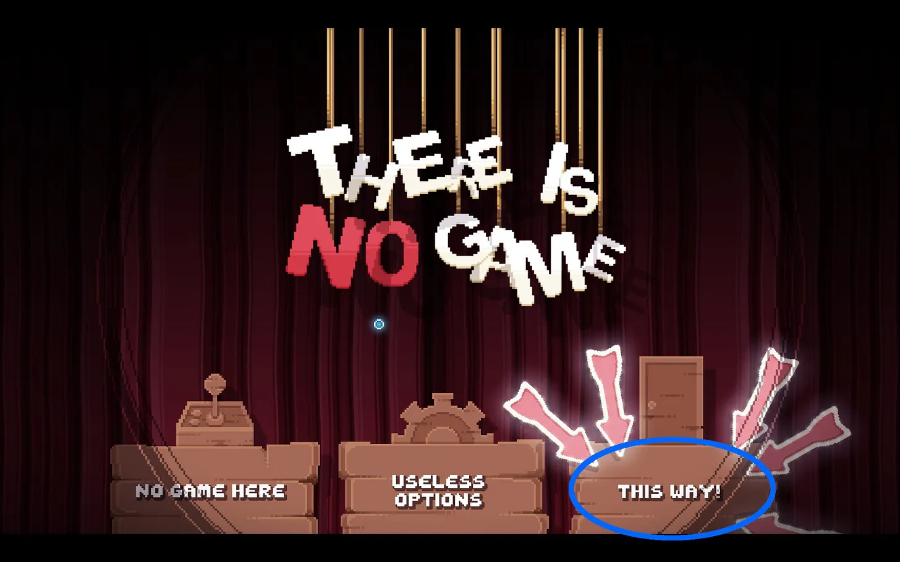
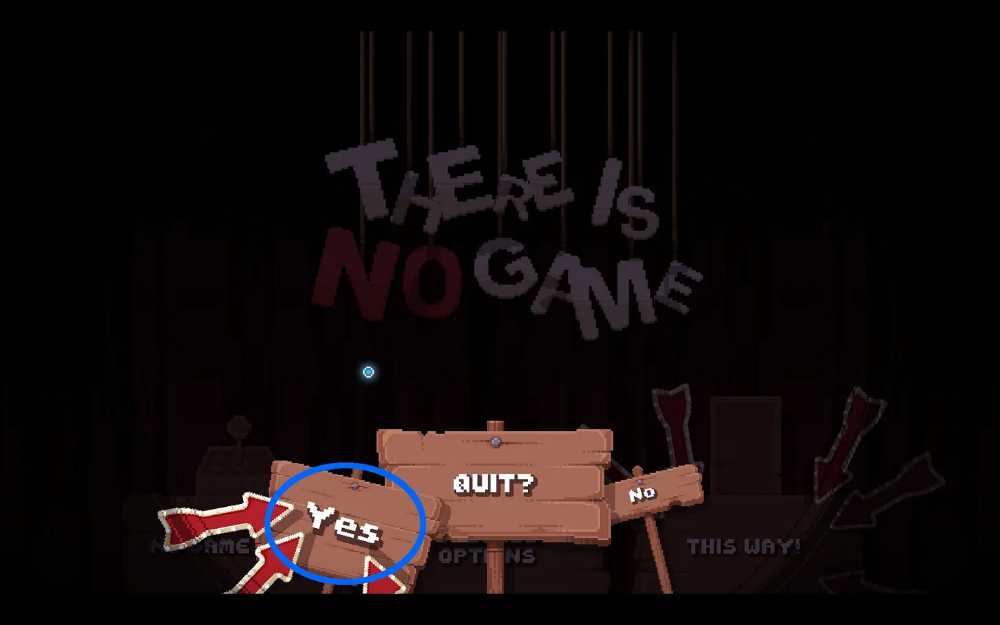

+++
title = 'There is no Game: Wrong Dimension'
date = 2020-12-27T12:00:00-07:00
draft = false
categories = ["video games"]
tags = ["adventure games", "there is no game"]
+++



<!--more-->

Classic adventure games are wonderful, but they were released in a time where puzzle solutions could be painfully intricate in a way that doesn’t always make for a fun game nowadays. We’ve all read the [Old Man Murray](https://www.oldmanmurray.com/features/77.html) Article explaining that adventure games died at the brutal hand of... *adventure games*.

(**2025 edit**: I'm including the entire article in its entirety, here, because, honestly, the fact that it's still on the internet 25 years later is already a miracle, I feel like I'm _really_ pushing my luck with that hot-link.)

> A few weeks ago, Gamecenter ran an article in which they declared that adventure gaming was "dead and buried".  The Gamecenter employees who write the titles for articles apparently don't coordinate their efforts with the people who write the subtitles for articles because even before the banner graphic was completely over, someone in the subtitle department had upgraded the condition of adventure games to merely "vanishing".  Still, no matter which part of the logo you choose to look at, adventure games are in trouble.
>
> Gamecenter blames Myst for killing adventure games.  Or at least the Gamecenter employees who write the first paragraph of Gamecenter articles do.  Again, this department may not be in direct contact with the team responsible for paragraph four, in which it is clearly stated that:
>
> > Now it seems people want more action than adventure. They would rather run around in short shorts raiding tombs than experience real stories.
>
> As far as I can tell, the Gamecenter "death of adventure" timeline goes something like this:
>
> 1. The action-packed Myst introduces casual gamers to the pleasures of Tomb Raider.
> 2. Genius adventure gamers come to the painful realization that the same equipment they use to explore the complex fantasy world of Leisure Suit Larry can also be utilized by stupid people to run Quake.  Thanks to their television-atrophied attention spans, these casual gamers are mentally incapable of spending six hours trying to randomly guess at the absurd dream logic Roberta Williams has applied to the problem of getting the dungeon key out of the bluebird's nest.
> 3. Horrified by the knowledge that somewhere someone is playing a game that is not an adventure, genius adventure gamers abandon the hobby in droves and resort to their backup source of entertainment: various combinations of Babylon 5 novels and masturbating.
>
> Gamecenter mentions Jane Jensen's Gabriel Knight 3 as the last title of note in the genre.  I'd like to use Gabriel Knight 3 to illustrate my alternate theory of who killed adventure gaming.
>
> Here is the solution to Gabriel Knight 3's first major puzzle, in which you must rent a motorcycle.  I've pulled it almost entirely from Gamespot, and have commented on it only when I could no longer help myself.
>
> Since this next part where I quote directly from the Gamespot Gameguide is pretty dry, feel free to imagine that it's being spoken by OMM's new Adventure Gaming Mascot, Francis the Talking France:
> 
> > Gabriel must disguise himself to fool the moped clerk.
> >
> >You must combine several items to construct an adequate disguise and gain access to the motorbike. First, return to the museum and swipe the red cap from the lost-and-found box. **You couldn't do this in the previous time blocks**, but Gabriel knows he needs it now and has little trouble stealing the hat from the box. With the red hat in hand, head to the church.
> >
> > Look at the Abbe's house and notice him watering his plants with a spray bottle. Wait for the Abbe to move back into his house and grab the spray bottle...   When you emerge on the new street, you'll spot a black cat in the corner. Move Gabriel up to the cat and use the verb menu to examine and pet the cat.
> >
> > The cat dashes into a small opening into an old shed.  Examine the hole that the cat entered. Open up your inventory and pick up the piece of masking tape (if you failed to get the tape from Gabriel's hotel room, return there and open the dresser to get the masking tape). **Use the masking tape on the shed door hole.**
> >
> 
> > Walk back from the shed and notice the cat is now on a ledge. You can attempt to pet or grab the cat, but Gabriel can't because the feline is just too high. Here's where the spray bottle comes in. Select your inventory and pick up the spray bottle. Use the spray bottle on the cat, and he'll leap down and run, again, through the small opening into the shed. **When he runs through the hole, he left some hair on the piece of masking tape you placed on the hole**. Pick up the masking tape, and **you'll gain black fur in your inventory**.
> >
> > Return to the hotel now and collect any items you missed the first time around that are vital to the disguise. These include the black marker from the hotel desk (just make sure Jean is wandering around), a piece of candy from the table near the lounge, **and a packet of syrup from the dining room**.
> 
> > Head upstairs and knock on Mosely's door (room 33). He'll let you inside. If you want a hint about what to do with the candy, you can offer Mosely the candy, which he'll gladly take and consume quickly. Also, talk with Mosely about his passport, the key to solving the disguise puzzle. If you give Mosely the piece of candy, you must return downstairs and grab another one.
> >
> > Locate the painting over the table depicting the street scene. Use the piece of candy from your inventory and place it on the table. Head down either staircase into the lobby. Look to the left of Jean's front desk and spot the room buzzers. Examine the buzzers and press the one for room 33, Mosely's room. This will buzz Mosely down to the front desk, but **he'll become sidetracked by that yummy piece of candy you left for him**.
> >
> > Ascend the stairs on the right side, so you're on the opposite side of Gabriel's room entrance. Follow the camera around to Mosely's room and watch him exit and walk to the table with the piece of candy. Mosely will bend over and grab the candy, gobbling it up like before. Walk Gabriel over just behind Mosely and use the mouse cursor on Mosely or his passport to pickpocket him and swipe the passport.
> >
> > As soon as you've got the passport, quickly head to Mosely's room 33 and enter it. Nab his gold coat on the coat rack by using the verb menu while the mouse is over the coat. Place the coat in your inventory and exit Mosely's room.
> 
> >
> > This sequence could take a few tries to get everything right, **but you can repeat the process as many times as necessary to secure the necessary items**: the passport and gold coat. Just use more candy and keep pressing that buzzer.
> >
> > Open your inventory now; make sure you have the black marker and syrup. Grab the black marker and use it on Mosely's passport to make a mustache. Next, **grab the black fur from the cat and use it on the syrup to make a black mustache**. Finally, use the red hat on the mustache and then on the gold coat to complete your Mosely disguise.
> >
> > With your disguise ready, return to the moped rental shop.
>
> Did you read all of that?  If not, good for you!  Dumb as your television enjoying ass  probably is, you're smarter than the genius adventure gamers who, in a truly inappropriate display of autism-level concentration, willingly played the birdbrained events described in that passage.  For those of you clever enough to have skipped the walkthru, permit me to summarize:
>
> * Gabriel Knight must disguise himself as a man called Mosley in order to fool a French moped rental clerk into renting him the shop's only motorcycle.
> * In order to construct the costume, Gabriel Knight must manufacture a fake moustache.  Utilizing the style of logic adventure game creators share with morons, Knight must do this even though Moseley does not have a moustache.
> * So in order to even begin formulating your strategy, you have to follow daredevil of logic Jane Jensen as she pilots Gabriel Knight 3 right over common sense, like Evel Knievel jumping Snake River Canyon.  Maybe Jane Jensen was too busy reading difficult books by Pär Lagerkvist to catch what stupid Quake players learned from watching the A-Team:  The first step in making a costume to fool people into thinking you're a man without a moustache, is not to construct a fake moustache.
> * Still, you might think that you could yank some hair from one of the many places it grows out of your own body and attach it to your lip with the masking tape in your inventory.  But obviously, Ms. Jensen felt that an insane puzzle deserved a genuinely deranged solution.  In order to manufacture the moustache, you must attach the masking tape to a hole at the base of a toolshed then chase a cat through the hole.   In the real world, such as the one that stupid people like me and Adrian Carmack use to store our televisions, this would result in a piece of masking tape with a few cat hairs stuck to it, or a cat running around with tape on its back.  Apparently, in Jane Jensen's exciting, imaginative world of books, masking tape is some kind of powerful neodymium supermagnet for cat hair.
> * Remember how shocked you were at the end of the Sixth Sense when it turned out Bruce Willis was a robot?  Well, check this out:  At the end of this puzzle, you have to affix the improbable cat hair moustache to your lip with maple syrup!  Someone ought to give Jane Jensen a motion picture deal and also someone should CAT scan her brain.
>
> Who killed Adventure Games?  I think it should be pretty clear at this point that Adventure Games committed suicide.

There Is No Game is a classic adventure game. You’re in for 5 hours of grabbing objects and trying them out on every part of the scenery. The puzzles are painfully intricate.

Oh, but the twist!

This is a puzzle game where, by and large, the puzzles are… fourth-wall-breaking video game UI puzzles. If there is a UI element on screen at any point, you’d better believe you’re going to need to pry it out of the UI with a crowbar and use it as a piece in the puzzle.

Oh, and the UI doesn’t want you to use it. The whole game bristles with soft malice, which is a fabulous joke.

_there is even an achievement you can get for opening the game and immediately falling for this_

This game seriously doesn't want you to play it.

> [Adventure Gamers: Review for There Is No Game: Wrong Dimension](https://adventuregamers.com/article/there-is-no-game-wrong-dimension)
>
> The Game’s determination to keep you out only increases from there as it continually tries—politely at first, but rising in fervor as you refuse to take the hint—to barricade all traces of interactivity behind increasingly impenetrable obstacles; the more persistent you are in sticking around, the harder the Game strives to drive you away.

The puzzle design in this game is brilliant. You’ll be combing through the UI, the title screen, the credits, the pause screen, even the background music in your quest to conquer this intransigent game. it helps that the ever-present narrator in this game is (accidentally) dropping hints as you go, with more hints forthcoming when you’ve spent a little bit too long staring at a puzzle. The hint system in this game is generous - so generous that it’s almost a touch frustrating at times - it’s like game, I could have figured this out on my own, thanks - but the hints are just as clever as the puzzles, just little accidental turns of phrase in the narration intended to guide your thinking.

As an example of the hint system at play: there is a puzzle whose solution involves _tickling_ something. And so, prior up to that scene, the game works the word “tickle” into conversation a couple of times, organically, like, so that the concept of “tickling” is psychologically primed when you finally get to the puzzle. Sometimes the part of the UI that you’re supposed to click on will gleam slightly or wave in the breeze. This game is operating on levels. I only had to click the “help” button a few times in my 5-hour playthrough. (In both cases, I had thought something was maybe broken, but had instead just misunderstood a mechanic).

There is No Game has got its game history and fourth-wall-breaking jokes on lock. It contains a joke referencing the same Old Man Murray article that I just did, and goes on at some length lamenting it’s own failed Kickstarter campaign. My only criticism here is that it decides to dunk on the easy target of terrible free-to-play games a little too hard.
I want to post screenshot after screenshot, but the game is so surprising and joyous that I’m afraid I’d ruin things.

The game is a game that is also a meta-game about games, and developing games, and fucking with games, and making loads of stupid jokes about games for that reason it feels like it was specifically intended for me.

I loved it. What a great game.
