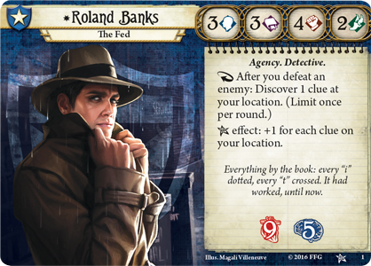
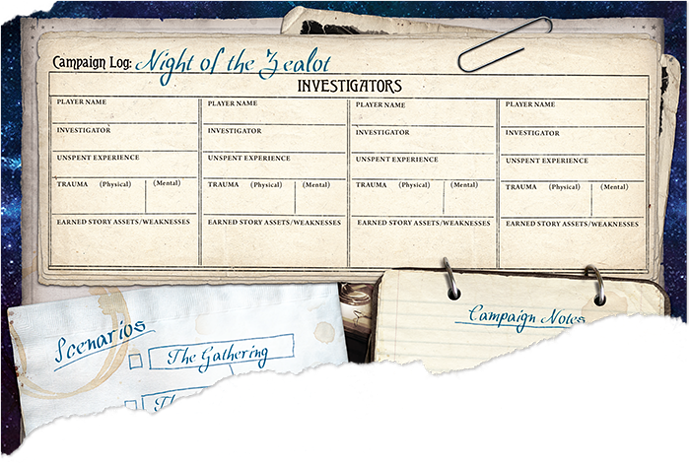
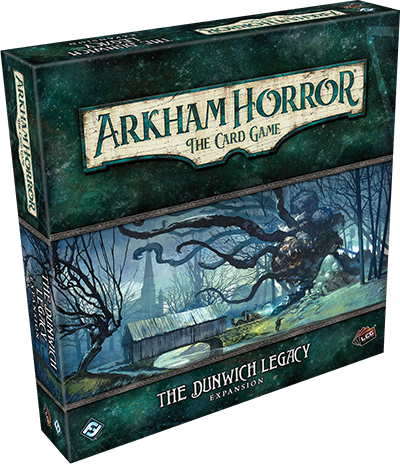
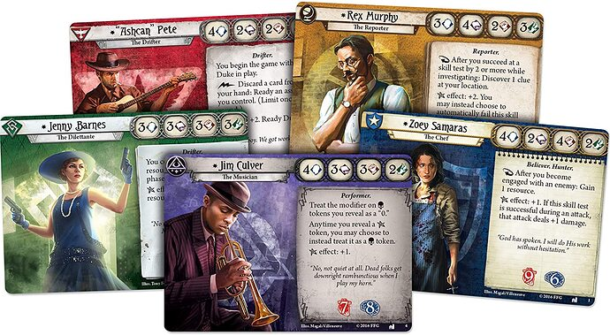
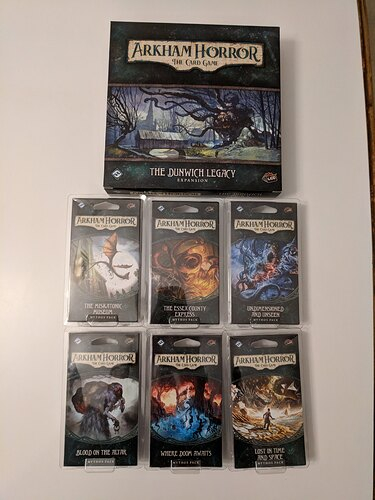
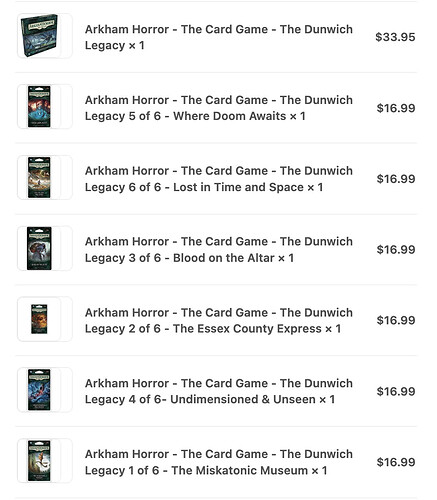
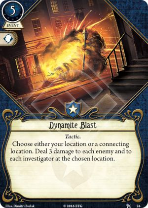

+++
title = 'Arkham Horror (TCG)'
date = 2021-11-15T12:00:00-07:00
draft = false
categories = ["board games"]
tags = ["cards", "arkham horror", "cultist simulator"]
+++

So, uh, perhaps you are familiar with Arkham Horror? Maybe a decade ago I brought you to my home to attempt to play it as a group?



<!--more-->

It's sort of a hybrid of "board game" and "RPG" where in the course of one evening, you and a handful of investigators attempt to prevent an Old One from being summoned, while being faced with a steady stream of bad luck and nasty surprises from a "Mythos Deck".

A board-game one-shot adventure, like Descent: Journeys in to the Dark, or Heroquest ([BRODESWODE!](https://www.youtube.com/watch?v=Cx8sl2uC46A)).

Each player starts as a different unique investigator, with a few unique skills that make them better or worse at one of the key elements of the game.

If you strip the board game down to its grubby little bones and polish them to a mirror sheen, you end up with Pandemic, a game that came out three years later and eclipsed Arkham Horror in popularity: You and your team of investigators are mostly doing your best to contain an awful lot of nasty stuff happening around you.

Arkham Horror is a messy game, packed with obscure rules, difficult to run, filled with moments where you have to stop everything and check the manual to see if you can, for example, use a chainsaw and a motorcycle at the same time (yes, and it is awesome). Pandemic is unquestionably the more polished experience, although it loses most of the fun _theme_. (At no point in Pandemic do you ever even _need_ to check the rulebook to determine if you can use the chainsaw and motorcycle at the same time, at which point why even bother to play?)

Anyways, there have since been more than a few iterations on the original Arkham Horror formula, <small>none of which have bothered to confront or even acknowledge how much of an utter shitheel H.P. Lovecraft was, but hey, that's a lot to ask</small>.

Like Elder Sign - same game, same themes, but simplified and given to the players in a Yahtzee-like format.



I have a copy of this sitting on my shelf and it's Quite Good, although it has been a good long time since I've brought it to the table. I _can say_ that it offers almost all of the fun and themes of Arkham Horror, but with a more satisfying gameplay loop and a more polished ruleset. The big piles of dice and simplified gameplay, though, can really lay bare how much your success or victory comes down to a single roll of the dice - like with most "more streamlined" experiences, it does sacrifice a lot of little thematic touches.

Then, there's **Eldritch Horror**, **Arkham Horror: 3rd Edition**, and **Mansions of Madness**.

Not much to say about Eldritch Horror - I haven't played it, but by and large it is regarded as a significantly cleaned up and tightened version of Arkham Horror - a spiritual successor, easier, more Pandemic, less Chainsaw/Motorcycle.



And **Mansions of Madness** really leans into the RPG aspect, dividing one player from the group to act as a sort of Dungeon Master, an antagonistic foil to the player's designs - or, in the second edition, turning over the antagonism to an _automated phone application_. Out of all of the games in the Arkham series, this one is the most like a traditional pencil & paper tabletop RPG.

So, uh, this is the Arkham series, and I'm gonna talk a little bit about some of the problems with it:

### Quarterbacking & Wasted Turns

These are some of the earliest of the _popular co-operative games_, and as such, they suffer badly from some of the worst qualities of the genre: namely, that it is quite possible, probable, even common for one player who knows what they're doing to _manage the entire table_ while a whole group of people... _watch_.

The division of responsibilities and skills also can often leave the board in a state where there's only a few players who _can_ be effective, leaving the rest of the players to just sort of _stand about_. For the players who _do_ have something useful to do, well, that thing is usually so obvious that it's not much of an interesting decision. I have definitely played whole games of Arkham Horror where I just sort of haunt the card-draw parts of the map digging around for a shotgun or a grenade or something.

### You Aren't Supposed To Win
In order for the co-op game to feel _challenging_ it has to be _challenging_ when played against a completely mindless opponent, and that challenge is driven by making the game just a little bit too hard.

Which means that, on average, especially if you're not playing _perfectly_, you're going to **lose**. You're going to lose to something random and capricious and stupid. One of your investigators is going to get emotionally wrecked by a bad experience in a gas station bathroom, causing them to go insane and become devoured.

That's... well, that's one of the reasons why the theme works so well in the first place. Lovecraftian Horror is _the right theme_ for a game where you are destined to _probably lose_. People will die, people will go insane, you'll probably fail.

### Complexity and Theme and Randomness is Fun, Until it Isn't

Arkham Horror's massive, bloated, over-complicated rule set is part of what makes it so evocative. The game itself is a thing of lovecraftian horror - too many rules, too many surprises, too _much to deal with_. It's big, and with that bigness comes a big implied promise: if you learn how to manage all of this complexity you'll have unlocked a potent story engine that generates a fun tale.

But the game's wild... bigness, is a thin disguise around a huge pile of decks and decks of random events - it doesn't always deliver on that promise.

It's quite possible to lose this game on the first turn. It's quite possible to luck into a party armed to the teeth with ancient relics and flaming swords able to topple an Old One on their own, just waiting out the game's clock.

If you're going to put this much effort into a Great Big Game, you might as well put that effort into [Scythe or Eclipse](https://marquee.click/t/twilight-imperium/490/19) and at least get some satisfying gameplay out of it.

On the other hand, attempts to strip Arkham Horror down to easier, smaller, more strategic bite-size experiences... don't really capture what made it great.

Quinns described the core gameplay of the simplified Eldritch Horror as "irredeemably boring" - the meat on those bones is all in the theme, the randomness, the _weird stuff that happens_.

Elder Sign's _gameplay_ is fun, but it barely feels attached to the theme at _all_. At some point you might as well just play Yahtzee! At least with that one you can play it with your mother-in-law without having to go through the embarassing experience of explaining what an "Elder Sign" is.

## On To The Card Game

Why do I mention all of this stuff?

Well, there's a new Arkham game in town, and it's ... quite good. Quite good indeed.



This is a "Living Card Game" - kind of a spiritual successor to both _Eldritch Horror_ and _Android: Netrunner_.

I really quite liked Android: Netrunner. It was a clever design for a game, wrapped in a cool theme. The idea of a LCG is that it works kind of like Magic: the Gathering - in that cards are continuously added to the game in perpetuity - but instead of randomized booster packs, the game's new cards are released in named sets, which you can collect at your own leisure.

Android: Netrunner was fun, but it had a bit of a problem: the competitive game's balance would swing wildly around as new decks game out. For people looking to run the game in their own homes, it would sort of fall on players either to agree to buy the exact same subset as other players that they want to play with, buy the entire universe and be aware of 100% of the game's current footprint at all times, or just kind of hope that they could build a balanced, competitive subset of the game out of whatever they had on hand.

So: Arkham Horror the LCG. It's out there solving Android: Netrunner problems and Arkham Horror problems.

So how does it work?

### The Basic Gameplay

Okay, in short: You and your co-op team each have individual Investigator decks. These decks are wildly distinct from one another - there's five core "classes" of card - Guardian (hit stuff), Seeker (find clues), Mystic (do weird magic), Rogue (run away from things and gain resources) and Survivor (miscellaneous special effects) - and each of the investigators has a mix of cards from two classes, a primary and secondary class.

I picked **Roland** (Guardian/Seeker), a practical monster-punchin' and clue-findin' combo for a straightforward game and Tiff picked **Agnes** (Mystic/Survivor), a big mixed-bag of weird tricks and lucky effects.

You draw 5 cards and take 5 resources, lay down a half-dozen Locations, ploop your investigator at the entrance to one of the locations, and are offered 3 actions per round, with which to perform one of 8 different actions:

* play a card,
* activate an effect on a played card
* draw a card,
* draw a resource,
* move from location to location,
* investigate a location to maybe find Clues, (which are generally required to win the game)
* fight a monster
* evade a monster

then, you take a resource, you draw a card, all of the enemies in the game get to attack you, you add a doom token to the "you lose" track, and each investigator draws a fresh Very Bad Problem from the Bad Times deck, which summons monsters and negative story events pretty much willy-nilly.

While you're doing this, you're racing your investigators ability to rack up clues (a difficult, time-consuming activity) against the game's ability to line up doom tokens in the "you lose" track.

### Skill Checks, and THE CHAOS BAG

Why, it's my main man, Roland Banks.

He's a bit of a Mario, pretty balanced across all fields, he's got some Willpower, some Intellgience, a little extra Punch It In The Face and not a lot of Run Away.

A lot of things in this game come down to Skill Checks - they come up often. Combat checks to fight monsters, Evade checks to run away from monsters, Intelligence checks to investigate and get clues, and Willpower checks to not go completely banana-pants insane.  On _average_, the difficulty level of a skill check is going to be about _3_.

So, Rollo here, with his "3-ish in every stat", should have an easy time with most checks, right?

Wrong! The CHAOS BAG is a great big bag filled with tokens, and you have to draw one every time you do a skill check.



Also: **the Chaos Bag hates you**. It contains 2 good outcomes, 2 neutral outcomes, and **12** bad outcomes. If you're playing on "standard" mode, like some kind of fresh-faced noob. If you want the game to really Bring The Pain there's a variant that does away with any remaining good outcomes and throws some -6s and -8s in there for good measure.

If you don't trust that you'll be able to pass a check (especially considering the mean Chaos Bag), well, you have cards that can help in your hand.

### Campaign

The base set comes with three _missions_ that you can take your investigators on, which link to one another in a single unified campaign.

They have _stories_ (albeit pretty perfunctory ones) and their own weird mechanics, and _twists_.

These individual missions take about... 60-90 minutes for two adults to clear.

Each mission has its own locations, victory conditions, and even special rules.

At the end of the campaign, your investigators either **die horribly at the hands of an otherworldly horror** (this happened to us) or barely save the day and retire, forever maddened by their experience - each campaign is intended to be started by a fresh investigator deck with _no experience_.

<small>although the internet is convinced that the later campaigns are intended to be started by a fresh investigator with _no experience_ but a whole bunch of great cards and deckbuilding experience from all of the previous campaign cycles so they're apparently quite a bit harder </small>

### Deckbuilding

The core game comes with 5 pre-made decks, sufficient to throw at the game's campaign. As players attack the campaign objectives, they earn experience points, which should allow them to purchase from a handful of more expensive and powerful cards provided to upgrade these default decks.

Technically, _all of the game's decks are customizable_ - within certain parameters - but there aren't really enough cards in the base set to really change the fundamental properties of the decks provided. Why, to get your hands on more cards you'll probably need to... go buy some expansion packs.

### Expansion Packs

So, having played the mini-campaign using the pre-fab decks, you're gonna want to get your hands on _more_.

More campaigns! More cards to build decks with! More investigators!

Well, guess what? That's why Fantasy Flight Games wanted to get you in on this train in the first place.

So, what you get when you want to get rolling on a real adventure is a _cycle_.

A cycle starts with a base set:

This includes the campaign guide for the cycle, and five new investigator decks full of _delicious cards_ for you to play with.

Also: the first mission in the campaign.

But just the first mission, if you want the whole campaign you've gotta get your hands on the whole set, which looks more like this:

Each of these missions contains a segment of the story, a complete mission, a Whole Bunch of New Bad Things That Can Happen To Your Investigator, and a handful of new investigator cards, including upgraded cards that you can add to higher level decks.

I wonder why they would do it that way?

Oh, yes, I know why:

Crikey, FFG, what a creative way to drain bank accounts.

While this seems unbelievably nefarious, let me refer you to some of the problems with Android: Netrunner - in a _competitive_ game, the problem of "defining an interesting and fair subset of the card space so that players don't have to simply buy every card in existence" is significant (this is also why Magic: The Gathering's draft format is so popular: it solves a core problem with the game by simply having that subset defined in-situ for a single play session)

However, in this co-operative game, there's fun to be had with whatever cards you have on hand, so long as you've got at least one campaign. Heck - the core set alone has quite a lot of gameplay in it. Tiff and I have definitely made three nights of fun out of the starting campaign, and there are more investigator decks we haven't even tried yet!

While I'd prefer it if the cycles were simply boxed and sold together as, well, whole entire cycles - the system of having a couple of friends and a big common pool of cards to draw from for an ever-growing adventure is actually... pretty cool!

### My Friend, Dynamite

This card is absolutely bonkers useful. I am **Team Dynamite** Forever. This game is not shy about absolutely mobbing you with baddies, and/or throwing monsters at you with a great many hit points while your puny fists deal an absolutely pitiful 1 damage per attack.

The dynamite is a real conversation ender, at the expense of also being a touch volatile, dangerous, and expensive.
I found an absolutely _clutch_ use for it in all three of our first missions. Dynamite is the difference between victory and failure. Hold on to that sweet Dynamite.

In fact, we'd have won all three campaign missions if I hadn't suffered a spate of truly critically bad luck. All we had to do to _not lose_ was interrupt a simple cult ritual, and as The Muscle, all I needed to do was clear the way of _several cultists_ so that Tiff could go in and use her occult knowledge to, like, _move some candles around_. Simple enough. To simplify the task of _rapidly removing a mess of cultists from play_ I also happened to be holding a stick of the aforementioned Dynamite, my favourite card.

There was just one simple thing - a rule I almost forgot to enforce it was so harmless seeming: I just had to find my way out of the dank forest that I was just hunting for clues in, which required that I pass a simple Investigate check.

Look, time was of the essence - we only had a few turns left before the cultists summoned [REDACTED] the big nasty thing that will definitely kill you - and a failed check would definitely waste time. So, to ensure that I'd have plenty of time to go clear the way for Tiff, I threw _every investigation card I had_ at the Investigate check.

I couldn't _possibly_ fail.

**The Chaos Bag Hates You**. I drew the red token, the "insta-fail, no questions asked" token. Having burned all of my investigation cards, my chances of getting out of the forest on a regular check dropped drastically, and _I spent the remainder of the game trapped in the forest while cultists and Young Deep Ones murdered Tiff_.

_whoops_.

Well I guess we all died, and it was pretty definitely my fault.

I guess the one problem they didn't solve was the _difficulty_. This horror ain't no cakewalk. At this point, though, I think long-standing fans of the series have come to expect it. It wouldn't be cosmic horror if you could _win_ reliably.

## Good Things

This game... solves a lot of the problems with Arkham Horror, and is quite good.

Quarterbacking, for example: you're playing _your own investigator_. You don't know what's in other players' hands. You don't even know what they've put in their decks. In fact - you shouldn't know. Don't even _try_ to learn that stuff. Quarterbacking is not much of a problem in Arkham Horror: TCG.

The game is pretty good about _almost always_ giving the investigators something useful to do, although admittedly it remains possible to get trapped in an ancient forest while your partner gets savaged by monsters that they are utterly unequipped to fight.

The randomness and capriciousness of Arkham Horror? Well, that's toned _way down_ because each individual campaign mission is actually pretty tightly planned and tuned. Oh, sure, it's possible to get bad draws, or good draws, and have a really bad time or a really good time with a specific campaign mission - but that falls inside a _much tighter band of possibility space_.

In a story about trying to hunt down cultists in an ancient forest, "the cop, driven insane from the things he's seen, gets lost in the mist and clawed to death by ghouls; leaving the woman he was sworn to protect to die" feels congruous with the story that we were telling with the cards. Before the "forest x cultist" mission, we were instructed to stock the encounter deck with a whole mess of cultist things and forest things, and took out a bunch of things that wouldn't have felt right coming up randomly while we were in the forest.

**I had fun**. Fun was had, by me, legendary grump.

## The Bad

There's an **absolute buttload** of rules to this game. Like - it's _seemingly_ simple but there's still quite a lot going on. There's a _pretty complete implementation of Arkham Horror_, under the hood, here, combined with all of the extra complexity of an Android: Netrunner style action/resource/card system.

We misplayed quite a few early rules to the game, accidentally making the game harder for ourselves again and again and slowly improving as we went. I know that at at least one point, I had accidentally put way too many Doom counters in play (when you kill a creature with a doom counter on it, that doom counter is supposed to be discarded, but I didn't know that).

At another time, I had accidentally three hands worth of equipment in play.

> 
> 3 hands

And, you know what? The deckbuilding isn't really that satisfying with 5 pre-made decks and _few customization options_. Which means that in order to really, truly experience this game, gotta drop some MAD STACKS, YO.

And the campaign included in the Base Set was _short_. A lot of the mechanics that crop up in the base campaign have to do with _speeding up the accrual of doom_, speeding up an already fast campaign.

Okay, here's another concern: I'm not _entirely sure_ if I believe that the core campaign is actually practical to beat without Roland. He's the _only investigator who's got access to a shotgun_. Although... actually, that kinda makes me want to give it a try and find out.

### Anyhow

So far, it is pretty good!

Soon I'm gonna crack into some of that Dunwich cycle of extra cards and see if I change my mind....

-------

Looking for the right ambience music for a game of Arkham Horror?

because I definitely found it several months ago when I played [Cultist Simulator](/posts/2021/cultist_simulator) :

