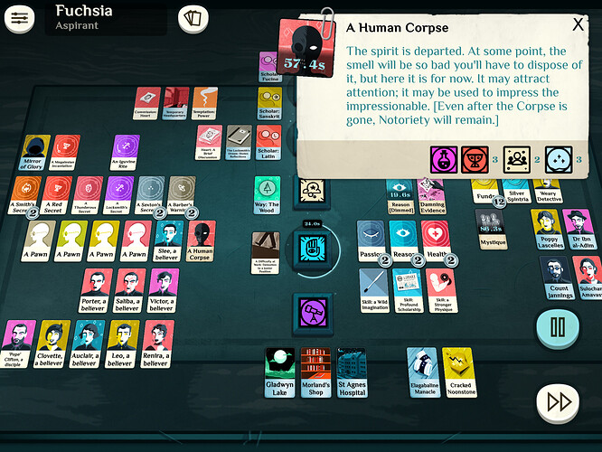

+++
title = 'Cultist Simulator'
date = 2021-06-15T12:00:00-07:00
draft = false
categories = ["video games"]
tags = ["cards", "games where the wiki is more fun than the game itself", "cultist simulator"]
+++



It's a card game! It's a narrative game! It's a combination card game narrative game!

<!--more-->

It's... _okay_. A solid **B**.

[MANY SPOILERS AHEAD]

The way this works is you have a tableau of cards, representing a wide variety of things - people, objects, books, money, your own personal stats - each card is socketable in a handful of "verb" slots.



So, if you socket your HEALTH into the WORK slot, for example, you'll go do taxing manual labor for a day, producing a FUNDS. If you then put your FUNDS into your DREAM slot, you'll buy a bunch of opium and have fucked up dreams, which might produce a CONTENTMENT (good!) but might also produce a FASCINATION (bad!) or a DREAD (very bad!).

While all this stuff is happening, a timer ticks forward. While the timer is going, it'll do things like consume funds (you've gotta eat) and generate random nasty events.

This game is also _proud_ of its complete and utter lack of tutorial. It figures - you'll figure things out, right?

So, on my first play-through, I managed to figure out how to put card A in socket B just enough to actually figure out how to buy a few spooky books and get a cult going - but I got trapped in a dead-end job working for a stingy boss - the game hinted ("you can do something about this") but I couldn't figure out what - and I ended up dying from a sickness that I couldn't afford to cure (that's American health care for ya).

Before I got there, I managed to walk through the WAY OF THE WOOD in my dreams, to a land where I could harvest potent magical energies. Not sure what to do with potent magical energies, but they were there.

So I consulted a wiki gently.  I didn't want to spoil much, but sometimes you need to see what exactly you're up against. I did a little bit of prep and prepared myself for a second run.

On my second run, I really managed to get things up and running - the game gives you the option to play as a physician the second time around, who has a job that _isn't terrible_ and that he can't be fired from. His ability to poop out regular money leaves him insulated from sickness, so that's a step forward! I started my new cult in earnest, trying to figure out what to do with my newfound cult.

This was, uh, actually kinda hard. Advancing the main goal of the game seemed to require that I Walk Through The Stag Door (?) and also required a powerful Lore that I wasn't sure when I'd be able to get my hands on.

Most of my other goals were stymied by similarly cryptic requirements. On top of that, my periodic cravings to _do_ something with my time would produce RESTLESSNESS, which, if it sat around long enough, would decay into DREAD, feeding DESPAIR, a card that, if it could consume 3 DREAD, would end the game.

I lucked into finding a cabaret which, if I poured funds into it, would produce CONTENTMENT, which could fight off DREAD, but I needed those funds to buy books to fuel my magical awakening.

I also kept running in to FASCINATION cards, which were piling into VISIONS. I thought "that sounds good, the VISIONS might help" - I'd later learn that the VISIONS were not here to help.

While all of this was happening, a WEARY DETECTIVE showed up - great - and started to hoover up all of the loose clues about crimes that I was leaving lying about on the board, building a TENTATIVE EVIDENCE, then upgrading it to a DAMNING EVIDENCE - seemingly another game-over waiting in the wings.

Eventually, I tried to go on an expedition to a mystic location I'd found - but that expedition tied up the "EXPLORE" verb, which I needed to use to cabaret away the DREAD, and I died from DESPAIR.

So, I'd made no further progress, except to discover that by stumbling around trying things, I'd managed to turn up several interesting ways to die.

So either I'd have to suffer through a lot of [trial-and-error](https://tvtropes.org/pmwiki/pmwiki.php/Main/TrialAndErrorGameplay)
OR it was time to consult
[the wiki](https://tvtropes.org/pmwiki/pmwiki.php/Main/GuideDangIt)
again.

It brings to mind an iOS game I played, Doodle God, that featured gameplay of "mostly trying to rub various concepts together to see if something interesting would happen"

> 
>
> Fire + Energy = Plasma

**2025 Editor's Note:** or https://neal.fun/infinite-craft/ where you can do that but the combinations never run out.

This time, I went in with a plan - a slow and steady plan. This time I'd focus all of my attention on keeping my character in a steady state. No dread, no fascination, no police attention.

And... it went well! I discovered that RESTLESSNESS can be channelled with PASSION into horrifying paintings, rather than dread. If I saved up money for the cabaret, I could fight dread as soon as it cropped up rather than having to fight it piecemeal. FASCINATION could be dreamed away with any spare DREAD, or with memories that I could drum up now and again.

The only problem was the police, hoovering up clue cards that lots of the core game actions produce. I managed to kill the WEARY DETECTIVE after sending about six different hired goons after him (also: figured out how to hire goons) - and he was promptly replaced by a _named investigator_ who was now hoovering up all of the extra clues that I'd been producing by trying to kill the original detective several times over! Hardly ideal, it seemed like I'd just multiplied my problem.

**further wiki consultation**

I guess I could try evidence tampering?

Yup, the solution to the police problem turned out not to be murder, but _evidence tampering_. None of my own cultists were leveled up far enough to be capable of that (nor were they terribly capable of murder, to be honest) and the upgrades that would get them there would take me (now that I've spent that time) another 4 hours of real play time to actually accrue.  So I hired a swindler. (Hiring people is a _random event_, like so many things in this game are, so I just had to keep on wandering around the city on loop until one turned up).

The swindler tried to tamper with the evidence. Failed. Got hurt. I paid for their medical care and sent them back to tamper with the evidence again. Failed again. Got hurt again. More medical care. On their third try, they succeeded. All three of those times they generated clues but being as clues make evidence and the evidence was something that I could clear (with effort) I was golden! I'd just need to roll the dice to find a swindler every time I needed them.

Or... did I? Here's the thing, cards only decay when they're sitting on the table, not in use. If I didn't want to lose the swindler, I could just keep them in active use forever. It'd slow down gameplay somewhat to lose that entire verb, but... well, swindling produced funds and silenced cops, so now I had an answer to all of the different "end game" conditions.

Which... allowed me to play the game properly, if carefully. For hours, with the actions required to stave off death becoming rote. Hours and hours. I used my funds to plunder local occult areas and buy all of the books in the spooky book store and _also buy out anything of interest from the auctions. I upgraded my stats all the way to their stattiest.

And that was _legitimately pretty fun_ for a couple of hours. I built an engine and solved one of the core puzzles of the gameplay: simply not dying.

But then... I was still stuck. The wiki indicated that I needed to try some new things, so I figured out how to get past The Way of the Wood to the White Door, and eventually the Stag's Door - which proved to be useful, unlocking further expeditions.

But... here's where the game starts to get a bit sluggish. The loop at this point is:
1. In your dreams, find a door
2. Go through the door, find a memory fragment (random, might be something else that you don't need as much)
3. Explore the memory fragment to find a location
4. Check out the location on the wiki to find out what you need to be successful at that location (failure is expensive and all you learn is "I guess it wasn't THAT combination of people")
5. Upgrade your cultists or hire goons to be able to beat the challenges at that location (this involves a LOT of luck, too)
6. Beat the location.
7. Get books.
8. Read the books.
9. In these books are Lores, which, if you get _enough of them_, might help you unlock the next door. Or not. Who knows.

You're doing these while also running all of the various wheelings and dealings you need to stay alive - and so, with my careful, grinding gameplay, several hours, and some help from the wiki I got through, I'd estimate, about the first 40% of the game's _books n' lores n' shit_.

But... past that point... the loop doesn't get much more complicated. Or much different. It's just a big ol' randomness-powered skinner box of luck and patience. That's about the part where it's time for me to bail - I've seen most of the interesting stuff the game has to offer, and now all it has for me is _grind_. The wiki more-or-less confirms that this is the case: while the steps become more difficult, random, and grindy as I go, I'm mostly just many hours and not much terribly interesting content away from an uncomplicated victory.

So, like, a _B_. The game has a _lot_ of interesting ideas - cool art design, fun writing - I doubt I'll ever bother to finish it.