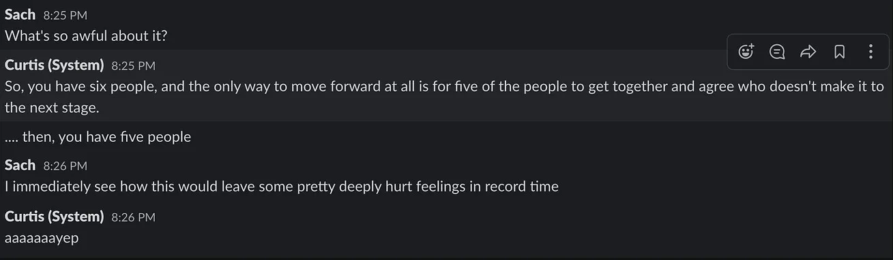
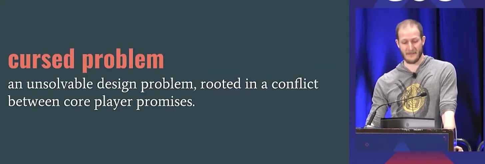
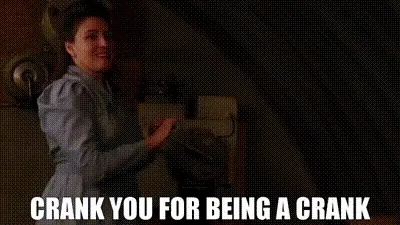
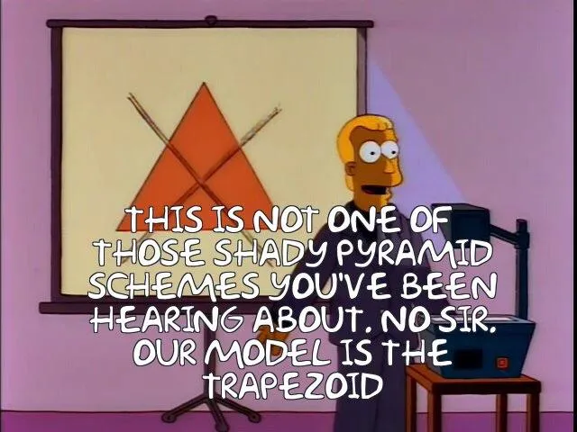

+++
title = 'Cursed Game Design Problems'
date = 2021-10-05T12:00:00-07:00
draft = false
categories = ["video games", "board games", "gamedev"]
tags = ["diplomacy", "cursed problems", "nft", "crypto"]
description = "The only rule of game design is 'don't make diplomacy'."
+++

Hey, did you see this thing? “The Game Prototype That Had to Be Banned by Its Own Studio”.



Spoilers: the designer accidentally built a game that could be described as “like Diplomacy”.

Yup, Tank Tactics is accidentally a re-implementation of Diplomacy, which is, in my opinion, one of the most destructive anti-games ever  this segment used to have a link to a Lifehacker article entitled "Diplomacy: The Most Evil Board Game Ever Made", but the link has since disappeared from the internet, lost forever to the shifting sands..

> 
> **Sach**: What's so awful about it?
>
> **Curtis**: So, you have six people, and the only way to move forward at all is for five of the people to get together and agree who doesn't make it to the next stage.
> ... then, you have five people.
>
> **Sach**: I immediately see how this would leave some pretty deeply hurt feelings in record time.
>
> **Curtis**: aaaaaaayep

I think it’s cool that there’s a game out there so simple, and compelling but also bad that people keep re-discovering it and re-burying it in the forest once they discover it’s evil. Like Jumanji.

And it’s really easy to accidentally end up making Diplomacy! It’s a common trap for a reason - any game where player elimination is necessary to move the game forward, but players aren’t quite powerful enough to eliminate opponents on their own has a chance of congealing into a Diplomacy if you’re not careful.

I’m really interested in the idea of game designs that are fundamentally cursed, just, game anti-patterns you can accidentally fall in to if you’re not careful, leaving your players playing a game that you didn’t intend for them to play at all.

I think the For those of you in the future, a "NFT", or "Non Fungible Token" was a way for people to try to scam idiots into buying virtual real estate: essentially the [star registry scam](https://www.abc.net.au/news/2018-02-26/buying-star-names-online-why-you-should-think-twice-astronomy/9479502) but for digital assets.  space is cursed in this way, too, by the way - it doesn’t matter what you try to build around the technology, the design always converges to “speculative, skill-free pay-to-win Beanie-Baby-collecting and throttling powerful GPUs for big cash prizes” - not because people are bad designers, but because that’s the only kind of game that NFTs can really support. BUT DON'T BLAME ME WHEN YOU'RE `[Crying]` IN A `[Broken Home]` WISHING YOU LET YOUR OLD PAL SPAMTON `[Kill You]`.

Even famous game designer [Will Wright is getting in on it](https://www.rockpapershotgun.com/oh-lord-will-wrights-new-game-is-built-on-nfts). And his game is converging to the same NFT thing, not because he’s a bad designer, but because "having NFTs” and “not letting NFTs become the entire point of the whole danged game“ is a [cursed problem in game design](https://www.youtube.com/watch?v=8uE6-vIi1rQ).

Because cryptocurrency has a strong profit motive attached to it, there becomes an enormous incentive to cheat: and the only part of the system that can't be cheated is ... the cryptocurrency, which means that any game built around a cryptocurrency invariably _just becomes an unadorned cryptocurrency_, which is not a fun game. So: crypto games, sort of necessarily and as a result of their design, can not be fun.

Like, let’s say that we played Monopoly with significant amounts of real money, and the only way to stop other people from cheating at Monopoly was to turn a giant crank with both hands, and the faster you turn the crank the better you can do regardless of your skill at Monopoly.

Well, then, it doesn’t matter whether or not you’re good at Monopoly, we’ve created a game that will eventually be Entirely About The Crank. Even if the Monopoly part is fun, it doesn’t matter, because this is a game where the only thing that matters is the cranking.

Good designers know this, and try to make cranking fun, which is why all NFT games ultimately converge to similar designs. They converge to being about the only thing they can be about: buying collectibles and hoping they appreciate in value.

