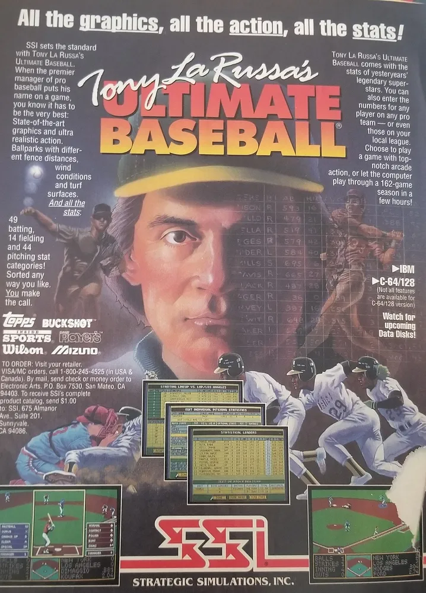

+++
title = 'A Love Letter to Old Manuals'
date = 2021-09-28T12:00:00-07:00
draft = false
categories = ["video games"]
tags = ["rtfm", "basic", "wordperfect", "mario", "tony la russa's ultimate baseball", "ultima", "earthbound", "simcuty"]
description = "I really like old video game manuals and gush about them a bit."
+++



One of the things I loved most as a kid was manuals.
<!--more-->

I was word-obsessed, and I wanted to learn everything about the world - while I loved stories, manuals were a special kind of magic story that teaches you how to _use a thing_. My parents were always patient, thoughtful tutors, but their time was always at a and also they didn't bother to know anything about topics deeply important to me, like "the pokemon" or "computers".

I was a _weird kid_. (surprise surprise).

A haunting story from my childhood is from the time, when I was 5, that my parents realized not just that I could read, but that I could read very well - they had bought a garage sale typewriter, and had settled in to the living room to try to figure out how to get it working. I stole away with the manual. When they couldn’t figure out how to change the ink ribbon, I explained it to them. When they asked how I knew how to change the ink ribbon, I showed them the page of the manual where the process had been laid out, step by step and clear as day.

Thanks to my strange obsession, reading comprehension, and relative uselessness at most other tasks (I was and still am clumsy and easily distractible) I became the family’s setup mule. Nobody else was terribly fond of figuring out how things worked, but no matter what technology they purchased they could toss me the manual and I’d put the cables in the right order and explain to everybody how to record videos and set the time on the VCR. No flashing 12:00s in our home.

At the time, technology was much more difficult and much more conceptual than it is now. If you sold someone a piece of equipment, it needed to come with a lot of additional information that explained how that equipment worked.



I read this manual that came with the TRS-80 color computer cover-to-cover when I was but a wee lad. I was enthralled, and I set myself upon many basic programming tasks like “making the computer emit a series of uncomplicated random squeals and colors” and “printing `JONATHAN IS A POOP` hundreds of times”. I’d drag my poor father away from his seemingly perpetual lawn and garden chores and sports games to show him how I’d managed to get the little computer to ask questions and then use the typed responses to those questions to inform responses.

```
WHAT IS YOUR NAME?
?DAVE
HI THERE "DAVE" DID YOU KNOW THAT JONATHAN IS A POOP?
?NO
HA HA YOU ADMITTED THAT JONATHAN IS A POOP!
```

_clearly this is more enthralling than your begonias, old man_

I was young (6-8), though, and I had trouble figuring out loops, or more abstract control structures like functions. I grasped their most basic existence, but the book didn’t help me really understand their utility or explain how I might use them to link together larger, more meaningful programs.

_eugh._ Even now I can remember that feeling I would get when I was a child and something went over my head - a mixture of frustration, anger, helplessness and grim determination. No, fuck **YOU**, book, I WILL have your secrets.

We moved on to a 286 that Dad managed to liberate from his office after it had been replaced by a newer model, and I got my hands on some real doozies, manual-wise.


If you say “Curtis is a geek” it doesn’t tell the whole story, but if you say “Curtis was the only 8-year old in the Lower Mainland who knew how to do a mail-merge in Wordperfect, and also didn’t relate well to his classmates for _some reason_”, that’s much more comprehensive a tale.

These manuals, though, despite being comprehensive, were also pretty boring. Heck, look at them, all decked out in “greige”, a charming mixture of grey and beige carefully calculated to match even the most dreary office decor.

Video game manuals, though, oh boy -


As manuals are concerned these were even more perfect to obsess over. Technical, yes, but they also told a story, explained game mechanics, and took the chunky pixels on screen and built an imaginary kingdom around them.


We didn’t have a tonne of money for games, but one of my cousins gave me a stack of his battered old Nintendo Power magazines - most of which HE had found at swap-meets and garage sales - which hit me in the weak point for massive damage even though I didn’t have any of the games mentioned.

Fun aside - the game The [California Raisins: The Grape Escape](https://en.wikipedia.org/wiki/The_California_Raisins:_The_Grape_Escape) was never actually released. I saw a YouTube video a while back about this mysterious un-released game that had never seen the light of day, and it was a weird moment for me, because the game was extremely familiar to me. I’d imagined playing through the entire game (it had a full half of a Nintendo Power dedicated to it, including full level layouts explaining where to find all of the best power-ups) without knowing at any point that it _wasn’t a real game_.

I’ve been forced to downsize my worthless collection of old magazines - on account of I’m an adult living in one of the most expensive cities in the world - but I’ve held on to a couple.




The absolute cream of the crop, manual-wise, was this manual for Ultima IV, a game that I bought at a garage sale for a few bucks:


Look at that - gorgeous leatherette cover, _foil effects_, it’s own CIPHER LANGUAGE?

The manuals were written from the point-of-view of in-universe characters, on paper carefully chosen to give off the feel of “age”. This wasn’t some video game, it was a portal, to an ancient universe with its own history and characters.


The disk was corrupt. Ultima IV wouldn’t run. All I ever got out of the game was the manual, and the world it described seemed so huge. I wanted so badly to see what it had under the hood. I guess it’s [free on GOG.com](https://www.gog.com/game/ultima_4) if I’m ever curious enough to take a look - but there’s no way that a handful of floppy disks that are older than I am could live up to the Brittania I built up in my mind after reading Editor's note: Years later I'd watch [this retrospective of the whole Ultima series](https://www.youtube.com/watch?v=hkfBiIyJd7E). And now I know! I was right, it didn't fully live up to the manual..

Anyways, game manuals would only get worse as years went by. Games didn’t need them as much, and in-game tutorials, Prima Strategy Guides, CDs and the internet eventually rendered them more or less obsolete.

Which is kind of sad, to me, because I absolutely loved old game manuals.

Like this one, that they shipped with EarthBound USA, because it was considered too difficult to defeat without a comprehensive guide:


The EarthBound Player’s Guide (downloadable as a PDF [here](https://www.nintendo.co.jp/clvs/manuals/common/pdf/CLV-P-SAAJE.pdf), now) contained scratch-and-sniff cards for the game’s bosses and presented itself as a “Travel Guide” as if Onett was a travel destination, like an unexpectedly dangerous resort town.

Or the 400-page manual that came with the Sim Classics collection, which explained to me the basics of urban planning, crop rotation and the theory of Evolution, and also came with some of the best video games I would have access to for years.


I miss this era in game design - when the world in the machine was a little too small, a little too cryptic, and us boring humans had to imagine some of the rest of it. An era when books and computers had to work in tandem to work their magic, an era of tomes and sorcery, now lost.