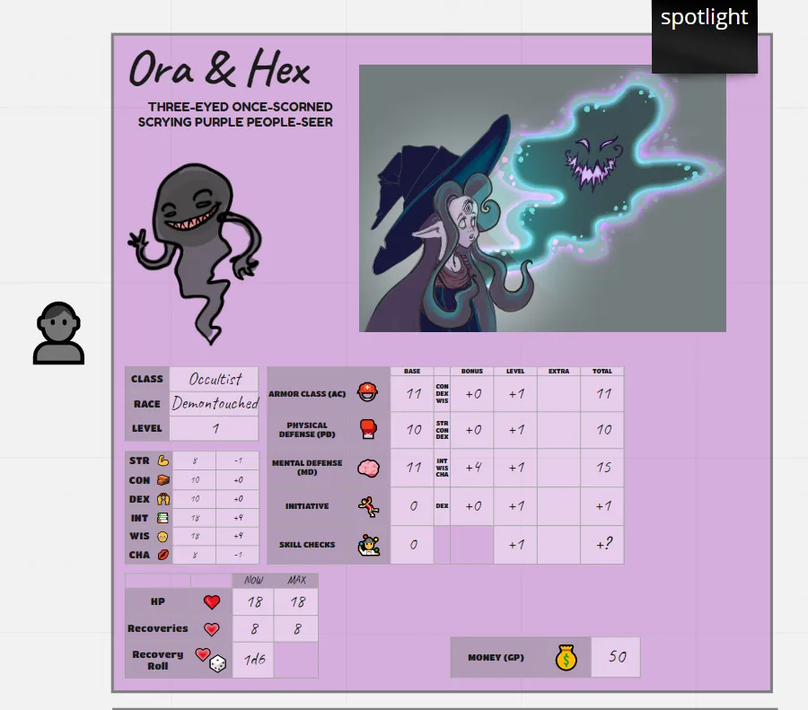
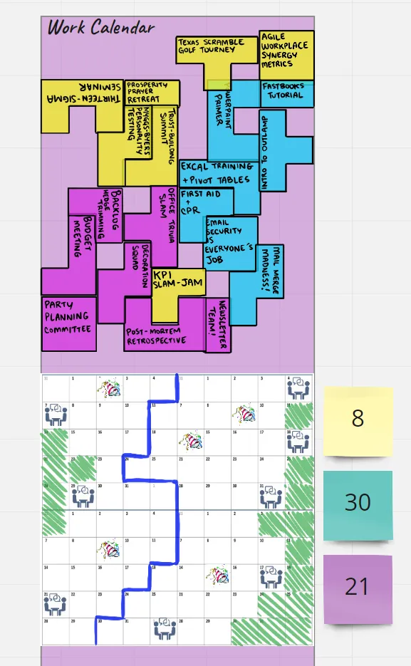
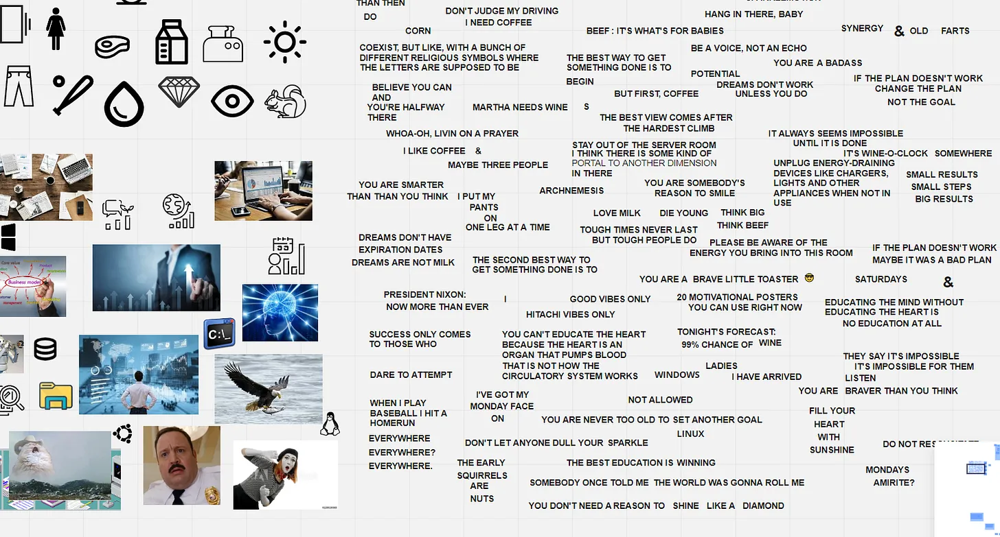
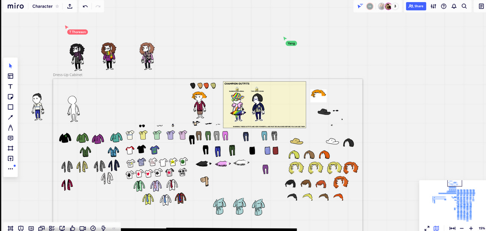
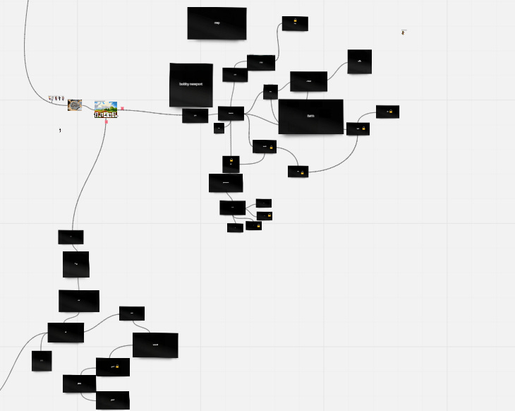

+++
title = 'Running an RPG on Miro'
date = 2021-03-01T12:00:00-07:00
draft = false
categories = ["rpg"]
tags = ["13th Age", "miro", "figma"]
description = "A good tool for running RPGs? Miro, actually."
+++



<!--more-->

Some time ago at work I wanted to do an architecture discussion, and in my opinion the best way to do this kind of discussion is around a whiteboard.

We’ve been a fully virtual office for a really long time, so I set upon the task of finding the best whiteboard software I could. I was looking for something that would work well with my pen - you’d be surprised how many whiteboard softwares can’t nail the super basic interaction of “I would like to draw on it with a pen”. Even Miro only does so well at that.

We tried a bunch of different alternatives and Miro came out as the winner - even with its slightly unimpressive pen features, it was able to power the most satisfying architecture discussion thanks to its completely excellent ability to slam down post-it notes and link them together with lines and arrows in a fully networked setting. It’s like someone came down from on high and made Perfect [Visio](https://www.microsoft.com/en-ca/microsoft-365/visio/flowchart-software).

We liked it so much that we ended up recommending it to the rest of the company. Our design team loved 2025 update: they've long since abandoned it for Figma. It’s now a really vital part of our remote stack. I’ve been trying to make the argument that it could even grow to replace Basecamp for us, because their stickies are quietly becoming full-fledged little tasks.

Anyways, out of all of the things Miro is quietly better than without much effort, one of the most surprising of those things? Roll20. I’ve tried to run campaigns out of Roll20, and I found a lot of it kind of… clunky and frustrating. I don’t want to go into too much depth about my Roll20 grievances, but there’s a lot of clunky macro-programming features having to do with automating character sheets and rolls and hit-point counters, and this might be my deep biases speaking, but I actually prefer if my players had to manage that stuff in their heads, and also if I didn’t have to learn (or worse, teach) a little macro-programming language just to get a game rolling.

Anyways - Roll20 is pretty good, but all I ever wanted was a shared whiteboard! When I’m trying to duplicate the experience of a pencil and paper RPG, what I want is not the feeling of **IMMERSION IN A REAL FANTASY UNIVERSE** - I could get that from World of Warcraft. I want **IMMERSION IN REAL PENCIL AND PAPER**, and the tool that I get that from is more… Miro.

## What Does That Look Like?

Well, being as it’s just a giant whiteboard simulator, it would look very different from DM to DM, but here’s what mine looks like:

The character sheets are just built out using in-place grids and boxes and whatnot.

To play with the office theme, the game itself has a office-themed framing device. We’re calling it “The Lion, The Witch, and the Server Room” and the players are office workers who’ve been pulled into a fantasy realm.

With the game sliced into an “office half” and a “fantasy half”, it gives me some real interesting angles on puzzle design, which is how we got to this monstrosity/calendar planning mini-game:

Which is just a full-on re-theming of an excellent Reiner Knizia game called My City.

Oh, and the silly mini-games don’t stop, as in our first session we also had a protracted segment where our players got to collage together motivational posters:

and just straight up get dressed:

That's where we're at for now: soon we'll be wandering into the _universe at large_:

It has been a long time since I’ve properly run a D&D-style game, and it’ll be the first time digitally. I hope it goes well.

Either that or I’m going to have my players solve more weird puzzles and play more unusual mini-games. It’s definitely going to be one of those things.
