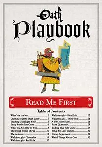
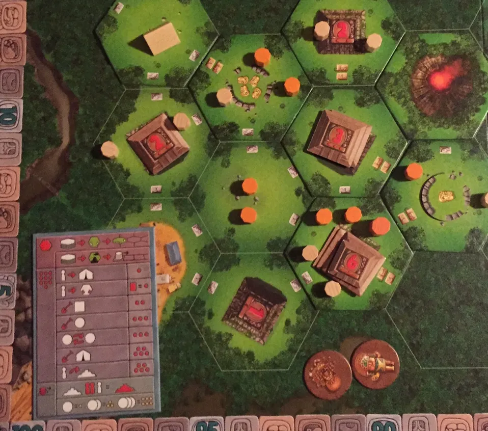
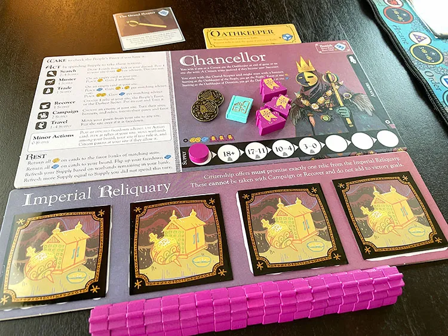
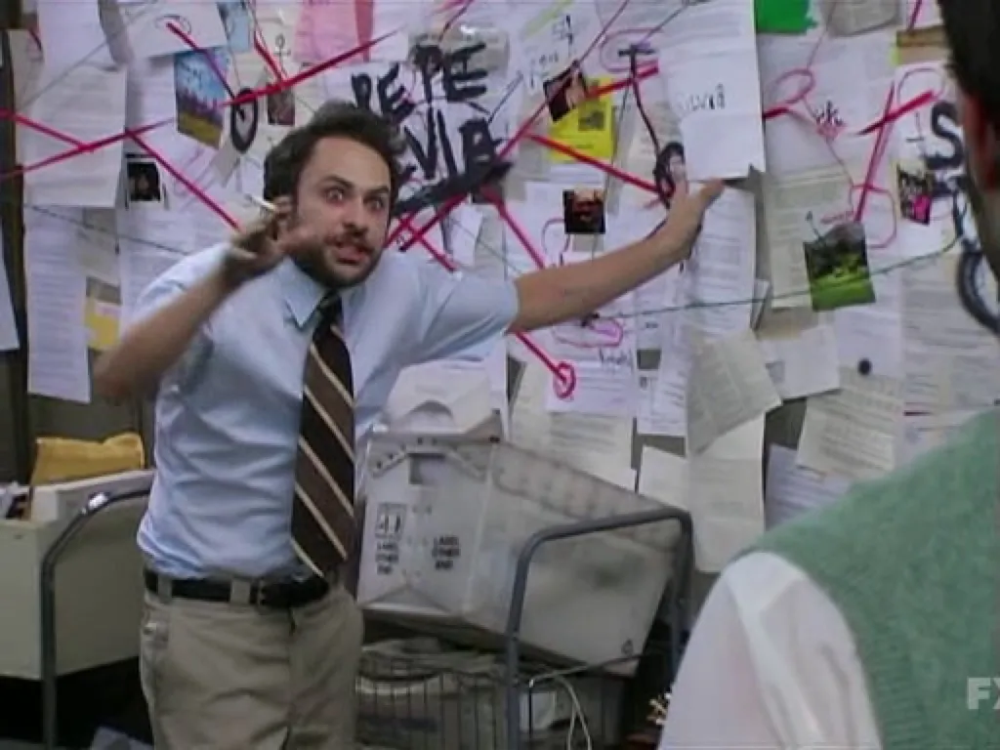
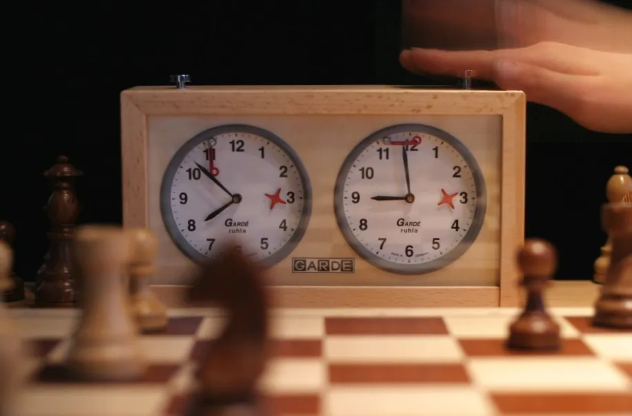
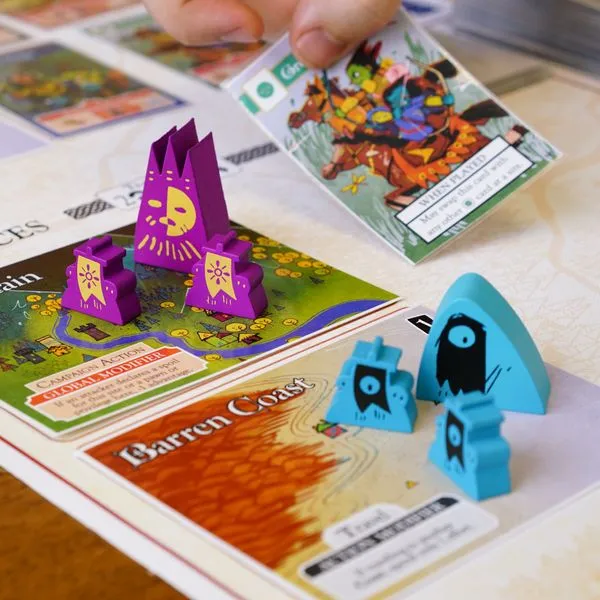
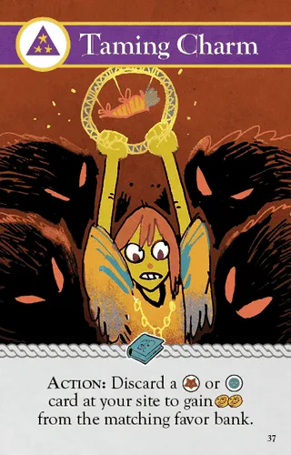

+++
title = 'Oath'
date = 2021-09-07T12:00:00-07:00
draft = false
categories = ["board games"]
tags = ["kingmaking", "oath", "cole wehrle", "cones of dunshire"]
+++

My copy of Oath arrived!



And, yeah, post-pandemic I've been able to rebuild a small group of board gamers who are willing to engage with me, even on ridiculous games like Oath. So let me tell you some of my thoughts about it.

<!--more-->

This Shut Up & Sit Down review calls it 2021's Most Exciting Board Game.



## The Cones of Dunshire Problem



It's an ongoing joke on Parks and Recreation that Ben Wyatt, a boring accountant, loves board games. He's nationally ranked at Settlers of Catan, and in his spare time he's concocted game called "The Cones of Dunshire", a game that takes several hours to play, involves mountains of dice, and has a variety of magical effects and win conditions, and is, effectively, a parody of the sorts of games that tend to top the [BGG Top 100](https://boardgamegeek.com/browse/boardgame).



> "The Maverick should be able to trade lumber for agriculture credits! _Why have I not thought of this before_?"



> Tech Worker: "You're the architect? Ha ha - and I'm the alchemist of the hinterlands."
>
> Ben: "There can't be an alchemist of the hinterlands, the hinterlands is a shadow kingdom that can only sustain a provost or denier."

In our first game, we, as a group, did the tutorial, an entirely deterministic first round where the book just tells us exactly what moves we're taking, and why. By the end of that first round, we've learned a bunch of stuff about how to play this punishingly intricate game.

A lot of the first game was just _hours_ of the group of us ironing out dozens upon dozens of tiny procedural issues. "If bandits rule unclaimed territories, why did the tutorial allow me to place a token there?"

Calculating the exact details of the resolution of a multi-territory attack phase between a strong player and the Oathkeeper on the first turn was so complicated that I spent a half-hour trying to figure it out ahead of time out of the rule-book so that I'd be prepared to help smooth things along once we actually started playing the game, and even then it took us some time to piece together the actual mechanics of that situation.

After the second game was over (and I had lost), I looked up a ruling about a wildly powerful card that I'd played and the discussion about it was 2 pages long and was only resolved when one of the game's creators posted updated "intended" text for the card.

_No, it wasn't valid for me to hide my secrets on bandit-controlled land, to protect them from being destroyed, this card destroys **all secrets** except for secrets not controlled by any players or secrets on the Darkest Secret._

So, this is a problem. **Oath is complicated**.

I've played a lot of games that I think are a contender for the throne, but Oath is the most **Cones-of-Dunshire-like** game I have possibly ever played. It's possible that the creators of Oath were in on the joke, because our first round was literally won by Tiffany using... the _alchemist_ - but not in the _hinterlands_ - in fact, if she had been in the _hinterlands_ she might not have won, her strategy hinged on both "holding the alchemist" and "not being in the hinterlands". In a round where most of the variables were pre-determined by the people who wrote the game. Look, I'm just saying it's **possible** that the Oath team found a way to work an extremely clandestine Parks & Recreation reference into their game. Or it's a fun coincidence.

## The Tikal Problem: Analysis Paralysis

Are you familiar with Tikal?

In Tikal, all information is visible, and on your turn you've got a limited number of highly flexible "actions" that you have to use to their absolute utmost in order to have any chance of winning. You can do whatever you want, in whatever combination, until you empty your action budget.

It's a fun optimization problem! For _you_. On _your turn_. Everybody else is forced to wait and watch you solve a highly personalized puzzle, occasionally interjecting to quibble about a procedural issue.

Oath has this problem in spades. With a turn having access to as much as 9 "supply" (actions, essentially), 6 unique and complex actions costing anywhere between 1-4 "supply", and access to dozens of unique board powers, the probability space of a single turn is vast.

[Analysis Paralysis](https://en.wikipedia.org/wiki/Analysis_paralysis) takes over.

Yesterday's second game went over _4 hours_ in runtime, and based on some estimations I can kinda back-of-the-envelope it that people were waiting as much as 30 minutes between their turns. You could take a turn and then go watch an entire episode of Its Always Sunny in Philadelphia, come back, and someone could still be piecing together the details of their incredibly elaborate turn.

> 
>
> pictured: an episode of It's Always Sunny I could have watched while waiting for my turn.

And this isn't just a failing of the game - this is required.

You can only win the game at the beginning of your turn (before doing anything) - and winning the game requires that you perform a fairly onerous and highly visible series of actions.

You don't just need to win the game, you need to win the game **in such a way that the rest of the table won't be able to untangle your win before your next turn**. This, with each of your opponents given their own highly intricate turns.  This requires that you model, in your head, not just your current moves, but the probability space of what every single player can accomplish to stop you.

Now, Oath has pools of limited information - it's not possible to know all information in Oath at all times - but it allows you _almost all of the information_- and knowing as much as reasonably possible is absolutely vital to being able to construct your master-stroke of a turn. You're privy to 90% of board state and most players have at best one or two hidden cards, so you really can come a this game with a lot of predictive capability.

The combats in this game are wild rolls of big piles of dice - but those dice are pretty understandable. You can run a big confrontation fully in your head and understand roughly how well one player is going to do against another. In our first and second sessions we were already tossing around ideas that we'd gathered about the expected utility of red attack dice (ok) and blue defense dice (amazing).

The Shut Up & Sit Down team talk about "Fuzziness" - a property of games that intentionally introduce mechanics to make the game's state or outcomes less predictable. Fuzzy abstractions make the game less strategic, but also serve to stop people from taking years long turns. Oath could stand to have a bit more fuzz in it, in my opinion.

Some player groups manage this problem with some manner of turn clocks or timer-based solution, which can force players to accept a slightly-less-than-mathematically-perfect-turn, but (and I feel like this might be an obvious thing to point out) **turn clocks are not a good way to make a gaming experience feel more loose, fun and casual**.

The way I tried to fight AP in our game of Oath was actually to try to engage the whole table in my turn, talking things out with everybody, talking out my own reasoning (sometimes to my tactical disadvantage, as it's much more effective to play games like this close to the chest) making sure everybody had snacks and drinks and keeping things fun and light-hearted and high energy, and by and large, that works okay. Until it's 11:45 PM and everybody is starting to root for the game to just END already.

## Kingmaking: Only Kind of a Problem

[Oh my god the BoardGameGeek thread on Kingmaking is insufferable.](https://boardgamegeek.com/thread/90150/what-kingmaking)

To summarize, Kingmaking is a term for when Player C can no longer win the game, but _can_ influence whether Player A or Player B wins the game.

To be honest, I think a lot of the people in the BGG thread are missing the point - a game has failed not when "an irrelevant player decides the outcome of the game" but when a player _feels that they have become irrelevant_.  That's already a not fun state.

Oath has a pretty bad kingmaking problem, although I can think of a few mitigating factors:

* The win conditions are flexible and fluid, and if one becomes totally impossible, with some effort it's possible to completely change up your strategy and try something else.
* The game's turns are so world-changing, and its advisors are so powerful, that it's possible for the state of the game to turn on a dime into something where you are a threat. The search deck is packed to the gills with advisors with highly-situational abilities that can be devastating against even the strongest player.
* Can't win as a Citizen? Defect (for a price of 3-7 favor) and become an Exile, forging your own path to victory. Irrelevant as an Exile? Sign up to become a Citizen and work against the other players with the military backing of the crown and a powerful new relic bequeathed upon you by the Chancellor.
* Don't have a big army? If you're an Exile, that means you have a lot of supply, giving you even more of an opportunity to go fishing for powerful cards that you can use to change your fortunes.

But... none of that feels terribly satisfying on the turn between the most powerful player Declaring They're About To Win and the turn in which they Win. There are still turns in Oath that feel a lot more impactful than others, and considering how long it takes for things to come back around to your turn, that can be downright demoralizing.

## The Good Parts

This game had a lot to recommend it, too. A lot of the complaints about this are also complaints that can be levelled against another strategic long-play game that I love, Twilight Imperium - which can also be barrels of head-scratching, rule-examining fun. I'm happy to own Oath _because I was thinking of buying Twilight Imperium_ but this scratches that same itch: players with competing armies squabbling and scheming over complex, secretive, and intersecting goals, intricate planning, alliances, betrayal, mead... it's got "first few seasons of Game of Thrones" energy in a big way.

## Brinkmanship

Somebody has satisfied the conditions to win the game, and now everybody has one turn to stop them from actually winning the game.

Who's... job is it to actually do something about that?

Sure, "everybody's", technically, but, like, practically, the more that other players do to stop a player from winning, the less you have to do, and the stronger that makes you in comparison. In fact, if you're the player immediately after the winner in turn order, it seems like everybody else's problem, not yours, right? I mean, so long as someone else actually has the resources to stop the game from ending. Of course, if they don't, you're hooped.

Why, some people might even note that if you prop up the player immediately before you in turn order, the other players may have to work so hard to stop them from winning that they hand the victory to you, instead.

This sort of calculation - this sort of active table negotiation and naked power-brokering - is the **beating heart of Oath**, and I do indeed find it pretty interesting.  That's another mitigating factor of the "kingmaking" - this is a game explicitly about kingmaking,

and kings are made in essentially the same kind of way that sausage is.

## Gorgeous

This game is just absolutely lushly produced.

> 
>
> _all of the Oath photography in this article was stolen from the internet, because I'm a blogger, not a real journalist_

I don't need to write a whole thinkpiece about this or nothing, but this is a very, very pretty game.

## Legacy

Oath is a legacy game.

I don't like legacy games. There's a recent trend in gaming - thanks to games like Gloomhaven and Pandemic: Legacy topping the BGG Top 100 - that is board games that evolve as you play them, adding and modifying game mechanics and even a creating a story by having you open envelopes, apply stickers to cards, and even destroying cards in the game.

**Thanks, I hate it.**  The idea that you have a board game that evolves over time is sort of balanced out by the idea that that evolution over time also damages your copy of the game, while also making it hugely inaccessible to new players who want to get in on the experience. Legacy games require buy-in, a fixed gaming group that want to return to it again and again, and definitely don't work if you let them sit on the shelf for several months between plays.

Oath does legacy really well, though. It's, for one thing, _completely nondestructive_. This is a game that can be 100% reset-to-factory-conditions, and without even too much difficulty. Reshuffle a few decks and set up the starting scenario again - or, heck, just scramble a few things and make up a totally unique start state.

Under the hood of this implementation, Oath is nothing more than a game with highly flexible start-up parameters. Instead of giving you an Adviser Deck with 400 cards in it, the Adviser deck is restricted to 40 cards or so, and at the end of the game, advisers that were part of a successful empire are kept around, and some of the discarded advisers are shuffled out to make room for new advisers - new advisers in the same suit as the winning player's advisers. But... since the game can be played with any deck of advisers, the legacy element is kind of just _deciding on the parameters for the next game_ - like if after every game of Dominion, you were to keep the cards that featured in the winning deck and swap out the cards that didn't. Isn't that a neat way to set up a next round? I think so.

Already after two games our deck is starting to lean towards Arcane and Nomad suits, meaning that our games are going to focus more on power-brokering in the Hinterlands and powerful, expensive effects that require Secrets.

The winner of one game becomes the Chancellor in the next game - which also provides a fun balancing mechanic, because I believe that the Chancellor has one of the most difficult paths to victory. Maintaining a stable empire across two or three rounds seems like an imposingly difficult task, even given the Chancellor's significant resources.

Alliances  - and "alliances" are a fuzzy term, because even in an alliance you're still competing as much with players within your alliance as you are with players outside of it - can also last (or form) between rounds.

Some places and advisors in the world itself can also stay in place between rounds.

But all of these things - well, they're pretty narrow bounds on setup conditions for an absolutely sprawling game. One could completely shuffle or reset the Advisors deck, deal out a random collection of locations and advisors, give a random player the Chancellorship and a couple of key locations, and the game would be off to the races with very little lost except shared context. The game's intended to be valid and fun with pretty much whatever state you end up in, so this cataclysm wouldn't hurt the game at all, except that the cards you trade with and their abilities would be strangers to you.

There's an advisor, "Taming Charm", and with the game's Fantasy Font and my reading it upside down, I read as "Tanning Chatum", and now [Tanning Chatum](https://en.wikipedia.org/wiki/Channing_Tatum) is a regular fan favourite.

Getting new players in to the game? Well, explain a little bit of history to them and they'll be just as competitive as anybody else.

Oath has fully reversible, completely optional legacy mechanics that still manage to be satisfying and deep. That is awesome. This is the sort of implementation that might actually convert me to liking legacy games.

## In Conclusion

Look, I just sat down and wrote like fo-feventy jillion words about this game, it should be pretty clear that I'm pretty excited about it.

Games are great in different contexts. I have short, pithy games for my family (Ticket to Ride, Point Salad, Sushi Go), middleweight euros for my friends (Concordia, 7 Wonders), light-hearted party games for both of those groups (Wavelength, Deception; Murder in Hong Kong), and one or two of these massive, complicated beasts like Gloomhaven and now Oath.

The context of a Gloomhaven or an Oath (or an Eclipse, or a Twilight Imperium) are that they're Project Games. You take them to a cabin with a couple of friends for a weekend.  You set them up on the big table and play for a couple of hours at a time between meals and breaks and doing other things entirely and just hanging around reading books, and you talk the games over dinner.

I think Oath has what it takes to be a fabulous cabin game.

## P.S.

> Eugene: curse you for putting the "OAuth" reading of Oath into my head because now I can't stop reading Oath as OAuth.

ha ha