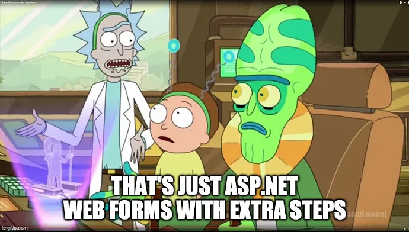

+++
title = "Phoenix LiveView makes a Very Old Mistake"
date = 2021-05-29T12:00:00-07:00
draft = false
categories = ["software"]
tags = ["elixir", "phoenix", "javascript"]
+++

I’m really enjoying learning about Elixir, and Phoenix. They constitute, in my opinion, an extremely thoughtfully designed language and framework. So far my biggest gripe about the language is that prominent library developers keep choosing names for their products and libraries that are not terribly Google-able. “Phoenix”? “Hex”? “Cowboy”?

Anyways, Phoenix got really popular in 2017, at which point it seemingly dropped off of the face of the planet.

I want to put that wholly at the feet of their pursuit of Phoenix LiveView, a stack so fundamentally cursed that it undoes almost every iota of goodwill earned from Phoenix or Elixir.

<!--more-->

## A Quick Overview

Let’s talk about the design of Phoenix LiveView a bit. The way that it works is as follows:

* You GET a web-page
* Phoenix uses an Elixir “live template” to determine what to send back to the user.
* A middleware plugin adds a blob of opaque JavaScript to the page.
* On load, the JavaScript starts up a websocket connection to Phoenix PubSub (an embedded engine within Phoenix that handles sockets really well)
* Any “changeable” parts of the website are bound to JavaScript events that send messages up the socket to the backend server.
* The Phoenix server mounts a controller that’s able to listen for these PubSub events from the page.
* If changes occur, the Phoenix server selectively re-renders segments of the page’s live template.
* These template changes are diffed against the previous page DOM using a merkle-tree inspired technique very similar to the one used in React
* Updates to the page’s DOM are sent back to the JavaScript running on the page.
* The JavaScript applies the updates to the page.

That’s the basic loop. I may have subtle details wrong, I’ve only given LiveView a brief once-over, not an in-depth look. And… honestly, it’s pretty cool, and _undeniably technically impressive_.

It’s now possible for Elixir developers to deliver entire web products without having to produce even a single iota of JavaScript.

You’d think it would be wasteful of server resources, sockets, or bandwidth, but the high-quality DOM diffing scheme combined with Elixir/Phoenix’s legendary performance render that essentially a moot point - the creators have demonstrated that their scheme actually sends less data over the wire than a comparable React + JSON app.

Cool, right?

## But It Was Not Cool

And yet, somehow, this _wonderful new technique_ has seemingly failed to win the hearts and minds of developers.

There’s one video, on Phoenix’s front page, explaining how to create a Todo app using this technique, at which point all writing on the topic of LiveView appears to dry up.

Why? What went wrong, here?

## The Law of Leaky Abstractions

Ugh, it’s weirdly often that I invoke this ancient blog. (Follow-up question: who’s making insightful programming blogs nowadays? pls share)

> [Joel on Software - The Law of Leaky Abstractions](https://www.joelonsoftware.com/2002/11/11/the-law-of-leaky-abstractions/)
>
> The law of leaky abstractions means that whenever somebody comes up with a wizzy new code-generation tool that is supposed to make us all ever-so-efficient, you hear a lot of people saying “learn how to do it manually first, then use the wizzy tool to save time.” Code generation tools which pretend to abstract out something, like all abstractions, leak, and the only way to deal with the leaks competently is to learn about how the abstractions work and what they are abstracting. So the abstractions save us time working, but they don’t save us time learning.

Elixir LiveView is one of the leakiest abstractions I’ve encountered in a long time. It has to struggle so hard to accomplish the magic that it’s trying to accomplish, that you end up having to learn every layer behind it _in horrifying detail_.

Its installation into [the Phoenix framework](https://hexdocs.pm/phoenix_live_view/installation.html#content) involves no less than 12 steps. A lot of fresh moving parts need to be installed for this to begin working.

Anyways, I don’t want to enumerate every single gripe I have with this cursed stack - you’d all get bored and wander off. Instead, I want to invoke a comparison with another doomed technology.

## ASP.NET Web Forms

Here’s what I thought the first time I encountered Elixir LiveView:

You might not remember ASP.NET Web Forms:

> 

With a little bit of cajoling, an ASP.NET server combined with a little bit of clever JavaScript on the client-side could allow you to build whole website experiences using C# components and Windows-like abstractions!

It was, for a time, a wildly successful model. It inspired JavaServer Faces, a similarly-cursed technology intended to insulate Java developers from ever having to get their hands dirty with web technologies. While Web Forms is largely dead, JSF is still going strong - not because it’s more relevant, but because Java developers have never been blessed with the ability to notice when a technology has become hopelessly dated.

> The core bit of plumbing that made Web Forms work was the HTML `<form>` element, stretched way beyond its intended purpose. In a Web Forms page, every web control lived inside the `<form>` element, and all dynamic content was rendered there. In practice, that meant that every ASP.NET web page was consumed by one gigantic hidden form (hence the name, Web Forms ).

The problem with Web Forms were that most of the tricks it had to pull in order to make the programming model work were inefficient, not to mention completely inscrutable if you happened to need to debug it from the outside.

> The eventing system that Web Forms stapled onto web pages — called the _postback_ system — was another expensive illusion. To make pages react to user actions and trigger server-side code, ASP.NET relied on a snippet of JavaScript that intercepted browser events and sent the page back to the web server. There, on the web server, a series of events unfolded.
>
> At first glance, the sequence of events in the page lifecycle seems logical enough. But even seasoned ASP.NET developers could get confused about the order of actions a page needed to perform — reading the markup, rehydrating web controls from view state, running initialization code, performing data binding, capturing new values that were posted in the form, loading up user controls, and so on. If a web control needed to do something during one of these stages, what could it assume about the other controls on the page? Problems were difficult to pin down, and automated tests were off the table. Once again the Web Forms abstraction had a stiff cost, but now it wasn’t performance, but complexity.

Even though LiveView has solved a lot of the performance problems, they haven’t even made a dent in the problem that the abstraction that they’ve chosen to present is _wildly, monstrously complicated_.

Which is why the bulk of the conversation around Elixir LiveView appears to be the world’s most needlessly convoluted TODO app.

## Anyways

One of the big questions when faced with a technology this ambitious is _what problem does it solve_?

> LiveView enables you to build Phoenix apps with interactive, real-time user experiences without writing JavaScript.

I’d argue that an awful lot of the ultimately-doomed web technologies of the past two decades - Web Forms, JSF, Flash, sproutcore, coffeescript, asm.js - they all start from the same broken ideology. “We built a tool that lets you avoid having to deal with the problems of JavaScript.”

**It's been a quarter-century. Maybe it's time to accept that JavaScript is not a problem that needs to be solved.**

Anyways, “you don’t have to deal with JavaScript” isn’t actually much of a selling point, as far as I can tell. JavaScript is not terribly difficult to learn or use - certainly not more difficult than C# or Elixir. Ultimately these complicated compatibility layers serve the preferences of a handful of developers rather than providing any concrete customer value.

And when JavaScript surges forward - new features and functionality are being added every year at this point - the compatibility layers struggle to keep up.

> All around, JavaScript was exploding with new ideas and techniques. Meanwhile, ASP.NET developers were stuck looking at the new web development landscape through a tiny porthole.

I’m still pretty excited about learning more about Phoenix development, though. I’m firmly convinced that I have a lot to learn from the Erlang ecosystem. I just might pass on LiveView.