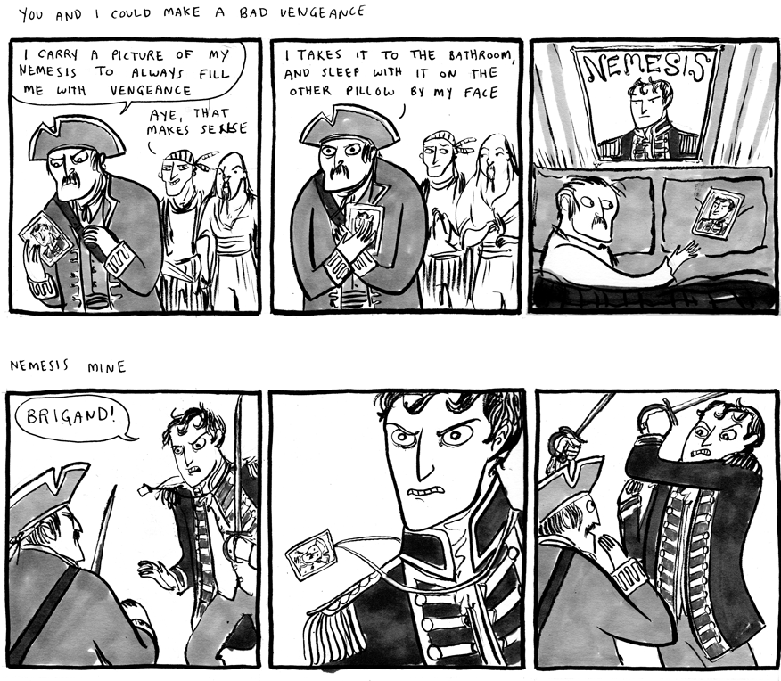

+++
title = "This is How You Lose the Time War"
date = 2021-05-10T12:00:00-07:00
draft = false
categories = ["books", "science fiction"]
tags = ["this is how you lose the time war", "queer", "epistolary"]
images = ["timewar.png"]
+++



<!--more-->

------

> As agents Red and Blue travel back and forth through time, altering the history of multiple universes on behalf of their warring empires, they leave each other secret messages—at first taunting, but gradually developing into flirtation and then love.

I liked this book a lot. Usually when I finish a book in one sitting it's because I like it a lot (and also because it is _short_). 

I'm finding myself intentionally having to tone my own prose down a few notches because when I read stuff like this I get _flowery_ for a little while. _Hold up, there, William J. Shakespeare, you're writing a quick book review for a private forum._

Winner of both a Hugo and a Nebula, this book's _divisive_ - five stars or one star, few in between. Love poetry writ large across a sprawling, barely-explained sci-fi universe. Everything in this book needs to be pieced together by scraps - as the twin protagonists of the book tease each other with densely layered references and florid writing. 

The book expects a lot from its reader - first of all, a lot of science-fiction tropes need to be sitting in RAM for this thing to parse at all, as evidenced by a lot of one-star reviews from confused lesbians looking for a satisfying sapphic romance and finding, instead, a universe that already expects you to be fully familiar with all of the time travel, alien and post-human sci-fi tropes it is throwing. It's also a book that expects you to be willing to sympathize with two psychopathic interdimensional assassins. 150 pages is hardly time to explain the mechanics of time travel, let alone not one but two different super-advanced sci-fi-races, so the book simply skips most of that. Mechanics be damned. This is not hard sci-fi. For those willing and able to put up with the science fiction tropes, they may not be expecting a _romance novel_.

This is a book of _imaginative steganography_. The agents hide messages for one another in _wild science fiction ways_. It's structured as call-and-response, a tale of finding a letter, then a letter, then a tale of finding a letter, then a letter again, each set in a new dimension, each delivering a shred of extra information.

And as for the plot, well...

It's just this Kate Beaton comic about nemeses falling in love through mutual obsession. 

 