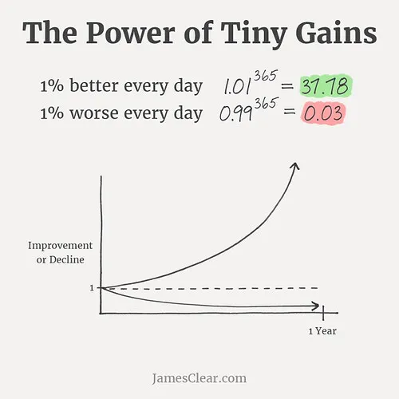

+++
title = "I Think Atomic Habits Might be a Crock of Shit"
date = 2022-12-01T12:00:00-07:00
draft = false
categories = ["humor"]
tags = ["motivation", "self-help", "speedrunning", "business books", "hustledork"]
+++

So, I make a handful of small improvements to one of our systems and open a PR, and I’m trying to find a funny “many small fixes” image to go with it, and I run into this image:



<!--more-->

In fact, this image search for “small improvements” has resulted in what I would regard as an _unusual amount of self-help hustle-porn_. If you simply make yourself 1% better every single day, why, in 100 days you will be **two entire people**. Think about that, why don’t you.

## Work Smarter, Not Harder

Anyways, I kind of remember this theory from a food video I watched a while back: a food-tuber, Alex, references the pop self-help book [Atomic Habits](https://en.wikipedia.org/wiki/Atomic_Habits), and uses it as a basis to try to improve his onion-chopping speed.



The central idea isn’t wrong, even, necessarily:

Big, obvious improvements can come with enormous productivity increases: if you’re bicycling on flat tires or chopping onions with a hammer, you’re going to see large, concrete productivity improvements from _simply fixing the obvious thing_.

But at high-levels - for example, bicycling competitions - or in skillsets where the baseline level of skill is high and the cost of high-end equipment is low - for example, onion chopping - most people have already exhausted all of the groundbreaking improvements.

So, instead, we start to seek improved performance by chasing a lot of little gains: if we make a bunch of little things a tiny bit faster, we’ll end up making the whole thing noticeably faster, right?

This is the underlying theory of a lot of speedrun world champions, too - watch them at GDC and they sweat every microscopic detail of the games they’re playing; even if there’s a whole minute they can lose to RNG, even if they’re playing for show in a marathon format rather than for a world record run, in order to stand a chance at all they need to be aware of every spot where they can skip 8 frames to save a fraction of a second. They add up.

Atomic Habits isn’t new, though; it’s a pop-self-help reframing of the Toyota business theory of Kaizen:

> [Kaizen](https://en.wikipedia.org/wiki/Kaizen)
>
> Kaizen (Japanese: 改善, "improvement") is a concept referring to business activities that continuously improve all functions and involve all employees from the CEO to the assembly line workers. Kaizen also applies to processes, such as purchasing and logistics, that cross organizational boundaries into the supply chain. It has been applied in healthcare, psychotherapy, life coaching, government, and banking. By improving standardized programs and processes, kaizen aims to eliminate waste and redun...

Make small improvements regularly and things will speed up more and more. Eventually: fast!

… This all makes sense. The title of this article, “I Think Atomic Habits Might Be a Crock of Shit” is going to seem hyperbolic when I admit that I don’t have any quibbles with the core theory, here - small improvements stack up to amount to bigger improvements! Kaizen, as a business theory, is interesting to read about and more humanistic than one might expect for a theory about extracting Maximum Value From Humans: it is about empowering workers to improve their own processes by giving them freedom and flexibility to experiment with whatever makes them feel most productive.

Ultimately, when I fuss with our team’s CI or try to fix my keyboard macros just right, I, too, am engaging in a form of Kaizen.

Back to that original image, though:

This image doesn’t just promise small gains; this graph appears to offer a lot more: no loss in productivity, gains increasing in speed over time, and unlimited gains. It also does not bother to note the cost of these gains.

**This is where, IMO, the “crock of shit” starts to intrude.**

These micro-optimizations are supposed to be a way to extract microscopic improvements in a competition format, not a map towards a more healthy and productive life.

So what I’m going to argue is not the theory itself, but the implication that this theory is broadly applicable. I believe that these tiny gains often come with high cost, temporary loss of productivity, and badly diminishing returns.

## The High Cost of Marginal Improvement in Both Time and Money

I love automating small tasks away. Sometimes I’ll spend days automating away a 2 minute task, because I know, deep down in my heart of hearts, that fussing with automation is more enjoyable than performing a boring ol’ 2 minute task, even if there’s no way I’m going to recoup the lost time I spent working on that automation.

> 
> <small>https://xkcd.com/1205/</small>

These improvements are often _extremely high effort and extremely low value_ - sometimes, for speed-runners, trimming a few frames out of each story window takes extremely precise and hard-to-trigger glitches that demand **hours** or **days** of practice.

The time cost of this 1% gain in game performance is extremely high, and - if you’re comparing the seconds of your life spent on optimizing against the seconds of your life gained by that optimization, probably never pay off unless you are explicitly competing to the the fastest at the game in a competition format.

In Alex’s cutting experiments, he switches to an extremely high-end knife: a knife that may offer a tiny improvement in cutting speed in exchange for costing _literal actual hundreds of dollars_.

And that’s the things: once big, obvious improvements are out of the way, we’re left with the kind of improvements that people only care about when they’re chasing world class performance: you can make an absolutely banging cup of coffee with $50 worth of kit (plastic pourover, paper filter, blade grinder, basic kettle) - and then you can spend _thousands_ of dollars and _hundreds of hours_ chasing tiny, barely noticeable fine-grained 
do you get the pun there? fine-grained improvements? ho ho


I’m going to post a link to [James Hoffmann’s YouTube channel](https://www.youtube.com/@jameshoffmann/videos) here, it is absolutely fabulous to watch people go down these rabbit holes, but obviously attempting to apply these philosophies to literally everything in your life is insane, right?

Like, if you want to chase a 1% improvement in the sound from your grand piano, you’re looking at spending a mortgage-sized amount of money to chase that 1% improvement. This kind of thing literally only makes sense if you have already exhausted every other avenue of improvement and you’re in a position where that 1% improvement is tangibly worth that kind of money to you.

Learning [colemak](https://colemak.com/) just might not be worth it, guys.

## Plus: Maintenance Costs

On top of the lead-in cost to these many tiny 1% improvements, they come with ongoing maintenance costs:

> 
> <small>https://xkcd.com/1319/</small>

In Alex’s Onion Chopping Mission, he took his already sharp knife and spent a little bit of extra time sharpening it extra, just before he started chopping onions, to get that _perfect edge_.

But, as anybody with good knives knows, keeping your knives sharp? That’s a forever job. While we could achieve optimal performance by performing a full sharpening before every single kitchen task, that performance would come at the cost of… an unnecessary and silly amount of time spent sharpening, and a much shorter lifespan on our very expensive knives.

That full sharpening for every task would also obviously take more time than it would save.

## All Improvements Are Not Created Equal

Alex puts on “chef clothes” to improve his chopping performance and claims that it will have a psychological effect on his ability to chop.

Some pro-level improvements are **just $350 audiophile-grade ethernet cables**. They aren’t going to do _anything_.

Some improvements that help 1% in one part of riding a bike will interfere with other improvements, or interfere with the development of other improvements.

An example from code: the oft-quoted “premature optimization is the root of all evil”. - or, the full Donald Knuth quote:

> The real problem is that programmers have spent far too much time worrying about efficiency in the wrong places and at the wrong times; premature optimization is the root of all evil (or at least most of it) in programming.

This is an oft-misunderstood quote: optimization itself is not evil, and this comes from a book where Donald Knuth has created his own personal insane [hypothetical computer](https://en.wikipedia.org/wiki/MIX) and shows you how to extract maximum performance from it.

> 
> <small>https://xkcd.com/1691/</small>
>
> I’m beginning to think that xkcd author Randall Monroe has thought about this more than I have.

The problem is that optimization - especially needless micro-optimization - is in-and-of-itself expensive and often makes the code uglier and harder to work with, which can get in the way of much more meaningful changes.

Everyone’s seen this ol’ gem:

Sure, it could mean that these two are too busy doing work to bother to try to improve their tools: an argument for kaizen!

But… these two could also be too distracted by micro-optimization of the wrong parts of their process to engage with… the big optimization, that they’re missing.

Sometimes big improvements will erase decades of micro-improvements: I imagine that [“rolling” Tetris is sufficiently different from “hypertapping” Tetris](https://kotaku.com/nes-tetris-players-call-it-rolling-and-theyre-setting-1846767518) that a lot of the micro-optimizations of one do not necessarily cleanly map to the other.

Competition cyclists really don’t have a lot of space for improvement: they already have the good bikes, the technique, everything down pat. For most people, that’s not the case. It’s really unlikely that a series of micro-optimizations to your bicycling regime will perform better than simply fixing your flat tire.

The point I’m trying to make here is that these reams of small improvements are the realm of professionals for a reason:

## You Simply Can’t Be The Best at Everything

I can’t remember the exact talk, but I was at a game industry conference one time and I caught a talk where someone made a case that, in order to be successful, a video game company needs to be best-in-class at _one or two extremely focused things_ and they need to be passably good at everything else.

Trying to chase the A+ performance in every possible direction at once is too expensive for any studio to chase - there’s not enough time or money in the world to make The Perfect Game and trying is how you get bloated Duke Nukem Forever disasters.

A company that can field one A+ with dozens of C-'s is going to be way more memorable to consumers than a company that gets a solid B in everything.

Also, as it turns out: just being _mediocre but sufficient at a great many things_ is incredibly hard and a talent in its own right.

If you’ve heard of [T-Shaped Skills](https://en.wikipedia.org/wiki/T-shaped_skills) as both a career development and hiring guideline: you want to be incredibly talented at one or two things, and broadly capable at a lot of other things.

> 
> <small>the line blocks are out there hogging all the glory but these guys are in the trenches, getting important work done</small>

Heck, that’s one of the things that I like about VRChat: we’re out there being the absolute, unrivaled king of one specific thing and I’m running around behind the scenes helping to be their C- in everything else.

## My ~~fucks~~ Improvements Have Runneth Dry

On top of that, lo and behold, these Tiny Gains eventually run out. Eventually, every corner of the game is just so micro-optimized that there are no more tiny gains to be found.

Back to speedruns:

> 
> [lesswrong.com](https://www.lesswrong.com/posts/nhjaegqWxbBhiqMGS/analysis-of-world-records-in-speedrunning-linkpost) - Analysis of World Records in Speedrunning

While people are still discovering big improvements for games, their speedrun time comes down dramatically. This is the “finding new techniques” (or “flat tires and onion hammers”) phase of speed-running - new discoveries are fresh on the ground and it seems like the players are posting impressive new times week after week.

Then, there are long plateaus where there are no new discoveries, and people are just Kaizen-ing their way through every moment of the game to shave off a few seconds here or there.

With all of the easy slam dunks out of the way, and even most of the small improvements exhausted, these players are now fighting over the last few fractions of a second. Of course, advances in speedruns continue, but I think it’s obvious, almost axiomatic, that chasing perfection has diminishing returns as you approach perfection.

## So?

I’m going to admit it: I _haven’t even read the book_. Maybe if I dig in deep it’s going to be up-front about some of these downsides

pop self-help is usually very realistic and down to earth about how its advice isn’t entirely infallible, he says sarcastically

 so, 100% of this post has been me making fun of that graph. Look at that graph! It’s terrible! Bad graph!

Sure, I believe that many small improvements can add up to make big improvements. Ultimately, though, I believe that a self-help theory of drowning your life in micro-optimizations misses the forest for the trees.

Stacking micro-optimizations can not be done forever, at low cost, with no loss in productivity, with guaranteed returns; on the contrary - a lot of the times micro-optimizations are:

* expensive
* fussy
* needless
* hard to maintain
* and only really make sense if you’re chasing the top tiers of performance in any given field.

Mostly, I believe that books like Atomic Habits exist because they give you an excuse to feel less guilty about buying yourself some sweet pro-grade equipment for almost unnoticeable improvements in your life; they exist because [hustle porn](https://www.inc.com/serhat-pala/alexis-ohanian-says-hustle-porn-is-most-dangerous-trend-in-silicon-valley-heres-how-to-eradicate-it.html) - the fetishization of productivity at any cost - always sells well.

They also might be a crock of shit.