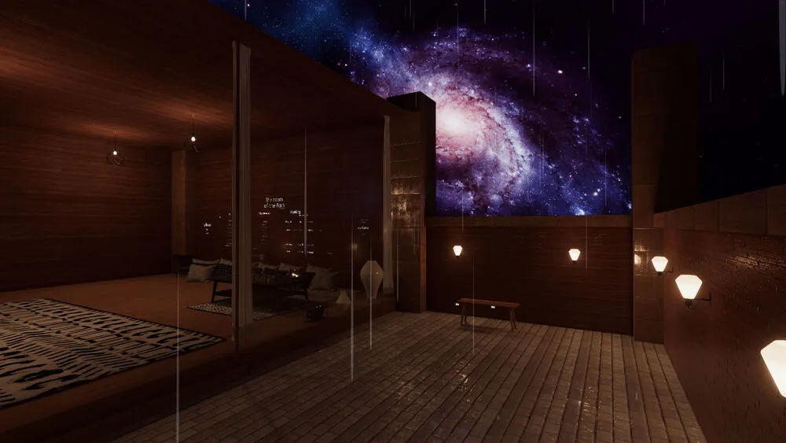

+++
title = "Cozy, not Cyberpunk"
date = 2022-12-12T11:00:00-07:00
draft = false
categories = ["video games", "vrchat"]
tags = ["cyberpunk", "hygge", "cabinpunk", "chill"]
+++



If you were to ask most people what they think the visual design of social VR looks like, I think they would say "Cyberpunk".

The Oasis, the Metaverse, virtual reality as a crowded, public, bazaar.

> 
> uh oh, we built a transmetropolitan

<!--more-->

Bright lights, neon, transhumanism, retro-tech, everyone knows that the future is a magenta-colored hexagon covered in advertisements, right?

Second Life - which functioned as both a metaverse and one of the world’s most wildly successful speculative real estate scams - really captured the feeling of being in a vast, open-air mall:

> 
> “wow, what creativity on display” you are definitely thinking while you look at this

A lot of the future of virtual reality is in the hands of people who didn’t realize that Snow Crash was supposed to be a dystopian satire. This is the Ready Player One vision of VR as an exciting new place to purchase things.

And we lean into it a bit. Our art director is, for example, obscenely talented (but did you knoooooow) and has been known to show off work that fits the vibe:

The source material: Snow Crash, Neuromancer, Transmetropolitan, a bunch of high-tech low-life near-future stories intended to highlight the glittering inequality of a world where the only reins on technological development are “who can afford it”.

> 
> recent prominent cyberpunk media has fallen into this trap too

And yeah, we’re somewhat aware of this: a lot of digital ink is spilled on how to build social VR without becoming an [abandoned virtual mall](https://secondlife.com/), a [thinly-disguised child sweatshop](https://www.youtube.com/watch?v=dPHPNgIihR0), a [slot-machine-inspired skinner box](https://www.youtube.com/watch?v=dPHPNgIihR0), a [storefront without a game attached](https://www.youtube.com/watch?v=dPHPNgIihR0), or - even worse - [doing all of the above while leaning in to the worst excesses of adtech and surveillance capitalism](https://www.oculus.com/horizon-worlds/).

It’s important for us that people just enjoy being in VR, rather than participating in nothing more than a joyless exercise in an extractive marketplace.

So, while the idea of virtual reality is firmly rooted in the cyberpunk stories from which it came… the vision of VR as a casino or mall: a loud, cold, neon-heavy, visually busy, overwhelming, glittering Oasis intended to separate rubes from their money? That actually doesn’t appeal to people very much. It appeals to investors, but not… humans.

So, what do social VR spaces built by people actually look like?

> 
> <small>Little Loft, [here](https://vrchat.com/home/world/wrld_d4d7d8e4-cd2d-4fcc-ab5b-2aaf1edb6436)</small>

> 
> <small>Room of the Rain, [here](https://vrchat.com/home/world/wrld_fae3fa95-bc18-46f0-af57-f0c97c0ca90a)</small>

> 
> <small>The Great Pug, [here](https://vrchat.com/home/world/wrld_6caf5200-70e1-46c2-b043-e3c4abe69e0f)</small>

These are some of the most popular worlds in Social VR. And these worlds are really, really popular.

Why, they’re not really very cyberpunky at all!

It would seem that our users didn’t get the memo about the aesthetic.

Heck, once you actually get into virtual reality, it seems like a lot of people don't want to inhabit a noisy glowing cyberpunk mega-bazaar, they actually want to inhabit THIS universe:

> 
> chill lo-fi hip hop virtual realities to study/relax/hang-out to

## Coziness, VR's Secret Aesthetic

One time, on a trip up to Whistler, I grabbed a book in the one cute little bookstore and read it in its entirety in about one night. It was about hygge, a Danish word with extremely similar connotations to the word "cozy" but with more of a Scandinavian touch.

This whole concept was really trendy in 2016-ish.

On our trip, we visited a mountain spa called "Scandinave" where you pay a fixed fee to just hang out in a bunch of heated pools all day. While I was reading the book about Hygge, I realized that, uh, duh, Scandinave is also Scandinavian, thus the name, and they definitely 100% architectured this place with the principles of the book I'm currently reading in mind.

Which would seem like a fantastic coincidence except that - well, I bought the book in Whistler. These book-store owners know what's up.

Anyways, type "hygge" into google image search and you get this kind of thing:

A lot of us grew up in the Pacific Northwest (Oregon, Seattle, Vancouver) or in actual-Scandinavia and we know this aesthetic like we grew up with it, because we did.

Also you might notice that these images look a lot more like what people are actually building in virtual reality.

Why?

Because it's the **furthest thing from cyberpunk**. Rustic coziness of pools of contrast between dark and light. Roaring fires and rainy days and blankets and mugs of hot tea and cable-knit sweaters. Books and rugs and natural, unpretentious materials.

Cyberpunk is loud and crowded and impersonal, brand-names and tech-inspired-maximalism, blaring club music and bright lights - Cozy is small and intimate and cluttered and friendly.

Virtual reality, too, is loud and crowded and impersonal, overwhelming, too much noise, too fast. It comes at you quickly and it’s exhausting.

To quote one of my co-workers:

> People want to socialize, public instances are not very pleasant for invested users with a built out friends list, and very full rooms are not enjoyable when our voice tech pumps every single ongoing conversation around you into your brain.

Public worlds are already too cyberpunk.

Introducing elements of cool and calm soften the rough edges around virtual reality's blaring and overwhelming nature and also naturally encourage the kinds of interactions that **actually work best with the limitations of VR technology** - small groups, intimate hangs, quiet chats.

As a result, the stuff we crave in virtual worlds look a lot more like what we see in the Scandinave: an organic grouping of small conversational circles connected by narrow paths, verticality and the ability to see other social groups from afar before engaging with them, zones of privacy, a fantastical backdrop, pools of light, warmth, and a sense of safety and security to offset the often bizaare and unsettling dreamlike quality of unfettered virtual reality.

Some of social VR’s most popular creators have realized this, and run with it.

And that, really, is the point I'm trying to make:

The dominant aesthetic of VR is not necessarily loud, crowded cyberpunk, but instead features a surprising number of quiet, thoughtful and chill spaces. This is a necessary adaptation to how flashy, cacophonous and obnoxious unfiltered virtual reality can be.