+++
title = 'Groovelet Card Game'
date = 2022-09-03T12:00:00-07:00
draft = true
categories = ["gamedev"]
tags = []
+++

## What Is This?

Hi, 2025 Curtis, here, to provide some context:

So, between 2019 and 2022, I was working on a game.

The game... went through a lot of changes as I worked on it, and I spilled a lot of ink about my various and sundry accomplishments and victories, which I'm going to combine here into one huge mega-post so that it doesn't take over my whole blog.

## 0. I come up with the broad concept:

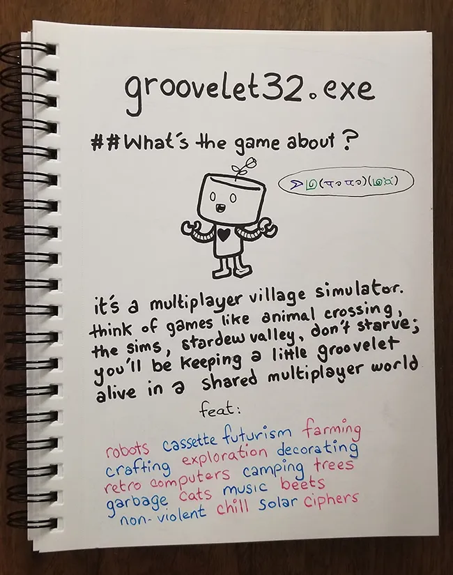

* Multiplayer
* Village simulator (a la. Stardew Valley, Animal Crossing)
* Grid-based
* Real-time

## 1. Late 2019: I Describe the Project to Tiff

I say "we'll start by simulating some sheep eating grass on an isometric grid" to my wife in, say, 2019,
and six years later she still won't let me forget that this was the original scope of the project.

Tiff makes some prospective isometric grass and vine art:

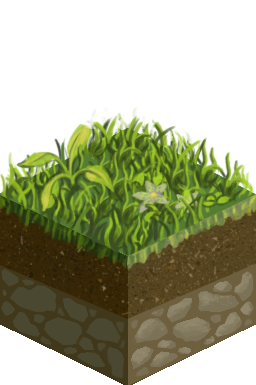
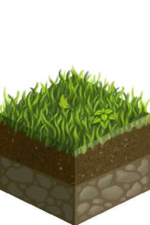

This is the beginning and end of her involvement in this or any of my projects, forevermore.

## 2. Early 2020: I Try to Build a Grid Simulation System
...that can synchonize across multiple computers using Redis at a tick rate of 1 tick per second.

This takes a long time and seems kind of like it's working.

The sample environment that it runs is: a chess game. That's a multiplayer grid-based multi-agent simulation, right?

It's not _sheep specifically_ but it is, in fact, a working simulation engine!

## 3. Late 2020: I Try to Build an Isometric Grid Display System
... using React, Pixi, and Electron.

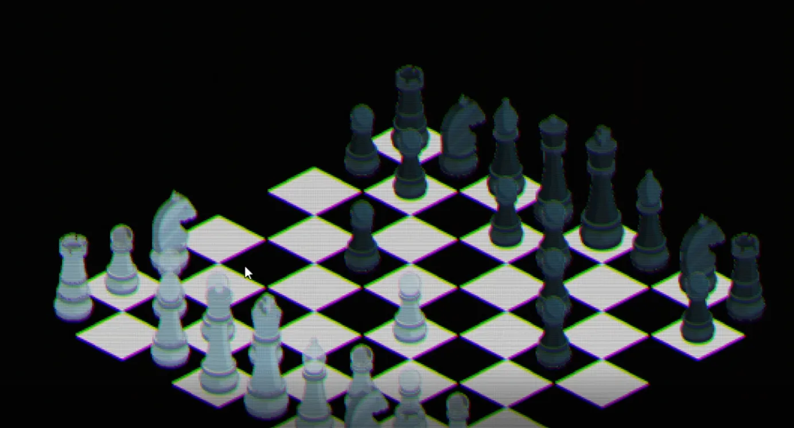

This works, more or less.

This is also an opportunity to integrate the [grass textures](#grass-textures-nov-24-2020):

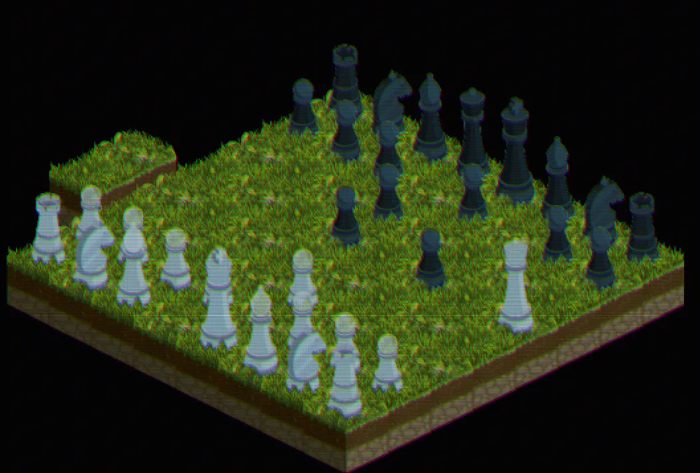

It's surprising that this all just barely works! _(hint: later on I will discover that it doesn't work, very well)_

## 4. Late 2019-Early 2021: I Get Really In to Procedurally Generating Music for a While

This world's gonna need music probably, and I have an idea for how to generate it!

--------

# The Full Blog Posts

## Nov 24, 2020 - Grass Textures

So, after work (being as all of this has to be done after work), Voxel showed me these isometric textures that she’d been working on throughout the day:

Handsome textures indeed.

“These are perfect”, I said.

Then, I asked if she could make me a top-layer for the grass.

”A what?”

”Well, you know, if you were to stand on the grass, some of it would display behind your feet, and some of it would display in front of your feet - so, if you could, like, cut out some of the grass that would appear in front of your feet, I can stack the layers so that objects appear to be nestled in the grass rather than standing on top of it”

”Well, if you want that, can’t you just paint out the bottoms of the things that you’re putting in to the grass?”

”Yeah, but we’re probably going to have a lot more objects in our universe than we are going to have types of terrain, I think - so it makes sense for the terrain to flow around the objects rather than vice-versa - do you want to have to paint out the bottom of every single animated object in the entire game?”

At this, Voxel just stared at me like I was speaking French. “I thought you said we were starting with just some sheep and grass - lots of objects? I don’t know. What if we just make the characters without legs so that they don’t sit directly IN the grass?”

”That’d work, but what if we have other ground-level stuff? Like, uh, cans. “

“Cans?!?”

”Okay, here’s an idea - what if I just take any element that I’m displaying on grass and mask out the feet with a gradient - that should give the illusion of them vanishing into the grass, right?”

We tested it out in Photoshop and it looked pretty okay. Plan made.

I was in the process of futzing around with procedural music, but I needed to integrate these textures right away if I wanted to be able to give useful feedback on them. So I had to take the current state of the isometric grid, which looked like this:

and integrate Voxel’s new grass texture. It… didn’t take too long.

You’ll note that my Pixi filters and the process of small-squashification take Voxel’s beautiful art and make it look much worse, more like SNES-era pixel-art, which is kind of what I’m going for. Some time might be spent pixel-twiddling to take her gorgeous concept art and really concretely pixelify it - bump up the contrast a little, that sort of thing. The A E S T H E T I C here is “Windows 95 game”.

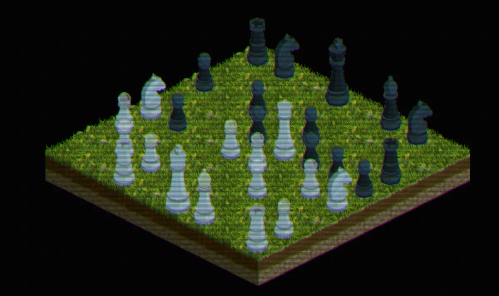

You’ll also note that my Groovelet world is filled with chess pieces. I’ll explain the chess stuff in more detail later, but for now, let’s just say that the chess pieces are temporary developer art, intended to hold the fort while I build out More Engine.

With the grass tiles placed, I had succeeded! I called Voxel over to look at the triumph I had wrought, not realizing that she had already gone to bed. She blearily got up, looked at her tiles rendered in gorgeous scanline-chique, and with a “hmph” of what I can tell was deepest admiration, went back to bed.

Now, for the icing on the cake: the gradient mask layer.

Unfortunately, I found stacking a mask on a piece in the way that I wanted nearly impossible. I don’t want to go into technical detail, but sometimes the interaction between react-pixi and pixi.js is documented somewhere between “not at all” and “zero”.

After multiple hours of trying to shoehorn a gradient mask on top of my pieces, and after reading through every word of pixi.js and react.pixi’s maybe 12 half-hearted collective lines of documentation on masking, I finally gave up, sunk my head into my hands, and made the whimpering sound I make when defeat has frustrated me so badly that I don’t think that I can continue.

What if I … just… did it the way that I thought I’d do it in the first place? I’m not much of an artist, but I can art!

I took the original art and erased everything except what I felt was definitely the foreground.

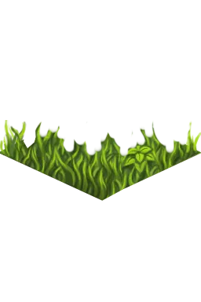

Then, I futzed with my isometric grid code until it wrapped anything on the tiles nicely with both the background and the foreground, which produced this:

Look at how lush it seems in comparison! ABSURDLY LUSH. These lushness levels are off the verdant charts!

now where in the hell did that little 2-square island come from?

## Nov 30, 2020 - (*My) Procedurally Generated Music is Awful

> "I don't think that this could ever create something that I wouldn't mute"
>
> - Tiff, laying down the hard truths about music generation in general and my music generator in specific

In groovelet32.exe, I’d like for the art assets to be capable of wiggling and booping in time with the music.

That’s seemingly simple sounding, but that simple idea contains, uh, multitudes.

This can be accomplished in one of a few different ways:

1. Buy, commission, or write music, transcribe the music whole into the execution environment and play the music with locally available music generation tools (Tone.js in JavaScript, Helm or wwise in Unity)
2. Buy, commission, or write music, transcribe important moments in written music into software language, have instrument hits trigger effects.
3. Buy, commission, or write music, use automated analysis (Koreographer in Unity) to guess when dynamics are occcuring in the music and use those to trigger effects.
4. Buy, commission, or write music, output music as midi, play music while using midi engine to drive effects.
5. Generate music entirely in place, have instrument hits directly trigger effects.

Each strategy has its ups and downs. Notably, the first four strategies start with the simple-sounding but imposing “buy, commission, or write music”. Buying music - well, it’s hard to build a whole game around stock music - especially if music is as fundamental to the experience as it should be in a game about musical robots.

Commissioning music is simply too expensive, if I’m planning on paying my composer fairly (which I would be, if I had any money).

Writing music on my own would imply a strong upgrade in my own personal music production skills, because currently I’m operating at somewhere near the “Three Blind Mice” level. A number of my family members are talented musically - my younger brother married into a “music teacher” family - but I don’t think any of them have ever cracked open a [DAW](https://en.wikipedia.org/wiki/Digital_audio_workstation), and they’re pretty busy with their own lives, so that’s a hard tree to shake and expect that video-game ready tunes will fall out.

So that leaves me with **procedurally generated music**. It’s perhaps naive to think that I, a person who can’t even write a regular song, could build a computer that could write music for me, but hey - if I’m good at anything¹ , it’s programming.

### A Basic Architecture for Procgen Music

Some time back, I watched this inspiring JSConf talk:



so cool

tl;dr “we built a tool called [Magenta.js](https://magenta.tensorflow.org/js-announce) that allows you to kids, tensorflow was what everybody was using for AI before LLMs ate the entire world up some tunes”

I like tensorflow! I like tunes!

Setting upon the task with some zeal I managed to get Magenta.js generating tunes, slowly. I had a simple plan for how I would take slowly-generated 8-second tunes and convert them into longer songs:

1. Have a background server process generate 8-second three-part-tune clips
2. Use some basic heuristics to guess at the key signature (“C# major”) of the clips, evaluate their intensity (lots of drum hits? loads of notes?) and save them in a huge clip database.
3. Create a search interface for the clip database.
4. Have the client request clips from the server in a specific key and intensity.
5. Weave two or three clips together, repeating them a couple of times, to make a full “song”.
5. Add tools to control the requested key signature, intensity, and change instrument, tempo, and what-have-you at the last second.
6. Take the output and make it sound like real human music that people would listen to on purpose.

Now, there are some definite problems with this scheme. One of them is [Tone.js](https://tonejs.github.io/) - an unbelievably powerful synth workbench written for people who have read [the entire book on Digital Signal Processing](http://msp.ucsd.edu/techniques/latest/book-html/), and no other people.

I actually took and passed a senior-level course in DSP for music generation, some 12 years ago. I have less of an excuse than the average person to be absolutely garbage at attaching oscillators to things. I’m still garbage, mind you, I just have less of an excuse.

Anyways, after some serious effort, I got steps 1-6 working.

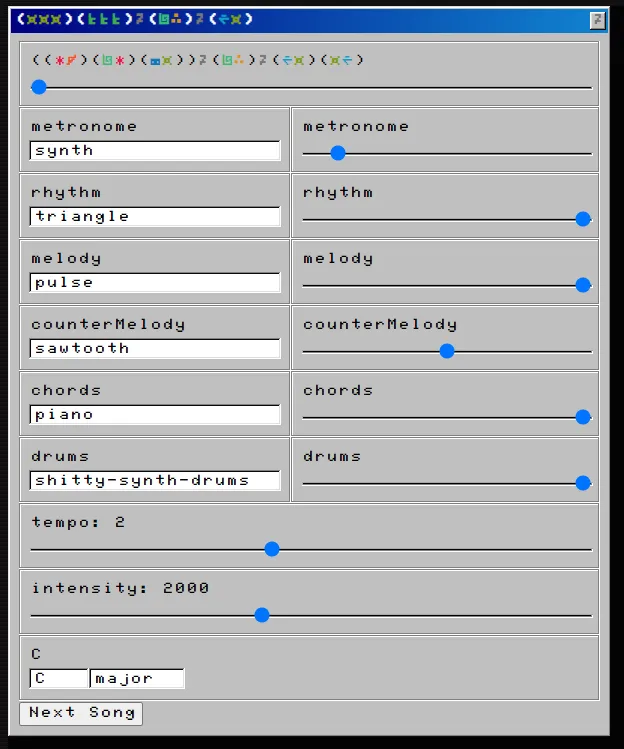

Look at that! Sliders! Tempo! Intensity! Configurable per-channel instruments and levels!

**2025 Edit: ... and, at this point, I completely lose confidence and spend the entire rest of the blog post blasting both my own output and the whole idea of heuristically generating music. For your sake and mine, I've removed this part, entirely.**

A [few early wins up on a Soundcloud account for other people to listen to](https://soundcloud.com/user-120828335-918863707/sets/groovelet32exe).

The whole [soundcloud account](https://soundcloud.com/user-120828335-918863707) is filled with the noisy and often unlistenable output of the engine.

## Dec 11, 2020 - Okay, More Procedurally Generated Music, Then

So, my article on procedural generation made the rounds on reddit.com/r/gamedev and [Hacker News](https://news.ycombinator.com/item?id=25327533), got some 12,000 hits, and generally stirred up some noise.

Here’s the summary of all of the different kinds of response:

1. Neural network generated music is getting pretty good. (Yep, particularly GAN-generated stuff can be pretty convincing.)
2. Procedurally generated music isn’t bad, you’re just incompetent. (Well fuck you, then)
3. Various shades of boring techno-utopian accelerationism. “HUMANS WILL BE REPLACED”. (Sure, I guess, but not before the climate collapses, so it probably doesn’t matter)
4. People agreeing in a sort of “I can’t believe you thought this would be possible” way and holding the line for traditional production methods and music theory.
5. People posting other, often much more successful procgen music experiments. (I mean, I’m sad that you could do this so much better than I could, but I think it’s cool anyways, so, thanks)
6. Multiple mentions of Autechre who are an experimental electronica band who use cool procgen tricks as part of their creative process. (Neat.)
7. People abusing the (pentatonic scale+randomness) angle. (yep, that is indeed a good strategy)
8. Someone says “as the main focus, it appears like an unnerving vacuous simulacra” which is just a real chef kiss reminder of why nobody needs to take HackerNews too seriously.

Anyways, just a lot of people with neat stuff to say.

enough to turn me into a _legitimate recording artist_

Move aside, Taylor Swift! There’s a new sherriff in town!

So I’m feeling a little less like abandoning this whole mess.

In defense of the generated music - it was always intended to be filler in between more carefully thought out moments with human-generated music. So long as I can keep it from being actively irritating it’s _good to go_.

And… honestly, as much as I want to quit working on this thing, donking around with it is pretty addictive.

_(It helps that I tried to get started on some graphics code for Voxel and immediately got completely rekt by bad interactions between Pixi, react-pixi, pixi-viewport and devicePixelRatio, yeugh.)_

So: I spent some time tweaking the generative algorithm to provide more structure and less randomness. One of the biggest complaints about the original was the obvious problem that it doesn’t give the ear much to hold on to - and a big part of that was how ambitious I was trying to be with the generation. Too ambitious. Two separate, potentially incompatible 8-second melodies, intertwined! When it worked, it was cool, but it didn’t work terribly often.

Now, instead of working with two separate melodies, the algorithm takes a single melodic idea and applies successive mutations to it from a set of possible mutations.

THAT’S RIGHT, IT’S TIME TO PLAY THE [FUGUE](https://en.wikipedia.org/wiki/Fugue).

.

.

.

I’m sorry, I’ll show myself out.

I’m also providing a bassline and countermelody, in both cases using the surprisingly successful technique of quantization-with-random-removal.

### Quantization With Random Removal

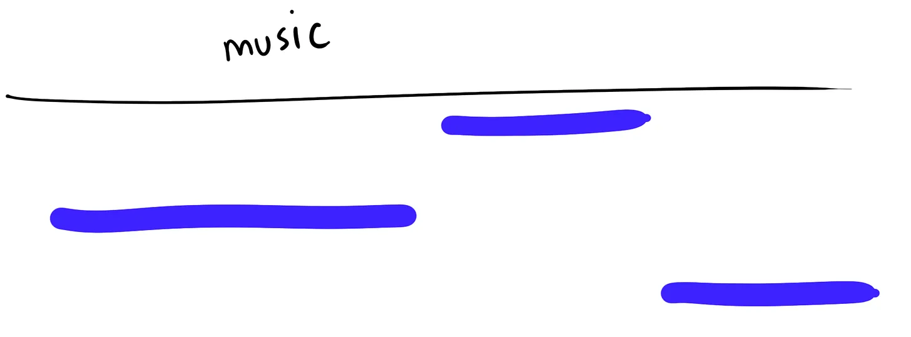

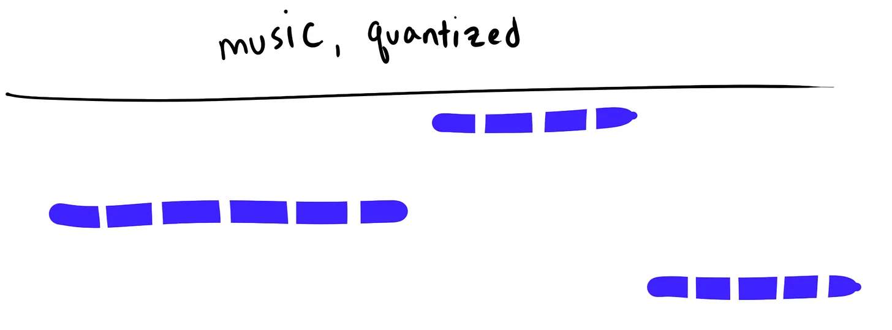

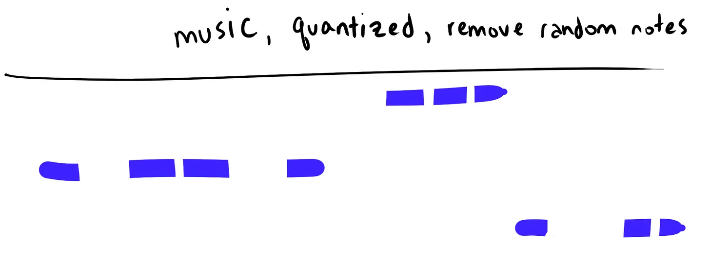

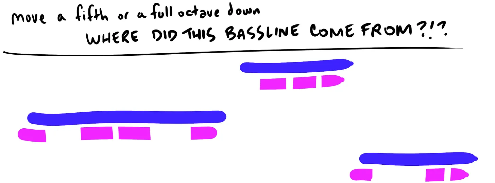

This may seem embarassingly basic to music producers, but to me, a music noob of the highest order, this seems like I have unlocked only the darkest and most arcane secrets. (For serious, where does one learn this stuff? If you’ve got good resources hook me up.)

The result provides music that’s significantly more stable - so stable, in fact, that it goes a little too far in the other direction and comes off feeling pretty flat and repetitive.

One big difference between this session and others is that this is just… four successive runs. With a lot of previous runs, I’d have to run it six or seven times and throw out all of the runs that were actively terrible to get to something merely forgettable - whereas these upgrades produce a system that allows us to get directly to forgettable much more reliably.
