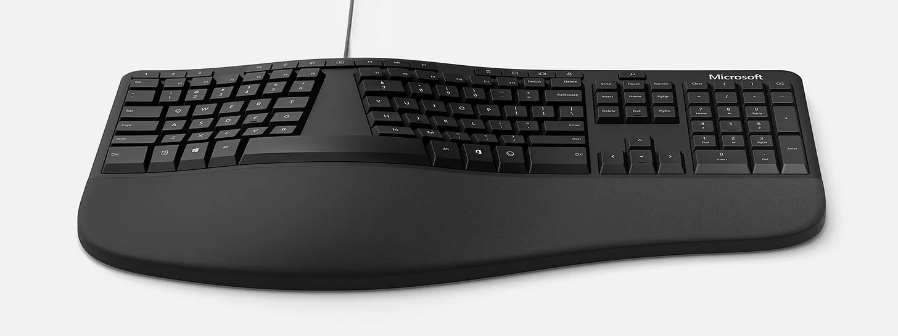
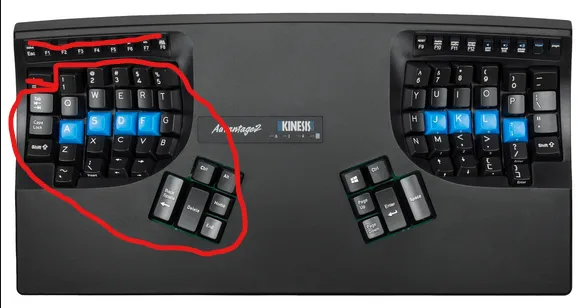

+++
title = 'Keyboard Keyboard'
date = 2022-07-19T12:00:00-07:00
draft = false
categories = ["technology"]
tags = ["keyboard"]
+++

I’ve been continuously computing, gaming, and drawing since before the turn of the century, and as a result my wrists are this close to just giving up and falling off of my hands entirely. If I try to do a Vanna White flourish it sounds like someone twisting bubble wrap.

So, ergonomic keyboards? I’ve tried ‘em. Mechanical keyboards? Those too. I have opinions.

<!--more-->

Like the Microsoft Ergo. This is probably the best cheap ergo keyboard you can get your hands on. Membrane keys don’t have the nice, satisfying click of a real mechanical key, but, like, this is a pretty good keyboard. If you’re still typing on a stock keyboard try one of these out for a bit, it’ll be good for you.

But _come on_. Membrane keys?

Anyways, my last three major keyboards have been the Das Keyboard 3, the Kinesis Advantage, and the Ergodox EZ.

The das is a very good slab keyboard. It’s also just a regular mechanical slab keyboard? Think “IBM Model M”. It’s nice to type on but it’s hardly very ergonomic at all.

Okay, Ergodox EZ: the split keyboard solves a problem, shoulder pain. Split keyboards separate your hands, so that you don’t hang over your keyboard like a dracula. As a result? Less shoulder pain.

> 
>
> “Soon, you’ll have a mighty hump.”

The keyboard, though, still has some serious weak points vis-a-vis RSI.

I have a handspan of 9.5in, putting me in the realm of "larger male hands", and here are the buttons on this keyboard I can actually hit comfortably:

I can hit all of the rest of the keys with some effort - wrist movement and pinky extensions, but, like, the whole point of picking ergo keyboards is to reduce wrist movement and pinky extensions.

Compare the Kinesis advantage's beautiful hand-bowls: let me tell you:

with my big horse-sized mittengrabbers, I can hit all of these keys without moving my wrist or pinkie:

The Kinesis has been my golden child. In my opinion it’s worth its exorbitant price, it is the _finest ergonomic keyboard on the market bar none_.

Look, it’s a weird keyboard layout. It takes some getting used to. Whenever I brought one in to the office to replace whatever shitty keyboards were there before, people looked at me like a weirdo.

It is _very, very good_, though.

The problem with the Kinesis, and any plank keyboards like this, is that using them for any length of time, you start to hang over them in a pose I like to call "the Creep"

This is, notably, pretty stupendously bad for your shoulders in the long term. After decades of creepin' my posture is noticeably very bad. I've been tackling it with exercise and - well, switching in the Ergodox every now and again.

And these keyboards are NOT CHEAP, in fact, they are hundreds of dollars each! Anyways, roundup:

* Kinesis Advantage: Shoulder pain, no wrist pain
* ErgoDox EZ: Wrist pain, no shoulder pain

The Ergodox's built-in tent kit is also pretty wobbly and unpleasant. And their New and Improved Moonlander... well, it looks to have most of the same problems.

If anything, that looks to have the same problems with pinkie extension and wrist movement.

But, uh, while hunting through Google Images to find reference images for this very post, I found… this image:

Oh **baby**. Hello, beautiful. That looks like a split Kinesis Advantage.

I must know more.

## The Kinesis Advantage360.

Sweet mother of god it's a thing of beauty.

It kills the function keys (fair, nobody has used function keys since 1992).

_LOOK AT WHERE THEY PUT THE ESCAPE KEY._

Every keyboard I have, I remap “Esc” over “Caps Lock” because

* Caps Lock is stupid
* I’m a Vim user (Esc is frequently used)

And, like, while it doesn’t take me very much time to remap Caps Lock to Esc everywhere, on this keyboard I don’t even have to, because they already did exactly the right thing!

Well… almost exactly. They did sneak the stupid Caps Lock key in there somewhere. But still. Top marks.

It’s got the superior bowl design of the Advantage, but it’s a split keyboard.

SHUT UP AND TAKE MY MONEY.

Aw, heck.

I guess I can wait, though, that’s like… now, right? Soon you will be in my grasp, sweet keyboa-

Aw, double-heck.

SOON.

-------

### 2025 Editor's Note

Perhaps you are wondering how this went?

While Kinesis did finally launch this in the fall of 2022, it was, as most of their products are, only available
in the United States of America, so I had to wait for a Canadian reseller to get their hands on a copy, so I didn't
have a Kinesis Advantage360 until late 2023, a full year later.

I ended up splurging, paying a little extra for the Advantage360 _Pro_, which can be used _wirelessly_. I _hate_ using
keyboards wirelessly (why would you need that? it doesn't move and it just introduces battery issues), and the wonky connection between the two sides of the keyboard has been endlessly frustrating, so
I seriously regret that decision.

On the other hand, this is... this is simply the finest keyboard money can buy. So,
uh, I'm willing to put up with a little bit of faff. As I suspected, combining the superior layout of the
Kinesis Advantage with a split was the right solution. Keyboard good. Worth money.