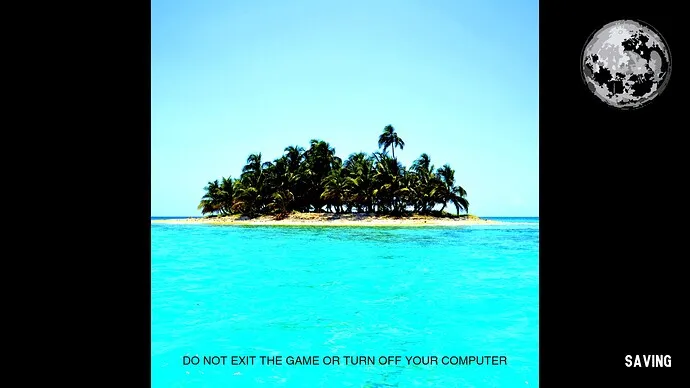
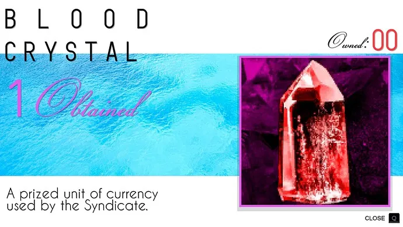
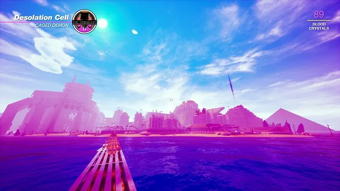
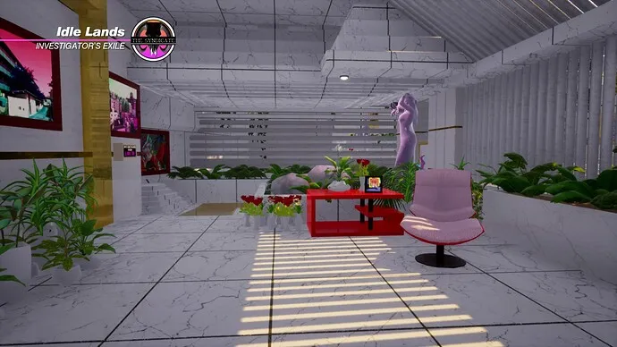
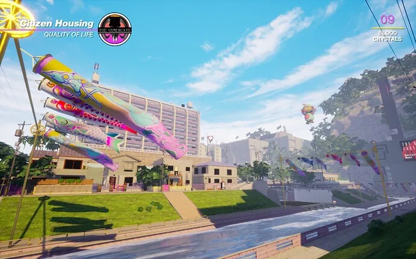
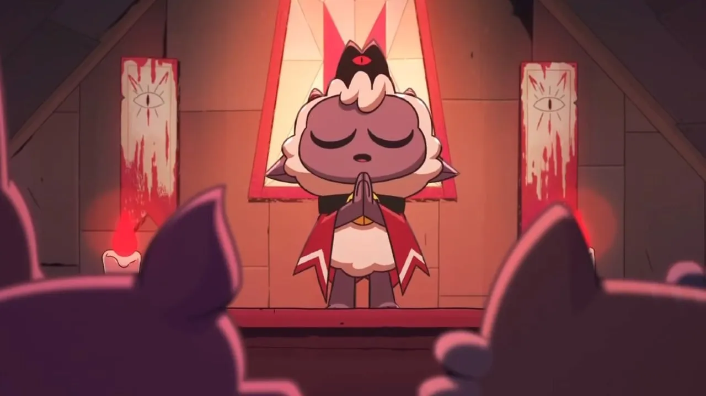
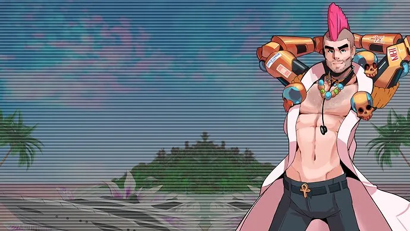
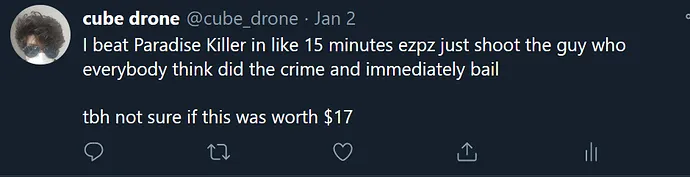

+++
title = 'Paradise Killer'
date = 2022-11-18T09:00:00-07:00
draft = false
categories = ["video games"]
tags = ["vaporwave"]
+++



<!--more-->

Someone has done a murder on vaporwave island and it is your job to find out whodunit.

To be more specific, a lot of people have done a lot of murder on this vaporwave island.

> You play Lady Love Dies (which might be the least strange name on offer here), an immortal “investigation freak” who was exiled from Paradise 3 million days ago, and is only invited to return after a locked-room murder spree forces the island’s egoless arbiter of justice to bring in the only person deemed capable of solving the crime. Oh, and you get back from exile by skydiving from a mile-high plinth suspended above the actual game map while the opening credits roll.
>
> [Paradise Killer Review](https://www.ign.com/articles/paradise-killer-review) - IGN - Joe Skrebels

## First of All, The Aesthetic

Seriously, this game takes its [Vaporwave](https://en.wikipedia.org/wiki/Vaporwave) style extremely seriously.

The low-poly look is pretty crunchy and ugly - and absolutely it feels intentional and totally works as an aesthetic choice.

This, uh, is both delightful and absolutely necessary to this game being possible to make, considering how it was built by a team of maybe 3 people.

I really do love the way that this game looks: intentionally lo-fi in a well-considered and consistent way.

## Second-of-ly, The Worldbuilding

This world’s backstory is fascinating and dark as hell. I don’t want to spoil it - deciphering it is one of the first mysteries of the game - and when you realize (early on) exactly what’s going on here - something your character already knows and is fine with - it really does change your perception of this whole colorful late-80’s paradise.

> 
>
> oh wait how did this image from Cult of the Lamb get in here, it must be a coincidence

I can’t say “this world isn’t what it seems” because there’s no way for a colorful vaporwave beach paradise to _seem_ - obviously we don’t really have much of a frame of reference for a reality lit in cyan and magenta, filled with pyramids, soda cans, and statues. I wasn’t coming into this expecting Doctor Doom Jazz in the first place, so I didn’t have a lot of expectations as for how they were going to explain things to me.

But dang, the game really goes out of its way to develop the lore and characters of its unexpectedly grimdark vaporwave universe.

## Then, The Music

I say this with all due respect to the _importance_ of Vaporwave: as an ironic musical statement it often sounds like complete ass.

You know, I love this frigging musical genre, but I’d never spin a [Macintosh Plus](https://www.youtube.com/watch?v=aQkPcPqTq4M) album, now, later on, except as maybe a joke, because while it’s _important and influential and cool_, it’s also borderline unlistenable a lot of the **editor's note**: not sure if actually true.

Instead of being _exactly vaporwave_ with its at least controversial _listenability_, it pulls musical inspiration from a broad pastiche of vaporwave, its more energetic contemporaries like future-funk, and precursors like city pop and acid jazz.

[The result is pretty darned listenable](https://kaizengameworks.bandcamp.com/album/paradise-killer-original-soundtrack), and of course just feeds into the already very unified vision of the game.

_oh, one sound design complaint: The characters’ 4 recorded voice lines each get kind of grating by the late game. Once you’ve heard the main character go “nani the fuck?” a few dozen times it ceases to be funny._

## Uh Oh, The Gameplay

The gameplay in Paradise Killer is really, painfully simple. You’re rendered in glorious first-person, you get buttons for “jump” and “examine”, and you’re off to the races, to rush around a not terribly large island meeting 8 fanciful suspects and picking up literally everything that’s not nailed down. Blood statues, clues, collectible objects and soda machines are hidden in every corner of every square inch of the small island of Paradise 24 - an island that’s maybe a 3-5 minute run from end-to-end.

To make thing-hunting on the island a little more confounding, the architecture of the island is _intentionally confusing_ in a lot of ways, and takes advantage of a lot of _verticality_. As an example, I had trouble remembering the exact location of the elevator down to Dr. Doom Jazz’s yacht, so I would often find myself just flinging myself off of the cliffs in the broad vicinity of his boat and hoping for the best. It usually worked out.

First-person platforming has always and will always suck total ass. It’s good that the platforming required by the game is extremely limited.

That being said, after 10 hours of bouncing around on this small vaporwave island I’ve got the whole layout more-or-less burned into my brain and I’m not excited to hurry 
**editor's note**: I posted this blog entiry almost 2 years after having played the game and I could still sketch you the island’s layout on a napkin.
**even later editor's note**: yup, 2025, still in there.


But that’s… the frosting, around a detective game that takes the “detective game” format established by your Phoenix Wrights and Danganrompas and completely rethinks them.

## Open-Ended Detectiving With No Right Answer

Okay, I say that the game took me 13-14 hours to finish, but actually I had beaten the game after about 20 minutes.

That’s because the game, having put you in charge of the investigation, is fully willing to let you go to trial at any time you want, with whatever dossier of answers you’ve accumulated.

So, having left the court-room with a no more than the scantest basics of the crime, I immediately saved the game, turned around, and kicked off the trial of the century without any leads, clues, suspects, or information whatsoever.

In the trial, I pretty much just read off of the police report, pinning the whole thing on the obvious patsy who the police had told me outright was the killer.

Result?

The judge accepted my investigation, executed the criminal, and we were all off on our merry way. Paradise Killer _prosecuted_. Roll credits. Thanks for Playing. The game didn’t even flinch, it was like “okay, I guess the guy who we thought did it did it, thanks for your help, have a nice day”.

I _really like_ unearned credit sequences in games.

This game gives you a lot of very open-ended clues, challenges you to figure out what happened, asks you to present your findings, and never, ever explains if you got them right.

Paradise Killer lets you luxuriate in a lot of information, piecing things together as you go, and I really liked that.

That’s good and bad. There’s a level of freedom here that games like Phoenix Wright never really had - you feel more like a detective, detectiving than in games where you can’t go to trial until you have all of the exact set of facts you need to complete the trial to your best ability. That being said - the last hours where you’re 90% of the way through the case and you’re just trying to tie up loose ends can be a real slog, and some of those loose ends never really tie up as neatly as you want them to, and you just have to be okay with that.

## Some More Handholding Wouldn’t Hurt Sometimes

I don’t think it would hurt the game at all to have a someone explain to you that you need to buy 10 sodas to get your hands on a vital component, or that you should try to hit all of the baths as early as possible to get three cheap, vital upgrades to your general mobility, or that half of the entire game’s content is locked behind a single silly side-quest involving finding a ghost’s fish-tank.

I think it does hurt the game quite a bit that there’s a _single, hard-to-find, late-game location_ that takes one of the game’s deepest mysteries and explains the whole thing in exacting, excruciating detail. There is, in fact, a correct answer, and either you **find it**, or you **don't**. It’s, like, an extremely tightly paced and difficult murder mystery unless you crack into Uncle Jeff’s Secret Crimes Bunker, containing a document “Here’s How I Did Those Bad Crimes, Signed, Uncle Jeff” and you’re like “huh”.

Although to this game’s credit, I believe you can piece most of the important details together without Uncle Jeff’s Secret Crimes Bunker, you’ll just never be as sure as if you’ve found it.

## Moral Puzzle

Every character in this story is a certifiable monster, even the ones you like and the innocent ones, and that raises some real moral/ethical questions about what your goals are at trial - Cold hard truth? Justice? Sparing your friends? Sparing everyone?

Punishing everyone no matter _how_ tenuous their involvement? Given, of course, how tight-lipped the game is about its ending, it also doesn’t bother to weigh in on this at all, even after you’ve made your choice - although this is the only way to really, truly see all of the content the game has to offer.

In fact, that is one thing I’d like a little more of: a nice dash of denouement after you’ve done everything to leave you a little less hanging at the end of this puzzle.

## Anyways

Paradise Killer. It’s probably a lot different from any game you’ve ever played.

Even if I wasn't always having fun while I was playing it, I could not stop thinking about it for months after I played it: that's, I think, a sign of a good game.