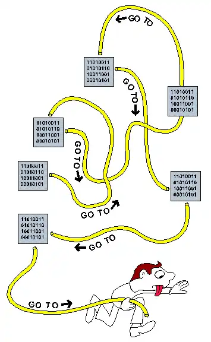

+++
title = 'Pasta is a Bad Theory of Software'
date = 2022-11-23T12:00:00-07:00
draft = false
categories = ["software", "humor"]
tags = ["spaghetti code"]
+++

_edit: I feel the need to point out that this is, in fact, a comedy article about technology and not a serious take on programming._

<!--more-->

Spaghetti code! It’s that thing where your code is bad and hard to follow.

I feel like spaghetti got the raw end of the stick here. Spaghetti is, according to science, _delicious_. People rarely encounter spaghetti and go “man, this spaghetti is hard to understand”.

> 
>
> "What the fuck is this?" - A rare man confused by spaghetti.

Nah, it’s easy to figure out spaghetti. You put a fork in there, twirl it around a little, then put the fork in your mouth. Spaghetti solved.

It’s term coined in the age of GOTOs: It was often possible with gotos to write code where following the code’s logic would feel literally like unwinding a big pile of spaghetti.

GOTOs, also, haven’t been common in code since decades before I was born. They got considered harmful so hard that they’re no longer part of the equation, except in [antiquated languages](https://go.dev/ref/spec#Goto_statements). “Spaghetti code” eventually grew to became a common term for any hard to follow code.

**Spaghetti code**.

You **monsters**. Spaghetti didn’t deserve to become the gold standard term for bad code. Spaghetti is _incredible_. The term has lost all meaning.

You should go write some spaghetti code. Go write some code that everybody loves, that’s good with anything, that comes together in moments to solve quick weekday problems, code where you can just dig in anywhere and immediately understand how great it is.

Spaghetti does not need to be organized in a logical fashion! I doesn’t matter if you can or can not understand where every individual strand of spaghetti is coming from or where it is going. Nobody wants that from their sketti! You can start anywhere and end anywhere!
**That is always how eating spaghetti has worked!**

In fact, if someone **did** attempt to take their spaghetti and tidily organize it before eating it, you would rightfully have cause to suspect that person of some kind of mental imbalance.

If you’re writing Java and you’ve made your inheritance tree so deep that figuring out how anything works involves reading through 18 different classes? You’ve got **too much inheritance** and none of the individual classes are doing anything important. That is not spaghetti code, your code has **rich kid syndrome**.

Ravioli code? Lasagna code? So you’ve got a lot of easy-to-understand and self-similar components (either modules to make ravioli, or layers in lasagna), and you’re _complaining_? Do you have any idea how much effort went into making that ravioli? That code sounds delicious. I should summon my mother to hit you with a wooden spoon.

Oh, you’re using functional components that nobody has ever heard of, but which offer unique and clever solutions to solve a whole class of problems you never even knew you had? [That's Bucatini code](https://en.wikipedia.org/wiki/Bucatini).

> 
>
> it solves a problem you never even knew you had

Copy-and-pasting the same line of code into everything because it works everywhere? Looks like you’ve got some [orzo](https://en.wikipedia.org/wiki/Orzo) code.

> 

Did you over-engineer your code and end up with something kinda stupid, but you love it anyways because it is fun and whimsical? Whoops you wrote some [farfalle](https://en.wikipedia.org/wiki/Farfalle).

> 

Fussing too much with the spacing to try to make your code into art? You have committed an act of [macaroni](https://en.wikipedia.org/wiki/Macaroni_art) code.

> 

Wrote a black-box so transparent with an interface so gnarly that everything that touches it gets hopelessly entangled in the implementation? That’s a big ol’ bowl of [cavatappi](https://en.wikipedia.org/wiki/Cavatappi) code.

**This is fun but it is has, at best, limited explanatory power as a metaphor.**

Look, I’m going to say it: _I don’t think pasta is a very thoughtful way to build a taxonomy of code smells_. Pasta is lovely. Pasta deserves better than this.

Let’s not even get started on the raw deal that spiced tinned pork got.

