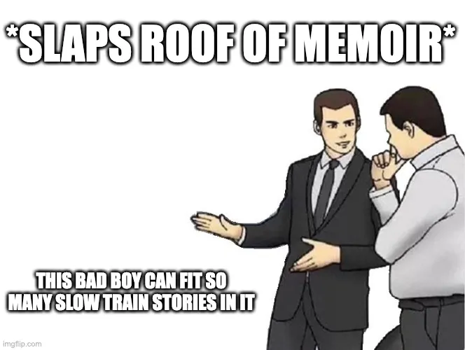

+++
title = "Slay the Spire's Opening Monsters Won't Deal 10 Damage"
date = 2022-06-15T12:00:00-07:00
draft = false
categories = ["video games", "board games"]
tags = ["cards", "slay the spire", "civilization"]
+++

_and why I think that's important_



<!--more-->

Did you know that Sid Meier has written a book?



It’s… uh, slow, and it very much is a lot more about Sid’s life than his design philosophies.

A fun detail of the book is it lays out how little of the Civilization series is actually Sid’s handiwork: Every Civilization game has had a different lead designer, many of whom deserve [more attention and accolades for their work](https://en.wikipedia.org/wiki/Brian_Reynolds_(game_designer)). “Sid Meier” is more of a brand name at this point.

One funny tale in this book is how Sid sunk years of his life and absolute mountains of time into [C.P.U. Bach](https://en.wikipedia.org/wiki/C.P.U._Bach), a generative music program that went over like a lead balloon.

_It’s a well known fact that every single software developer, regardless of musical talent, thinks that they can crack the “interesting generative music” puzzle. I mean, [certainly not me](/videos/2020/a_terrible_concert/), but every other software developer is extremely prone to this flaw, as far as I can tell._

Anyways, this is a digression, but it leads to a point I want to make about why a totally different game that I love, Slay the Spire, is so good.

“Games are a series of interesting choices”, said Sid Meier.

It’s a design philosophy that, I think, really informs games like Civilization. Deeply enjoyable, fun games. And every (stock) game of Civilization starts with the same interesting choices: given the resources around me, do I settle here, or explore first to find a start point with better resources? If I settle, what’s the first thing I should build?

I like “settle immediately” and “build a scout”; modern Civ games usually arrange things such that your starting position is a good place to build a city by default, and the scout’s utility in the early game is massive: they usually pay for themselves dozens of time over in goodie huts and information.

We’re not talking about Civ though! We’re talking about Slay the Spire! FOCUS, CURTIS.

Slay the Spire starts out with this whale, Neow, cruising in and offering you an interesting decision up-front.



Interesting trade-offs. Would you like more cards in exchange for less hit-points? Would you like a random power in exchange for a weak but known power?

The game’s interesting trade-offs continue as you go. You’ll be presented with card after card, deciding which ones to add to your deck, and that decision is painful every time. Each card is situationally useful and uses up space that could be devoted to other cards.

Slay the Spire is so good. Rock Paper Shotgun’s Alec Meer called it a [miracle of design](https://www.rockpapershotgun.com/slay-the-spire-review). We’re hitting the point in time when the games inspired by Slay the Spire are going to start rolling in because this game was so unique and so good that everybody who played it just wanted more, but Slay-the-Spire-inspired games often fall flat, because it is just so, so hard to keep decisions balanced on the knife-edge of interest the way that this game does.

I just want to talk about one tiny detail.

You start the game with 3 energy per turn, and a hand full of 5 cards that either do 6 damage, or block 5 damage. Your opening turns will involve playing 3 cards out of 5.

You have a few cards that aren’t 6 Damage (Strike) or 5 Damage (Defend), but we’ll pretend those aren’t part of the equation, for now.

So, if you draw nothing but Defends and Strikes, you can choose to

* Do 18 damage, block 0 damage
* Do 12 damage, block 5 damage
* Do 6 damage, block 10 damage
* Do 0 damage, block 15 damage

And the detail I wanted to point out is that all of the opening monsters in the game are tuned to make even this simplified decision a little bit hard.

The Cultist, for example, one of the handful of early monsters that you will fight in Slay the Spire. They have 48-54 HP, and will do 0 damage the first turn, then 6 damage, then 9 damage, then 12 damage, then 15 damage, and so on until you knock them out of the game.

These guys are quite probably the simplest monster in all of Slay the Spire. Their low initial threat and linear damage scaling make them a credible threat in Act 1, Act 2 and Act 3 of the game: Ignore a cultist for a few turns and whoops, they’re dangerous.



Notably, they don’t do exactly 5 or 10 damage, so you have to decide: do I block more than I need to in order to take zero damage, or do I take a little bit of damage now to do as much damage as I can, to stop the cultist from getting stronger.

So now, what do you do? You can math this out somewhat: you need to hit them ~9 times to win the battle.

You can just strike-strike-strike, strike-strike-strike, strike-strike-strike. 9 times. In doing so, you take just one full hit: 6 the first time. 6 HP of damage, total. Well, if you could draw only strikes, which you can’t, because there are other things in your deck.

You can play as conservatively as possible: strike-strike-strike, strike-block-block (6 damage blocked), strike-block-block (9 damage blocked), block-block-block (12 damage blocked)… block-block-block (15 damage blocked), oh, shit, he’s doing more damage that I can block every turn and it’s only going up… uh, shit, strike-block-block (10 damage blocked, 8 damage), strike-strike-strike, and we win, having taken 8 HP of damage.

Even with perfect draw, which you don’t have, you are going to have to be okay with taking some damage to get through this battle: there is no perfect play, only tradeoffs.

**None of Slay the Spire’s opening monsters deal 5 or 10 damage, because that would allow you to fully block them. It would seem like an obvious decision. And obvious decisions aren’t interesting.**

 This opening puzzle is already a little bit interesting. The game quickly adds other cards into the mix, complicating the puzzle further. Perhaps you would like to spend 2 of your energy on a Bash? It does 8 damage - that’s less than the 12 damage you would get out of two Strikes - but for the remainder of this turn and next turn all of your remaining strikes will do 9 damage instead of 6. Or a Zap - shell out for a Zap and it’ll do 3 damage per turn for the remainder of the fight.

Interesting, right? I think it is.

I honestly have no idea how it’s possible to design and balance a game like this, although the Slay the Spire team reveal that a lot of it has been powered by gathering a mountain of data about every single person’s playthroughs of Slay the Spire and using it to pull, prod, and tweak the values for every single card.

