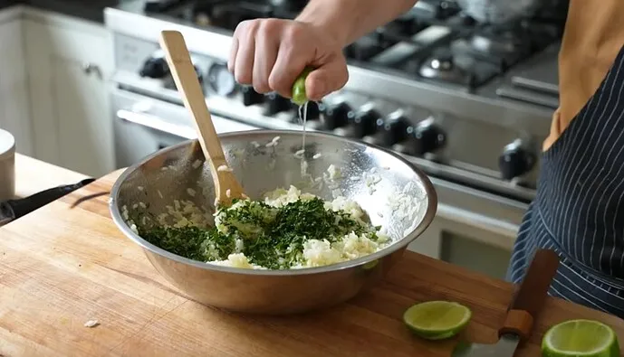
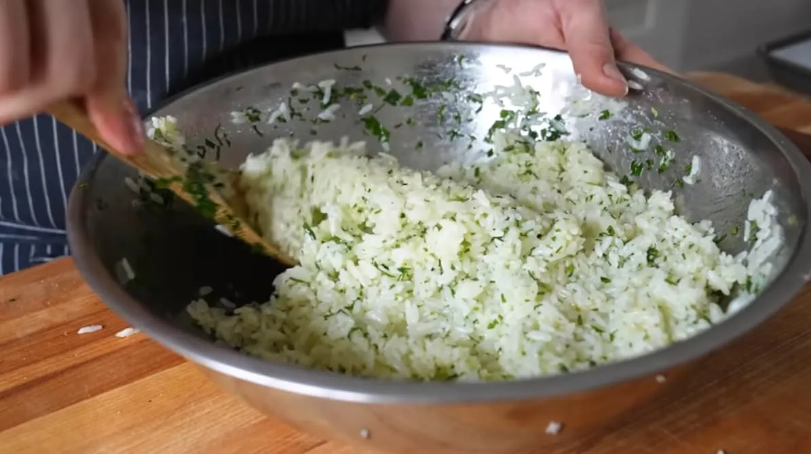

+++
title = 'The Taco Rice Bowl'
date = 2022-10-27T12:00:00-07:00
draft = false
categories = ["food"]
tags = ["taco"]
+++



<!--more-->

I have a problem.

For decades one of my favorite meals has been the Tex Mex Night.

You know: Old El Paso Tacos.

This shit is up there with Kraft Dinner in my pantheon of charming mass-market meals that I ate a lot of as a kid and still like as an adult.

Is it Mexican I **also** love Mexican food but this is not it.? _hell no_. Do I care? _Not even a bit_.

There’s just something so fundamentally good about the combination of ground beef, bright orange shredded cheddar cheese, crisp iceberg lettuce, diced tomato, lime, and sour cream.

I’ll make all kinds of modifications to the basic recipe - I’ve got a salsa Cherry tomato, jalapeno, lime, white onion, salt, cilantro that’s always great on this, we’ve got arrays of hot sauces,
 sometimes I’ve done it up with slow-roasted beef or homemade carnitas or homemade refried beans - I've even learned how to make taco powder from Packaged taco powder is just cornstarch, cumin, chili powder, onion powder, garlic powder, and some ill-defined spices: once you know what's in there you can make your own, better. ,

Just as often, though, I’ve put it together on a weeknight from packet taco powder and it’s been delicious.

Taco Tuesday is real, folks.

But.

Tragedy strikes.

After every Taco Tuesday comes a grim, unyielding, Taco-less Wednesday.

The sad reality of Taco Tuesday is that all of the ingredients get used at uneven rates. In the fridge goes some loose meat glop, maybe some shredded cheddar, some salsa - sometimes leftover tortillas or tortilla shells, sometimes not. It’s often very difficult and irritating to re-assemble Wednesday’s leftovers into viable, balanced tacos - and unappetizing, after having eaten too many tacos the night before.

But, lo: a trick I learned by watching [the internet](https://www.youtube.com/watch?v=rm8LENSYD98).

You can just dump taco ingredients atop a rice bowl and, like magic, a meal is formed!

Namely, Joshua Weissman’s fluffy concoction of rice, lime, sour cream, and cilantro looked like the perfect base for a daytime leftover taco rice bowl, and… yeah. It was. it also looked 90% easier to prepare than everything else he makes.

I tried it and it really worked.

The taco leftovers cleaned up in one delicious fell swoop, I felt accomplished. Full of beans.

**I AM BECOME MORE POWERFUL THAN EVER**