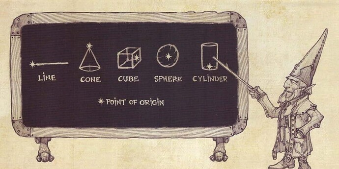
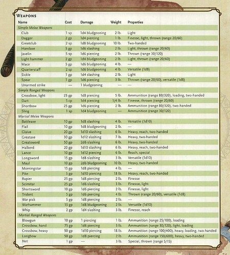
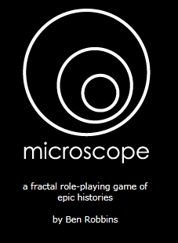
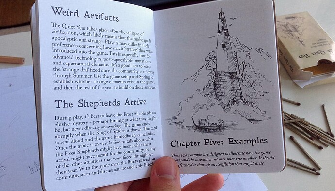
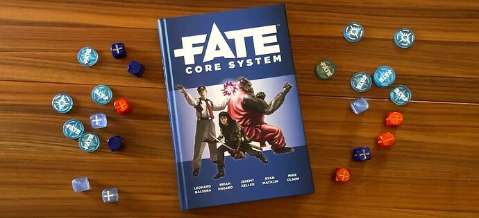
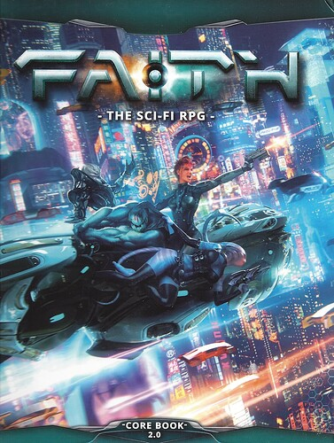
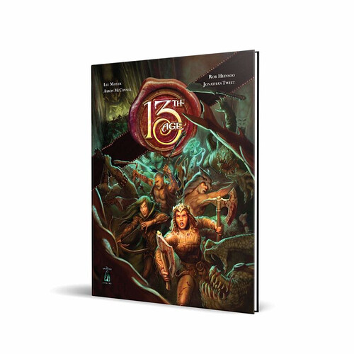
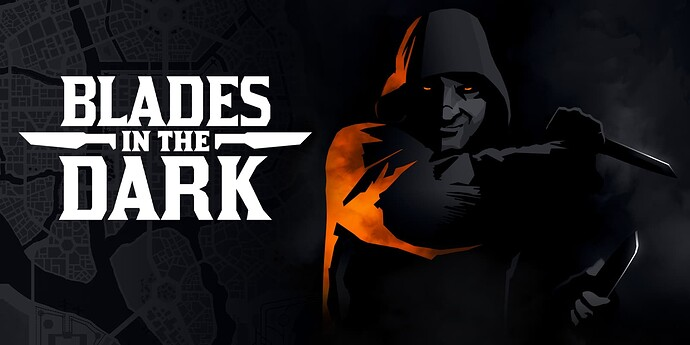
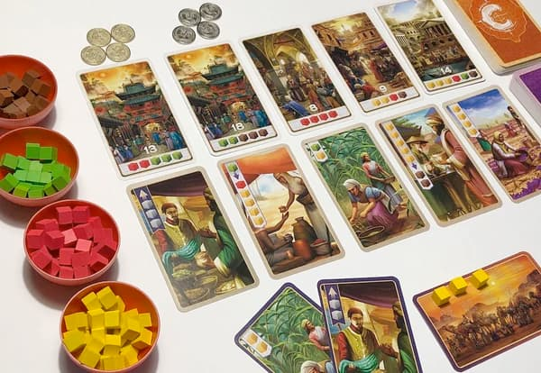

+++
title = "DMing Alt/Indie RPGs"
date = 2023-04-15T12:00:00-07:00
draft = false
categories = ["rpg"]
tags = ["D&D", "Blades in the Dark"]
image = "./cone.png"
description = "some of my problems with D&D, some alternatives"
+++



_The Default Fantasy Genre doesn't always do it for me._

<!--more-->

I like running TTRPGs.

I've been doing it for a long time to _varying levels of success_.

But there's a slight problem with that:

## I Have Some Problems With D&D:

### The setting: "default fantasy".

Where is D&D?

Why, it's Everyfantasyrealm, of course.

Christ, J.R.R. Tolkien has got some swing, a _lot of fantasy_ takes place in this "Tolkien Mashup Fantasy Realm".

### Literal Actual Racism

It's _fantasy_ racism, but, like, there are 26 pages of the player's handbook devoted to race and the various different abilities of those different races.

This whole _way of looking at things_ is based on, like, a really early euro-colonial way of looking at the world and the various peoples in it, and that's the path that lead to it ending up in D&D: Tolkien's caricatures of various european ethnic groups through the lens of folk mythology, writ into fantasy, became Dwarves, Elves, Goblins, Orcs, and the rest.

And, you know what? I don't _like DMing it_. I don't like it when players lean way in to it. If you're building a D&D universe in your head, goblins are evil, barbarians are stupid, elves are haughty pricks, and there's not really a way around it.

You can try to build adventures where _it turns out the goblins are an advanced and ancient culture and it was the humans who were the bad guys the whole time_ (somewhere, buried deep, are my notes for the "goblin civilization" campaign) but actually that's... not a very fun game to play, especially not as the humans. "Let's confront fantasy racism" is too heavy for a silly game about thwacking things with big hammers.

### The over-developed combat system

Light armor? Ascendant Step? Finesse? Reach? Druidic Focus. Concentration! Grappling. Suffocating! Terrain! Flying. Size? Saving throws! Feign Death! Dominate Beast! Dash! Dodge. Hide? Ready. Range! Shove! Cover. Critical Hits! _Acid_. Death Saves! Mounts! Verbal spell components!

The combat system is _complex_, difficult to understand and adjudicate.

But also: the level of systems weight devoted to combat makes it absolutely and unquestioningly clear to the players: **this is the important part of D&D**.  If you're playing D&D, you are going to sit down and be carried, via some excuse plot, through a variety of crunchy combat simulations that have been _heavily playtested_ (because balancing these complex fight scenarios without aggressive play-testing is nigh impossible). If you're sitting down at a Default D&D table, the only way to really play is for the DM to roll out a big ol' grid, you're going to be _In Fights_ for about 75% of your play-time.

And that complexity? It doesn't always pay off. It's often _bloated and cumbersome_, and it's a lot of work to _learn_ and _run_.

I learned how to run both 3rd Edition and 4th Edition - at a pretty amateurish level, but run them nonetheless - and I feel like learning 5th Edition would be, well, _work_.

### The under-developed non-combat system
For literally everything that's not combat?

_skill checks_.

Oh, and _non-combat abilities_, which your players (correctly noting how combat-weighted the game's mechanics are) have been under-emphasizing during character creation.

You get the one peep who needs Charisma to hit harder to chat up the town guards, the one peep who needs Agility to hit harder to unlock the door, the one peep who needs Intelligence to hit harder to read the book, and move along.

### The decades of cruft

This damned chart has been floating around, in various forms, since D&D v.1, and while it seemed pretty cool when I first encountered it...

Actually it kinda fuckin' _sucks ahoy_.

There have been massive improvements here: weapons that are total stinkers like the trident or hand-crossbow have been upgraded or given new abilities to make them less obviously terrible. The oft-maligned whip still deals trash damage but now gets to be the only weapon in the game with both "finesse" and "reach" - but these massive improvements are still... **C++** - legions of awkward, unpleasant, complicated hacks to try to get something that was designed in the 70s to perform like a more modern design.

### I just want _more_
Look, I _love_ a lot of RPG designs. Why can't we have characters who swap classes at will and keep the stat boosts and key abilities from their classes, like in Final Fantasy V or Tactics? Why can't we be SPECIAL, like in Fallout? Why can't we have an ability grid, like in Final Fantasy X? ~~Why can't we have junctioning~~ no that system is cursed

### WoTC
Wizards of the Coast is _not your friend_.

## Indie TTRPGs
Okay, so, if not D&D, then what?

Well, loads of people are out there publishing their own TTRPG content.

And I've tried - or, at least, _purchased_ - a bunch of them!

I definitely keep tabs on the Ennies and try to keep abreast of the Good Stuff.
https://ennie-awards.com/history-of-winners/

## Microscope

Microscope is less a classical RPG and more of a _co-operative creative writing workshop_.

https://www.lamemage.com/microscope/

I've read a bit about how writer's rooms for movies organize their scenes, and Microscope's rules feel like a codified and gamified version of _that_: you and your friends are collaborating to build a story.

## The Quiet Year

Again, this one is in the Microscope camp - less of a classical RPG, more of an activity.  This one is a mapping game where you lay out the story of a small town for a year, establishing more and more details about how the town fits together and works as you go.

While I was running 13th Age, I was planning at some point to run a one-shot in-campaign game of The Quiet Year to build a town in-universe that the players could adventure in.  That won't work in my current Blades campaign because Blades _very clearly takes place in Duskvol_.

## Fate

Fate's curious - it is an _engine_ without a lot of the rest of the game attached. Fate doesn't have any lore or classes or _universe_, it's just a bunch of rules that you can use to put together essentially any kind of RPG that you would like.

It's an _insanely flexible_ system.

I had a crazy idea that a flexible, talented DM could use a pipeline of Microscope => The Quiet Year => Fate to build a collaborative universe, town, and then TTRPG-adventure _entirely_ out of whole cloth, but ho _boy_ does that sound like a lot of work.

I had a different crazy idea and built out a whole Cowboy Bebop inspired FATE module, called "Seatbelts", one time.

## Faith

I haven't actually tried Faith! I bought some pricey sourcebooks for it, read them all, and then never ran a game because _hoogh_ - it looks like a bear to run. Maybe someday, though.

One of the biggest concerns I have about _actually DMing Faith_ is that two of the major axes the game's themes run around are "political" and "religious" - a lot of the game's worldbuilding is built around the conflict between the hyper-capitalist Corvo and the hyper-communist Iz'kal, and a lot of the game's rule-set involves explicit spirituality rotating around the game's handful of Real Actual Divine Powers.

I haven't seen a lot of reports of this online, but I can imagine more than one scenario where someone has DM'd a game of Faith that got **uncomfortably polemic** and **ruined friendships**.

## 13th Age

Built by a bunch of ex-D&D developers, 13th Age is an attempt to backport a bunch of interesting "modern TTRPG ideas" into D&D, with varying levels of success.

## Blades in the Dark

I'm running Blades in the Dark for some friends. It's pretty good!

## Indie TTRPG Problems

Let's talk about some specific problems I've been having with some of these TTRPGs:

### Open-Ended Improvisational Narrative Isn't For Everyone

A lot of these more narrative-focused engines give both the players and DM a _lot_ of control over the narrative, much more than what D&D gives you.

This is a double-edged sword: their combination of mechanical simplicity and narrative complexity can leave players feeling like they've just been invited to a night at the improv when what they actually wanted to do was just to _roll some dice and kill some goblins_.

After running BiTD for a bit, some of my players have noted that the system's open-endedness can be _exhausting_ - and, as the DM, I can't help but agree. It _can_ be.

13th Age has a mechanic, icon rolls, where players roll dice at the beginning of the session, invoking the 13 _big characters_ in the 13th Age Universe, and if they roll well I'm just supposed to _organically work in a positive or negative interaction with that character_ as part of the session. A lot of DMs don't like Icon Rolls (Sly Flourish's alternative Icon roll rule is pretty compelling: https://slyflourish.com/icon_rolls.html )

The level of this varies from game to game, with FATE and Microscope off in the "no crunch, all improv" dimension and 13th Age and Faith in the "more crunch, less improv" zone, with BITD right in the middle, but they're all, IMO, more open to interpretation than 5e, which is very rigid.

### No Ecosystem (Just Write Me a Damned Adventure)

When you're looking at a TTRPG, you're also looking at _ecosystem_. With D&D, you technically have everything you need to run a game in the Player's Manual and the Dungeon Master's Guide - but, you also need a bestiary full of creatures to populate your universe, so a Monster Manual too.

That's some 700 pages of stuff to deal with, and while you don't need _all_ of it for some of the more stripped down adventures, that's a good base to start with.

There's also a _huge_ ecosystem of prewritten adventures to work with. Building adventures ahead of time for your players is a *huge* amount of effort:  just running a pre-written adventure is GREAT.

The really popular indies do build up some content over time: 13th Age and Delta Green have been pumping out adventures for a while, now, filling out those universes slowly but steadily.

But Blades in the Dark is a particularly nasty culprit here: it has _one book_. 334 pages, and _a lot of those pages are character sheets and index_. It's got rules, character classes, play examples, lore, and then _good luck_. Now that my players are starting to get their feet under them in the game, I'm hunting around for _any_ pre-baked Blades in the Dark content and coming up _pretty empty_.  Shazbot.

### Not ENOUGH Crunch, or Weirdly Balanced Crunch
Balancing an RPG with complex mechanics is unbelievably hard.

The narrative-focused RPGs, the FATEs and Blades In the Darks, they don't even _try_. You've got a dice for Fight, the same way you've got a dice for Negotiate, all skills work about the same way, and theoretically a bad roll on Negotiate and a bad roll on Fight are just as likely to put you in the hospital.

These games are supposed to be _narrative experiences_, not so much _mechanically satisfying_. If you wanted a game with excellent mechanics and no story, well, can I recommend a board game?

But... the additional narrative focus and _much, much smaller playtesting teams_ leave less room for finely tuned mechanics.

Blades in the Dark, for example, has _no crunch_, no real combat mechanics, no monster details, it's all just stuff that's folded into the larger systems of the game.

13th Age has a system that's a little less crunchy than D&D, but also weirdly balanced: there are limited guidelines and tools available for preparing a balanced and enjoyable encounter for your players, so you're constantly riding the thin, thin line between "total cakewalk" and "total party kill".

## Modding D&D Into Submission
There's some stuff from these games that I'll absolutely take to future games:

### The D&D Race House Rule
I came up with this eras ago and I stand by it: whatever race you are, you can also use the stat blocks and bonuses of another race if that would be a better fit for your class. Want to be a Gnome Barbarian (with an orc stat block?) Sure. Go for it. Hit like a tiny little truck. Swing a weapon three times your size. Anyone can be anything. It's a little unrealistic but I want to see the Dwarf Wizards and Orc Bards and Elf Paladins that I have been denied.

### One Unique Thing
13th Age asks you to come up with one totally unique thing about your character as a mandatory character creation step. Whatever your unique thing is, you have to (and _get to_) be the only player in the universe of 13th age with that unique twist.

It's... well, that's just **good character creation advice**.

###  Quantum Inventory & Flashbacks
Instead of compiling a list of things your character is carrying, you compile a much larger list of things _your character could reasonably be carrying_.

Then, when the time comes for you to pull something out of your pack, you mark off a "load" (of which you have 3, 5, or 7 depending on how heavily you packed) and that object appears as if you decided to bring it all along. Your character's loadout still _matters_, (because you burn load every time you use an object and collapse its waveform) but it doesn't matter until exactly when you need it to. You _always_ packed the right stuff for the job.

In fact, if you needed to do ANYTHING before your adventure, you can always throw a Flashback, one of Blades in the Dark's greatest mechanics. Pay a small fee of Stress (one of the game's currencies) to invoke a flashback and you can hold a scene _back in time_ to grab an object that you need or set up some task that needs to be done to make your adventure successful in the now.

These flashbacks are variably expensive, or even possible, depending on how the DM rules, but flashbacks and quantum inventory serve to _really, really simplify planning and packing for adventures_.

**2025 Editor's Note**: When I finally got around to running another D&D campaign for my players I forgot all of these house-rule ideas and it went _fine anyways_.