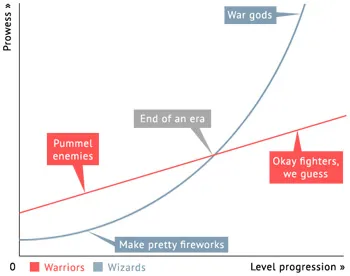

+++
title = "Struggling to Choose a TTRPG in This, The Year 2023"
date = 2023-09-15T12:00:00-07:00
draft = false
categories = ["rpg"]
tags = ["D&D", "FATE", "13th Age", "Blades in the Dark", "Pathfinder"]
image = "./modern_nerds.png"
description = "talking about some of the many options in the TTRPG space, with a bit of historical background"
+++

## Prussia Enters The Chat

In the early 1800's, Prussian nerds got involved in _das taktische kriegsspiel_.

> 
> pictured: [Prussian nerd](https://en.wikipedia.org/wiki/Georg_von_Reisswitz).

<!--more-->

 Cartography and probability theory were _really hot right now_ and so some high-level officers got way, way in to complicated miniatures games.

> 
>
> the year is 1824 and your nerd son is presenting this to the literal actual King of Prussia, and... he _loves it_.

By the Franco-Prussian war the average Prussian Officer is basically this guy:

> 
>
> ii. **Supply:** Wargamers that meet the requirements of VI.D.i. may attempt a Light Bulb Change if they also meet the following Supply conditions:
>
> ii. 1.: They are currently stacked in a hex with a Light Bulb (LB); OR,
they are within three hexes of a magazine.
>
> ii. 2.: They are currently in the ZOC of an LB emplacement.
>
> _EXCEPTION: LBC's may NOT be attempted if the LB is currently at full strength._

Surprising everyone, Prussia won the Franco-Prussian war so hard that a Germany happened, mostly by abusing early line-of-sight rules and moving large objects in front of high value units.

As a result, _das taktische kriegsspiel_ started to get really popular in all of the poncy officer circles.

100 years later? Still popular with nerds.

> 
>
> pictured: a group of men standing about measuring their miniatures

Wargaming has gone off in its own weird directions over the years and now involves this kind of nonsense:

----

Lord of the Rings was written during World War 2, by World War 1 veteran Jolkien Rolkien Rolkien Tolkien, based on his 1930's children's story The Hob Boat (later renamed "The Hobbit" when it was determined that a small pleasant man would make a more relatable main character than the original plucky tugboat named Hob).

It took fantasy realms of the sort imagined by socialist poet [William Morris](https://en.wikipedia.org/wiki/William_Morris) and combined them with a mishmash of epic mythology, an almost encyclopedic attention to detail and _a great big fucking war_. The book was slightly less popular than The Bible, and chubby nerds with wooden swords started showing up in wastebaskets and lockers across America.

Basically as soon as it was released, some of the wargaming nerds from earlier start taking their elaborate battle simulations and trying to figure out how to simulate the Battle of the Black Gate, and as a result they were forced to try to figure out some real bullshit like how to treat a fanciful made-up wizard like _literal artillery_.

> 
>
> i don't know how this line from a banned pornographic film ended up in a Reese's commercial, but history is a funny thing

Fantasy wargaming starts out as largely an ad-hoc set of add-on rules for existing game systems, but some borks with a photocopier scrape together some of the most popular folk rules into...

That's right, it's not even D&D yet.

Oddly, what people gravitated to was not the large battles, but... like, little individual hero moments.

Ugh, I GUESS, we can make some rules for that.

It had just THREE classes:

* Fighting Man
* Magic User
* Greg

This Dungeons & Dragons was still deeply rooted in _wargaming realism_, but it established the canon for a lot of stuff that would form the basis of Every RPG You Will Ever Play, like Levels, Hit Points, Classes, and, of course, **Greg**.

First Edition also introduced some bad ideas that remained very sticky for much longer than they should have, like rolling for character stats. Are you sad that your friend gets to play as a 7-foot tall golden god who can kick through walls while you're a potato farmer with 2 hit points? Well maybe you should learn to roll dice better!

"Whoops, I guess you were just born unlucky" *is* accurate, realistic, and not terribly fun, all three of which were properties that appealed to wargamers.

One neat thing about the original sourcebooks is that they ask players to take, not just their class roles, but also "simulation" roles: one player was the Caller, responsible for collecting and reporting on the party's group decisions, one player was the Mapper, responsible for preparing and maintaining the maps (the DM's maps were _not_ shared with the team), and another player would be the Ledgerman.

The unfairness of this system was balanced out by its astonishing lethality. The wargamers' dedication to Accurate Simulation meant that, golden god or not, the only way to reliably deal damage to a dragon was with _indigestion_.

The "Tomb of Horrors" module was initially created in the 80s as an elaborate and cruel prank, where just about every single room was a greased chute sitting above a pool of acid. It became unexpectedly popular to this day with people who do not understand that it was never intended to be fun or

Note that this could also describe C++.


Advanced Dungeons & Dragons, Second Edition introduced "THAC0", a simplified system for determining whether or not things could hit other things, that people still mock to this day.

Ultimately, D&D, AD&D, and AD&D2E are all pretty broadly cross-compatible with one another and 30 years of bonus content, fan adventures, and errata build up.

People who are attracted to the charm, open-endedness, unfairness, and shocking lethality of the early stuff are now way in to [OSR](https://en.wikipedia.org/wiki/Old_School_Renaissance), which has now existed for so long that nobody is sure which exact era it's supposed to be nostalgic for.

Over the years, the D&D writers started to learn that people liked to feel heroic and powerful and have story arcs, and moved more towards systems of rules that would let players build overpowered edgelords in capes.

------

We need to skip ahead somewhat or you'll get bored. *THE YEAR 2000.*

A fourteen year old Curtis is introduced to D&D via a 3rd Edition he finds at a Chapters.

This is an edition widely despised by the D&D fandom as being an over-simplified babytimes D&D for people who can't be assed to have collected 20 years of AD&D2 errata. How **dare** this upstart "Wizards of the Coast" come in and replace THAC0 with AC?

Fourteen year old Curtis doesn't know any of this. He makes a couple of homebrew adventures with the system as written and has a good time.

> 
>
> this graphic design has the mystical property of "looking like it's made out of cheap gold and fake gems" despite being... art, that presumably they could have changed to not look like costume jewelry.

Thanks to the sweet mercy of **ALL RECORDS FROM THIS ERA LOST**, we do not have any remaining shreds of Curtis High School Fantasy Drawings. Thank your lucky stars.

I haven't played enough 2E to have a firm opinion about this, but my bias is that 3rd Edition and it's eventual 3.5-errata are a firm, firm improvement over the 2nd Edition. The WoTC team came in and swept out a lot of _cruft_ and replaced it with some _satisfying crunchy rules_.

This also marked another great big step towards "the player as superhero". This is not an accurate medieval simulation, this is a simulation
of _the heroes of a pulp fantasy novel_ having _great big adventures_.

--------

I mostly remember D&D 3rd Edition as being kind of a pain in the ass to run - it's a fussy system with a lot of systems that are easier just to ignore entirely or fudge.

I had simplified variant rules for Languages (everybody speaks Common), weight capacity and encumbrance (you can carry it unless you can't) , non-magical healing (You heal everything overnight, rather than healing, like, 1d6 hit points a day for a whole week.)

I was always the DM. That's still the case now: finding people willing to volunteer to DM remains a few-and-far-between kind of thing.

Aside from still being a _dense, dense game_, there are some 3E **problems**.

## Fighter, Rogue, Mage, Cleric

Game's designed to be played with these four, pretty much.
You can fuss with it a little, replace the Fighter with a Paladin or Barbarian, or replace the Rogue with a Bard, but that's about as creative as you can get with your team composition without leaving some very real holes in your party.

(This is also why I had to have a house-rule about non-magical healing and loads of healing potion: nobody ever volunteered to play as a Cleric.)

## Linear Warriors, Quadratic Wizards

One of the reasons that the optimal composition of a D&D team is "Fighter, Rogue, Mage, Cleric" is that the fighter has to carry the team's damage output at early levels, and then starts to get useless at late levels. That's not great.

## Impossible AC

Roll-to-hit with bonuses that scale by level is _tough to balance_.  It's possible to kit out a character (or a monster) with equipment that makes them essentially _un-hittable_ except in the case of a random critical hit.

## Huge Level Scaling
A single level 2 character could probably wipe the floor with a whole team of level 1 characters. The level 2 character is doing significantly more damage, has a big bonus to AC making them much harder to hit, they have twice as many hit points.

This tends to mean that every unit of content the player interacts with either needs to be _tailored to exactly their level_ or it's going to be somewhere on a wide gradient from ridiculously easy to astonishingly lethal.

This can be particularly hard on homebrew DMs, who already struggle to balance their encounters! The "CR" system, which attempts to build fair and balanced encounters by giving different creatures a "threat rating", is... well, it's not great. It's absolutely likely to build a CR-appropriate battle that's impossible for players to win, or a total cakewalk.

## I Hit It With My Sword / Uh, Let Me Check My Spellbook

The difference in complexity between a fighter and a wizard in D&D 3E is also _enormous_. With fighter, the complexity is mostly in making sure that you have good equipment and your strength is high. Your option, on your turn, then, is mostly some variation on "I hit it with my sword".

More complex classes, though, have a _lot_ of tactical flexibility, and that tactical flexibility is represented as a *lot* of rules they need to remember.  This means that some combats will have fighters checking out as they go "I hit it with my sword" and then ... checking out for a while, because it's not going to be their turn for 10 minutes and that's time they could be checking their phone.

## Grid vs. Theater of the Mind

From the manual, heck, from the _community_ it's unclear whether D&D is expected to be played on a grid, with miniatures, or in a more ad-hoc descriptive system where players locations are described narratively.

In fact, this is part of a bigger topic...

## Wargaming vs. Improv

If you were to draw a long line, and mark one end with "Strategic Wargaming" and the other end with "Theatre Sports", D&D falls somewhere firmly in the middle. In fact, that's one of its strengths!

To be honest, I've always been more in the "Theatre Sports" camp. D&D is a _collaborative storytelling tool_, not a _strategic wargame_. If I wanted to play WH40K, I could remortgage my house to buy miniatures and find some people to do _that_ with, but I was an obnoxious theatre kid.

But there are a lot of rules and systems in D&D that only really make sense in a tight, focused tactical strategy combat game. 5ft differences in character speed in a tactical grid combat game are a *lot* more meaningful than in an improvisational radio show.

Deciding what and how your D&D is going to be tailored for your group is part of the _challenge_ of D&D, I think.

----------

## 4th Edition

4th Edition addresses a **lot** of problems with 3rd Edition, and introduces a lot of new ones, by deciding to firmly choose between the "tactical wargaming" and "improvisational storytelling" camps. 4th Edition is a *tactical wargame*, in particular, one that intended heavily to lean on _computerized dungeon mastering_ to make all of the rules possible for a single DM to run.

The person leading the digital design team [killed his wife in a murder-suicide](https://en.wikipedia.org/wiki/Murder_of_Melissa_Batten), though, which may be indicative of more serious problems getting this product to market - the computer-half of the D&D4E equation never showed up, despite many promises in the source books.

At the time, I was kinda hard on 4th Edition: what I wanted was a D&D that was _less crunchy_, not _more crunchy_ - but, not gonna lie, under the hood the system that 4th Edition presenteid was **significantly** more mechanically sound than D&D 3rd Edition, up-to-and-including balancing wizards and martial characters much better and presenting much more balanced and interesting fight scenarios.

With classes divided into DPS ("Striker"), Tank ("Defender"), Crowd Control ("Controller"), and Buff ("Leader"), and the game making it clear that all combats were designed to be completed by a party composed of One Of Each Of Those Things, the designers did a lot of work to make the combats of the game varied, complex, and satisfying.

Healing? Simplified aggressively.

Every character class gets a **menu** of options that they can choose from every round, with varying levels of resource expenditure for each.

All of the non-combat stuff? Mostly pushed to the side. 4E adventures were mostly a series of mechanically satisfying board game setups lined up one after the other.

In fact, there's a game that does this even better, and it's Gloomhaven.

### Gloomhaven
Gloomhaven isn't a TTRPG. It's a board game.

It's really good, and I think it's actually _exactly_ what 4E wished it could be: a series of self-contained, well-balanced, interesting, complex tactical puzzles lined up one-after-the-other for the players, tied together by a paper thin story.

It's also hard as nails. The balance in Gloomhaven isn't about making you feel _powerful_, it's balanced towards making you feel _desperate_ as you are just on the verge of running out of resources and letting your whole team down.

(This is how a lot of Gloomhaven games turn out. I find it very stressful, actually?)

Also, and this is, I think, part of the problem with 4E: _this has gone too far into not being a TTRPG anymore_.

By trying to make something **mechanically sound**, the result is a system that is _only_ mechanically sound and doesn't support
narrative play as much at all any more.

## FATE

So, if what you don't want is a tough tactical puzzle, maybe you want a system that leans, full steam, into the collaborative storytelling aspect of D&D.

FATE does away with the combat system almost *entirely*. Imagine D&D if _everything_ was a skill check, even "fighting".

This actually kinda grooved a lot more with my style: the parts of D&D that I tended to enjoy being describing a scene or situation and seeing how my players would react creatively to it.

FATE's also an enormously flexible and customizable system. I ended up building a whole Cowboy Bebop-inspired FATE mod, called Seatbelts, which I tried to run on Roll20 and which fell through after a handful of sessions due to scheduling issues and _just not being very fun_. In our first session, my friend Dan immediately wandered away from the rest of the party and off of the main adventure path and did his own thing, and my younger brother and sister-in-law tried to share a computer and she fell asleep.

*Roll20 is also not a very good pick for this kind of RPG, I think.*

## 13th Age
I swore off trying to run games for a good while.

Eventually, though, some friends of mine invited me to play a game of 13th Age with them, and I got to join in as a rogue.

I played as **Vance Valiant**, brave, wealthy, and world-renowned hero (no skills, no feats, no fighting ability), and **Pif Also**, his personal manservant and squire, who was a Rogue who did all of the actual work. Any time there was an actual battle, Vince would hide immediately, and it became immediately clear to anybody that Vance was little more than a spoiled failson who was chasing adventure to try to stoke his personal brand, and Pif was a put-upon mercenary ass who was mostly just in it for the money.

You know:

This was very fun, and the game was just getting started, when a COVID and a pregnancy or seven happened and the whole game fell apart once mo'.

## 13th Age, Again

So, a while later I decide I'm going to run a game of my own again, and I remember 13th Age being pretty fun.

This time, I pour my entire ass into it and build a whole workflow the game in Miro of all things, a whiteboard tool.

13th Age was made by the D&D writers who left Wizards of the Coast around the time that they were working on 4th Edition, on account of _they didn't want to build a strategic wargame_.

13th Age was instead designed to work a lot like 3rd Edition, but with a lot of very practical and thoughtful simplifications and ideas borrowed from games like FATE to make it more narratively satisfying and creative.

Here are some of my favorite things from 13th Age, things that I might port to future game systems if I can hack it:

* The "**Escalation Die**" adds +1 to everyone's attack and damage rolls, every round of the battle, escalating battle's lethality and seriousness every turn that it goes on, and giving the players a chance to take on even very very hard battles if they can just _hold on a while_. This speeds battles up!
* **No multiclassing**: this has always been a houserule for me, anyways, because I don't have all damn day.
* **One Unique Thing**: players are asked to come up with one thing that makes their player _entirely and completely unique in the world_. This can be pretty much anything, and it's a wildly creative prompt to juice a character's backstory. "I am the only son of the Demon Prince".
* Replacing skills with **Backgrounds** means that you can just say "I used to be a scholar" and the job of any given skill check is trying to explain why being a scholar would give you a bonus to breaking windows. ("I, uh... needed to steal... books?")

13th Age's systems are designed for Theatre of the Mind combat explicitly, with ranges like "close up" and "far away" rather than measurements in exact feet.

There are also things I didn't like about 13th Age:

* The game insists that each character have a personal connection to one of the game's **Icons**, who are major power players in the game's universe, and based on **Icon Rolls** the DM has to find some way to work in little Icon Moments with these, like, Level 20 Worldbending Megacharacters every single session.
* The game also has **Gods**, who are extremely ill-defined.
* The **Background** system seems conceptually easy, but actually players would often struggle to describe how they could use their history of being a _fletcher_ to _run faster_. Just having the skills laid out in the 3E style is much easier for players to wrap their heads around. "That's Athletics, I have that!"

It's not just me! **Nobody** likes Icons:

13th Age also had few-to-no published adventures, a _tiny_ bestiary, and limited-at-best lore, so you were (especially early on) basically handed a pile of characters and monsters and told "good luck, have fun, don't die".

I had a lot of fun with 13th Age and it was really good!

I'd have kept this game going but the group fell apart after a while due to the oft-grim reaper of games: scheduling issues and childrens.

## Blades in the Dark

At some point I picked up a Blades in the Dark book and wanted to try it. And I did! And it was fun! It's very much a game in the FATE mold: all skill checks, no combat mechanics, but it's much more well-defined and crunchy than FATE is, and it all happens in a _very specific_, _very well defined_ and _quite small_ universe. Everyone's Duskvol is a little different, but every game of BiTD happens **in Duskvol**.

Blades in the Dark is, I think, the closest example of the almost entirely narrative-driven game that I've ever tried: it's a wonderful and focused expression of the FATE system and it's very, very good.

Here's the thing, though: It's really hard to do. It's hard to _run_ and it's hard to _play_. The game is, often, **too** open to interpretation. All imagination, no crunch.

This is something that I'd never really thought about, because I'd been looking for a game that did a better job of emphasizing the creativity and flexibility of D&D without all of the heavyweight strategic crunch:

Replacing it ALL with improv is _EXHAUSTING_. For _EVERYONE_.

If we really *were* running a radio show, this would be the perfect system, but we're **not**.

It's exhausting to be that **on** all night. You tell me I need to think up an entire heist, on the fly, _right now_?

....

## Wait a Minute

The D&D alternatives that got really mechanically precise, like 4E and Gloomhaven, felt too mechanical.

The D&D alternatives that got really creative and narrative focused are exhaustingly improvisational and give us way too much rope to hang ourselves with.

On top of that, I want a **prewritten adventure** to work from, dang it!

Maybe the right balance was _just regular ol' dungeons and dragons, all along_?

## Baldur's Gate 3
So, uh, Baldur's Gate 3 came out and it's easily, _easily_, no question, Game of The Year 2023.

Unless Cities Skylines 2 happens to be a _real barn-burner_, I think that's already decided.

And it's... D&D 5th Edition.  Slightly modified 5th edition to make it a little more workable in a video game format, but 5th edition, nonetheless.

And I'm having a blast with it! I'm really engaging with the mechanics! It has interesting, tactical combat, like a lot of my favourite games. I've really liked all of the Larian games. XCOM. Fallout 2. Jagged Alliance 2.

_wait a minute_

**Do I LIKE crunchy tactical combat?**

Have I liked it _all along_?!?

Maybe it's time to go back to just D&D. I'm having so much fun with Baldur's Gate 5E, I could just run that, right?

## Let's Talk 5th Edition

The D&D team ALSO wanted to go back to their 3E roots and make a game that was a bit less of a tactical wargame. Here we have D&D 5E, a game that makes a whole bunch of 13th-Age-Like simplifications to the original 3.5E formula, but still feels a _lot_ like Dungeons and Dragons.

To be honest, 5th Edition seems pretty _ideal_. It's got a lot of everything - fun crunch, fun improvisation, loads of prewritten adventures - it's a great system.

I have one and _only_ one qualm about 5th Edition:

maaan, we all remember how Hasbro made [everybody in D&D mad](https://www.gamesradar.com/dandds-licensing-controversy-explained-heres-why-you-should-care/), right?

They walked a lot of that _stuff what made everybody mad_ back, but it doesn't matter: we know that Hasbro considers D&D undermonetized. 6th Edition, "D&D One", is incoming, and what Hasbro wants is for D&D to be hosted on a *subscription-backed digital platform*.

I want D&D, but... _not_, y'know?

---------
## Pathfinder

"It's D&D, but **not**."

Do you know what happened when I tried to log in to my old Paizo account from when I bought a cheap humble bundle containing a bunch of Pathfinder books? It was running on a `cgi-bin` and it took like 30 seconds.

**Paizo is not building a subscription-backed digital platform**. Their website seems to struggle with the idea of _JavaScript_. I don't think Paizo could digital service their way out of a wet paper _bag_.

### What's Pathfinder?
Well, originally, it was 3.5E, again.

Every system, 4E, 5E, 13th Age, Pathfinder, is _just 3.5E under the hood_. 3.5E was very influential.

I'm not as down with the Pathfinder history as the rest of the community, but the Pathfinder community have been the ones running D&D 3.5E a _lot_ and _paying attention to all of the rules really closely_.

See, Paizo used to be, uh, the ones publishing Dragon Magazine, a quarterly supplement for D&D containing loads of variant rules and micro-adventures:

The mountains of lore and errata they produced were half of the _reason_ that D&D had a reputation for being Too Complicated.

Then 4th Edition came out, with a very restrictive license, and Dragon magazine was worried that they wouldn't _actually own_ any of the content that they produced for it.

And so was Pathfinder born, a system that's almost but not quite completely identical to D&D 3.5E.

With the popularity of 5E and the almost 20-year-old crustiness of 3.5E, Pathfinder started to work on updates to their core engine, but they didn't go nearly as far down the path of clarity and simplification as 5E did.  **Pathfinder Second Edition** is the result of this.

Pathfinder's ORC license is much more consumer-friendly than 5E's OGL license.

Pathfinder's setting is just... No-Name Forgotten Realms:

*"welcome to Baldor's Big Door, gateway to Cavernus"*

So, let's talk about some of the [differences between Pathfinder 2E and D&D 5E](https://www.cbr.com/pathfinder-vs-dnd-5e/#crits-are-expanded-beyond-natural-20s-and-1s-in-pathfinder):

I'm gonna tl;dr this one down to the buttons: 5E is _simpler_. Pathfinder hasn't been sanding off the rough edges of 3.5E, it's been devoting years and years to adding *more and more and more* of them. Pathfinder is **nothing but rough edges at this point**.

Pathfinder is _harder_ and _more complicated_ than D&D.

Pathfinder has a lot of published adventures (nice!) but those published adventures are tuned to be so difficult that the kind of people who count D&D as their one-and-only-hobby find them balanced and challenging.  *BUT* that challenge can be sanded down somewhat.

I _could_ do what Baldur's Gate 3 does and have a the oldest and most powerful god of death just wander into camp one day and start handing out $200 resurrections for Player Characters Only.

As a result, though, Pathfinder is much more complete and balanced than D&D, as far as I can tell? You're really unlikely to put your characters in a situation where they get unfairly TPKed or there are huge balance issues between characters because _the game is really, really focused on making sure that the combat is balanced, and strategic_.

So, Pathfinder is a D&D but a little closer to the Gloomhaven side.

Pathfinder is very much the Linux to D&D's Windows.

Also, I mean that in both a good way and an _incredibly derisive way_:

## Anyways

I say all of this because I currently am juggling some _purchasing decisions_.

I know *I want to run something set in either a Magical University or Hell*, and also, *I would like a pre-written adventure please*, because I'm busy and lazy and building my own dungeons is hard.

Either I can pick up a copy of the 5E sourcebooks, and Strixhaven (which is set in a magical university) and Baldur's Gate: Descent into Avernus (which is set in hell)

OR

I can pick up a copy of the Pathfinder sourcebooks, and Strength of Thousands (which is also set in a magical university).

I'm currently looking at both in cheap-as-pirated-PDF versions to try and help figure out which is the best direction, here.

## After Reading Strixhaven And Strength of Thousands

I don't want to run either of these.

Strixhaven is charming but it’s really, really underdeveloped as both a campaign setting AND a campaign. It’s like a Fun Story Pamphlet.

Most of the Strixhaven-running-community are energized by the fact that Strixhaven is nothing more than a skeleton that they have to build a LOT of meat around, but that seems exhausting to me.

As for Strength of Thousands? No... it's just not... very fun sounding.

## **Editor's Note, Months Later**

We ended up playing Waterdeep: Dragon Heist. It was great, although past a certain point (like, chapter 1.5) our own adventures started to
overtake the often pretty _bad_ prewritten adventure and expand out into their own thing. Which... is good, actually, I think?

## **Editor's Note, Months Later Still**:



So, Quinns did a whole THING explaining the connection between wargaming and modern board gaming and…

while I was watching it, I was thinking “I already know a lot of this, did I do a ton of research on this a while back?”

and so I search my notes for “kriegsspiel” and find this article

apparently I **did**
