+++
title = "Casablanca"
date = 2023-12-29T12:00:00-07:00
draft = false
categories = ["media"]
tags = ["casablanca"]
image = "./bogart.png"
description = "I watched Casablanca for the first time maybe 60 years after it first came out and it still holds up."
+++



Did you know I was probably in my 30s before I watched Casablanca for the first time?

<!--more-->

How good could this 75-year-old film possibly _be_, I had thought. It's gonna be like Citizen Kane, or The Beatles: so massively influential that they're copied by everyone, rendering their first-mover advantage kinda underwhelming in retrospect.

Nah, _naaaah_, Casablanca holds _up_.

### Stuff That Doesn't Hold Up

Look, there's some stuff that's cornball as hell: "here's lookin' at you, kid" is just the kind of Humphrey Bogart cheese that probably played well 75 years ago and now is, I'm gonna say it, _just a weird thing to repeatedly say to a woman you love, even as a toast_.

**Rick doing the thinking for both of us.** That sits badly.

Also, "As Time Goes By" is just a deeply mediocre and forgettable song. It's _really important to the story_ and a leitmotif that runs through the whole movie, which is too bad because _dang, who cares, this song blows_.

Also, every time Ingrid Bergman is on screen, they goop so much vaseline on the camera to try to make her look soft and pretty that I can barely make her out.

> 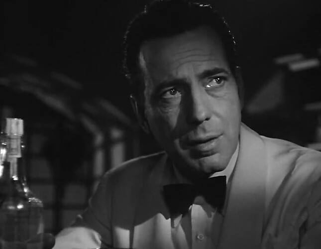
> bogart: so crisp

> 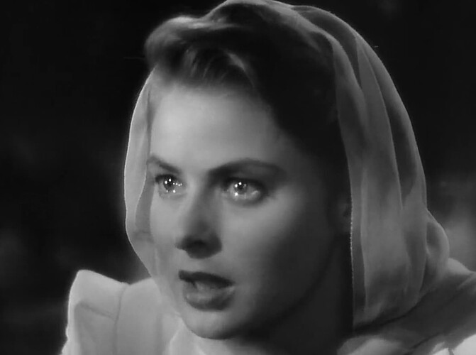
> bergman: so smooth

(I doubt they actually used _vaseline_, but there's a noticeable difference in how Bogart and Bergman are shot in this film, and while it might have seemed like _technique_ in '42, I find it really weird and distracting.)

### Stuff That Works
Everything!

First of all, the storytelling is crystal clear:

#### The Plot, In Brief Summary

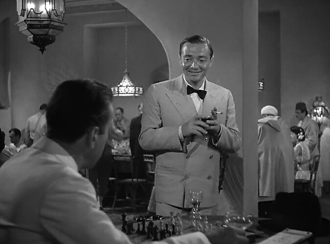

The set up is unique and memorable: in World War 2, French refugees are pouring out of France and seeking passage to Spain and then the USA, where they can be free from the Nazis: and one of the most dangerous stops on this journey is the neutral city of Casablanca, where people wait for a seeming eternity in a dangerous purgatory to try to get travel visas.

Rick, morally gray and politically neutral operator of the shady gambling and drinking den "Cafe Americain", comes across two totally free-and-clear travel visas, basically by accident.

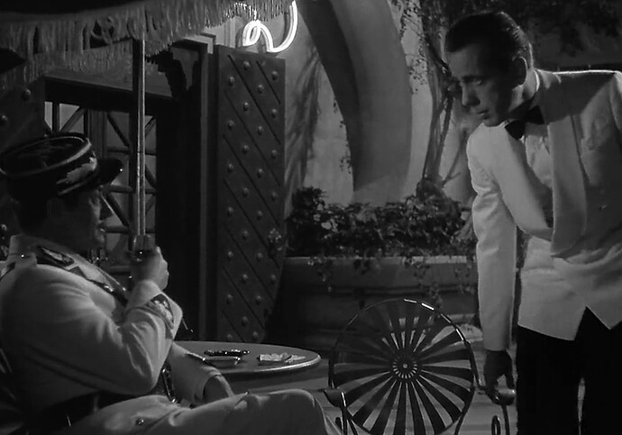

Captain Renault, corrupt chief of police, and tentative ally to Rick, warns Rick that a political agitator, Victor Lazlo, is coming to town, and under no circumstances is he to get his hands on a visa: this would infuriate the reich and create a lot of problems for both of them.

Victor strolls into the bar with Ilsa, a woman who (whoops) broke Rick's heart some time ago in Paris, leaving him without a trace and utterly heartbroken. Victor turns out to be something of a stand-up guy: he both survived and escaped a German concentration camp and is spending his time trying to broadcast to the world the horrors that he'd seen there and rile up resistance against the 
note that, this being 1942, the filmmakers were not 100% aware of the *full extent of said horrors*, which means that leaving them ill-defined and terrifying for the sake of the movie turned out to be pretty prophetic.
.

It becomes increasingly clear that the Nazis and Captain Renault are working behind the scenes to try and manufacture some trumped up charges to have Victor imprisoned and then murdered: to stay in Casablanca would be a death sentence for him.

------

## A B-Story: Rick Has a Heart After ALl

Rick shows a tiny ounce of humanity: a young woman and her young husband come to gamble in his parlor, hoping, foolishly, to earn enough money at the crooked roulette tables to buy some exit visas on the black market. The young woman comes to Rick with a question: **can Captain Renault be trusted**? Captain Renault has offered up Rick as a _character witness_.

She's been proposed a deal: Captain Renault can produce some exit visas, but in exchange she'd have to do something that _her young husband can never know about_. Further details are obscured by the Hays [Hay, no prostitution.](https://en.wikipedia.org/wiki/Hays_Code), but the nature of her deal with Captain Renault are _fairly wink wink nudge nudge_.

Rick verifies that Captain Renault, while crooked, is good to his word: he would indeed abide by his prostitution-for-exit-visas deal - but takes a little moment to wander over to his rigged roulette tables and arrange for the young woman's husband to win thousands of francs - just enough to arrange exit visas.

> 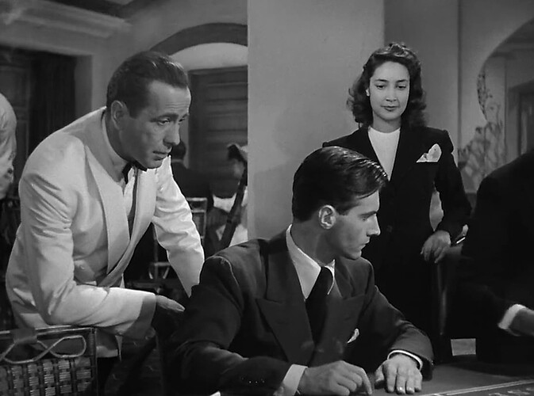
> "put it on 22"

Captain Renault is irritated by this, and politely requests that Rick let the next beautiful woman (who he has lined up already) lose at roulette.

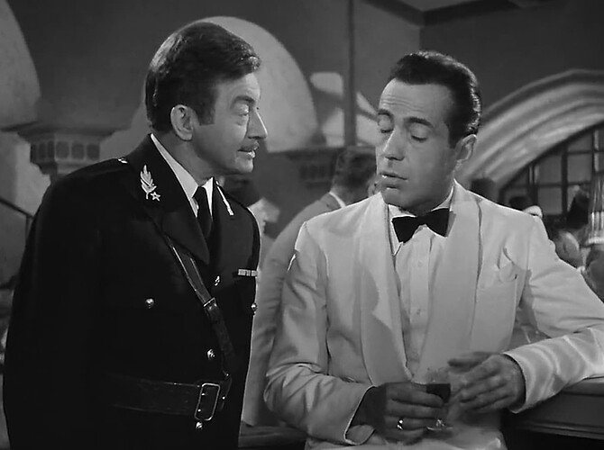

------

## Back to the A-Plot: Victor and Ilsa's Escape

Nobody in town will sell Victor a forged exit visa, so Rick is their only chance.

Ilsa offers a deal - well, not really - she rushes into Rick's arms and assures him that _Rick_ was her true love all along, and that she'd be happy to stay if he'd just send Victor to safety. Rick is _almost but not quite convinced that this isn't a performance_.

What disabuses him of the notion is... Victor coming to Rick and offering him the same deal in reverse: Rick should take Ilsa to safety in Spain, and Victor will stay 
there's a reading of this where Victor and Ilsa are just sick of one another and each one is desperate to leave the other one behind on an excuse, and Rick's just screws everything up for everyone, but that's not terribly well supported by the text. Funny thought, though.
. Each one loves the other so much they're willing to sacrifice themselves to ensure the other one lives.

Rick - well, it's not totally clear _what_ Rick will do. He appears to take _all sides_: he lies to Victor and says that he'll take Ilsa, he lies to Ilsa and says that he'll take Victor, and he makes his own deal with Captain Renault to betray Victor to the Nazis, so everybody is going into the final act thinking that they're getting _exactly what they want_. Rick makes arrangements to sell his bar: he clearly plans to escape with Ilsa and a big bundle of money.

Everything's set up for the big betrayal... but wait. The hero flag has been set!

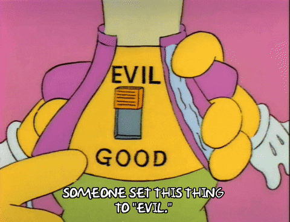

The whole plan has been a double-cross to get Victor and Ilsa out, together!

Rick has to pull a gun on Captain Renault to really double the cross.
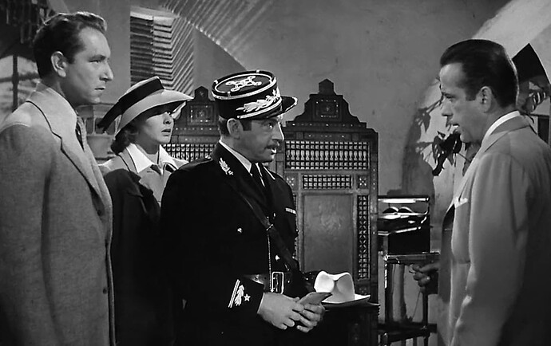

Now Rick just has to get Victor and Ilsa together on that plane.

But Ilsa wasn't joking: she actually _does_ love him, and she's pretty distraught that he's going to be left behind.
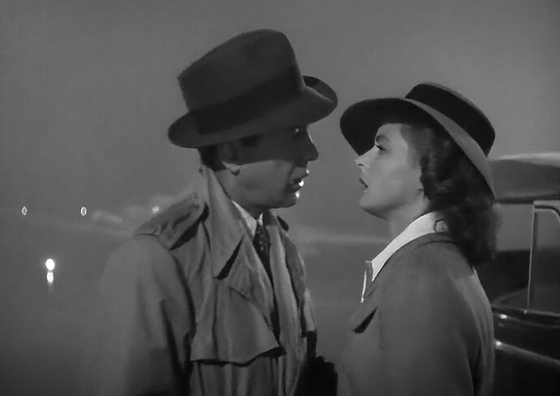

"What about us?"

"We'll always have Paris."

> 
>
> Bam! Mic drop!

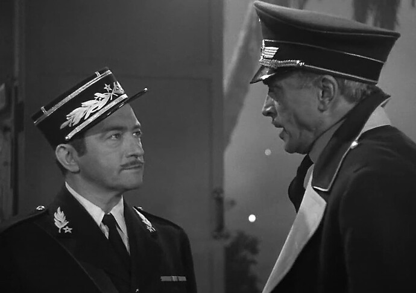

A Nazi official shows up, attempts to use the phone to call HQ to have the plane shot down, and _whoops, Rick shoots him_.

The police (finally) show up and ask Captain Renault what happened: this is the part where Rick has to pay the price for all of his heroism - he's held the chief of police at gunpoint and shot a high-ranking reich official, and now he's going to get dragged to jail, probably murdered, probably **right now**.

Captain Renault:  `¯\_(ツ)_/¯` , idk, it must have been criminals

📯📯📯📯📯📯📯📯📯📯

THAT'S RIGHT BAY-BEE, YOU THOUGHT THIS WAS JUST THE ONE REDEMPTION ARC? NAW, CAPTAIN RENAULT TURNS GOOD TOO, THAT'S A TWO-FOR-ONE!

Captain Renault and Rick walk off into the fog, ready to **join the resistance**.

And so they walk off, delivering one of the most memorable lines in cinema:

> 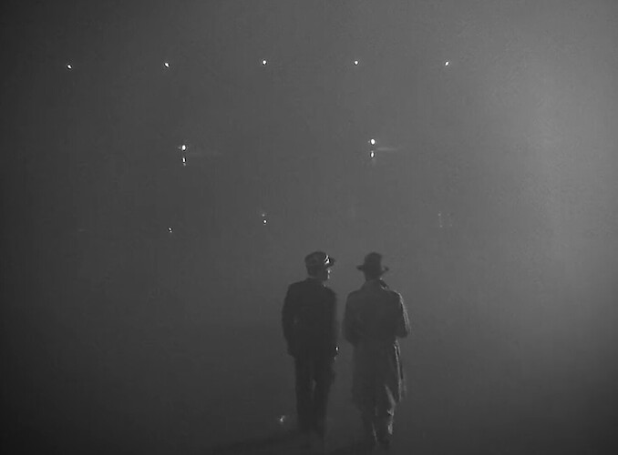
>
> "Man, **fuck** those Nazis."

### So, Again, What Works?

Well, first of all, and I'm disappointed I have to say this in the year 2023, but _killing Nazis always works_.

I think that redemption arcs are great:

Casablanca offers _not one_ but _two_ redemption arcs, happening at the SAME TIME! That's twice as much redemption arc for your film dollar!

The story has a cast of memorable, almost cartoonish characters filling out the story,

> 
> weasel business rival?

> 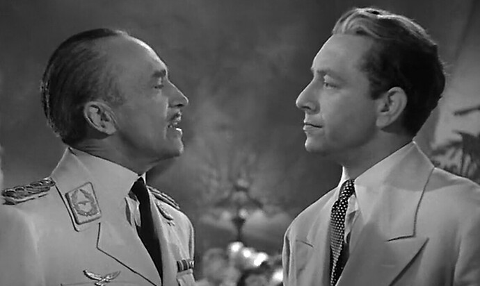
> greaseball Nazi and noble Victor

> 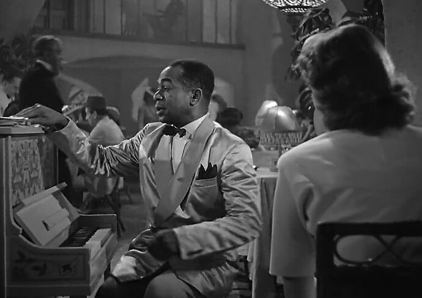
> the only other person in Casablanca who knows the truth behind Rick's checkered past

It's got dramatic questions that need answered! Will Rick do the right thing? Are Ilsa's feelings for Rick genuine or are they a ruse to get Victor to freedom? (answer: yes).

Under the hood, it still works because it's a good story, told well.