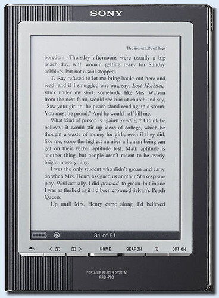
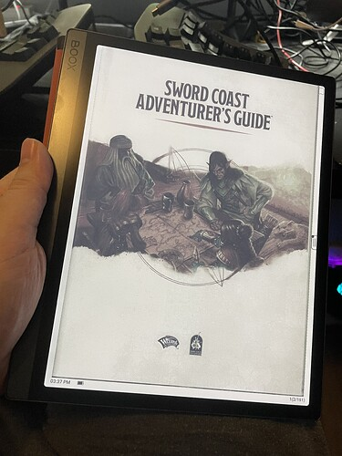

+++
title = "A Large Format Color E-Reader"
date = 2023-10-15T11:00:00-07:00
draft = false
categories = ["technology"]
tags = ["ereader"]
+++



For years, _years_, I've loved e-readers.

<!--more-->

I mean, I carted one of these early Sony-models to Peru with me, rather than a whole mess of books:

I learned in Peru that I'm a little bit afraid of heights.

So while we were powering along narrow dirt roads, hundreds of feet above the ground, at high speeds in one of Dragoman's adventure battletanks, instead of looking out and enjoying the stunning views, I spent most of the time watching the power levels on my thirsty little PRS-700 as they circled the drain while I read a comforting [sci-fi fantasy novel about a hyper-competent but lonely telepathic woman running an interstellar businesses while dreaming about one day finding a family of her own.](https://www.goodreads.com/book/show/61938.The_Rowan)

Ever since, I've been ... regularly upgrading my eReader tech. I have broken more than a few early, cheap Kindles in my time. I don't even really _own_ paperbacks anymore: I just don't have room in my tiny Vancouver homes. Only ebooks.

So, now, Tiff and I have higher-end Kobo devices and we both get a lot of use out of 
Kindles are still great if what you're looking for is a dirt-cheap e-reader that's usable, quickly, although if you're not interested in the deep Amazon library and prefer library books, or _piracy_, I'd recommend the Kobo e-readers instead: they're better devices with fussier software that isn't irrevocably tied to the Amazon Ecosystem in a way that tech people will find frustrating.


Thing is, though, there are two kinds of book in my collection:

* Novels
* Not Novels

eReaders firmly replaced the Novels, sure, but what about the Not Novels? The big, lushly illustrated cookbooks? The graphic novels? The art books? The TTRPG core books? For those, why, **you'd need an e-reader that supports color e-ink and is over 10" large**!

This device _doesn't exist_.

If you want a nice eReader for that kind of content, you're looking at an iPad: with gorgeous color response and a print-like crispness and resolution, why even bother with e-ink anymore?

Well, there are some reasons you might want e-ink:

* it's markedly better for eyestrain, which (at 14+ hours a day of staring at screens uninterrupted) I _absolutely_ suffer from.
* the low power draw of e-ink makes the devices much more resilient against having to be charged regularly, which is super nice for _book_
* a device for reading is for reading, and not for distracting yourself with ~~twitter~~ mastodon and youtube

Anyways, it's a moot point: such a device has been _theoretically possible but still on the horizon_ since... well, forever, really. I've been google-searching for "large color e-ink reader" for ages and while the technology has always been theoretically possible, no contenders have ever appeared in this space, _ever_.

I followed the Triton color e-ink technology: pretty, but too expensive and slow to make its way into any consumer technology.

And, last couple of years, color e-ink devices have started to pop up, starting with the Pocketbook Color 3 years ago:

> [PocketBook Color review: is color E Ink finally ready?](https://www.theverge.com/21507390/pocketbook-color-review-e-ink-kaleido-e-reader)
>
> There’s still no color Kindle, but E Ink Kaleido is promising...

This device, however, was merely a _promising tech demo_, with a small screen, resolution issues (at the time, black and white content would display at 300dpi while color content would display at just 72dpi), and a refresh rate measured in what seemed like _days_, it just wasn't quite ready for prime-time. The black-and-white performance of the Kaleido screens also isn't quite as crisp and perfect as the black-and-white performance of top-end B&W screens: the white of a blank page on a Kaledo screen is grayish, nowhere the picture-perfect contrast of the Kindle 
which, of course, is so named for how good it is at exactly this.


So I kept checking on things, year over year, and things kept getting sharper, and faster. Gallery came out, offering true 300dpi color e-ink, although it remains slow, whereas Kaleido's new screens increased their color dpi to 150 and got significantly larger, cheaper, brighter, and faster.

Now it seems like there may well actually be a **true contender in this space** - two of them, actually, as Onyx and BigMe have two competing devices both using the newest 10.3" Kaleido 3 color screen:





The new screens also have _adjustable_ tradeoffs between resolution and speed: they can provide a screen that's crisp and slow, but also _lower resolution and 12fps_ - look, 12Hz may not be the most impressive numbers to put on the board in the game of monitors, but this is e-ink that's borderline fast enough for choppy, non-gaming general computing applications.

This is... well, a thing! That actually exists!

A thing that I've been waiting for for 15 years!

Huh, neat.

---------

Oh my… it’s arrived… and it’s pretty interesting.

Initial thoughts:

### The Color
the color is _significantly_ less vibrant and beautiful than I had hoped it would be, _especially_ in fast-refresh mode where it has a very "VGA monitor" feel.

It's the most colorful and vibrant eInk screen I've ever owned and it's still a far sight from real color paper.

### The Fast-Refresh
This is a must faster refresh speed than I'm used to on older eInk screens, It's quite usable.

Still not, like, "tablet" fast, though.

### The Umph
Even the relatively mighty Kobo Libra 2 has a 1Ghz processor with 512Mb of RAM. A badly optimized ePub - or, worse, a large PDF  - will bring the poor Libra 2 to its knees. I was counting, like, 5000ms+ between page refreshes while I was trying to read a technical manual in there, and that's on one of the most powerful eReaders on the market. Awful.  (the performance on small, lightweight ePubs is quite good, however)

Not on this device, though, this thing is a **beast**. I loaded a Dungeons and Dragons PDF (over 100MB of unoptimized, hand-scanned PDF goodness) into this Onyx Boox Tab Ultra C (4-core, 4GB RAM) and it handles like a _dream_. Buttery smooth page turns, _working pinch-to-zoom_, it's _very good_.

### The Weight
At 479g  ("about a pound") it weighs twice as much as the Kobo Libra 2, about a third of the weight of a Macbook Air, and about exactly as much as an iPad Air.

A bit chonky for one-handed reading, but it's meant to replace cookbooks and textbooks which were ALSO a bit chonky for one-handed 
That's right, J. Kenji Lopez Alt, I'm putting your HUGE COOKING TOMES on blast.


### Battery Life

Good!

### To Be Honest
I think that unless you're _absolutely in love with e-ink screens_, an iPad is going to be a far superior experience for you,

...but so far I think this thing is still pretty great.