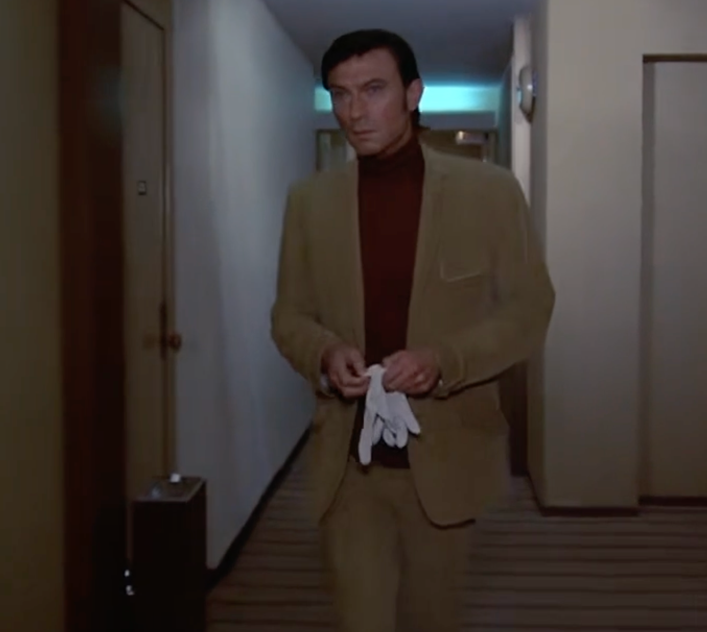

+++
title = "Columbo's Most Dangerous Match"
date = 2023-06-08T12:00:00-07:00
draft = false
categories = ["media", "humor"]
tags = ["columbo"]
+++

let's watch an episode of Columbo



<!--more-->

ugh, dream sequence, gross

did columbo predict the "chess master cheats with a vibrating buttplug" plot 30 years before it actually happened?

this image suggests "yes"

collars were thicker in the 70s

oh boy, this guy HAS to be the one who's getting murdered, he's basically just a big cuddly teddy bear

you know what, I'm gonna say it: chess has gotten worse since the 70s, half of these pieces aren't even in use anymore

Columbo specced all of his points into PERCEPTION and INTELLIGENCE and CHARISMA, but didn't leave a lot of space for WISDOM, so he has just harangued his vet to identify a mysterious sound that his veterinarian helpfully informs him is "snoring dog"

Hearkening back to a simpler time when you could indicate that a character was pre-meditating a murder by simply superimposing footage of the murder method over their face: seems like our friendly ol' grandmaster is gonna get stuffed down a garbage chute.

"You say you want me to meet you? Right next to the garbage chute on the roof? You want me to look waaaaaay into the chute? Come alone, you say? That sounds reasonable, I'll be there in five."

I know he didn't come to this chess event with murder on his mind but he's still just got cotton crime doin' gloves in his luggage for just such an occasion

if he doesn't wear these for chess later I'm going to have some real follow-up questions about why he travels with these

(a lot of Columbo episodes feature villains who remember to bring crime gloves: the number one way to commit an unsolvable crime)

could you... could you dolly the camera back just a scodge? this... this shot... it's... it's too close to his face. I'm uncomfortable. He's uncomfortable. Nobody wants this.

"Please - my girlfriend, she's very Russian, I need your help writing her a letter. You need to write, in your handwriting, 'I'm very sorry, I didn't want to have to do this', on this piece of paper. For my girlfriend. In Russian."

"Huh. Seems legit. I'm definitely going to do that."

He DOESN'T wear his crime gloves for chess. Why did he pack crime gloves then? I know *I* don't usually travel with a set of cotton schemin' gloves for fingerprint free murders.

wait, should I start packing those?

"I'm Detective Smug Badcop, and it's my professional opinion that your professional chess player left a note, bailed on the big chess match, and while he was in the midst of escaping, fell into a trash chute and got compacted"

So this guy shows up at the scene of the crime and puts on a big show about how **sad he is that the match didn't happen** and I am not sure if I have ever seen more of a "well obviously this guy did it" face on ol' Lieutenant Columbo

I'm really getting in to this, this show rocks

"Oh, the fall didn't kill him? How.... very... fortunate. I need to go, uh, right now, for unrelated reasons. Could you tell me where the massive fatal glucose shots are btw?"

_We are over half way into the run time of this thing and this murderer still hasn't sealed the deal, no wonder he's so bad at chess_

🎺🎺🎺🎺🎺🎺🎺

"Excuse me, sir!"

this is the most Columbo shot of the entire episode so far

Wuh oh, the gloves are out, that means it's time to do some more crime

DANGER: DO NOT SWAP DRUGS AROUND, MAY KILL CHARMING OLD CHESS MEN

we finally have a confirmed kill, almost a full hour in

Don't die on me! Your head's been wrapped in protective gauze for diabetes reasons!

so, you very clearly wrote the requisition for murder drugs in the same pen that he used to write the fake "i'm leaving" note and also it's that pen you have in your hands right now

also, you didn't hear the trash compactor not murder him because your hearing aid was broken

also, you secretly met and lost to him at chess the night before the murder

also, you were cheating with anal beads

checkmate

-----

There is of course no #columbo posting without mentioning "I Hear The Blues A-Killin' " by
Joe Chouinard which is the Frasier x Columbo crossover comic the world has needed all these years

https://www.tumblr.com/joechoui/724392286725832704/i-hear-the-blues-a-killin-or-frasier-meets
