+++
title = "Columbo's Lady In Waiting"
date = 2023-06-10T12:00:00-07:00
draft = false
categories = ["media"]
tags = ["columbo"]
+++

let's watch [another episode of Columbo](/posts/2023/columbo)



<!--more-->

Beth, I know you're dating an attorney from the family practice - we both know that you're fabulously wealthy and a real Horseface McGoo - the only reason anybody would ever be attracted to you is to get a crack at that sweet family money pinata. So I've sent him a letter telling him that if he doesn't break up with you, I'm going to fire him.

I'm certain this will work because this is the year 1972 and "wrongful termination lawsuits", "newspapers" and "twitter" all do not exist yet.

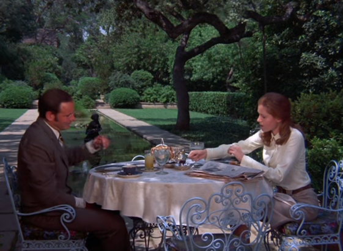

You know what, Beth? This one's on the house, he sucks. Murder away.

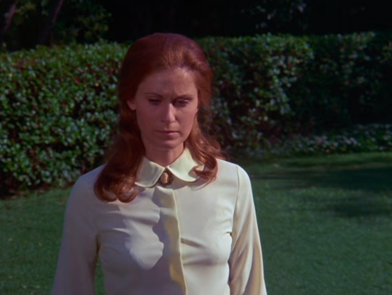

"Surely he's going to follow through with his threats, darling!"

"I'm not scared of your older brother - and don't call me Shirley"

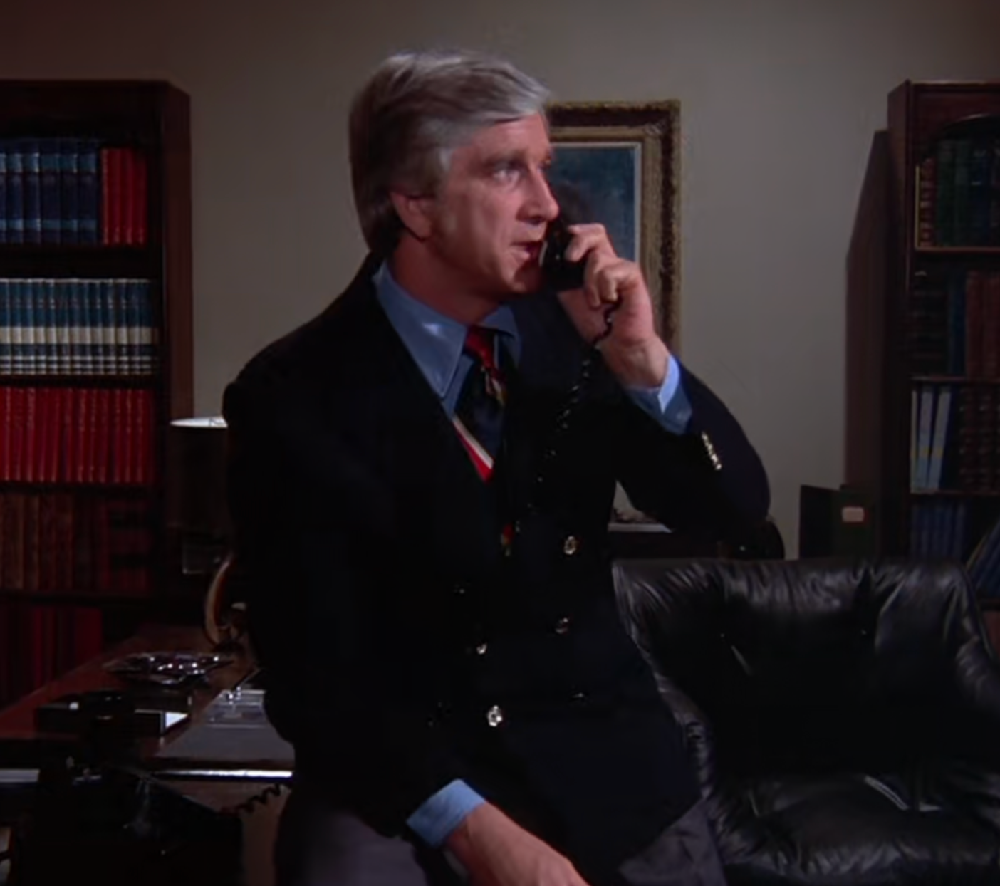

murder plot step 1: fill an important lightbulb with mustard

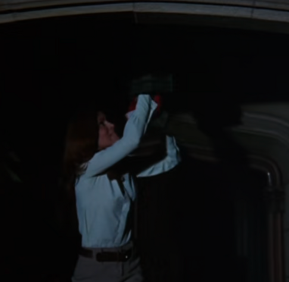
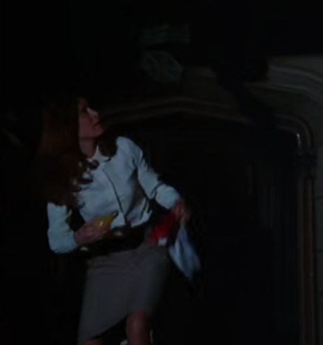

"Ed, what should we call our security patrol system?"

"How about - follow me here - all-caps, SECURITY PATROL SYSTEM. That way people will be able to clearly identify what it does, from the box!"

"Bang, zoom! You've done it again, Ed!"

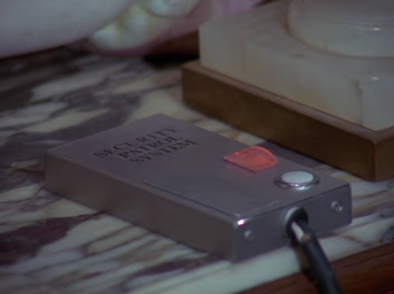

just getting ready for bed with my night pills and night gun and big glass of water

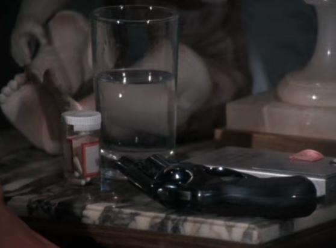

Tame by today's standards, but in 1972 showing a woman this nude on television could get your show taken off the air. Such was the cultural clout of Columbo that they could get away with it

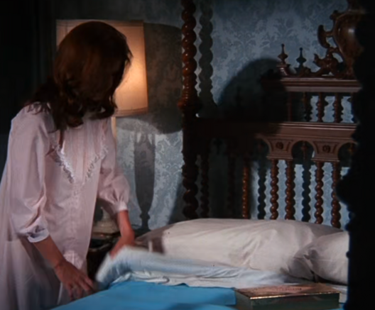

You know what? I'm going to say it. This woman is the laziest damn murderer I've ever seen.

I guess this is extremely accurate to how I would expect a child brought up very rich would plan a murder: just get some chocolate and a gun, hop into bed, and see where the evening takes you. If nobody is murdered by the morning? Take a break for a while, you've earned it.

In order to let us know that what's coming next is a dream sequence we get the blurry edges and harp arpeggios. It's how we learn her plot: She imagines her dick brother is going to come home in the dark, unable to unlock the front door (she's stolen his key and mustarded up the lightbulb), trigger the alarm, and she's going to shoot him. "Oh, I thought it was a burglar, here to do unspeakable things to me."

However, they'd have no reason to show this as a dream sequence if it HAPPENED: what's the chance she accidentally shoots her beau instead?

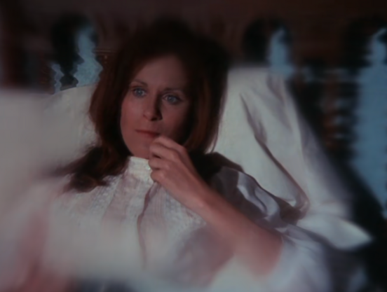

"Would you believe it? The front door lightbulb was all mustarded up and I lost my key. So I had to use my spare key, which I obviously have access to because I'm not a complete idiot."

I'm not going to lie, this has been one of the more ill-conceived murder plots on this show so far.

Columbo writers: not a tonne of respect for women.

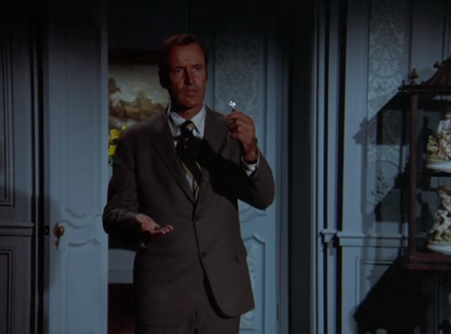

What do you do when your carefully planned alibi doesn't work out?

Obviously you just YOLO-murder the guy anyways: why waste a perfectly good murder plot just because it was terrible?

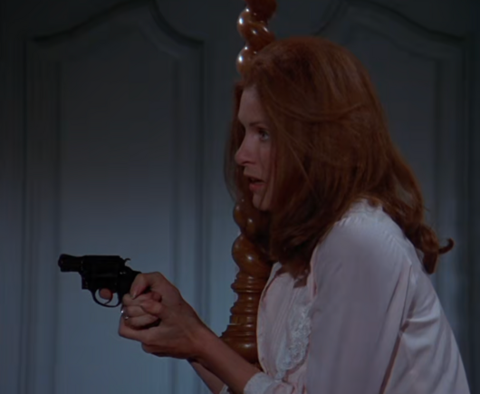

Yeah, buddy, someone mustarded up this light bulb, but good - real spicy English mustard, too, expensive stuff.

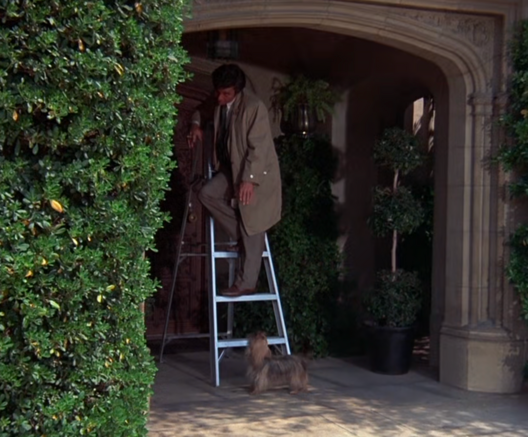

I don't know why this was so funny, but it absolutely was.

"Now my son is dead. He was my special little guy."

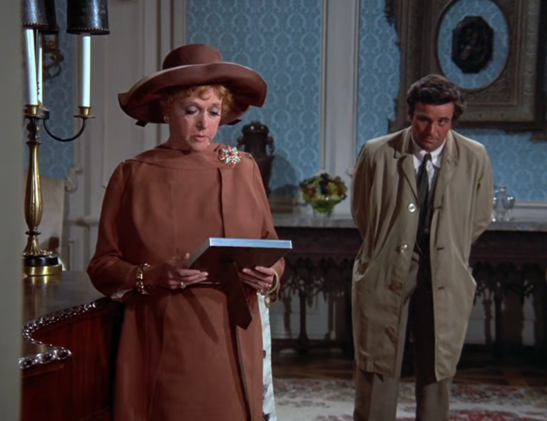
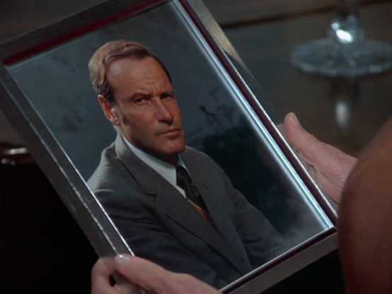

That is just such a _stern_ picture for a man to have in his own foyer.

That's like the kind of picture Tom Haverford would have of himself.

"Ma'am, your son - he never married, did he?"

"No, he was too busy with work to think of such things. He did have a curious number of male business roommates, though. And that... burly fellow he spent all of those years with, his... roommate. Yes."

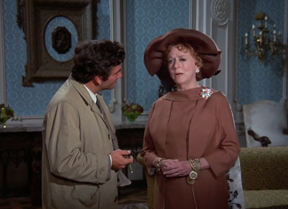

even for an episode of Columbo, I have never seen Lt. Columbo have such an easy time with a case

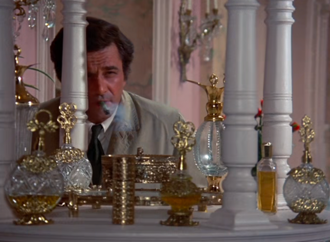

Her boyfriend's mad.

"Ever since you probably didn't kill your brother, you've been a real mouthy broad, making your own decisions and thinking and speaking for yourself. I hate it. "

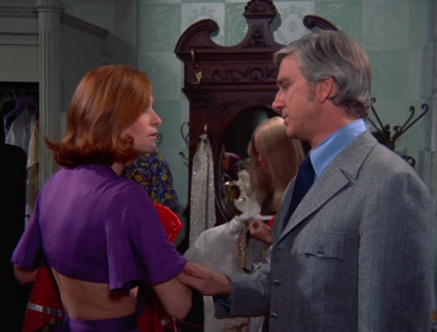

MY BROTHER IS DEAD

I'M IN CONTROL OF THIS COMPANY NOW

BEHOLD MY MOST SERIOUS BUSINESS LOOK

I AM THE CONDUCTOR OF THE SERIOUS BUSINESS TRAIN

ALL ABOARD

TOOT TOOT

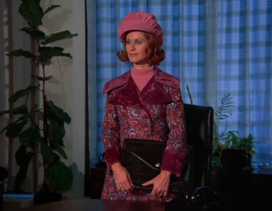

"Mustard, you say?"

"Yeah, mustard. The bulb was just packed full of it. Now what I just can't figure out is, you know, why someone would fill this lightbulb with mustard and screw it in to a light fixture."

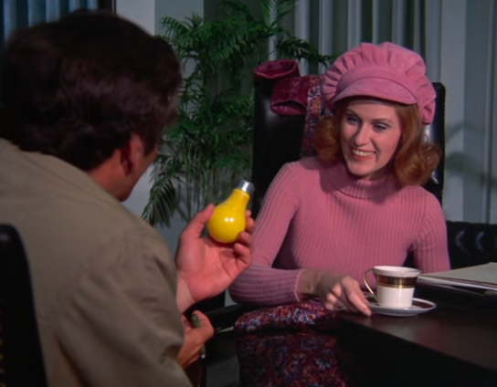

"Well, I just don't know why someone would fill a lightbulb with hot English mustard."

"The thing is, ma'am, I never said that the bulb was filled with hot English mustard - I just said mustard. Now there's a lot of mustards out there - ballpark, honey, stone-ground - "

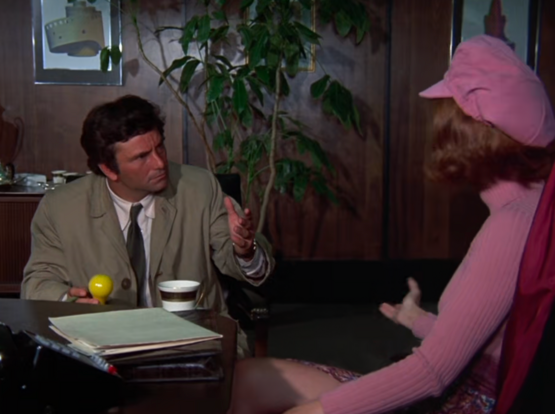

"Man, this has been the dumbest case. We all knew she shot him and had a motive to shoot him from the get-go, and nothing about her story made any logical sense. Plus all of that stuff about the mustard. I sure hope my next one's less ridiculous."

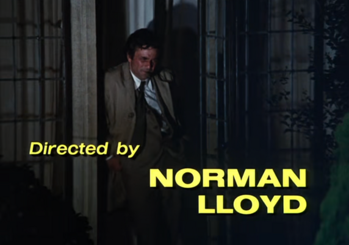

-------

"What's the matter with this thing, what's with all the churning and bubbling, you call this a crime database?"

"No, sir, we call it Mr. Coffee. Want some?"

"Yes! - I always drink coffee while I'm solving crimes, you know that!"

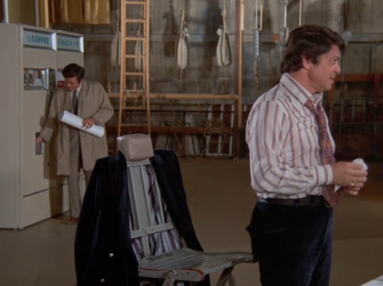

-------

All this intense Columboposting happened on a [late night Mastodon binge](https://mastodon.social/@cube_drone/110682540730549156).