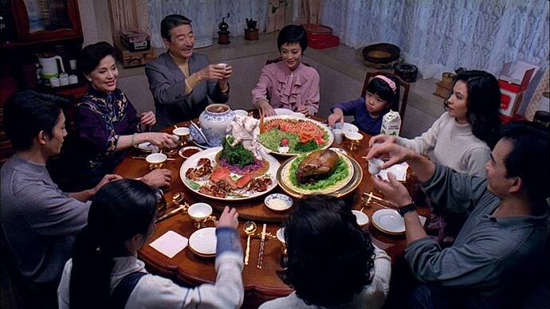

+++
title = "Eat Drink Man Woman"
date = 2023-12-28T12:00:00-07:00
draft = false
categories = ["media", "humor", "food"]
tags = []
+++


<!--more-->

How do you celebrate losing your sense of taste and

temporarily, due to COVID
?

Well, with **Eat Drink Man Woman**, obviously.

I've never seen Eat Drink Man Woman, but I thought I'd watch it 
I don't have a lot else going on, sick during Christmas.
, and...

well, for one thing, I feel like I know just about every beat of this film, even though I haven't seen it before, because it was remade into the American film:

Tortilla Soup is not a _great_ film, it's by no means a masterpiece, it's a _middle of the road romantic comedy from the 90s_.

And _yet_, though. Tortilla Soup is a good movie, dammit. It's unusual. I can't think of a lot of movies like it. Almost as if it's almost a shot-for-shot remake of a beloved foreign film and it keeps a _lot_ of the good qualities of the original.

I've watched Tortilla Soup _quite a bit_.

(It didn't hurt that I had something of a teenage crush on Tamara Mello, who was stunning in what, in retrospect, was the _most 2001 way_: )

## Summary:

Anyways, the story of Tortilla Soup/Eat Drink Man Woman is that single father and professional chef on-the-verge-of-retirement
Martin/Old Zhu
has his three adult daughters living with him, and makes an elaborate meal for them every Sunday. His middle daughter is a working professional, his oldest daugher is a too-religious spinster of a schoolteacher, and his youngest daughter is just _young_.

In each of the movies, this cooking scene - and _every cooking scene in the movie_ - is elaborate and beautifully shot. Eat Drink Man Woman's clocks in at a full 6 minutes of movie runtime and starts with Old Zhu catching, gutting, scaling, breading, and frying a fish. Movie magic is required: the actor's hands are replaced with the hands of an extremely experienced chef, and _you can tell_. Tortilla Soup's is longer but interspersed with a few character-building moments, and each of them ends with an absolutely stunning spread.



> 
>
> you aren't fooling me, actors can't cut radish this perfectly, this quickly, this is _years of skill on display_



Martin/Old Zhu is gruff, but their care for their family is apparent in the love that they clearly put into the grand feast that they've prepared.

The middle daughter Yolanda / Jia-Chien's career is going well and she's leaving home - for an exciting job opportunity in Barcelona / Amsterdam - but she secretly reveals that she resents her father for pushing her into academics when she always just wanted to cook.

Martin/Old Zhu
has lost his sense of taste and smell, and his cooking is just a little off: his middle daughter's sharp culinary sense means that she's the first to pick out little problems in his cooking.

The oldest-daughter, Leticia/Jia-Jen, a teacher, falls in love with a new sports teacher at her school who doesn't appear to notice her. He appears to be sending her love letters, however - although she doesn't know that this is nothing but a cruel prank from her students.

The youngest daughter, Maribel/Jia-Ning falls for a cute, well meaning boy.

A family friend, Yolanda / Jin-Rong, has a school-aged daughter, April / Shan-Shan, and the whole family keeps attempting to set up
Martin/Old Zhu
with Yolanda / Jin-Rong's widowed mother.
Martin / Jin-Rong doesn't seem terribly interested in the whole deal.

At the same time, Yolanda / Jin-Rong is too busy to cook for _her_ daughter, April / Shan-Shan, so Martin / Old Zhu concocts a scheme to trade little tins of his excellent professional cooking for the youngest's lunchables and PB&J sandwiches. He's energized, both by the shared secret and the opportunity to care for a new young woman - as a single father of three, his daughters all being old enough to move out has left him feeling a little bereft of meaning, and this forms his emotional arc in the movie.

------

I hope I've impressed upon you how similar these movies are. Tortilla Soup is _very strongly_ based on Eat Drink Man Woman.

So, the story starts almost identically in both cases, but it diverges a little more in the last half, so I'm going to retell Tortilla Soup's ending, on account of I'm slightly more familiar with it. Be assured that the endings of the two movies are also _very similar_.

Each story comes to a pleasant little resolution:

The youngest daughter is ready to commit a cardinal, mortal sin in the family by _taking a leap year_ to loaf around with her cute new boyfriend rather than going to the university she's been accepted to. He reveals that he had also applied and been accepted to her same university, and instead they can go together.

The oldest daughter is so taken by the beautiful love poetry that she finally makes a play for the sports teacher! Who reveals (gasp) that he hadn't written her a thing: it was her students playing a cruel prank on her all along. She's devastated, but he reveals that he'd been pining after her, too, but just hadn't figured out how to express it yet. It's revealed shortly after in a _real hurry_ that they had to be married _almost immediately_, as the oldest daughter was both "very christian" and "extremely horned up".

And finally, everyone expects Martin to announce his upcoming betrothal to The Obnoxious Widower, and when he stands up to deliver his _shocking and unexpected announcement_ to the room, instead of revealing his betrothal to The Obnoxious Widower... he reveals his betrothal to Yolanda! They bonded in secret over their care for April!

Leaving only the middle daughter, who is in the process of leaving for Barcelona, but just before she goes she decides to cook her father something special. She does, and he eats it, only to bring in a small criticism about her cooking: the serrano is too sharp.

The whole thing comes to a conclusion at the restaurant: now, the middle daughter is the head chef, having seemingly abandoned her job in Barcelona, and the family raises a glass as Yolanda announces that she's expecting - another girl, for the family.

------
## Let's Talk Differences

There are a handful of differences, though:

* Tortilla Soup goes for a few cheap laughs that Eat Drink Man Woman doesn't. In order to be qualified as a "rom-com" you need at least _one_ hi-jink every half an hour or so. The one I remember most prominently is that the oldest sister is "advised" to hide her wrinkles with Preparation H, which she _does_, and it doesn't work (instead: it highlights them and makes them look _greasy_).
* The sisters get along much better in Eat Drink Man Woman than in Tortilla Soup. The sibling sniping in Tortilla Soup is _vocal_, whereas it seems to hardly exist in Eat Drink Man

I'm also willing to entertain the notion that they're being absolutely brutal to one another in this movie and I'm just not
picking up on the subtleties of it, thanks to my cultural blinders, here.

* Youngest sister _barely_ gets a storyline in Eat Drink Man Woman - her whole character is significantly expanded in Tortilla Soup.
* The patriarch is much more of a crabby old crank in Tortilla Soup: Old Zhu is much kinder and more calm and collected than Martin.
* Tortilla Soup resolves the Middle Daughter's storyline a little more effectively, IMO: Yolanda giving up on Barcelona and taking over the family restaurant _is_ a little more satisfying a conclusion to her arc than Jia-Chien going to Amsterdam and just showing her dreams of being a restaurant chef to her father by _cooking real good for him_.
* Middle Sister and Father get more screen time overall in Eat Drink Man Woman. Jia-Chien and Old Zhu are significantly expanded and get more character development (at the expense of screen time for the other characters).
  * This is... largely a good thing? They are the main characters, after all.
* This is a plot point that never occurs in Tortilla Soup: Jia-Chien discovers that her older sister's whole _reason for spinsterhood_ (a bad break-up with a boy) is entirely manufactured (she never dated that boy at all, presumably she was scared to date and didn't want to admit it to her family), but _never confronts her with it_. I'd really like her to have ... asked her sister about this, at some point, but I suppose the point is rendered moot by her sister _eloping with a fella by surprise_.
* Eat Drink Man Woman develops the distasteful widower in a different direction: in Tortilla Soup she's more of a man-hungry cougar, whereas in EDMW she's actively kind of a sour, complainy leech. In both cases, however, it's clear that this would be a pretty grim fate for poor Martin / Old Zhu.
* Eat Drink Man Woman takes more beats to let its emotional content settle. Zhu's growing dissatisfaction at his emptying home, the peace and satisfaction he finds in cooking, his obvious pride at his family, it all hits harder in Eat Drink Man Woman than it does in Tortilla Soup.

idk, watching Eat Drink Man Woman after being overwhelmingly familiar with the adaptation was really nice. I think I might _prefer it_ to Tortilla Soup, which has started to seem a little pat and smarmy over the years.

-----

## Why Do I Love This Movie?

The emotional core of this film is something that feels unusual to me.

Unusual in a good way! How many movies do you see where the theme explored is "this father is sad that his family is no longer reliant on him, and expresses that frustration through stoic culinary excellence, ultimately resolving his feelings by building his family anew, and bigger?"

That's a big, meaty theme with emotional _heft_! Most 00's-era romantic comedies explored no themes and followed a very rigid formula. Tortilla Soup's soul shined through: inside of it was a much warmer and more nuanced story than I was used to.

And, honestly, the throughline of preparing food as an expression of love and care for one's family members? 🥲

Some of the conservative messaging of these movies hit a little weird for me - this movie seems like it would be a staunch favorite with conservative moms of all stripes, as its message is largely "find a partner, have babies". That's fine, though - stories from more conservative cultures can still be good stories.
