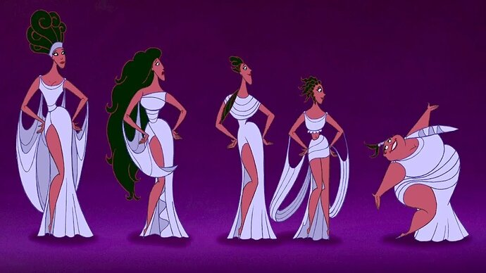

+++
title = "Feed Me, Seymour"
date = 2023-12-31T12:00:00-07:00
draft = false
categories = ["media"]
tags = ["little shop of horrors", "musical"]
image = "./little-shop.png"
description = "watch some old musicals with me"
+++



the parade of musicals-i-havent-seen-yet continues...

<!--more-->

We open on a motown [greek chorus](https://en.wikipedia.org/wiki/Greek_chorus)!



That's a move. I can count on one hand the number of musicals I've watched that actually feature a Greek chrous and the one that most memorably _did_ had the distinction of being a story about _Greeks_.



Oh hey, it's directed by Miss Piggy!

The main antagonist of Little Shop of Horrors is a _big puppet_, in 1986 you're going to _need_ an Acolyte of the Cult of Jim Henson on board to make that work.

This is based on an off-broadway musical, where presumably the puppeting was done live.

It's also - unlike The Producers(2005) - a pretty successful adaptation of a stage musical, which it achieves by virtue of leaning in to the cartooniness and weirdness of its source material.

Some reviews of [Hello Dolly](/posts/2023/hello_dolly/) mentioned how cartoonish and simple the characters were, but... oh boy, it's got nothing on Little Shop of Horrors, which goes _very_ cartoonish and simple for its characters.


Seymour is a clumsy, put-upon nerd.


Audrey is ... a Betty Boop, which is ... just a _weird thing from the past that I'm glad died_.

You know, a high-pitched, naive, sexy idiot.

And finally, Mr. Mushkin is ...



Another weird thing from the past I'm glad we don't see in media anymore, a cheap greedy old jewish man. A [Shylock](https://en.wikipedia.org/wiki/Shylock).

And that's our three primary characters, most of them _ugly, cartoonish stereotypes_.

Mr. Mushkin yells at some black kids (portrayed by full-grown adults) who are loitering outside of his business, which doesn't do much to clear the "ugly racial stereotypes" taste out of one's mouth.



The next 20 minutes is all _set-up_, using some doo-wop songs to establish:

* The shop is poor, and in a bad part of town, and nobody wants to buy flowers here.
* Seymour quietly pines for Audrey.
* Seymour puts an unusual plant (a plant that he found during a _to-tal eclipse of the sun_, which he names Audrey II) in the window, which attracts attention and money.
* Immediately, people start coming in and buying things, but the plant is dying!
* Seymour discovers, by cutting himself on a rose, that the plant craves human blood.



hey, John Candy cameo!

After that, the street kids confront Audrey, who is nursing a fresh injury from her abusive boyfriend (hitherto unseen): why date someone who keeps hurting you? Why not date Seymour instead?

She likes the idea but she's too afraid of her boyfriend to leave him, and sings a song about how happy she'd be with Seymour, **Somewhere that's Green**.



**Somewhere that's Green** is _very good_. Audrey's dreams are really _small_, and that's a good joke, and really sad: she dreams of _not being hit_ and moving out of the city to a lower-middle class life with a _real chain link fence_ and putting _plastic on her furniture_.





There's something so weirdly charming about someone singing an "[I want](https://en.wikipedia.org/wiki/%22I_Want%22_song)" song about something so _mundane_.



The other thing that's noticeable about this song is that... it's **Part of Your World**. Holy shit, whatever hack wrote the songs for The Little Mermaid just... _fully stole this song and made it about mermaids_.

I wonder if the guy who wrote Something that's Green ever got the credit for that.



oh, heh

same guy both times

**Well I guess it's okay for Alan Menken to rip off Alan Menken**.

I also discovered that there's a bit of a cottage industry on YouTube where people just sing _both songs side-by-side_ because they're so similar.



Okay, okay, so what's the problem? Why can't Audrey be with Seymour? Who's this boyfriend who's so scary that he's holding up the whole plot?

And, even worse, he's the nastiest kind of creature alive:

a Steve Martin!



wait, I mean

a dentist!



That's a solid visual gag: the fact that he's a dentist is kept from you for a good bit until you get to the reveal, the punchline: a _dentist_.

He's a relatively bit part in this play, but the character has become notorious and something of a fan favorite: the dentist who's literally a sadist, who sings about how happy it makes him to hurt people.



Which is funny, I think it's _fine_ but I never find Steve Martin _that funny_.

-------

Okay, so, the plant has grown big and strong off of scraps of Seymour's blood, but now it can talk - with the booming motown voice of Levi Stubbs. "FEED ME, SEYMOUR!".



**Grow For Me**, **Feed Me (Git It)**, and **Suppertime** are all forgettable songs about _putting people into that plant_ that happen at one point or another in this movie and they're all pretty interchangeable.

This musical was originally written in 1982, only 2 years after Sweeney Todd: The Demon Barber of Fleet Street, so apparently the early 80's were a real sweet spot for musical theatre about eating people. Who knew?

The plant smooth-talks Seymour into doing a murder on his behalf: obviously the world would be a better place without the dentist, and the Audrey 2 craze is going to make Seymour rich, and famous!

So Seymour sets off with a little snub-nosed pistol to go murder the dentist, but not before we get a scene where ... Bill Murray shows up for a dental appointment.



Bill Murray plays a masochist who's way, way in to dental work.



This is legitimately a very funny scene. It doesn't advance the plot at all, but Bill Murray's excited masochist is _good_. The dentist finds this man's enjoyment _deeply frustrating_ and intends to take it out on Seymour.



but not without some nitrous - but not for Seymour, for the dentist, who has rigged up a contraption to feed him nitrous oxide while he works



Seymour pulls a gun on him and, in the excitement, the nitrous contraption breaks, suffocating the dentist. A totally bloodless kill for Seymour!

Seymour drags the dentist's body back to the plant shop, chops it up, (which Mr. Mushkin _sees_, setting up the next act), and feeds the body to Audrey 2.

Audrey is sad her boyfriend is dead, but ... not really, and that means she can be with Seymour.  **Suddenly, Seymour** is our next song, a love song.



I... I know I've heard this song before, somewhere. It's weird that "Suddenly, Seymour" is the most recognizable song from this musical. Is _it_ borrowed from somewhere famous?

Mr. Mushkin confronts Seymour about his murder, and threatens to take him to the police.



Except, critical mistake, greed takes over and he offers to let Seymour go - in exchange for Audrey II and instructions on how to care for Audrey II. In doing so, he stands a little too close to Audrey II.

wup, _poosh_


problem solved!

anyways, we get **Meek Shall Inherit**, cataloguing some of Seymour's rise to fame and prominence off of the back of Audrey II



But Audrey gets hungry again, and Seymour, unwilling to fuel his fame and fortune with a campaign of ongoing human sacrifice, has a l'il freakout.



_Apparently, in the original 1960s sci-fi B-movie movie that this was based on, Seymour is a little more willing to feed the plant, even tricking some local homeless people into getting 'et, but not in the musical adaptation._

Seymour asks Audrey to marry him and plans to skip town and get out of dodge entirely, which she agrees to, and then he confronts Audrey II with an ultimatum: no more corpses, and he's just going to get _ground beef_.

A prop guy with a vine-shaped stick bonks the store's telephone a bit, and Audrey II invites Audrey back to the store.



wuh oh


Seymour comes back just in time to "rescue" Audrey, but her wounds are too great, and her dying wish is to be fed to Audrey II, to continue powering Seymour's meteoric rise to fame and fortune, with an ironic little reprise of **Somewhere that's Green**.

After feeding her to Audrey II, Seymour has nothing left, only to confront one of the people trying to get rich off of his plant's weird fame.



Hey, I took a cutting and got it to grow! Everyone in America is gonna have one of these!

This is too much! Finally, Seymour has had enough and he's going to confront Audrey II!



Nah, man. In the penultimate song, **Mean Green Mother from Outer Space**, Audrey II just brags and then eats Seymour, too.



Now with a chorus of little sprouts of his own.





So ends Seymour.

With only the greek chorus left, they have to deliver the denouement, the final song, **Don't Feed The Plants**.

Where it becomes clear that humanity did, in fact, feed the plants, lots of them, and now they're rampaging around and eating everyone.



> subsequent to the events you have just witnessed
>
> similar events in cities across america
>
> events which bore a striking resemblance
>
> to the ones you just have seen, begin occurring
>
> ooh
>
> subsequent to the events you have just witnessed
>
> unsuspecting jerks from Maine to California
>
> made the acquaintance of a new breed of flytrap
>
> and got sweet-talked into feeding it blood

And the whole thing ends with stop-motion carnage as big plants rampage through various cities.



They make sure to smash this famous Harryhousen reference to let you _know_ that they're doing stop-motion.





And that's it, after about 10 minutes of the plants laughing and smashing around, the movie ends with them tearing out of the film screen to eat you, the _audience_.



------

Anyways, that was certainly better than _Hello Dolly_.

------

Oh! I'm just now learning that what I watched was not even the original ending of the movie: from 1986 through 2012 - so, for some 26 years - the original theatrical cut of the movie had a quickly put together happy ending where Seymour and Audrey _live_ and escape to the suburbs.

Audrey's bite is non-fatal, I guess, and she spends the rest of the third act watching from an apartment building window (because that's easy to splice in after the fact). Seymour manages, at the last minute, to plug Audrey 2 into an 120V household outlet.





Instead of "Don't Feed the Plants", we get a short orchestral reprise of "Suddenly Seymour", then "Somewhere that's Green" as they get married and move into their tract house.



And in the garden? A little Audrey 2.



Much shorter. Happy ending.

The violent, tragic ending **that I saw** cost _$5 million dollars_ to produce and was one of the most expensive sequences ever filmed in Hollywood up to that point, and it performed _just terribly_ with test audiences.

They tried it with a few different test audiences and each time the results were the same: interest in the movie was high until Seymour gets eaten, and then the whole theatre was just stone cold shocked silence for the whole last 10 minutes.

There are a few reasons why the Bad Ending did so poorly in test screenings: partially, (in my opinion), because the film (different from both the musical and the original B-movie flick) pulls **all** of its punches vis-a-vis Seymour actually making bad decisions or being a bad person - the dentist and Mr. Mushkin's villainy are both wildly amped up and their deaths are both _partially their own fault_. Audrey 2 basically feeds himself!  Without Seymour gradually getting on board with murder, even a little carried away with murder, the tragedy doesn't feel as _earned_.

The other reason - this is what Frank Oz claims - is simply that it's a lot harder to do a sad ending in Hollywood than on Broadway, because you don't get to see the actors come out and do a bow afterwards. They're just _dead_.

They lost a lot of the masters for the original $5 million end sequence, and the one that they eventually released for the director's cut in 2012 had to be extensively re-worked to get it back into viewing condition.

Apparently _nowadays_ the grimmer, bloodier, weirder, more cynical "everybody dies" ending has become the more popular ending. So what I saw was the movie's original intent, anyways!