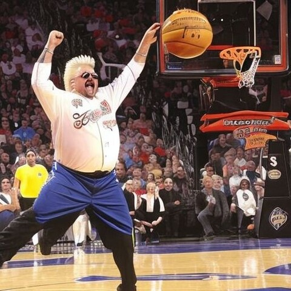
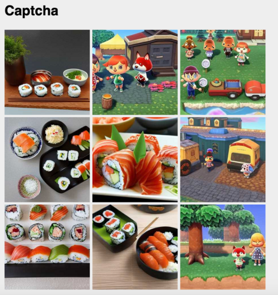
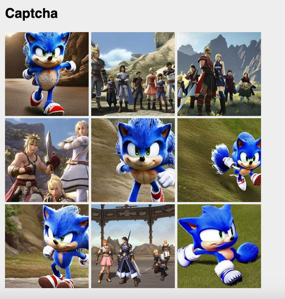
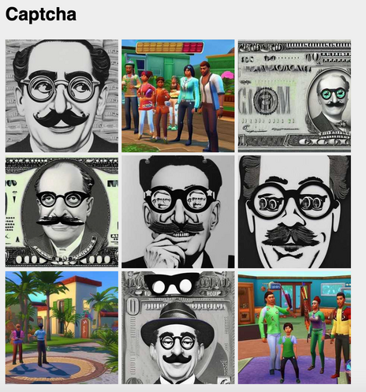
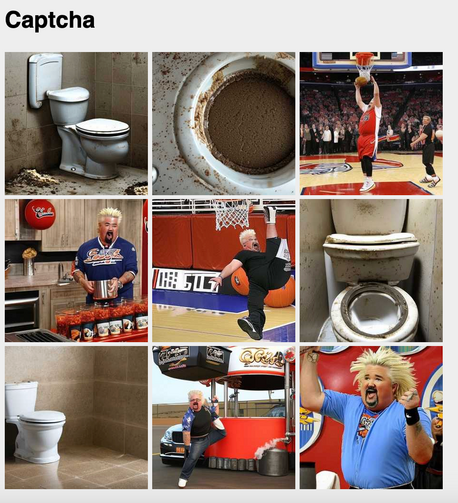

+++
title = "generative captcha"
date = 2023-04-08T11:00:00-07:00
draft = false
categories = ["software"]
tags = ["AI", "captcha", "guy fieri"]
+++



So, I decided, "how hard would it be to build my own CAPTCHA?", but instead of showing people boring trains and crosswalks, I could generate the dumbest possible categories of things.

<!--more-->

> 
> find the JAMES BOND EATING CAKES

> 
> find the MILITARY INDUSTRIAL COMPLEX BARBIE

> 
> find the OLD WOMAN FALLING DOWN A STAIRCASE

> 
> find the GUY FIERI DUNKING

It actually works pretty well - like, I bet you, a human, could look at each of these four sets of things and easily divide them into two separate categories, right?

--------

**Editor's Note:** I have at best limited belief in the usefulness of CAPTCHA nowadays, and also this scheme unfortunately would also keep out any blind or visually impaired users, so it hasn't been widely rolled out.