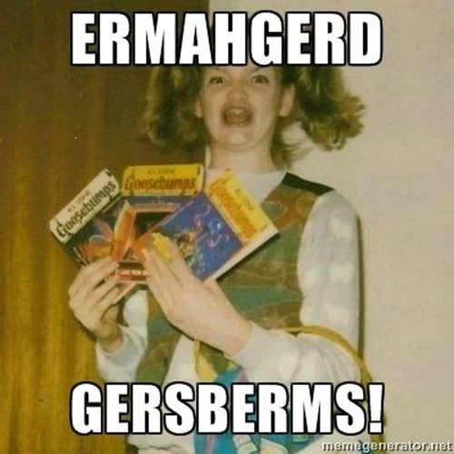
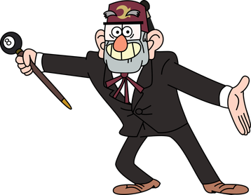
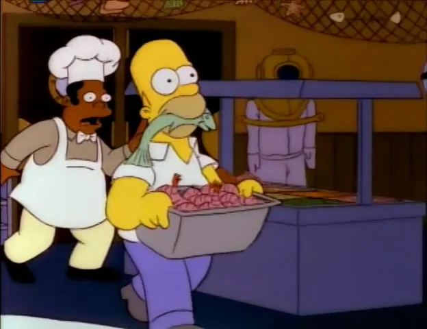
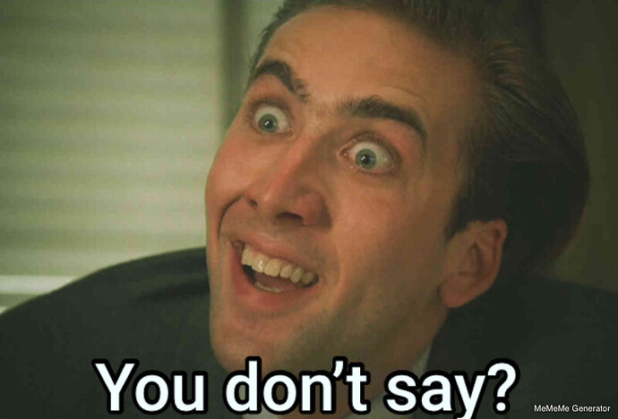
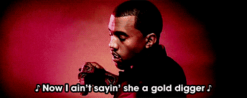
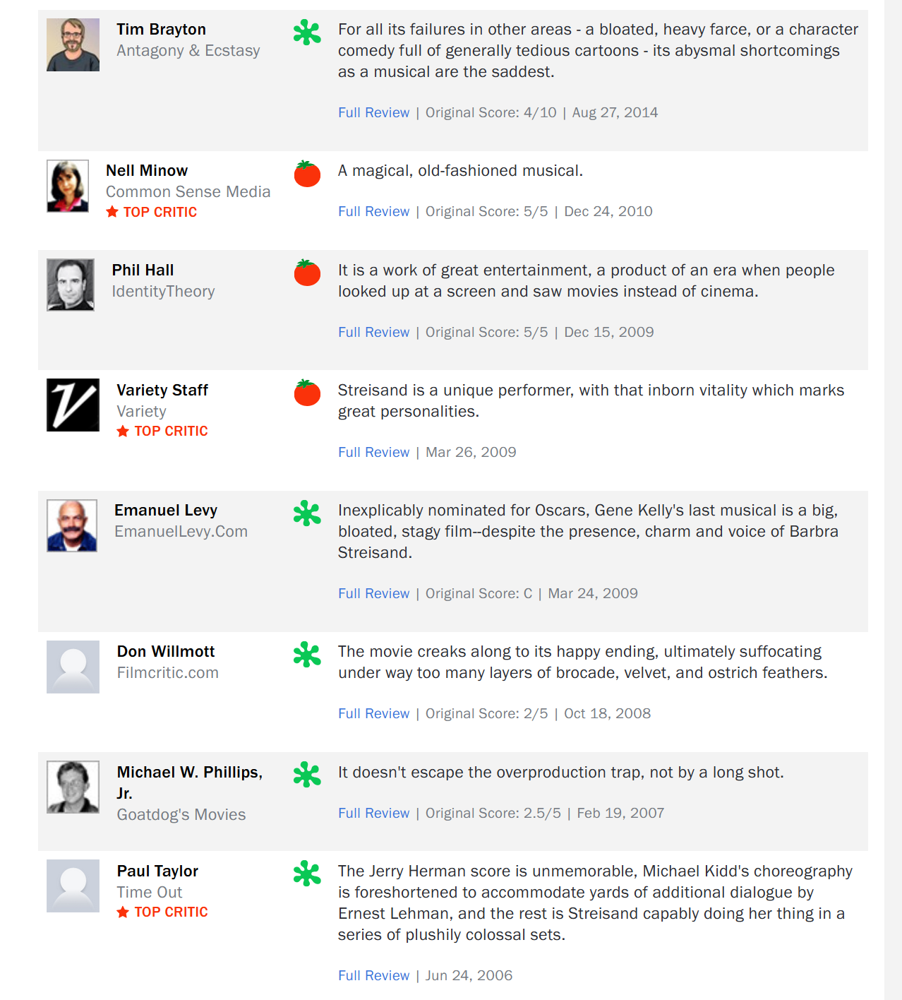

+++
title = "Hello Dolly"
date = 2023-12-30T12:00:00-07:00
draft = false
categories = ["media", "humor"]
tags = ["hello dolly", "wall-e"]
+++



<!--more-->

Okay, so, I know Hello Dolly from two places:

1. For its reputation as a film that nearly bankrupted Fox and heralded the end of the [big roadshow musical](https://bayflicks.net/2020/11/30/big-roadshows-of-the-50s-and-60s-mostly-the-60s/) as a profitable endeavor.

and

2. (and much more prominently) **Wall-E**



[Wall-E's director, Howard Stanton, explained that he chose Hello Dolly because he was looking for interesting, antiquated human cultural detritus that Wall-E might find in the garbage, and because he had played Barnaby in a high-school production of Hello Dolly.](https://ew.com/movies/2018/06/27/wall-e-anniversary-andrew-stanton-hello-dolly/)

>  "I turned to my wife and I said, 'I think I have the strangest idea I've ever had.' Once I had it in my head, I couldn't drop it. I had to try it. I just kept waiting for it to fall apart. There were so many reasons why it wouldn't hold. It was so incongruous that it was attractive, and so we worked it into the story."

So, _Hello Dolly_.

Review: faintly negative. Gosh this is a slow, plodding musical.



The first musical number, **Call on Dolly/Just Leave Everything to Me**, is good: it's a high-energy dynamic musical number introducing Dolly, this domineering, dishonest, fixer of a woman with a business card advertising her services for any possible situation you might encounter. Also: not super familiar with Barbra Streisand's _ouvre_, I think the most I've actually seen her in one place at one time is in the music video [Barbra Streisand](https://www.youtube.com/watch?v=wWhtcU4-xAM).



> if you want a law abolished, jury swayed or toenails polished, just leave everything to me
> if you want your liver tested, glasses made, _cash invested_, just leave everything to me

Okay! Interesting dynamic character with a lot of possibility! I'm excited! Maybe this will be good!

Also, Dolly having a business card for everything is a running joke that's called back to at least two more times in the show, which is _excellent_.

Then a ... fully four minute long credit sequence. It's like they want us to experience Dolly's journey from New York to Yonkers in _real time_.



I don't actually mind these sluggish montage scenes because when I'm watching musicals I'm usually _also coding_ and they're nice enough as background content, but if I had made the mistake of devoting my full attention to the movie I'd have _died_. (this goes for The Sound of Music, too, great "coding" movie, but if I tried to watch it on its own _I_ would be the one coding)

In our next scene we introduce Walter Matthau, Walter Matthau's consistently being called a "half-a-millionaire" throughout the movie is a solid joke., being a hot dick to literally everyone in his life.



Starting by insisting that his daughter, Ermahgerd, is not to marry this artist boy.

... Did... did I get her name wrong?

Nope, there it is.

Then he denies a raise or any time off to his two clerks, Cornelius and Barnaby, while also insisting that "28" is a stupid age to be, and that "40" would be a much more respectable age.



Horace sucks. I get it, he's supposed to be an old crank, but _oh boy_ is a lot of this musical going to revolve around Walter Matthau being a grump. The framing of the whole show is, I think, trying to make him out to be a "lovable grump" - it's okay that he's a miserable old crank because that crankiness is a funny schtick.

> 
> pictured: a lovable grump done well

Folks in the 60s were, I think, a lot more on board with watching Walter Matthau try to extract comedy out of being sour and cranky.

Then he gets the worst song in the entire movie, **It Takes a Woman**.



This doesn't even have the common decency to be a villain song. **Misogyny: The Song** is intended to be a comedy song: Horace wants to marry a woman because he wants free labor for chores, and so the song emphasises the softness of the woman he intends to work like a horse.



> And so she'll work until infinity
>
> Three cheers for femininity

Charming. 🙄

I get that this is intended in a tongue-and-cheek "well, _obviously_, we're less shitty to women in nineteen-sixty-something than they were in eighteen-ninety-something" but **ho boy**. This joke _drags_ and it's carried on the back of _Walter Matthau's singing voice_.

Anyhow, Dolly (who wants to marry Horace, because he's rich) shows up just in time to intercept Horace on his way back to New York where he intends to propose to a milliner named Irene.

Dolly begins a series of _devious plot machinations to sabotage things_: she convinces the stockboys, Cornelius and Barnaby, that they should seek adventure in New York and that they should seek it _at Irene's hat shop, at exactly the same time that Horace plans to stop by_. She also convinces Ermagerd and her Boy to meet her in New York later for dinner where she'll fix everything for them, too.

Christ I hate Cornelius and Barnaby, their whole "pie-eyed naif" schtick is just _agonizing_. Holy cabooses!



However, that does take us to **Put on Your Sunday Clothes**, the third musical number and the one most prominently featured in Wall-E, because it is _the best song in the entire movie_, and also the sort of thing that's absolutely chilling when played over a slow pan across a post-apocalyptic wasteland:



Uncontroversial opinion: _Wall-E is a much better movie than Hello Dolly._

I'd thought that this was mostly just a Cornelius and Barnaby song, but no, _everyone_ is going to New York - Dolly, Ermagerd, Horace, Cornelius, Barnaby, and _the entire town of Yonkers_ all join in, both in the song and the trip.





this is one of those "non-diegetic movie moments": the entire town of Yonkers _isn't actually going to New York_ probably, but it's a funny way to end the scene.

------

Okay, enter Irene, a young milliner who, paralleling Cornelius, tries to convince her young friend to have an adventure with her. Flirt with some stupid boys. Do something that's more fun than making hats endlessly.



If there's one thing I've learned about eighteen-ninety-something its that apparently making fancy hats is a total bummer.

> 
>
> man, this fuckin' sucks



Irene gets a song, **"Ribbons Down My Back"** which I forgot immediately. All it does is re-establish the themes she's _literally just established_: Irene is bored and horny (but in a classy, romantic eighteen-ninety-something way).

And then some boys show up. They're terrified, and Irene does her best not to scare them off.



Dolly shows up with Horace. Oh no! It's eighteen-ninety-something! If Irene seems the kind of woman who's just _hanging around unaccompanied men_
she'll be totally unmarriagable!





_god, these two are exhausting_

Dolly engineers to reveal to Horace that there have in fact been two _men_ here just recently: gasp! The impropriety!



Horace is so disgusted by the idea that Irene might have had _men in her shop_ that he storms off in a huff.

Dolly does more _dark pattern social engineering_, pretending that Cornelius is rich and influential and setting him up with Irene, setting up Barnaby with that girl who was hanging around behind Irene, and arranging for them all to meet up at the _same restaurant that she invited Ermagerd and Her Boy to_. Later, she'll invite Horace to the same restaurant along with a mock heiress as part of a _scheme_. Wow, that restaurant scene sounds like it's going to be a real doozy!

... okay, I'm going to level with you: that restaurant scene is fully 45 minutes away, and *nothing of interest happens between now and then*.

I'm sure someone at some point has pointed out that the entire middle hour of this two-and-a-half-hour film is almost entirely unnecessary, but I'm discovering it now, for myself.

Yes, the story has been moving along at far too much of a clip, so it's time to _waste some time_.



Cornelius and Barnaby can't dance, so Dolly has to show them how, in **Dancing**.

This gives us a lot more of their squeaky, high-pitched, nervous teenager energy, which is just awful.



Have you ever thought "I wish the pimple-faced teen from the Simpsons could do a bunch of musical numbers"?


"Look! He's dancing!"

The large musical interlude cannot be contained, and they take it to the streets, getting half of New York involved in these dance lessons.



Huge dance number.

> 
> jesus, guys, take it down a notch

Don't worry, though, now we get **Before the Parade Passes By**, an extended song where Dolly cops to being _lonely, too_.

> 

I think this is intended to establish some humanity for this woman who has hitherto come off as something of a bugs-bunny-esque trickster demon, with the problems that:

* God, it's long, that could be established with a sad look here or there much more _quickly_.
* She's angling for _Horace_, who, as we've established, is an absolute trash-tier beau (aside from his money).
* She absolutely _fog-horns her way through this song_ and establishing emotional vulnerability through MAXIMUM BELTING is not always so effective.

> 
> 📯📯📯

Then there's an actual parade.



It takes for-fucking-ever.

the movie takes a beat to make the joke that suffragettes were grim and stern and horse-faced, which, uh, _great_.



I little bit of plot happens: she knows that Horace is going to be at the parade and uses this opportunity to both invite him to a dinner with a mysterious heiress and meet up with a friend who she plans to use as her mock heiress.

Exhausted? I am too, but we're only at the...



-------

Five minutes to get popcorn and stretch your legs.

-------

We come back a few hours later: in **Elegance** the boys come to pick up the ladies, but they're poor as shit and attempt to convince the women that aperitifs and cabs are tacky, and that true elegance is established **not by** drinking expensive cocktails, but instead by _walking for hours in high-heels_.



Their subterfuge is paper-thin and the girls just go along with it cheerfully: but there's an eventual and kind of obvious reveal teed up: Irene is _not at all fooled by these boys_, and, in fact, just likes hanging out with them, even though they're visibly and obviously poor.

So they gradually stroll to the restaurant pretending that the height of elegance is _whatever the boys can afford or steal_ which is _not much_.



This is actually a pretty solid comedy song, although it goes on for a _while_.



> Snubbing folks - is chic to us
> Sometimes we don't even speak to _us_
> If you ain't got elegance
> You can never ever carry it off

Oh boy, now it's time for **Love is Only Love**, a song where Dolly expresses some loneliness and vulnerability again, although this time she tones the belt down about 10% so it's marginally softer.



Look, we get it, lady.

She establishes the small additional detail that she's reluctant to fall in love again without some kind of sign from her dear departed first husband, which is a plot point as stupid as it is easily resolved later on. Her whole goal throughout the film is to marry Horace _by any means necessary_ but _what if she doesn't get a sign from her dead husband?_

Yes, this woman with _crystal clear motivation_ and _enormous amounts of drive_ might not even want the thing she's spent the last 90 minutes pursuing with such ferocity that you'd be wholly unsurprised to find literal blood on her hands. _such conflict_. 🙄



finally, the big restaurant!

the head waiter and Dolly’s fake heiress argue a bit to establish that they both exist:



he’s stuffy, she’s pretending to be the worst person alive.

Everyone’s seated, which takes another 5 minutes, at which point the kitchen discovers that Dolly is incoming.



apparently, from her first marriage, Dolly has made for herself a real reputation at this restaurant: she's beloved for her _enormous appetite_.

This sounds like I'm joking. I am not joking.

Everyone on staff is so enormously fired up by the prospect of serving _Dolly, the hungriest woman on the planet_, that they need to do a big choreographed dance number about it.



> 
> christ, how much can Dolly _eat_?!?

Cornelius reluctantly reveals that he's poor as shit and won't be able to pay for dinner.


Irene reveals her own terrible secret:

She obviously knew the whole time, and was planning to pay for the night herself.

But - oh, whoops - she forgot to bring her wallet, so now they're all in a _minor pickle_.



Fake heiress gives Horace the brush-off as rudely as possible.

Dolly strides into the restaurant with **Hello, Dolly**, the second major musical number devoted to the concept that _this restaurant is very excited by a hungry woman_.



She used to be rich and there is _money to be made_.

> 
> this lady put our kids through college
>
> boy can she put down a ham dinner

she's friends with the band, too, including Real Actual Louis Armstrong.

> 
> "I hear one time you shotgunned an entire turkey."

The restaurant repeats "hello, Dolly" at her in singsong for _12 entire minutes_.

That's right, you could fill an entire 22 minute sitcom block with just musical numbers where the restaurant is excited by how much of a _heavyweight customer_ Dolly is.

This also helps to establish _why_ Dolly needs Horace so much: _someone_ needs to pay for these extravagant meals and her ex-husband is clearly too dead to foot the bill any longer. Such romance!

> Ok, Horace, after two completely botched dates, are you ready to finally marry me, Dolly, the woman who's very clearly been chasing you this entire time?
>
> 

> 
> "fuck no!"

"oh, good, my **entire goddamned turkey** has arrived. here, you eat my beets."

"_i don't like beets_!"

> 
>
> I bet you thought I was joking about how much of the last half of this movie is about how much food Dolly can pack away, but lo, proof: she ordered an **entire goddamned turkey**.

I'm not sure if it's romantic that these two people deserve each other just because it's funny to watch Dolly torment Horace.

Anyways, the kitchen is so excited by this woman who can eat an entire turkey to herself that they make her the honorary judge for tonight's dance competition.

> 
> leave me be with my turkey, you vultures

It just so happens that the prize for tonight's dance competition is $50 - exactly enough so that Cornelius and Irene can pay for dinner!

So, uh, earlier, Dolly invited Ermengarde and her beau to _also eat dinner here, at this same restaurant_, and I cannot for a single second imagine how that factored into her scheme. In fact, she seems to have invited everyone to this restaurant simply because the _plot requires that it happen_.

This whole evening start to unravel, as Horace notices both his daughter Ermagerd and his two shop clerks on the dance floor.

He throws a hissy-fit and _also some pies_, creates a _scene_, and fires _everyone he can_.




_everyone wants to marry this man he's such a dreamboat_

The distraction afforded by the scuffle is enough for most of the freeloaders to escape the restaurant without paying their tabs.

Cornelius takes this opportunity to sing **It Only Takes a Moment** to Irene, establishing that he fell in love with her _immediately_ and without _even a single thought troubling his empty head_.



Irene remains _inexplicably in to it_. Life as a milliner must be rough, that this dweeb is the height of excitement.

> 
>
> There's no close-up of them holding hands in this scene. That's notable because a [sharp-eyed redditor](https://www.reddit.com/r/MovieDetails/comments/oy6wwb/in_walle_2008_the_version_of_hello_dolly_1969/) noted that a close-up shot of them holding hands in this scene was a major plot point in Wall-E, which means that **the Wall-E team must have added it to Hello Dolly**. (Which would be necessary: hand-holding is plot important in Wall-E.)

This is the other song that's used in Wall-E, just the very last bit.

Honestly, mostly watching this movie just reminds me that "Wall-E was very good".

Storming out of the restaurant, Dolly sings **So Long, Dearie** to Horace, emphasizing that he's a miserable, shitty old crank and that she's better off without him.



_many minutes of scenery chewing from Barbra Streisand ensue_



to be entirely honest this would be my preferred ending to the movie. Realizing that Horace sucks and telling him off with a big song then leaving with a grand fuck-you after setting up Cornelius with Irene and helping Ermagerd escape with her boy? **Good ending**.

But no, there's one last scene, the next morning.

"Aw shit, nobody's left for me to verbally abuse."



"We're all here to tell you that you suck, and you can't fire us because we quit."


"Also Dolly's here. Apparently that goodbye-and-fuck-you was nothing but smoke."

I mean, he's awful, but there's just _something_ about him that keeps Dolly coming back -



Horace, warn down and exhausted by Dolly's _brutal campaign_, finally relents.



But she's not sure if she wants to marry him - she needs a sign from her dead-husband, remember? Anyways, he, offhandedly, says something that _dead husband_ used to say, and that's resolved! Wows! That was such an ill-conceived and easily resolved plot point!

Story over!

Now, to close out the show, there's a reprise of each of the show's major songs as we cruise up to Horace and Dolly's elaborate wedding.





Dolly's back in restaurant money! Turkeys for everyone!

----
## Thoughts, Feelings?

... I guess it's a big fun musical? Not a lot happens.

I honestly think there's a pretty great 90 minute film in here. Cut out most of the entire middle hour, trim a few minutes out of each of the songs, and leave Horace lonely and alone in New York, and call it a day.



I don't like that Horace gets "redeemed" despite being nothing but an irritated, chintzy sourpuss for the movie's entire runtime. I know it's supposed to be endearing but it's _not_.

Cornelius and Barnaby's "deer in the headlights" approach to romance and high, squeaky voices are... just the worst.


And maybe the restaurant dance number could have been, like, 2 minutes long, rather than _six full minutes long_.



That might just be me applying modern standards to ancient films, but it doesn't seem like this did so well in 1969, _either_.

It's not _terrible_. It's not great, either.  The Rotten Tomatoes score of 45% is a solid spot for it, with one's opinion of the movie apparently largely hinging on whether or not one is excited by the prospect of Barbra Streisand chewing the scenery or an absurdly opulent dance number.

One thing I _do_ kind of notice in these Music Man / Hello Dolly era musicals is this kind of weird _reverence_ for the late 1800s as an era.

I think there's something distinctly conservative about portraying the past as a kind of rosy, idealized place where the women are virtuous and the men always wore suits and were so chaste as to be terrified to even kiss a woman.



Where the biggest problems are children playing _pool_ and _sassing their parents_ and good, god-fearing citizens are easily taken by local hucksters.



I don't know why musicals of the 1960s _so badly wanted to live in this pat, cartoonish idealized past_.  I guess it was a real contrast with all of the dangerous, scary stuff that The Teens were up to in the 60's.



Anyways.

Hello Dolly.

Is a movie. I watched.