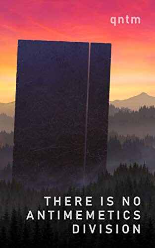
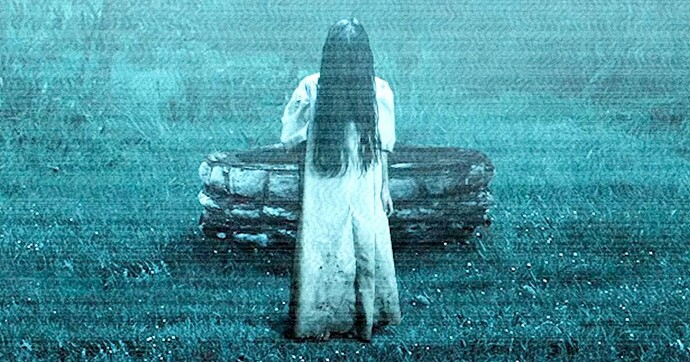
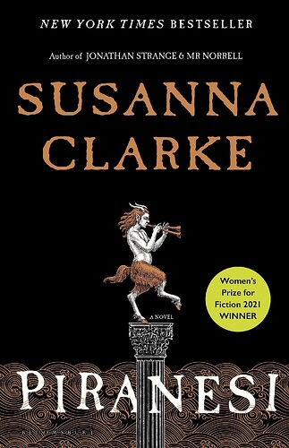
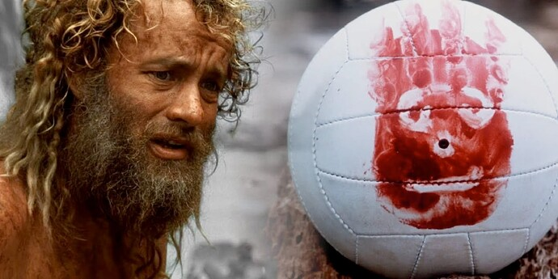
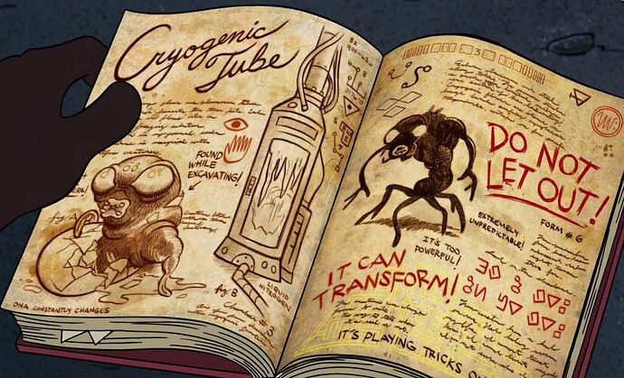
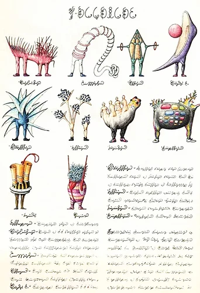
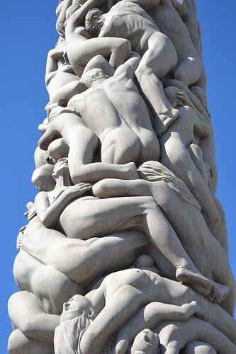

+++
title = "Vacation Reads"
date = 2023-05-15T12:00:00-07:00
draft = false
categories = ["books", "science fiction", "conspiracy"]
tags = []
+++

Through no fault of my own, I've accidentally stumbled into a themed reading list. It wasn't on purpose, but definitely my last three books have explored themes of _memory_, _belief_, and _hazardous information_.

<!--more-->

I'm going to keep spoilers _light_ but I'm not going to do away with them entirely - like, "first third of the book" kinda stuff, no big reveals. (_I think that's an okay spoiler policy in general: I want to be able to say enough about stuff to get you on board with the premise without saying so much that it ruins the reading_)

## There Is No Antimemetics Division

### What's It About?

Have you heard of [The SCP Foundation](https://scp-wiki.wikidot.com/)?

That might take a little bit of background on its own: The SCP Foundation is a wiki online, est. 2008, a shared collaborative online writing project where a team of core contributors and a bunch of fans have collected and curated a bunch of horror short stories, each written in the "house style" - and the "house style" of SCP is that your average story is written in the format of a paper database entry concerning the containment and ongoing management of some supernatural threat.

SCP launched _well before_ Cabin in the Woods, but they're essentially stories told from the point of view of these guys:

These scientists are generally complex, nasty, morally grey characters willing to do and/or sacrifice just about anything in order to keep these nasties contained - because you never know when the knowledge you gain from Nasty 238 (Class: Euclid) is exactly what you need to save the world from Nasty 941 (Class: Keter).

As I tend to do when I encounter a deep bin of online lore, I've read ... _a lot of the SCP wiki_, although mostly the earlier stuff in the lower-thousands files before it all took off in popularity.

This is important background because "There Is No Antimemetics Division" is just a collection of SCP stories, gathered, presented, and edited, to tell (in a way that's a little disjointed) the overarching tale of one specific department within the SCP, a department that _nobody in the SCP foundation knows about_, because _knowing about the department is a memetic hazard_.

This is the Antimemetics Division (and, correspondingly, the Memetics division), a group of people confronted with informational hazards.

The Ring is a sort of informational hazard: simply by watching the video you trigger the curse, and will die in 7 days - but the stuff that Antimemetics works with is more potent than that, where even _knowing about what they're containing_ puts people at risk.

So, a lot of the containment procedures have to do with _memory manipulation_. Mnemonic drugs, Amnesiac drugs, and lots of 'em.

Unfortunately, this leads to a lot of, uh, bureaucratic difficulty, as every other department of the SCP and most of the Antimemetics staff are constantly forgetting and re-remembering that they exist, which also leads to a, uh, _somewhat disjointed narrative_.

Most of the senior agents are _constantly_ living through a sort of [Memento](https://en.wikipedia.org/wiki/Memento_(film)) existence where they're rebuilding their lives from scratch, having recently forgotten either _something that they forgot, on purpose, in order to keep themselves safe_ or _something that's eating their memories, and if they don't remember it soon will kill them_.

And that's kinda the core problem with being an Antimemetics agent: sort of as a logical extension of the premise, they've always _forgotten something crucial_ and either:

* "they must force themselves to remember it OR ELSE THEY WILL DIE" **or**
* "they forgot it for a good reason" **or**
* _"both"_, which creates a constant loop of scrambling to forget and then remember key memories.

Anyways: a collection of short stories set in this universe where a variety of characters memento their way through a variety of informational hazards, including a huge and apocalyptic Arc that runs through the lot of the stories.

### Thoughts

* Short. At ~200 words, you can finish it in two sittings.
* A compelling read, overall, I did power through to the end to figure out what happens. High stakes.
* Between the subject matter (everyone constantly forgetting everything) and the presentation (short stories), this book is *necessarily* chaotic and disjointed. This wears out its welcome pretty quickly.
* I'm already familiar with SCP lore, but I feel like this book would be a _really bad entry point_ into SCP stuff because the whole thing already assumes you've been onboarded with the basic SCP concepts and the premise precludes much in the way of explanation. That being said, this particular division is so separate from the rest of the lore that it's not too important to be up-to-date with the rest of the universe, which is good.
* This is never outright stated in the book, but since memetic hazards are either _crucial to remember right now or you'll die_ **or** _crucial to forget forever or you'll die_, a lot of this book is spent on the treadmill of re-re-re-remembering things only to remember that you were supposed to forget them.
* If only there were a better way
* the SCP and [The Laundry Files](https://en.wikipedia.org/wiki/The_Laundry_Files) have been things I've liked lately, which makes me think that "shadowy government department tasked with cataloguing and managing horror" is a surprisingly high-ranking genre for me. Maybe I should go back and watch The X-Files, I've never really seen it.

## Trust the Plan

Dan Olson's hour-long documentary on flat-earthers, "In Search of a Flat Earth", takes a surprise twist half-way through: it was actually about QAnon the entire time!



That is to say, Flat Earth appeals to the conspiratorially minded, but QAnon has been rolling through conspiracy circles, a "big tent" conspiracy theory that rolls other conspiracies into it like a big ol' Katamari of crazy, which has allowed it to achieve a shocking amount of _size_ and _influence_ for what is, essentially, a mixed-bag collection of utter gibberish.

Like many others, I've always been fascinated with looking at _wacky cults_ and _insane conspiracies_ from a safe distance. It's, like, up there with "true crime" as a topic of broad public interest.

Will Sommer's book is just... a lot more reporting on the QAnon phenomenon ("QAnon phenomenon" is a solid tongue twister), including some sad stories of people losing their family members down the Q-hole and some _bananas_ stories of what Q followers have done in the name of their mad cult.

## Thoughts

For such a wild and wacky topic, it's kind of a boring read. Anybody already familiar with the basics of "what QAnon is" and "what sovcits are" and "what pizzagate was" and "who is Romana Didulo, Queen of Canada" is not going to find much new information in his book.

It's a decent primer for people unfamiliar with the topic but if you're Extremely Online there's not much new or interesting here - and if what you're looking for is _lots of juicy nuggets of crazy to chew on_ it's a little too dry and clinical to provide them in their full force.

To be honest, I feel like Dan's video up there ^ covers the topic as well or better, in a much shorter time.

## Piranesi

Another tight 200-page read (these short novels are making me feel very productive on my vacation, look at how many BOOKS I can read), Piranesi is another amnesia tale.

Piranesi is a feral human, living on fish, in a giant, endless, half-sunken labyrinth of big statues and old architecture, who can only remember the last 6 years or so of his life.

Like Castaway if Tom Hanks _didn't remember being a deliveryman_

Piranesi is also happy and quite uninterested in solving the puzzle of his confinement or lost memories, which leaves much of the book's early sleuthing up to _you, the reader_, as he happily grabs a clue, reads it over, and then discards it because he's found a pretty shell or some shit.

It's a divisive book because some people can't stand having a viewpoint character who _just wants to tell you about shells and birds_ and can't seem to be bothered with the central puzzle of the whole story, but it's **not a long read** so _be patient, geez, this is going somewhere_.

The puzzle comes together eventually and you learn all about the [SPOILERS REDACTED] and how it fits together - and I found that _very satisfying and good_.

This book also leaned into one of my favorite horror tropes: where the supernatural horror isn't "malicious" or even "evil", it's just kind of an unusual, dangerous natural phenomena and the story is about doing science to it. Which also often crops up in SCP and The Laundry Files.

## Tiff's Thoughts on Piranesi (Piranesi Spoilers):

_ed: I'm swapping you over to my wife's POV for this next segment: imagine me becoming suddenly much more pleasant and intelligent_

I found Piranesi a fascinating read, but I can see why you would say it is divisive. It’s the kind of book that I wouldn’t recommend to someone without knowing their taste a bit first, because indeed, it’s not intending to walk you through the final details of its philospphy and leaves a lot of the bigger mysteries unresolved.

Remember when I gave Brandon Sanderson a try, and found that he was kind of formulaic? (the bad guys are dressed in black spikes, there is a male and a female lead, and they will fall in love by being in proximity to one another, the good guys win-but-not-without-sacrifice, we all learn a valuable lesson in the end, padded with fantasy tropes) The redeeming qualities I found in the Sanderson books (i did Elantris and the Mistborn trilogy) was the depth of his world-building, his lets-tie-up-these-loose-ends approach to his various arcs and his deep and thoughtful approach to his magic-systems. He wanted you to know the rules of his magic, understand it, almost feel like it wasn’t magic, but a natural system like gravity, that had rigid parameters you could learn, follow and formulate. Mistborn’s very developed magic-needs-metals system was super cool, and I very much nerded out on the idea of keeping various metals and performing alchemy to have the needed components for the spells you wanted. It was a cool idea and it felt the opposite of tropey, in that I have yet to encounter before or since, such a unique take on magic.

Piranesi is doing both and neither of these things. Like, the world-building is evocative, considered and unique. It’s not something I’ve ever heard of before, or are likely to encounter again.

An amnesiac wandering through endless white rooms and vestibules of beatific greco-roman statues depicting all the ideas of mankind, where only birds may join you and your only path there is descending into pre-rationalized thought…

This is not a story even remotely predictable or similar to anything I have ever read, and that in itself is refreshing, as a voracious media-ingester, to find something so wholey unlike the dozens of other sci-fi and fantasy and quasi-scientific books cluttering my e-reader.

However, you will not find that same detail applied to the “systems of magic” that I so admired in the Sanderson books. If you are looking for concrete answers, well, so are the scientists in this book, and this books is the retelling of how they failed in that respect. You don’t get a ton of answers, and that ellipses on what feels like a bit of the meat of this story, left me vaguely unsatisfied. I think i like “hard” fantasy and sci-fi so much because I am pedantic, and even more so since working full-time as an environment artist. The “why” of things is important in my job, and we are constantly being told to justify our additions (the rim lighting is HERE because our Time of Day is X and Subsurface Scattering happening on Y should make it look Z.) and also told to remove the superfluous. And so the unresolved bits left over in the end, gave me some unease, searching for meaning in things that the author never bothered to explain or revisit.

- why could only birds get there from the real world?
- why did it cause the people inside it to lose their memories?
- were the halls infinite, and ever-expanding, sort of an allegory for the universe or finite?
- where does the sea in the halls come from and what guides its tides? is it an Earthen sea, did it come from whatever is creating the rooms, or was it a natural phenom that the rooms are built upon?
- how did each and every one of the 13 bodies end up in the rooms? (we have a handful explained, but the origin of The Folded Child or The Biscuit Box man were left largely unexplored or explained)
- if the scientist exploring these worlds could routinely return to them, along with photographic evidence, why were they not believed by their peers and why couldn't they simply prove the Other Worlds theory by taking other scientists there, or going in front of them?
- Why was Piranesi just able to walk out when 16 showed him the way? Is that all it took to leave?
- how long was he in there, exactly? How long did it take for him to become a full amnesiac?
- And really, what had to all fall in to place in the end for that police officer to find her way in at the exact moment of the flood, at the exact moment Ketterly was walking through the rooms?  16 felt like one of the more far-fetched components of the story.

So while in the end, I felt like it was a worthwhile read, and I enjoyed it for the sort of wonderous, untethered surreal world it took me on journey though, I agree with Curtis about how Piranesi's overall lack of desire for an explanation, and the author's focus on exclusively Piranesi's POV left me aching for a second book, a viewpoint told from the police office or Ketterley;s point of view, giving more concrete motivations and rationale around what is happening.

The nature of Piranesi's innocence resulted in a sort of mutual lack of clarity between reader and character on who people were and what they symbolized in the story.  We hear the names of Ketterly's colleagues and learn the role of Arne-Sales in the book through a number of entries, but attaching Sylvia, or Jack Ritter, the names, to the people in or out of the The House, were sometimes difficult and I still feel like I kind of lost the thread eventually on who murdered who and who disappeared in what way.

But yeah, it's is a short read, and it does feel like a kind of intimate, secret little book, since it's largely told through Journal entries and recollections of an amnesiac. It's like:

-  finding one of the lost books in Gravity Falls

-  flipping through the Seraphinianus

- the sensation I had playing Journey

like....  this is weird and beautiful and feels like it has Meaning, while also lacking a larger context. But that's ok, because every detail of context isn't the focus nor necessary to enjoy the broader intended experience.

*** also, as a tangental aside, the House with it's beautiful statues piled on one another depicting all walks of human life reminded me HEAVILY of the Norwegian park filled with statues called Vigeland.  Seeing this obolisk, where the base is the old being climbed over by the young until it is topped with babies, was definitely affecting:

The park is surrounded by statues depicting life from birth to death and they are striking.  a really cool place.  It is the closest real-world counterpart I can reference mentally, when trying to conjure the grandeur of The House of Statues.