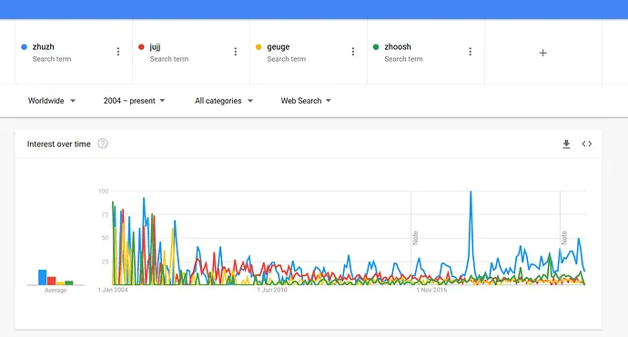
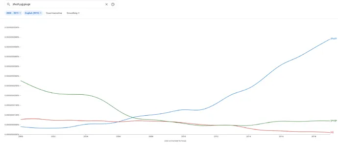
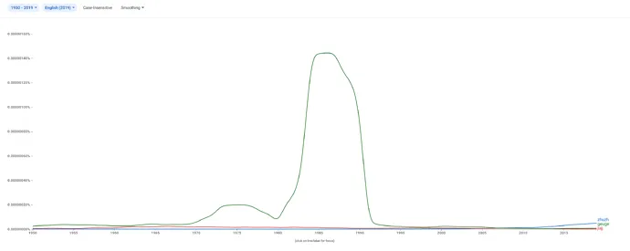
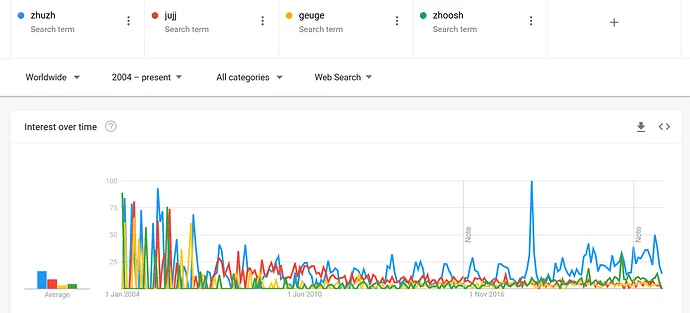
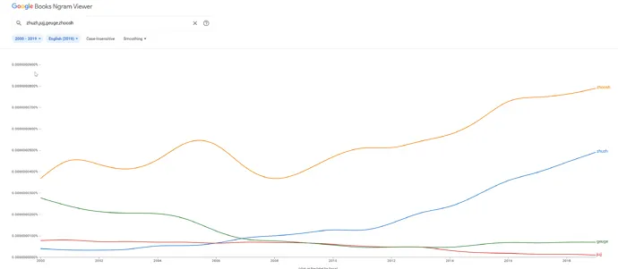

+++
title = "Zhuzh it Up"
date = 2023-01-06T12:00:00-07:00
draft = false
categories = ["words"]
tags = ["zhuzh"]
+++

_How do you spell jujj?_

<!--more-->
--------

I am a man who prides himself on knowing how things are spelled, no matter how ridiculous or inconsistent the English rules happen to be. Furlough? Victuals? Hiccough? Mnemonics? Pneumatic? I’ve got all the unspellables on tap just in case I happen to be in a spelling bee at some

I have never been in a spelling bee, but I’m ready, just in case one advances threateningly at me.


But, years ago, Tiffany asked me a question that has haunted me to this day.

_How do you spell jujj?_

Me: “Jujj?”

Tiff: “You know, like… I’m gonna jujj it up a little.”

Me: … I … don’t know! Jujj? Zhooj? Jooj? Juj? Jeugh? Geuge?

Then we were watching the Stupid Netflix Bartender Thing with the captions on, and someone says it. “Gonna jujj this drink up.”

> 
> <small>“Baby Masters: DO NOT SHAKE UP THE COMPETITION”</small>

And the captions person has spelled it … zhuzh. Huh. I’ve _never seen that before_.

I made Tiff pause the episode so that I could look at that spelling up close. ZHUZH. Zhuzh? zhuuuuuuuuzh.

First and foremost: there’s no English-language letter for a buzzing J sound - “ʒ” ( ʒʊʒ ) so English works around it in words like uʒual, viʒion or garaʒ - which can be spelled a lot of ways, so there’s no really obvious grammatical spelling for zhuzh.

So I look it up and it seems like zhuzh is currently the accepted spelling of the word… but all of these articles are from 2018+. Is this word only a few years old? I’m sure I’ve heard it before that.

In fact, it would seem that… the various different possible spellings of zhuzh have been fighting for the past 20 years, and only recently has zhuzh started to pull ahead as the accepted spelling.

It seems like 2007-2010 was the turning point, where zhuzh started to take over.

One proposed origin for this term is originating from gay subculture in the 60s and 70s, and, in fact, it seems to have been "geuge" when written about back then:

Although this could be confounded by someone prominent or famous named, like, “Frank Geuge” or something - but a quick Wikipedia search turns up no Geuges.

For some reason, Google Search Popularity only goes back to 2004 - I don’t know how they could be so sloppy with their

I'm joking, I know that Google doesn't have "Google Search Popularity" data that predates Google itself.


Okay, another detail: Merriam Webster mentioned that the word “Zhuzh”, which made its debut on the “Words We’re Watching” list in 2018, was a popular catch-phrase of style icon Carson Kressley (Queer Eye).

In fact, back in the Google Trends graph we can see that all of the various and sundry variants of the unspellable zhuzh were in full play in 2004-2008, back when Carson Kressley was on the air and people were trying to figure out how in the heck to spell zhuzh:

Carson Kressley claims to have learned it from Ralph Lauren, who spelled it “Zhoosh”.

Hey, there zhoosh is: dominating the literary world of zhuzhes even as zhuzh seems to be taking over as the dominant term. (Well after the dominant geuge of the 80’s.)

So there appear to have been at least a few major changeovers in the historied mystery of the word zhuzh:

* geuge to zhoosh between the 80’s and 90’s,
* zhoosh to _nobody knows for sure_ in the 00’s,
* and then everyone finally settling on zhuzh in the late 10’s (around the time that Queer Eye’s reboot came on the air)

all brought to us by a shady cabal of powerful lexicon-altering gay fashionistas who **make up their own rules** and **zhuzh with impunity**.