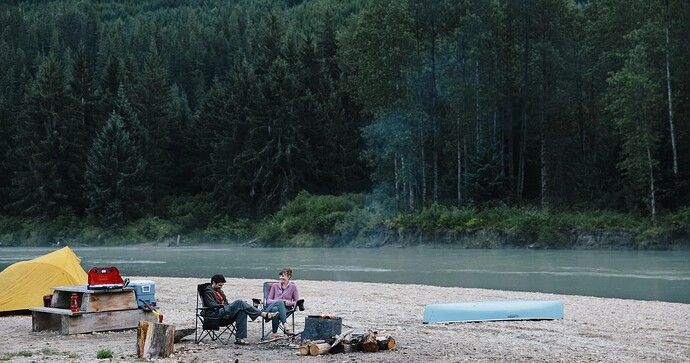

+++
title = "Camping / Roleplaying The End Of the World With 4000 Other People"
date = 2024-09-15T13:00:00-07:00
draft = false
categories = ["camping"]
tags = []
+++

Just after my trip to New York City I thought to myself about a vacation that would be the _complete opposite of a trip to New York City_.

Not because I didn't have fun, but because _variety is the spice of life_. Also, Tiff has never been camping.

We've been pretty dedicated "it just makes more sense to get a hotel or a cabin" folk, but dang: between the rent crisis and 100% inflation that's starting to get less and less practical.

I camped _a lot_ as a child, like, for multiple weeks every summer. It was the _vacation of choice for the thrifty_.

Now, my experience of camping is pretty simple:

* Camping is mostly CapEx (capital expenditure) with actually pretty minimal OpEx (operational expenditure): most of the equipment you buy is reusable trip-to-trip, and the point costs of camping are low and marginal - campsites tend to run low-double-digit dollars to rent per night, and most of the cost (outside of food that you _probably would have bought anyways_) is for fuel to get to and from campsites and fuel to _expend at campsites_.
   * However, some camping solutions (trailers, RVs, for example) have quite _high_ CapEx: after spending five figures on camping kit, you need to go on _dozens of vacations_ to break even against hoteling, which very much _restricts_ the kind of vacation you can go on.
   * Also: if you live in any kind of strata-managed property, parking a trailer is likely to be a manner of some contentiousness.
   * Also also: my car has a tow capacity of "please don't" and handles like a particularly slow brick/minivan crossover when it's completely empty.
* The BC Campsite reservation system is a borderline _nightmare_, and is one of the larger barriers to entry. The problem is not campsite prices but _actually getting a campsite at campsite prices_.
  * However, I'm told that with excellent timing (set a timer for 7AM, 4 months exactly before you plan to camp) and/or mid-week date flexibility (Wednesday is available: Saturday is not), this is surmountable.
* Once camping: I mostly stay at camp. Not much of a hiker, or a kayaker, or a lake-goer-inner.
* I like to read, doodle, listen to music at a respectable volume, eat prepacked snacks, and play board and card games, (which are mostly things I could have also done inside), and are somewhat less comfortable and convenient to do in the outdoors.
* I do not enjoy mosquitos, or the presence of mosquitos.
   * Tiffany is so afraid of spiders. You guys. You can creep her out by saying the word "spider" and she'll immediately be like "where?"
   * One time I saw a loose hair on Tiffany while she was outside and I said "hold still" and she said "IS THERE A BUG ON ME?" and her eyes became wide as saucers.
* I very much avoid long drives, as any time I'm behind the wheel for more than 2 hours the act of being forced to pay attention to the same monotonous thing for a really long time exhausts all of the extremely limited dopamine reserves in my brain and I start to collapse in upon myself like a dying star.
   * Most of my worst _bad mental health moments_ have been after long, monotonous instances of travel.
   * Trying to convince Tiff to learn to drive so that I can split this up somewhat has gone (**checks notes**) nowhere.
* I am allergic to 25% of the things that are outside ("most trees", "dogs") and have to be on a pretty potent dosage of allergy medicine not to immediately die.
* Adventurous pets enjoy camping very much. (Zapp would probably do pretty well on a trip like this, and it's one of the few kinds of journey where we CAN take Zapp)
* Optimal temperature is 15-20C, mildly overcast.
  * June/September are the best months for this?
* Getting up in the middle of the night, having to get dressed and put on shoes, to walk into the forest to pee? Don't care for that at all.
   * actually this is less of a concern now that I generally sleep in pyjamas and a t-shirt, toss a little thingie of hand sanitizer and a headlamp next to my shoes and I'm good to go
* I generally sleep very well while camping.
* Successfully camp cooking, and drinking a coffee on a crisp morning outdoors is very rewarding.
* Camping _near friends_ is a superior experience:
  * The cooking is logistically complicated and it becomes _less so_ if you're doing it for more people at the same time.
  * Board games are better if you can round up 3-5 people for them.
  * You are less subsceptible to the "whoops I forgot crucial object X" failure condition if multiple redundant parties are packing their own kit.

> 
> pictured: one (1) adventure cat

## Camping v. Gear

So I walk away from this wondering if I'm more interested in _camping_ or simply the _enjoyable activity of shopping for gear_.

Gear is neat. I can learn what the "best" tent is, and [watch people review that tent, on YouTube](https://www.youtube.com/watch?v=1lRoL9gutYs). I can [get weird with it and test out weird and estoteric gear](https://goalzero.com/en-ca/products/skylight-portable-area-light?srsltid=AfmBOoqcbpllG4rCycDHwdEvz7Xi0_YxQzA63u2mKlapQUDLlaJ3YBiR). I love gear. I'm a gear-enjoyer. Camping is a _fun project for the gear-minded_ because it makes every element of the process a fresh gear-based decision.

Do I _need_ to set up a solar power station? No.
Do I _want_ to? Absolutely yes.

Hell, there's a bunch of stuff I _already have_, like little telescoping bench circles and USB-powered lanterns, that _I want to see how they do... in the outdoors_. (It turns out that basic "responsible adult" emergency kit stuff and camping gear enjoy a lot of overlap.)

One of the ways I try and resolve this for myself is: if I had to camp with someone else's kit and it had _most of the stuff I needed_, would I still want to do it?

And the answer is... **55% yes**, I think. I'd need to have some good experiences to get that number up.

-----

## The Wasteland Beckons

[We Roleplayed the End of the World with 4000 Other People](https://www.youtube.com/watch?v=bW6EYmRX7wk)

So, Quinns went to _Wasteland Weekend_, a festival in the Mojave Desert where a bunch of folks just _pretend to be Mad Max_ for several days.

Between Quinns' expert reportage and a bit of my own research, it seems like Wasteland Weekend - and its Cyberpunk sister event, Neotropolis, are sort of a mix of "Burning Man", "Ren Faire", and "COSPLAY".

(I like the Cyberpunk one more, although Tiff is more on team Mad Max)

Which, uh, honestly? I've always thought the _idea_ of a Ren Faire is cool, but practically I'm just not that big a fan of the medieval aesthetic.

> 
> 
>
> [Tommy Cash gets a pass tho](https://www.youtube.com/watch?v=w7yG1P2Nq_w)

That actually looks like ... fun. I would go to that. I miss _festivals_ like Pax, and "outdoors" and "mask easily worked into theme" actually significantly reduces the microbiological event risks.

Except, the logistics. The logistics of going to such an event are _complicated_.

Quinns managed to go home to a hotel every night of the wasteland weekend, but the nearest hotel is a 20 minute drive away by car and I doubt anybody's Ubering to the middle of the desert. How did he get back and forth to the event? Did he rent a car? How easy is it to get your deposit back after driving a car on unpaved Mojave roads for a week? Cars coming and going also have to go through the entire entry process every time, so you're going to want to minimize comings and goings.

Once you're in, it's a _desert event_ with _minimal food and drink_ so it's advised that you pack food. Okay, so, are you going to bring a cooler and a camelbak with you on the plane? That's going to call for some _checked_ luggage.

Which brings us back to... camping.

Camping is included with the cost of the event ticket. If you WANT to pitch a tent out in the Mojave you _can_, giving you _maximum event access_.

So in order to bring your own gear to _that_, you'd need to drive, and the drive from here to there is... 22 hours?

> I very much avoid long drives

That's the sort of drive I'd do across 3 days, even: 6 hours to Portland, 6 hours to Redding, 8 hours to the Mojave, heck - even a 4th day to pad that a little _more_ maybe. So now it's a 5 day event with 7 additional days of travel time.  That doesn't sound _toooooo_ bad although I'd _much_ rather do that with a driving partner than alone.

And... this is desert camping, not BC camping. It's **Burning Man rules**, where you're expected to truck out your grey water and there are _no showers or potable water anywhere_.  Dust gets everywhere, you need to invest in _much longer, deeper stakes_ and _weights_ so that the wind doesn't carry your gear away, and you have to be prepared for some potentially pretty wild temperature fluctuations.

Oh, and while travelling with Zapp for a short outdoor adventure sounds fun, travelling with him for 12 days across a very long distance sounds _distinctly less fun_. On top of that, if we're busy with a festival, he's likely to spend a lot of time _alone in a scary desert tent_, which sounds distinctly less :cat: than _hanging out with his family in a big fun forest_.

## The Unfortunate Conclusion

All that is to say: as much as I think it looks cool to go do a wasteland or cyberpunk festival out in the middle of the desert, I don't think I'm quite ready yet, or likely to take on that project in the near future.

I think that it would probably be a lot easier to go to, like, [Magwest](https://www.magwest.org/) or [Pax](https://west.paxsite.com/) and stay at a hotel. If I want to level up my camping ability a bit, it's a lot more practical to do that _near home_.

(**2025 Editor's note:** just about every Canadian is now boycotting travel to the increasingly fascist state to our south, so now _definitely_ not)
