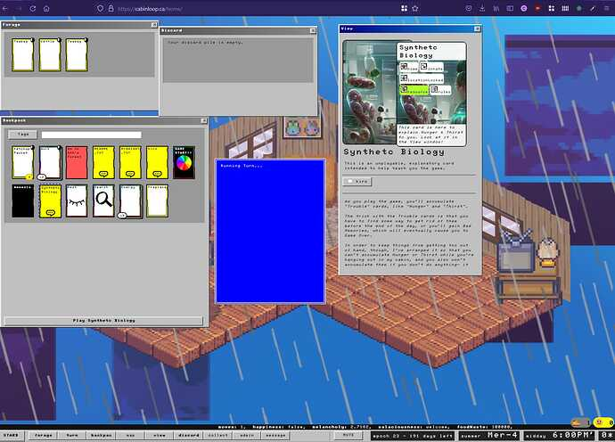
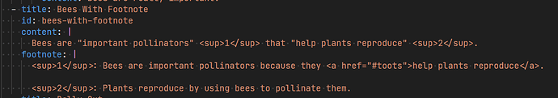

+++
title = 'Cardchapter 2'
date = 2024-09-29T12:00:00-07:00
draft = false
categories = ["rust", "software", "visual novel"]
tags = []
+++



<!--more-->

So, uh... long story. Looooong story.

Around the end of life of Cube Drone The Comic, 'round 2016, I started to experience a _lot of frustration_ that the

I ... honestly wish I had a screenshot of that site, I have no recollection what it looked like.

 I'd built for Cube Drone just performed like absolute poop sandwiches on mobile devices.

"Mobile devices? Everyone's dominant form of media consumption for the past decade?" Yes, those mobile devices.

## CardChapter

So, I started working on CardChapter, a tool I would use to build newer, better, smarter comics.

I had this idea across a series of notebooks, this idea that all content would have to fit on these mobile-phone sized cards and you could jump from card to card, and each card could have its own effects, and the _story didn't even have to be constrained by horizontal space, the cards and the story could exist vertically and horizontally at the same time_ whooaaah.

At the time, I recognized that it was one of my two _ur-projects_. The projects I keep going back to, again and again, forever.

These two things are:

* **a multiplayer grid/card engine server** that could be used to power Civ-like games
* **a CMS for Comics** that could be used to host a large collection of comics.

For each of these projects, I have dozens of Git *and SVN* projects at various points in my career indicating a greenfield update to my opinions as to how to build it properly, and I’ve put these experiments to the test in live projects that I’ve pointed at the internet and actively used.

Anyways, even at that time I had _built a comics website many, many times over_. [CardChapter](https://old.cardchapter.com/#root) was a particularly weird version of the idea.

Technically, this wasn't even the first version of CardChapter: I'd already tried to build this thing a few times and failed miserably each time. It's kind of complicated to build, actually!

It worked - more or less - on mobile devices, although I struggled to crack some of the fuzzier issues. I never managed to get the animated scroll to a place where I was comfortable with it.

Documents were _tree shaped_. I thought that was a clever design but most people found that _confusing and weird_.

Documents used a Tiddly-Wiki style "save this document to create a new version of the document" system to propagate themselves. I thought _that_ was a clever design but most people found that _confusing and weird_.

Each document contained 100% of the entire _document_ at any given time, so as the site they described got _larger_, the page size started to climb into the megabytes: nobody _really_ wants to hit a 10MB webpage: so I implemented lazy loading on images.

It came with a neat inline editor, but the editor never supported vim keybindings, and if I jammed my fingers on Ctrl-S it would just do _something I didn't want_.

I used it to build "northwestica", a comic where I worked with some RPG players/writers to build a veeeery slow interactive RPG. Technically northwestica is longer and contains more art (and effort) than Cube Drone! But, uh, the audience never went over, like, 10 people, and it was a _lot of work_.

Also: actually building a project in CardChapter really revealed some of the seams in its design: the weird little blip on every page turn makes my eyes hurt.

> re-reading this it is pretty funny at times
>
> 

Okay, so, that's enough of that for a while.

Time to bounce to Ur-Project 1: Cards, Grids, and Simulation for a handful of years.

-------

> this card-engine monster ate much of 2021 and 2022
>
> 

-------

Okay, so, I burned out hard on my weird little card engine. It was fun but ultimately broken.

One of the fun little things I built in the card engine?

An animated text-o-mo-bob.

CardChapter used a kit text animator, but for this project I just built my own in React.

--------

## What About WASM?

What about WASM? I mean, I'm obsessed with The Web, but can interesting experiences be delivered on The Web using full-on game engines?

So then I went down a Godot
rabbit hole for a while, and then after that I got way in to Ren'Py for a bit
and I made a whole little Visual Novel in Ren'Py which _sucked_.

For both Godot and Ren'Py, they felt much more powerful and expressive than dumb ol' JavaScript.

Also in **both the cases of Godot and Ren'Py**, after investing 50+ hours into the platform, I discovered that their WASM builds were **completely unusable**.

By and large, memory management in WASM remains an unsolved problem: game engines are generally designed to operate in a much less constrained memory environment and have a real tendency to overflow browser memory, _particularly_ on mobile devices where the browser's available headroom is wildly constricted by platforms that _don't want free web software competing with their app stores_.

So most people only ever saw the first chapter or two of my Ren'Py game, which is probably for the better.
It's still available online [here](http://comics.cube-drone.com/capilano/index.html), although for the aforementioned reasons I recommend
downloading it before you play it.

-----

## Okay, So, What If I Wanted To Write a VN For The _Web_?

So, that's just CardChapter but... better, right?

I even built a "Text Dialogue" card into the [original CardChapter](https://old.cardchapter.com/#rpg-dialogue):

So let's start taking apart CardChapter and building it better, smarter, for the _future_.

Which takes us to...

https://cardchapter.com/s/cube-drone/atoms-isn-t-real/#intro

CardChapter 2.

I think it's like... the sixth or seventh crack at this darn software? Practically it's CardChapter 2
because this is the second one to hit an even-remotely-shippable state.

----

## How Is It Better?

Well, first of all, it abandons the button-based paging system for _free scrolling_, which works significantly better.

### Better Paging

I fiddled SO HARD with drags, and animations, and throws, tuning weight parameters, to try to get the card deck motion to feel right... only to eventually come to the conclusion that there's no draggable toolset in existence that feels as natural as _regular-ass goddamned scrolling_. I threw out all of the experiments and put the content in a _scrollbar_. It works _better_.

One of the reasons Cardchapter Original had such a complicated paging system was that it made it possible to trigger _special effects_ when you hit a specific page, like starting an animation: but in this new version we do that by using visibility triggers to determine which slide is "live".  This is - actually much MORE complicated, but it works reasonably well.

> the [pikachu slowly fades in](https://cardchapter.com/s/cube-drone/atoms-isn-t-real/#pikahchu) when the card is active:
>
> 

### No Tree Shaped Documents
The complicated tree-based document thing? That's dead. Now there's a _single row of content_.  It's conceptually much easier to deal with.

I thought "tree-shaped documents" were clever, a neat idea, but I don't know if I ever actually found much use for them.

### Maybe Slightly Faster (In Some Conditions)?

To be honest this one's kind of a wash.

CardChapter Original Recipe was statically hosted, which is fast as hell, but all of its code lived within the single document - which introduced Cache Staleness Issues and made the document a little bigger than I'd like (~1.5MB total for most Cardchapter documents). As a result, most of the document's load time was packed into that one document downloading, which took about 300-600ms.

CardChapter New is a little Rust server which responds to queries in a matter of single-digit milliseconds, and the site's built using tightly packed [Preact](https://preactjs.com/) so the size of the compiled JS is _way smaller_

_but_...  the JS calls back to the Rust server to load cards dynamically as you scroll around on the page (and _unload_ them dynamically as you scroll away from them)

Now, with this model in mind I was able to create some absolutely monstrous 10,000 page test documents that were still performant, but that back-and-forth between the JS and the server costs some time that I didn't have to spend on the original chonker.

Ultimately the new site is just marginally faster. Also: since it's not loading everything as a single page, I can style the HTML before the JS arrives and loads, saving me a bit of "blank page" in favor of a proper load screen.

What actually helps the new site in the performance numbers is applying some throttling to the problem: that 1.5 MB download actually really sucks on a slow phone connection (which I discovered in the wild no small number of times)

> on "regular 3G" the page takes 15000 ms to load
>
> which is bad
>
> 

comparatively, on the slow connection the new site loads... very quickly:

> 675ms seems svelte in comparison
>
> 

score one for the compressed payload!

----

### Updated Animation Engine

I just finished this bit today, but the animation engine uses a more powerful variant of the Animation DSL I wrote for the card game:



XML: actually the right language for controlling animated text.

---
### Content Format

Oh, boy, I spent some TIME IN THE WEEDS determining how this content was actually going to get stored.

Most of that multiple-months of weeds time was spent "learning Rust", so it wan't a major loss, but an earlier version of this had a full on internal database and account management system _with invite codes_ so that I could invite _other people_ to _also_ author content using CardChapter, and I would have had to build a whole _authoring interface_ and... and...

---
### It's Time To Admit That This Product Has a Target Market of Just Me

Okay, what if instead the server just _loads all of the content from disk_, like a statically hosted website, and I edit it... with a text editor, and save it... in version control. Like I do with _everything_.

well, gosh, that makes things easier

---
### Stuff That's Hard to Do With Static Hosting
Notice that CardChapter sets the social headers correctly, so that when I paste a link, you get a little image, and a favicon, and a title, and a description:

https://cardchapter.com/s/example/example

That's not _too_ magical but it was basically impossible to do with CardChapter's bullshit "the file contains itself" nonsense.

---

### Pipeline

Site updates are just "push to github, wait a minute". Ez. It's powered by a darned [systemd cron job](https://opensource.com/article/20/7/systemd-timers).

---
### WebP

uh, it automatically transcodes any images it's using from .png, .jpg, or .gif into the more compressed [webp](https://en.wikipedia.org/wiki/WebP) format?

also it can thumbnailify and slightly modify images, because why not:

`owen.png?color=red`

`owen.png?color=pink&height=200&blur=1&flip_turnwise`

not sure if this is useful but it's definitely _a capability_

---
### Anyways:

Atoms Isn't Real is intended to be _real content_, if disingenuous.

But if you want to really stare into the eyes of insanity, "Example" is the test deck, used to poke and prod the various available features:

https://cardchapter.com/s/example/example

Tiff has walked into the office with me just staring at Owen Wilson, dozens of times now. It doesn't even faze her anymore. "At least you're through your `florb` phase."

----

### Wow, That Seems Like a Cool Tool for Building Out Comics, Do You Have Art That You Intend To Actually Make With It?

I made a little presentation called "Command Line Interface" with it.

https://cardchapter.com/s/cube-drone/command-line-interface/#intro

### Ok, Adding Footnotes

### mp3 and Audio Guide

the mp3 option puts a mp3 player at the bottom of the page

with audio_guide: true, it will use the next: property on individual slides to move the slides along with the audio - or, if you track around in the audio, it will automatically move to the correct slide.

