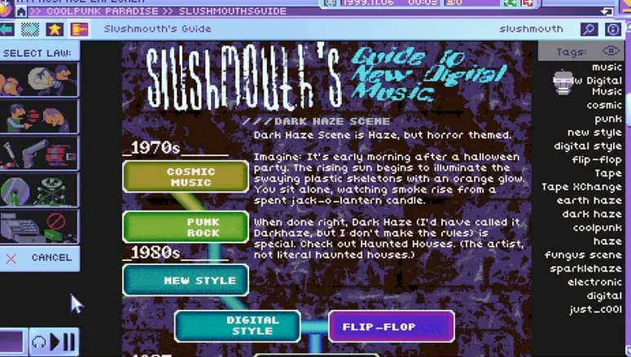
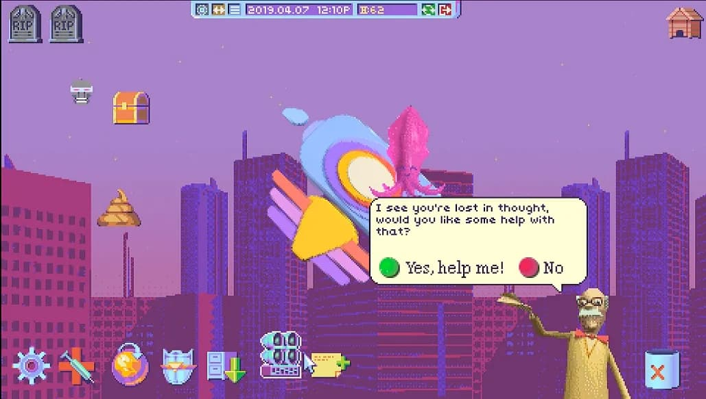
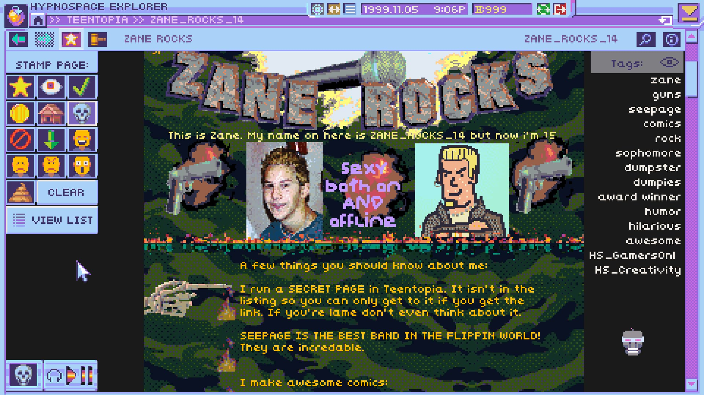

+++
title = "Hypnospace Outlaw"
date = 2024-04-10T11:00:00-07:00
draft = false
categories = ["video games"]
tags = ["narrative games", "epistolary", "nostalgia", "blippo", "a normal lost phone"]
description = "the 1999 that exists in my heart looks like hypnospace outlaw"
images = ["hypno.png"]
+++



<!--more-->

[Hypnospace Outlaw](https://store.steampowered.com/app/844590/Hypnospace_Outlaw/) is 75% off on Steam right Future Editor's Note: well, not NOW, although you should probably check during a holiday sale, it might still be, who knows?, removing any possible excuse you might have not to play it.

Okay, well, one reason not to play it is definitely “I do not have a mouse and keyboard”. This is definitely a mouse-and-keyboard kind of game.

Another reason not to play it? You hate reading and puzzles. This game is mostly about reading and also puzzles.

Okay, a third reason not to play it? You experience no nostalgia for the Geocities-era internet, perhaps because you are too young to have experienced it, or too old to have taken it seriously.

## So, What is Hypnospace Outlaw?

You are a moderator of a AOL-like private internet community in the year 1999, and everybody on the internet has their own page. It’s your responsibility to simply browse the fake internet, looking for people who have broken rules.

This internet is laden with MIDI files, chain mail scams, rap-rock, electronica music, alternative spirituality, conspiracy theories, ironic humour being taken at face value, and a helpful buddy who is definitely not a virus intended to serve you ads.

The game's puzzles are cute, mostly, although I found almost all of the fun of Hypnospace Outlaw was just _taking a few passes through their internet and reading it all_. 

It didn't take long - maybe six hours? I should go back and solve the last few puzzles, although a lot of them have to do with just _excavating this humorous internet space for all of its myriad easter eggs_. 

## Thoughts? 

Okay, so, I'm uniquely the target audience for a reading/puzzle/nostalgia/humor game set in 1999.

I laughed out loud quite a few times to myself. This game is quite often _very funny_. I don't want to ruin too many of the jokes, but they're all quite good. I tend to play games after Tiff's gone to sleep, and there was a joke that had me gasping for air because I was trying so hard to stifle a laugh, to keep from waking her up.

I sort of imagine myself a cool, hackery `t1mageddon` &mdash; but, no, I was very much (and regrettibly) a `ZANE_ROCKS_14` in the year 1999, and boy is that a _thorough and laser-targeted roast_. 

As a result, I was glad that I banned this dork from the internet before it gave him terminal beefbrain.

