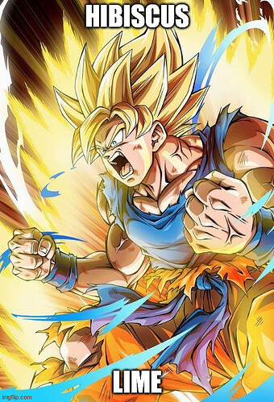
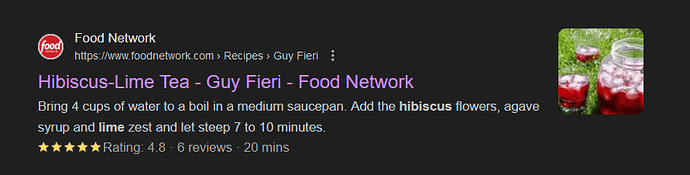
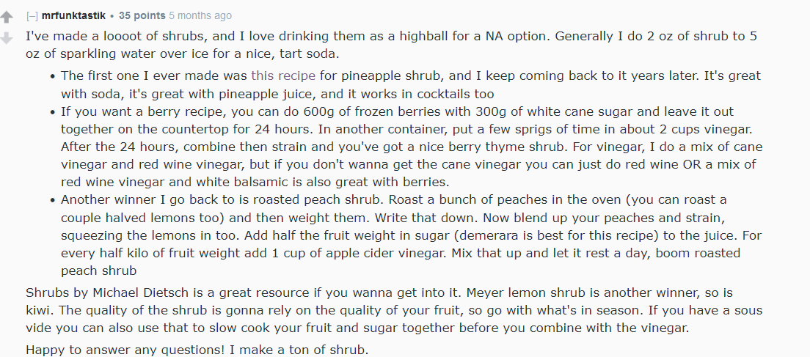
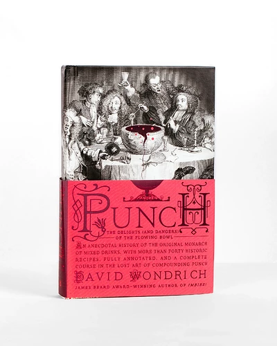

+++
title = "iced tea, man"
date = 2024-05-10T11:00:00-07:00
draft = false
categories = ["food"]
tags = ["iced tea"]
+++

I know I've talked about iced tea before, because I _care a lot about iced tea_, I firmly believe that a lemonade iced tea
(an "Arnold Palmer", technically, because sometimes if you ask for an "Iced Tea" you just get cold tea, which is fine but
it is not what I am talking about) is the greatest beverage that exists.

There's an enormous historical digression that _could be made_ about why Canadians like me think of
"lemonade iced tea" as the default iced tea, but the
tl;dr is it has to do with the complicated history of the Arnold Palmer and the Coca Cola company.

Just be assured that when I say "iced tea", what I mean is potent, bitter, sweet, tart, and _lemony_.

## a new iced tea in town

I've now discovered a _new iced tea_.

I'm planting my flag, I am the first human being ever to discover this radical flavor combination:

Now to take a big sip of water and go to google to make sure that I am, indeed, truly the first.

## damn you, Fieri!

Anyways, I've learned most of my _iced tea hax_ from Classic Iced Tea, but they apply exactly as well to Hibiscus Lime Iced Tea:

1. Use a vegetable peeler to remove the peel (not the rind) of a CITRUS, then let it sit, in a ramekin or small bowl, with about 2 tbsp of sugar. Shake it a little. This takes at least _overnight_ although once it's done it's shelf stable for weeks ('citrus oil and sugar: very hard for nasties to live on') so you can just make it whenever and assume you have an iced tea on the way. This is an _oleo saccharum_ and its potent citrus oil flavor really contributes to a tasty beverage.
2. In a Big Plastic 1.9L/2Qt Jug, fill to about 3/4 full with just-off-the-boil water, then add 10 teabags of Arbitrary Tea. (Tetley, Hibiscus, or whatever kind of tea you're using). Make sure you have a large splash of boiling water leftover.
3. Give the tea an appropriate amount of steeping time. (If you oversteep black tea, it gets unpleasantly bitter, but herbal teas often need LONG steeps, so ... follow box instructions.) Then, fish the teabags out, with a spoon, or a kitchen spider, or someone else's hands.
4. Dump a splash of hot, hot water (I guess about 1/4-1/2 cup?) into the oleo saccharum to dissolve the citrus-sugar mixture, stirring gently until the sugar dissolves. This will allow you to very easily pour the sugar-syrup-oil mixture into the iced tea jug, while capturing the peels with a fork or sieve.
5. Juice the citrus into the jug using whatever citrus juicing method you prefer.
6. Add 1/2 tsp of raw citric acid for potent sourness (or, failing that, the juice from an extra half-citrus or even a capful of vinegar)
7. It's time to add sugar to taste! Starting from here (from MY sugar preference, keep in mind sugar preference may vary wildly), 4 tbsp of sugar will get you to something that's sour and potent and refreshing, 6 tbsp of sugar will get you to something balanced and delicious, and 8 tbsp of sugar starts to get you into Kool-Aid :tm: territory. (No judgement: do whatever you want) - this is extra easy because the mixture is still hot, which means the sugar will dissolve instantly and easily, making it very easy for you to use a l'il spoon to taste if you've got the sugar and sour balanced properly, which you should _definitely do_.
8. Time to chill. Cover the jug and put it in the fridge.

So, while I do this with **black tea and lemon**, or **hibiscus tea and lime**, you can do this with **_any tea_ and _any citrus_**. Jonathan gave me some rooibos raspberry tea that was bonkers delicious with some lime. Please: _go forth and try combinations of teas and citruses and report back to me with the best ones._

They're not all winners: I tried this with some _sleepytime tea_ and _navel orange_ and it was... awful, actually. Sleepytime tea is minty and the combination of mint and orange gives off a noticeable "brushing your teeth then drinking OJ" flavor. That was... not so good.

I drink an unhealthy amount of this stuff. It's the _perfect beverage_. I always have a pot in my fridge. I'd rather have it than most alcoholic drinks. I offer it to guests when they come over. It's _so good_.

### Vinegar Drinks: Good Actually

Most good drinks are either _regular water_ or sweet and acidic. Coca cola,  gin and tonic, margarita, whiskey sour, lemonade, 7-Up, so long as they got the sweet AND the tart they're golden.

One surprise for me is that the _source_ of that tartness can be pretty variable. Citrus is expensive, but you can use _raw citric acid, or even vinegar_, and the drink is still good if you balance it.

At some point I'm gonna try to concoct some shrubs, maybe even some haymaker's punch.

> ## This Tropical Shrub Proves Spice Is Nice
> Pineapple combines with brown sugar and baking spices in this festive tropical shrub.
>
> https://www.liquor.com/pineapple-shrub-recipe-5077965

### Pirate Punch Ahoy

A while back, I read [Punch, by David Wondrich](https://www.amazon.ca/Punch-Delights-Dangers-Flowing-Bowl/dp/0399536167):

This drinks historian goes into absurd amounts of detail describing both the history and recipes-to-recreate various and sundry historical punches.

The recipes in Punch are mostly _completely ridiculous_, being as they tend to call for three or four full bottles of hard liquor _at least_ and are intended to provide a wild evening for a great many people at once.

One recipe is codified in a long poem and calls for 72 lemons, 5 bottles of french dessert wine, 10 bottles of cognac, and a nutmeg or two.

That one's pretty big, but it's got nothing on Admiral Russell's Punch, which calls for

> the following ingredients, viz. four hogsheads of brandy, eight hogsheads of water, 25,000 lemons, 20 gallons of lime juice, 1300 weight of fine white Lisbon sugar, 5 pound of grated nutmegs, 300 toasted biscuits, and last a pipe of dry Mountain Malaga.

unable to find a bowl large enough, Admiral Russell prepared this in a _fountain_.

_Apparently they made a little boat and had a boy floating in the punch with a ladle, serving it up for people._

One thing I noticed, reading Punch, though, is that many of the punch recipes have a _thing or two_ in common with my iced-tea recipe. Citrus, sugar, water or tea - the difference is an _absolutely bonkers amount of hard, hard liquor_. Sometimes they'll finish it off with a little bouquet of pie spices like nutmeg (something that can be quickly approximated with a dash of angostura bitters).

So, for a party one time, I went hunting for a recipe that had similar proportions to an iced-tea that I had already prepared, and decided on **Chatham Artillery Punch**.

> One of the three recipes for bowl-sized Punches I included in *Imbibe!* was a version of this, formerly Savannah’s favorite way of putting visitors in their place. The 1907 recipe I printed for it, while a good one, came with an acknowledgment that back when the Chatham Artillery first made it, “its vigor . . . was much greater than at present, experience having taught the rising generation to modify the receipt of their forefathers to conform to the weaker constitutions of their progeny.” I always hate to print a weaker recipe when a stronger one exists or, with exceptions, a newer one when there’s an older one.
>
> I was therefore very pleased, some weeks after that book was published, to come across a little item in the *Augusta (Georgia) Chronicle* recounting the origins and original composition of this particular piece of ordnance. “Its history is this,” the article explains:
>
> > back in the fifties the Republican Blues, which were organized in 1808, visited Macon and were welcomed back by the Chatham Artillery. Mr. A. H. Luce, since dead, proposed to brew a new punch in honor of the Blues. Mr. William Davidson furnished the spirits.
>
> Note that the Republican Blues here are the Savannah ones, not the Richmond ones with the gargantuan bowls of Quoit Club Punch. It must’ve been fun to be in one of those regiments, in peacetime, anyway. The Punch as originally made is utterly devastating. I can vouch for that, having now made it many times. To quote the *Chronicle*, “As a vanquisher of men its equal has never been found.”
>
> The concoction was thus made: One of the horse buckets of ordinary size was filled with finely crushed ice; a quart of good brandy, whisky and rum each was poured into the ice, and sugar and lemon added. The bucket was filled to the brim with Champagne, and the whole stirred into delirious deliciousness. Rumor hath it every solitary man of the Blues was put under the table by this deceiving, diabolical and most delightful compound.
>
> **SUGGESTED PROCEDURE**
>
> Prepare an oleo-saccharum of the peel of twelve lemons and 2 cups light raw sugar, such as Florida Crystals. Add 1 pint lemon juice, stir to dissolve sugar and strain into an empty 750-milliliter bottle. Add water to fill any remaining space in bottle, seal and refrigerate. To serve, fill a horse bucket of ordinary size or a two-and-a-half-gallon Punch bowl with crushed or finely cracked ice, pour in bottled shrub and add one 750-milliliter bottle each of VSOP cognac, bourbon whiskey and Jamaican-style rum. Top off with three bottles of chilled brut Champagne. Stir. Then smile.

I don't have a horse-bucket, unfortunately, and while a number of other punch recipes in this book use "tea" as their "weak" ingredient, this recipe uses _champagne_, so my version is a bit of a bastardization.

However, this was enough to convince me to try mixing brown liquors and spices to my iced tea to produce Potent, Delicious, Quite Alcoholic, Historically Inaccurate Punch.

_It's quite good._

**ed**: at the end of the book, Wondrich notes that a quite competent punch can be made with Any Premixed Lemonade Iced Tea and Any Dark Liquor: 3 parts iced tea, 1.75 part booze, 1.5 parts soda water, a shit-tonne of ice, and some grated nutmeg on top and you're good to go.

> If you can get lemons and real tea, of course you’re going to use those. But if it’s a choice between commercial lemonade and iced tea and a campground full of folks stuck with Beam and Coke, why not cheat a little? Flexibility in the pursuit of intoxication is no vice.

So my punch is really closest to the Quick & Dirty Punch recipe included the margins. Flexibility in the pursuit of intoxication indeed.