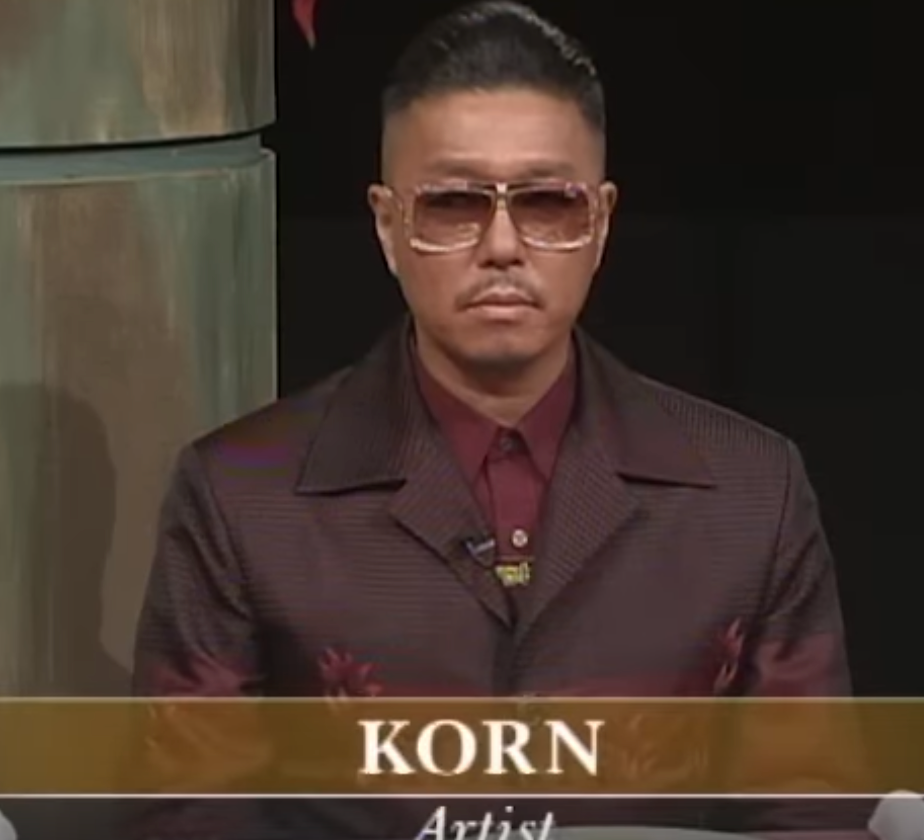

+++
title = "iron chef"
date = 2024-01-13T11:00:00-07:00
draft = false
categories = ["food", "media", "recommendations", "humor"]
tags = ["fukui-san", "cooking competition shows"]
image = "./chef.png"
description = "I love the original run of Iron Chef, let me tell you why."
+++



_you know what, I think it's time_

<!--more-->

Iron Chef is the greatest show and I loved it when I was a teenager.

Every episode starts with a clip of Chairman Kaga taking a bite out
of a pepper dramatically, and then visibly kinda regretting it.

_this man is the absolute mvp of dramatically eating objects_

One thing about watching a lot of Iron Chef in English is that even if there's a different challenger and panel every week, they always have the same voices and you get to know those voices like old friends.

The other thing about watching a lot of Iron Chef in English is that AFAICT they decided that Chairman Kaga's voice and personality was Just Too Iconic to translate and he just gets subtitled while everyone else gets dubbed.

_oh man I forgot how much I used to watch this show when I was in high school_

the challenger picked Hiroyuki Sakai and I just went "OOOHH SHIT, YOU GONNA GET REKT"

Wikipedia didn't exist back then for me to check the stats, but even 20 years ago I knew that Hiroyuki Sakai was an unbeatable wall and it would serve a challenger well to choose literally anybody else.

Now I can check the stats and: hell yeah, I was right.

That is an 82% win rate, 4/5 episodes. At the time, French cooking was having a _moment_ in Japan,
so if you were trying to make a name for yourself, taking on Sakai must have been the best-seeming move.

The actual safest bet was to take on Iron Chef Japanese Masaharu Morimoto
(he was very skilled, but I think the casual "Japanese cookery" skill level in Japan was much higher so Morimoto only had a 67% win rate)
or Iron Chef Italian Masahiko Kobe (Look, I have some _opinions_ about Japan's mid-90s interpretation of Italian cookery...)

_across both Iron Chef AND Iron Chef America, there's nearly two decades of the ice cream maker being a terrible idea and you'll lose if you try it_

I don't think I learned a single damn useful thing about cooking from watching this show, it's kinda too frenetic and unfocused to actually be helpful in any sort of practical way (especially when I was a teenager, I didn't have much in the way of the basics of cooking), although that's also part of why the show is so darned entertaining.

I think part of the reason that this show translated so easily was that the show was already 90% voiceover, and this localization team did SUCH a good job.

> I don't think Zapp wants to watch Iron Chef with me
>
> 

The insane made-up framing story of this competition show: that an eccentric billionaire started Kitchen Stadium and started collecting the world's finest chefs, and he unveils them like a series of anime villains that nobody can defeat, it's so good, this show's constant overbearing theatricality is just awesome.

a lot of what made this show great never _really_ made it stateside

this man just decided to go full theatrical bad guy as his stage persona and I respect that a great deal

If you have never watched an episode of the original run of Iron Chef, I beg of you, give it a try, it's so extra.

I have to avoid the episodes where they cook foods that make me sad, though, like octopus or shark fin, I think the show would be even worse if you're vegetarian or vegan.

> I'm not sure if the localization team decided that this guy needed "meathead voice" or if he's actually this slow IRL but it's very funny.
>
> "PUMPKIN IS SWEET."
>
> 

Oh wow, I finally found which episode this moment is from:

> KORN
>
> 

she was not advised to mix the mustard cabbage with the pork and just ate a big hunk of mustard on accident:

One thing I eventually learned - the localization team said it _so fast_ I could never really figure out what they were saying: "SQUEEZON!"
"SQUEEZON!" - they're saying "Fukui-san" with something of a hard-to-parse accent, so all of these are just addressing the host.
