+++
title = "Neverending Soda"
date = 2024-05-15T13:00:00-07:00
draft = false
categories = ["media", "books", "fantasy", "wife"]
tags = ["neverending story", "homestuck", "color e-reader", "the empress", "dark crystal", "creepy age dynamics", "ouroborous", "bluth", "muppet", "jim henson", "80s", "brave little toaster", "princess bride", "the chocolate river", "nimh", "david bowie", "bulge", "clowns", "oz", "scrooge", "meta", "meaningfully colored text", "homestar"]
+++



I've never seen the movie, The Neverending Story

<!--more-->

But as part of my ongoing low-level Homestuck obsession, I thought I'd read the book, The Neverending Story:

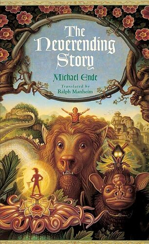

"Wait, what?"

Okay, so, I've been listening to [Homestuck Made This World](http://rangedtouch.com/homestuck-made-this-world/), a podcast where two cranky academic nerds read through Homestuck, one of whom is going through it the first time, the other one already intimately familiar with

Time has moved forward far enough that people who were homestuck fans as teenagers are now English professors, that's just how Time works, con-sarn it.


And a handful of the elements I've found persistently confusing in Homestuck have turned out to be _elaborate references to the Neverending Story_, in particular _in its book form_. Micheal and Cameron from the podcast _JUST KEPT POINTING THIS OUT_ and I eventually had to go and investigate on my own.

So, some thoughts:

**This Book Totally Slaps**.

It's written in the style and mode of children's fiction, but it's a 400 page _tome_ and it's wild.

... also, when I say "the style and mode of children's fiction", I have no idea how to _describe what I mean by that_.

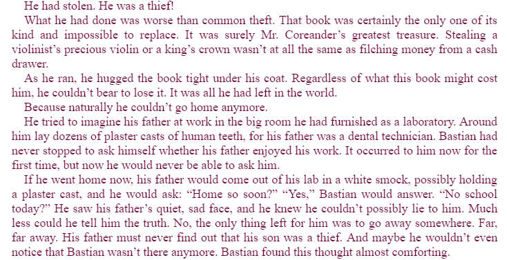

The vocabulary remains _fairly complicated, actually_, but there's a sort of radical simplicity to the way sentences are structured that just shouts "children's fiction writing" at me, and I'm not sure what exactly makes it feel that way.  Maybe it's that the book kind of *stops* to carefully explain _every single detail_ along the way?

It's like... while the vocabulary is flowery, the story is also very simple and readable and explanatory and regular and patterned, and I think of that as "children's fictiony".

## The Ink Thing

One of the reasons I haven't read this book until now?

The "Human World" parts of the book are in Purple, and the "Fantastican" parts of the book are in Green. **Every copy of this book has to be printed with two easily-differentiated colors of ink.** (Apparently this can differ from printing to printing, although it was Purple and Green for mine)

Which means, in order to get the full effect of this book, I either needed to buy a _real copy_ **or** get my hands on a color e-reader.
Which I didn't get until _just recently_.

This is also why I've been holding off on [House of Leaves](/posts/2025/house_of_leaves), which is also in my reading queue now that I've got a color e-reader.

## The Rough Plot, In Case You Don't Know (SPOILERS AHOY)

* Bastian, a chubby loser with a dead

ha ha

on the run from bullies, steals a mysterious book from an old bookshop, then runs away into his school's attic to read it rather than go to school. He opens the book and...
* Patches of _Nothing_ are consuming all of Fantastica, and some various and sundry messengers have been dispatched to find The Childlike Empress and tell her about it.
* The Childlike Empress is dying, and Atreyu, a native-coded boy from the grasslands is summoned to go on a quest to save her (and with her, Fantastica). He's given AURYN, an ouroboros-emblazoned amulet, to protect him. He takes his horse Artax along, which goes _extremely well_.

> 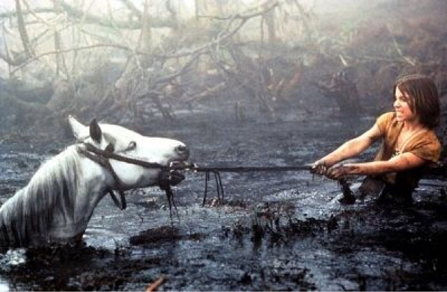
> every horse was harmed in the making of this movie

* Basically _immediately_, Artax the horse gets swamped to death, helping to establish that the Nothing means _business_:
* We go through a bunch of chapters with a pattern where Atreyu is introduced to a fantastical new location, meets a fantastical new creature, is put in some kind of fantastical new danger, and through it, learns a fantastical new detail of his quest.
* Sometimes, Bastian interjects, and weirdly, the book seems to react to his interactions.
* A big ol' spider made out of hundreds of miscellaneous insects introduces Atreyu to the Luck Dragon, Falkor.
* Atreyu goes through a bunch of mysterious gates and ends up learning that in order to save Fantastica, he's going to need to find a human from outside of Fantastica to give the Childlike Empress a new name. He also sees **Bastian, specifically**.
* Atreyu discovers that he can't just leave Fantastica to find a human because Fantastica has _no borders_, and despairs.
* Atreyu learns from a werewolf that he's nothing but a _fragment of story_, and in order to leave Fantastica, he has to go through The Nothing, which will transform him into a **lie** and further poison the human world, accomplishing nothing.
* Atreyu despairs and takes this information to the Childlike Empress, almost but not quite dying along the way. All is lost!
* The Childlike Empress is actually very cool about this: this was always the plan all along. In fact, this whole adventure was only necessary because it made a good story, and the good story drew in a _human_ who was reading the _whole time_.
* And all he has to do to save the Empress is say her new name, he'll be sucked into Fantastica and that will immediately save the day.
* The characters stare, impatiently, out of the book at Bastian, who absolutely knows the thing he's supposed to say, but holds back because he's a fat little

i'm not 100% in love with Sebastian's character in this, I'll admit

* Atreyu: 🤷
* Childlike Empress: 🤷
* Maybe he just doesn't know that he's supposed to interact with the book, like, right now, _just say the Childlike Empress's name out loud, right now, you little twerp_.
* Atreyu: 🤷
* Childlike Empress: 🤷
* Childlike Empress: okay, fuck it, I can force his hand, I'm going to go directly to the author.
* The Childlike Empress retakes AURYN, and goes on her own journey to speak to The Old Man of Wandering Mountain, who is currently engaged in the eternal task of transcribing The Neverending Story, the book you're reading right

that's right, I bet you thought it was meta enough with the audience interaction, but it's getting worse

* There's a sign on the door saying, essentially, "No Childlike Empresses Allowed, This Story Will Get Too Confusing"
* In order to force Bastian's hand, the Childlike Empress goes "okay, tell me the story, again, from the beginning."
* "Wait, if I do that, I'll just get to the point where you ask me to tell the story, again, from the beginning, and we and the boy will get stuck in a loop, forever."
* Childlike Empress: **DO IT**.
* "Ok, I guess".
* Bastian, a chubby loser on the run from bullies, steals a mysterious book from an old bookshop, then runs away into his school's attic to read it rather than go to school. He opens the book and...
* ... (skip ahead a whole bunch)
* Bastian, a chubby loser on the run from bullies, steals a mysterious book from an old bookshop, then runs away into his school's attic to read it rather than go to school. He opens the book and...
* ... (skip ahead a whole bunch)
* Ok, Bastian is _finally_ starting to get sick of this, he relents and says the Childlike Empress' new name: Moon Child.
* There's a lot of Nothing to rebuild, and the Childlike Empress gives Bastian AURYN and says "go do whatever the heck you want".

--------

Wow, what a story! That's as far as the movie ever makes it, but... the book goes on for quite a bit longer.

In fact, that's just Act 1!

## Act 2.

* So long as Bastian has AURYN, everything he wishes comes true, it's essentially Fantastica God Mode.
* Bastian wanders around Fantastica having zero-stakes adventures where he gradually becomes the handsomest, strongest, bravest, smartest boy in the realm, accumulating loads of overpowered artifacts.
* Every time one of his wishes comes true, he loses a little more of his memory.
* He runs into Atreyu and Falkor, hooray! They're bestest friends!
* Atreyu doesn't seem sufficiently impressed by the handsomest, strongest, bravest, smartest boy, and so Bastian starts doubling down on the wild miracles to try to seem *even more impressive*.
* Atreyu is concerned that Bastian is getting _too deep into Fantastica_ and starts grilling him about his memories. Noticing that they're going missing, he warns Bastian to _leave Fantastica immediately_ before it gets any worse.
* Bastian is furious about this, and instead starts doubling down on his wishes _even more_.
* There's a side-plot where Bastian accidentally creates a race of the saddest, ugliest craftsmen in the world as part of one of his wishes. They confront him about this:
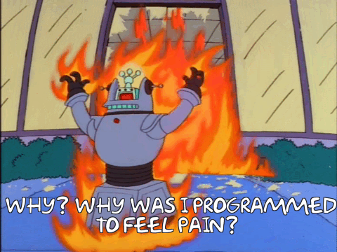
* He wishes for them to be happy and joyful all of the time, and accidentally turns them into Obnoxious, Stupid, Nasty

the story inspired Homestuck in other ways than this, also

*  _whoops_.
* An evil sorceress

herself created from a wish triggered by Bastian's selfish desire to stay

, commander of hollow metallic armies,
starts supplicating herself to Bastian and advising Bastian to be _more selfish_ in a plot to separate him from Atreyu and make a claim for the crown.
* Bastian gives Atreyu the boot and builds an army to try and take over Fantastica for himself.
* Bastian is just about to overtake the Ivory Tower and become the new Childlike Emperor when Atreyu intervenes with an army of his own, and there's a bloody and violent fantasy war.
* Bastian _almost but not quite_ kills Atreyu, and Atreyu escapes at the last minute on Falkor, badly wounded.
* Bastian decides, instead of trying to become the Emperor, vengeance on Atreyu for betraying him is now the order of the day and goes chasing after Atreyu.
* Instead of finding Atreyu, he finds The City of the Old Emperors, a city where tens of thousands of humans live; their minds hollowed out by Fantastica.
* Apparently they all _also_ had saved the Childlike Empress, and for humans who stay in Fantastica, there's a 100% chance of "going mad with power and trying to become emperor", which always

the Childlike Empress is Fantastica itself and cannot be tamed thus

and burns through their wishes and mind at a prodigious rate.
* The people in the city are immortal and utterly mindless, eternally pressing random objects together and trying to read stories out of nonsense.
* Xayide, learning that Bastian has found the City of the Old Emperors, realizes her game is up and commits

children's book! children's book!

* Bastian goes on a long and introspective journey to try to escape Fantastica with his last few remaining wishes, using his wishes on things like "wanting to be part of a community" and "learning empathy".
* The only wish that can be used to leave Fantastica is _the last one_, for which Bastian trades his name.
* Juuuust before making it out, the way is blocked by... Obnoxious, Stupid, Nasty Clown-Faeries. It turns out they hate being like this and blame Bastian.
* Atreyu and Falkor show up to save the day AGAIN.
* Bastian gets to go home, but not before giving up all of the gifts of Fantastica: his strength, his handsomeness, his willpower, everything he wished for is stripped away, and he's just a regular boy again.
* Bastian wakes up and it's the same day he

you there! Boy! What day is it?
!
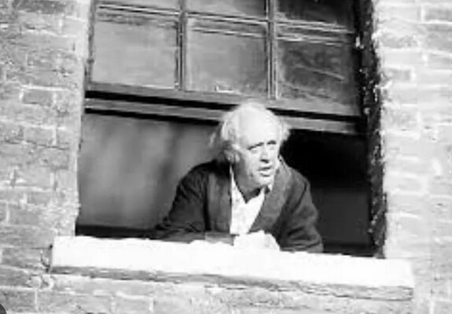
* He goes home, patches things up with his dad, and is generally a better dude.
* Everybody believes Bastian when he talks about Fantastica, because by defeating The Nothing he actively _beat back_ a layer of lies, making everyone a little more receptive to the fantasy realm.
* He goes back to the bookshop to apologize for his book-theft, and the book seller reveals that _he had also done the Fantastica 100% speed-run_, and that portals to Fantastica are hidden in books all over the place.

## They Made This Into a Movie?

I can't believe they made this into a movie. Reading this book, it _seems_ completely unfilmable. I might have to go watch the 1984 film to _see what they did_.

I'm aware that they split this up: the movie The Neverending Story is, like, just the first half, the part of The Neverending Story that's just the _Standard Fantasy Adventure_, and all of the heady god-mode meta-adventuring ended up shunted in to The Neverending Story II (1990) which was _far less well received_.

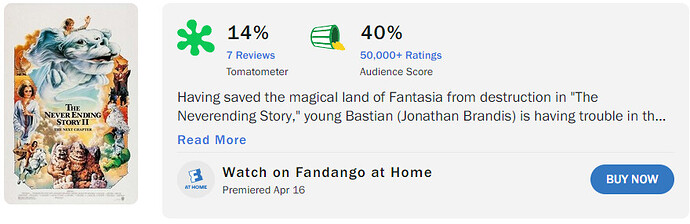

Which, uh, _yeah_. That makes a lot of sense, actually.

## Fantastica is Unquestionably an Un-Alloyed Good

One of the things I think the story kind of dodges is that it treats Fantastica as unquestionably a _good thing_.

It's a _story_ that _eats children_, and as we discover from the text, this is both "non-optional" (the Childlike Empress _will_ threaten reality if it means her survival) and "often results in an eternity of torment for the children in question".

The good parts? The people who survive the Fantastican gauntlet are much improved by it, and in doing so they bring Fantastica's gifts of imagination and empathy back out into the world - and since people who are trapped eternally in the book are _people who couldn't figure out how to escape a world in which they are granted literal god-mode powers_ it's probably not _too_ bad.

But, uh, definitely, Fantastica does brook some _follow-up questions_.

There's a touch of cosmic horror to it, is what I'm saying.

## Arbitrary Rules That You Must Follow

A frequent fantasy trope that is used to _great effect_ here is... "the rule".

You know, "you can use the Magical MacGuffin, _but_, if you ever do X, some _undefined but definitely unwanted behavior_ will happen", or "the only way to perform task Y is by doing unrelated thing Z".

The rules of fantasy, magic, et-al can often be extremely arbitrary. They certainly are in The Neverending Story.

Sometimes I think this is why programmers are so often board gamers, video gamers, and fantasy nerds: these are adjacent fields where "arbitrary rules that you must follow to the letter or be destroyed" are common and well-accepted.

## This is a Legitimately Great Children's Story

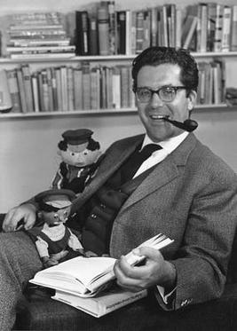

Micheal Ende was raised by surrealist painters who were censured by Nazis during the war for their _weird, incomprehensible fantasy art_.

The Nazis understood art on very limited terms.

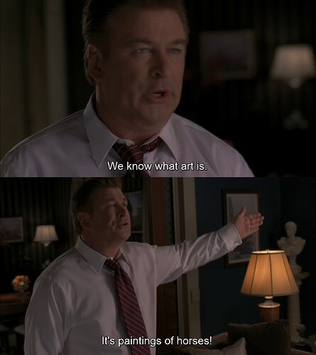

Anyways, that imaginative surrealist approach to children's fiction was, uh, hugely influential in children's fantasy? I feel like I've been reading stuff that has been strongly influenced by this book for **decades**. It's like _finding a missing book of the bible_.

For a 6-11 year old child, this story seems like a slam dunk. I'd have loved it as a kid.

<small>I had fun with it as an adult, too. </small>

## That Second Act, Though

The first act of The Neverending Story is a pretty bog standard fantasy story. It's fun, but it's The Wizard of Oz, a story which (notably) already exists.

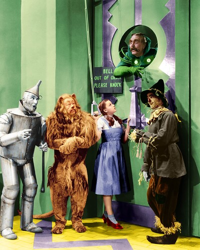

It's not until we get to **The Story Loops In Upon Itself Creating an Endless Meta-Story Loop, Followed By God-Mode Bastian Fucking Around in Fantastica** that the story starts really _cooking with gas_, and this part of the book contains some of the most bananas parts.

Gragraman, the Many-Colored Death?

Obnoxious, Stupid, Nasty Clown-Faeries who Wish They Were Never Created?

Bastian rides an all-armor horse until he EXPLODES?

The City of the Old Emperors?

A bloody and reckless civil war for the impossible crown of Fantastica?

An evil sorceress with eyes of green and purple who subtly represents _the book itself_?

_The Picture Mine_?

An ouroboros as a symbol for a world constantly destroying and regenerating itself through storytelling?

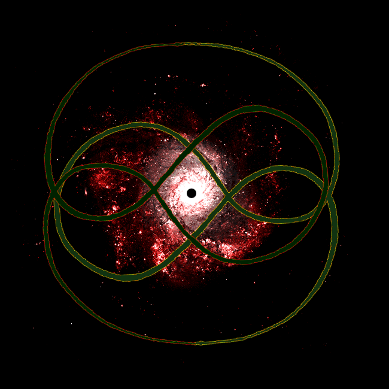

There's a lotta good stuff in here.

And, yeah, when my podcasters say "Homestuck is an internet-poisoned retelling of The Neverending Story", now I get what they mean.

---------

## Tiffany Steps In

_Tiff's taking the mic for a bit: imagine suddenly that I'm much more well-read and interesting_:

Ooo, this is kind of interesting to me, because when Curtis and I first started dating and I found out he hadn't seen the Neverending Story, I sort of abandoned the idea of trying to introduce it to him as a grown man, thinking the experience didn't translate as well once you were older.  I'm not sure why I put him through Mean Girls, Every Wes Anderson film and More Horror Than He Cares to Have Shared, but didn't unearth this old childhood nugget.

This movie undoubtedly traumatized many a child, but it was also one of those immensely satisfying fantasy epics that I loved when I was a kid. It was pretty formative to my introduction to fantasy-fiction, in the same way The Fifth Element and Dune were my precursors to Sci-Fi.   It ranks among other traumatizing-but-beloved surreal kiddie adventures that shaped me as a little human that include:

### This Guy and his Bulge:
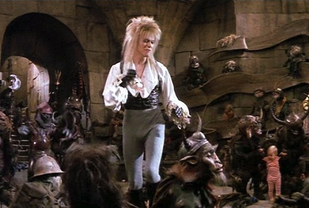

### Horrifying Sentient Rats Escape 
this one scared the shit outta me as a kid
:

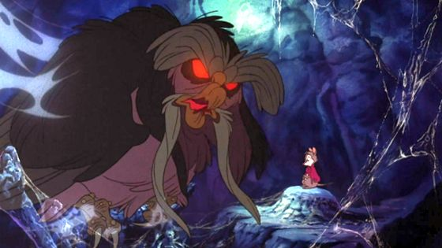

### Crazy Man Tortures Children in Factory:
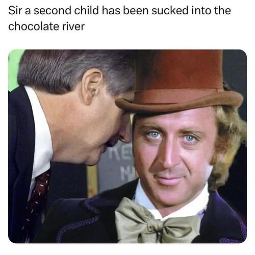

### Horrifying Genocidal Vultures Attack Elves:
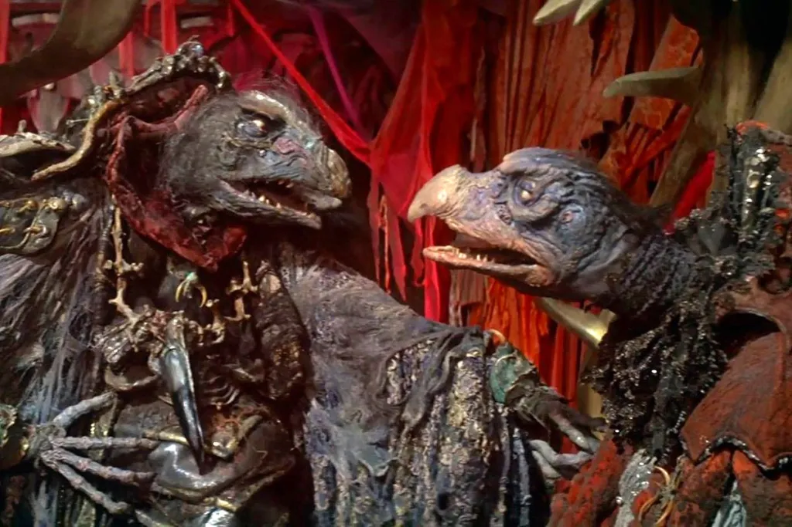

### Most Quotable Movie ft Man Tortured to Death:
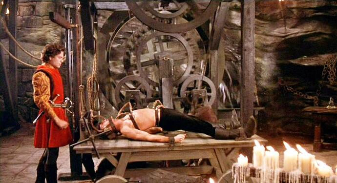

And of course, the beloved

### Horrifying Sentient Appliances Devastated by YOU, Horrible Humans  (Now with more 
i fuckin' love the brave little toaster
!!)
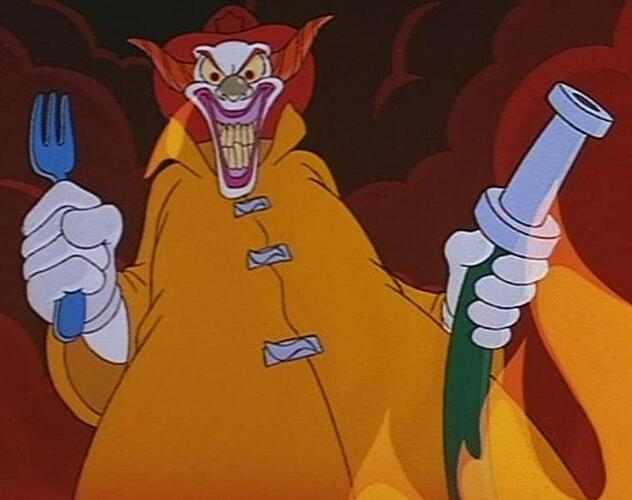

But even among those bangers, NeverEnding Story really stands out as having some terror-inducing scenes when I was a kid.

The Nothing was SCARY, when I was young.  (FYI, this movie came out the year I was born, so though I don't remember what age I watched it, it's on the list of some of the first media I ever remember seeing.)
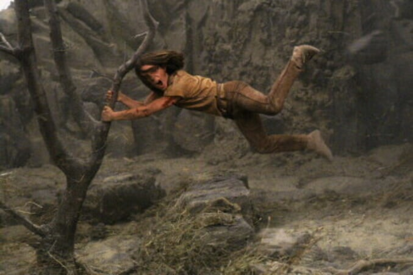

But so was that Wolf-thing: (Which kind of just looks like a crusty puppet now)
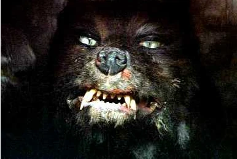

and the weird gate: ( I remember being EXTREMELY aware that they were topless when I was a child)
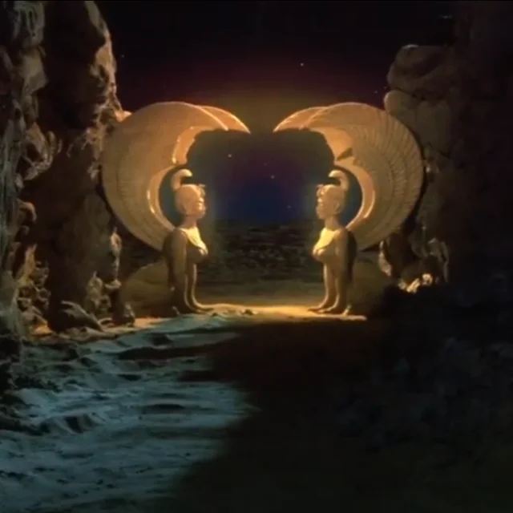

Like, sure, the horse scene was soul-shattering, but I remember being afraid of the Rock guy, slowly being disassembled by the Nothing:
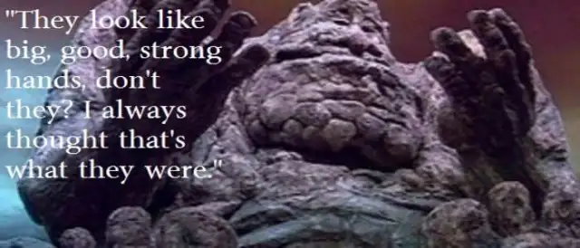

and this fucking giant turtle that was "allergic to relatable":
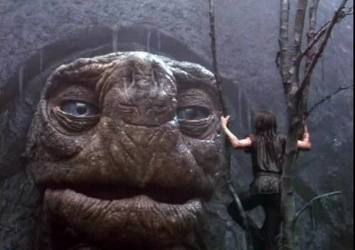

The second one, I don't think it tracks too closely to the book, from what you're saying.  In trying to conjure memories of this, I realized the evil sorceress:

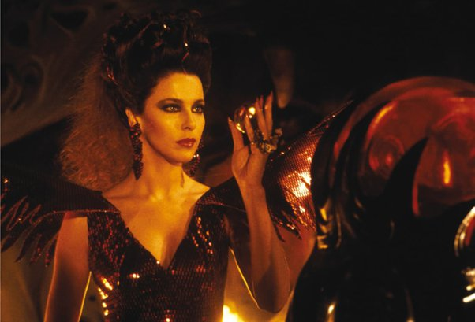

was kind of blending into my memories of the oddly-similar head-swapping sorceress in Wizard of Oz II:
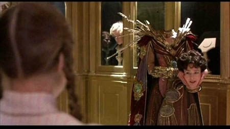

and her weird hollow armour army:
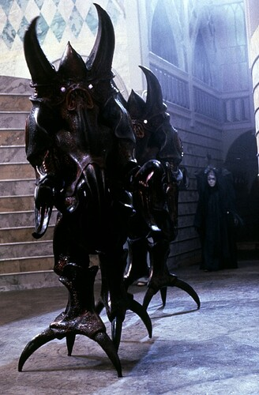

was merging with my memories of of the Dark Crystal's Darkened Creatures:
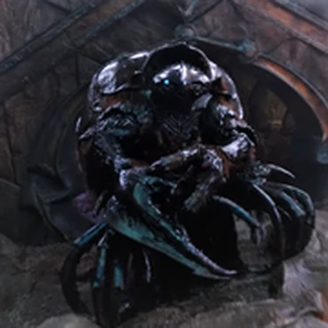

It's like, were all these 80s movies just one long fever dream? Funny to revisit them as an adult with a lot more media-literacy and see the connections and the artistic influences.  I'm not surprised at all to learn surrealism was influencing the author, and it would have been the time that Henson & Co were at their peak, with Brian Froud playing a huge role in how 80s children's fantasy looked:

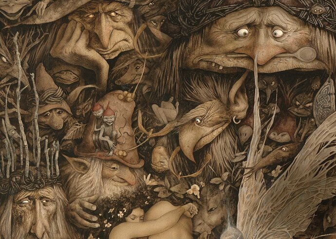

Henson's Creature Shop would have supplied all of the puppets for Labyrinth, The Dark Crystal and Neverending Story.  They'd also go on to work on another beloved children's author's work in the 90s, when they did the equally strange adaptation of The Witches by Roald Dahl!

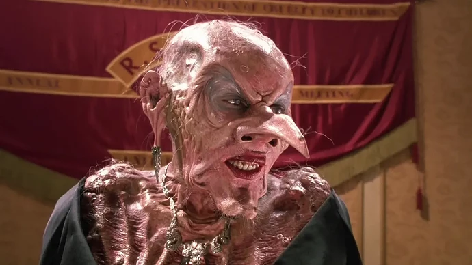

Anjelica Huston slayed in that role.  What an icon.
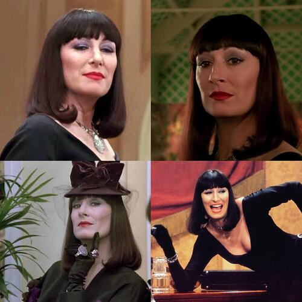

Between Henson, Froud and Don Bluth, I can hardly think of something more quintessentially 80/90s  kids cinema.
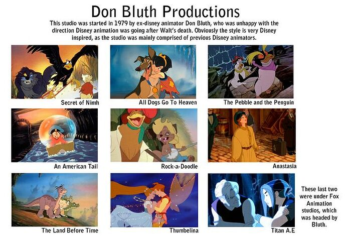

It's funny, that second one, they recast Bastian as teen heartthrob Jonathon Brandis, who by your description is pretty far off-brand from the book's character.
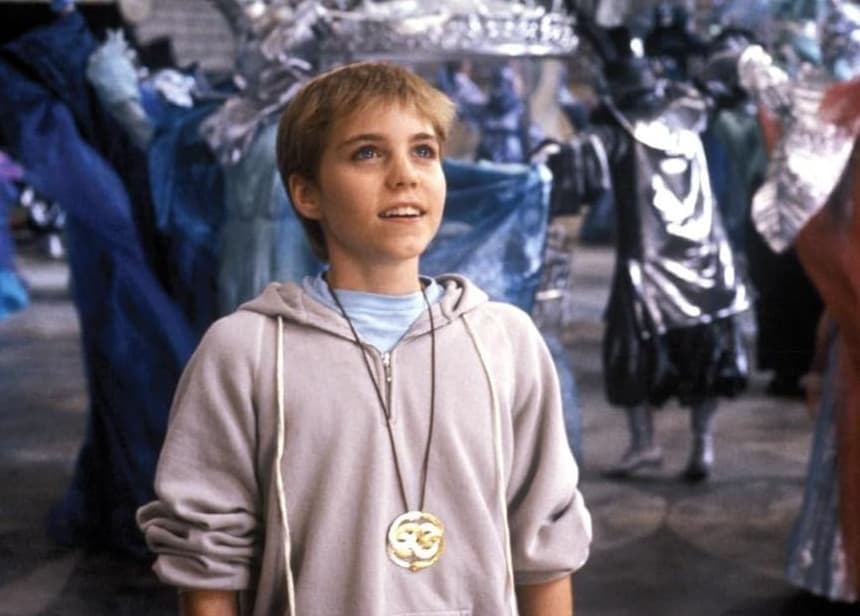

Did the book have an insufferable Bird character, as well?  Did they just shunt insufferable-bird in because there was a rule in the 90s that you had to have at least one insufferable nightmare-fuel character per movie or you couldn't participate in the Illuminati meetings?
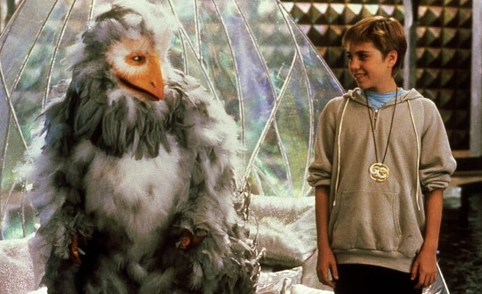

They also replaced the Childlike Empress in the second film (i mean, I think they replaced basically everyone) but child-me thought the original girl was like...  supernaturally beautiful...  and aspired eternally to be her:

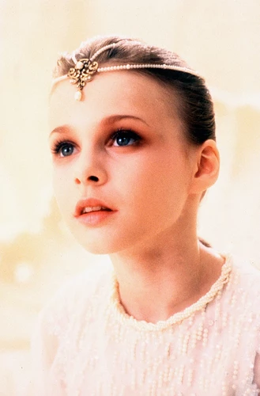

No life a Canadian 7-year-old is living is ever going to measure up to whatever this is:
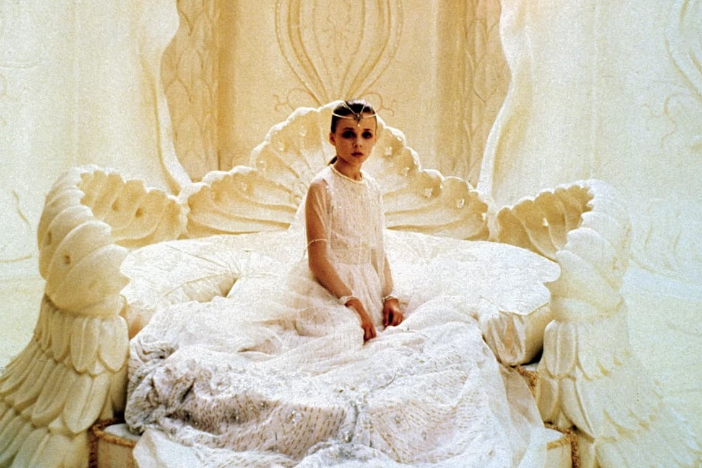

She's just a kid, and a relatively normal one, but apparently I wasn't the only person transfixed by her beauty.
As I collected this photo off IMDB, I read:

> though she appeared on-screen for just minutes in the role, with her character described as ["an indescribably beautiful young girl,"](https://vsbattles.fandom.com/wiki/The_Childlike_Empress) adult men tracked down her address (in pre-internet times) and camped outside her family’s Northern California home hoping to get a glimpse of her after the film came out. Then came the marriage proposals, including one from a German man who mailed her an expensive engagement ring, and the inappropriate offers from producers, some who would show up at her door. "They came to our house and pitched it, and I'm like, I'm not doing a nude film,” Stronach recalled. “I’m not Lolita.”

It's all good though.  She became a talented dancer in NYC for two decades after, and remembers the three months she stayed in Bavaria filming the movie with her Mom as a dreamy summer camp. How odd to remember looking up to her, knowing at that time she was just 11 at the time, and wasn't, you know, really an Empress.

IMDB had a more current photo of her now!  Time flies!

---------

## Okay, Back to Me, Curtis, Your Usual Host

So, yesterday, with Tiff, I watched **The Neverending Story (1984)** for the first time.

I don't have Too Many Thoughts about it, but I had a few:

> 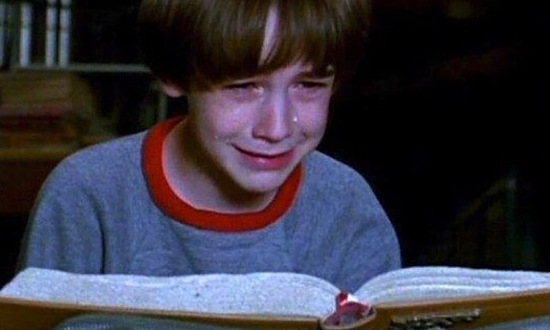
>
> this kid isn't as fat and terrible as Bastian is in the books, but I was still filled with a powerful desire to bully him

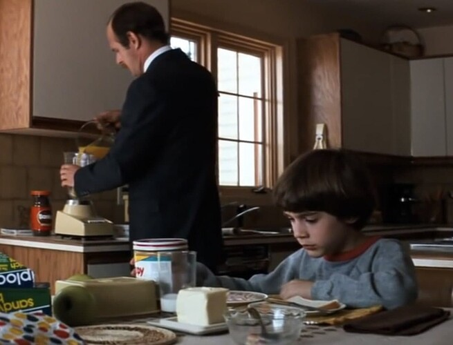
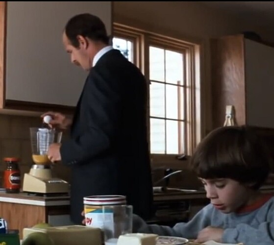
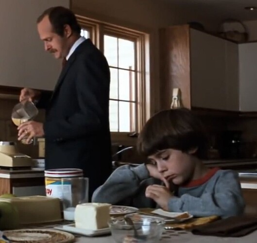
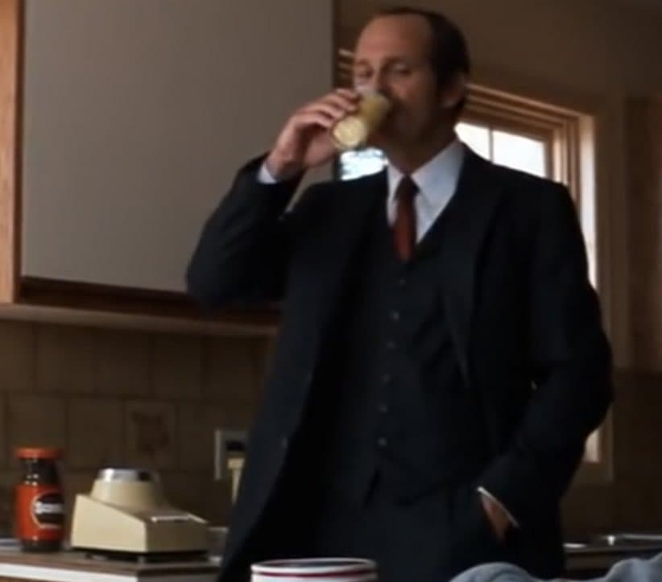

Bastian's dad just... cracks a whole egg into some orange juice, blends it up, and visibly drinks it. On camera. Which means he probably had to do that DOZENS OF TIMES. Good lord. **WHAT.** This may be the most disturbing fantasy film ever made.

* The movie includes almost all of the strange characters from the book, which seems _impossible to film_, which was, at the time, an ENORMOUS flex by the Jim Henson company. Groundbreaking special effects.
* In fact, MOVIE is almost beat-for-beat identical to BOOK (up until the ending).
* Some of the creatures they left out include:
* Will-o-the-wisp:  a fast moving glowing ball of light with a character inside it would already be insanely hard, doing that _at the same time_ as all of the character effects seems impractically difficult.
* Ygramul the Many: this being 20 years before particle effects, uh, omitting the spider-made-of-mosquitos seems like a good idea.
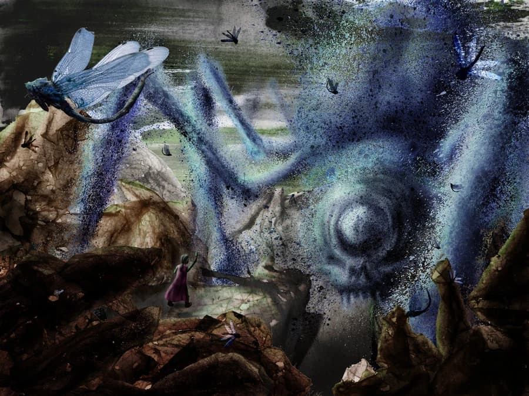
* There's already a lot of scary stuff in this movie for kids, "meta-spider" seems like it might go over the line.
* Some of the effects do not stand the test of time so good: they're impressive puppetry but ... enh
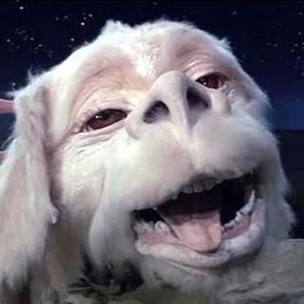
* Gmork is absolutely just a Head:
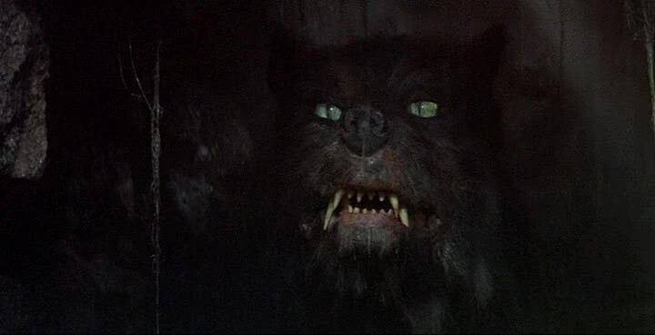
* I laughed out loud at Gmork's only attack in the entire thing: they kinda just throw the head at Atreyu
> 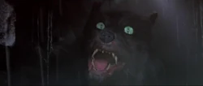
> bleah!
* In the book, Gmork's death-bite holds Atreyu fast so that he can't be swept up by the Nothing, whereas in the movie he's just gotta hold on, which is how we get:
> 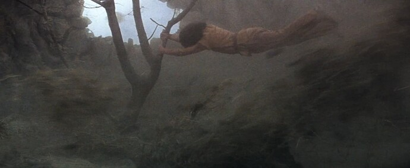
> hup
* Engywook is practical make-up done so, so well:
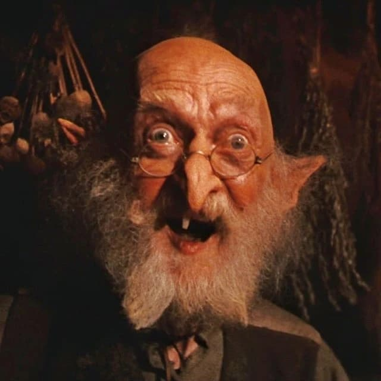
* although this is what the actor looks like in real life, so it's not even that much of a stretch:
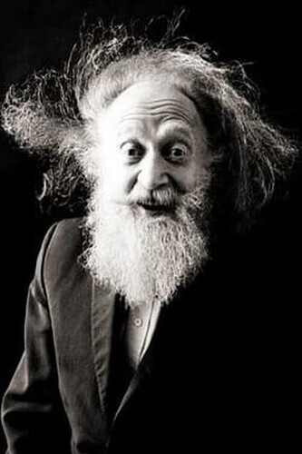
* MOVIE: Fantasia
* BOOK: Fantastica
* MOVIE tries its best to avoid BOOK's meta-exploration of Fantastica at every opportunity.
* MOVIE uses "show-don't-tell" to great effect to replace long stretches of rambling exposition with character moments that establish the same information but by _doing some stuff_. This also gives MOVIE a much more slapstick Muppety vibe at times.
* For example: the 80's Bullies are not just mentioned in passing: we get to see them dunking Bastian in the trash.
* The Rock Giant gets a reprise - which makes sense, he must have been SO EXPENSIVE, might as well get some extra use out of that big puppet.

* I found it extremely funny that the movie's school looked like this:
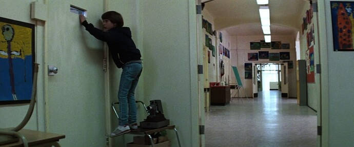
* But its attic looked like this:
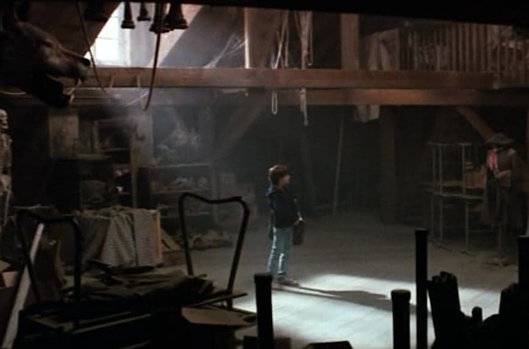
* The ending _sharply diverges_ between BOOK and MOVIE, presumably because the MOVIE had to tie things up right quick.
* in MOVIE, Bastian just... rides Falkor out of the Neverending Story and uses him to enshittify some bullies' pants, roll credits.

Oh, and throughout all of Sunday Tiffany couldn't stop singing "NEVERENDING STOOOO-RRYYYYYYYYYYYYY AA-aa-AA aa-aa-AA aa-aa-AAAAA" which is the song that _bookends the movie_. It's an earworm, it's incredibly simple and irritating, and they play it _so much_.

